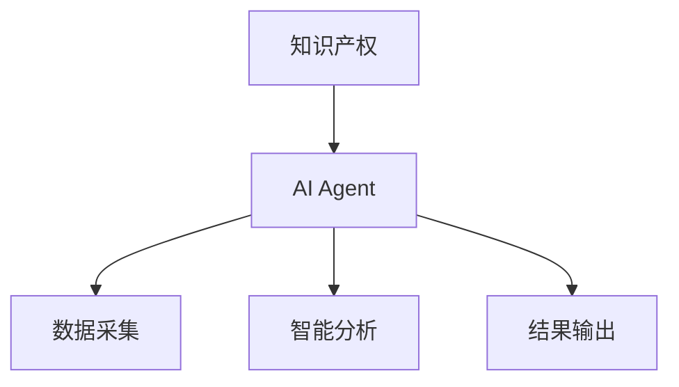
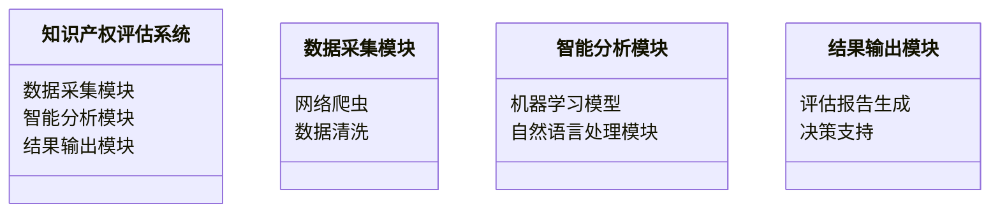

                 


# AI Agent在企业知识产权价值评估中的应用

> 关键词：AI Agent，知识产权评估，机器学习，自然语言处理，系统架构

> 摘要：本文探讨了AI Agent在企业知识产权价值评估中的应用，分析了传统评估方法的局限性，介绍了AI Agent的基本概念和核心作用，详细讲解了基于机器学习和自然语言处理的算法原理，并通过系统架构设计和项目实战展示了AI Agent的实际应用价值。

---

## 第一部分: AI Agent与知识产权价值评估的背景与基础

### 第1章: AI Agent与知识产权价值评估概述

#### 1.1 知识产权的基本概念
- **1.1.1 知识产权的定义与分类**
  - 知识产权是指依法保护的创造性成果和标记，主要包括专利权、商标权、版权、商业秘密等。
  - 专利权：保护发明的独占权；商标权：区分商品或服务的标识；版权：保护文学、艺术和科学作品。

- **1.1.2 知识产权的评估意义**
  - 知识产权是企业的核心资产之一，其价值评估对企业并购、融资、侵权诉讼等具有重要意义。
  - 正确评估知识产权价值有助于企业制定合理的定价策略和风险管理。

- **1.1.3 企业知识产权管理的重要性**
  - 有效的知识产权管理可以提升企业的竞争力，防范法律风险，促进创新。

#### 1.2 AI Agent的基本概念
- **1.2.1 AI Agent的定义与特点**
  - AI Agent是指能够感知环境并采取行动以实现目标的智能体。
  - 具有自主性、反应性、主动性、社会性等特征。

- **1.2.2 AI Agent的核心技术**
  - 数据处理与分析：从多源数据中提取有用信息。
  - 自然语言处理：理解并生成人类语言。
  - 机器学习：通过数据训练模型，实现预测和分类。

- **1.2.3 AI Agent在企业中的应用现状**
  - 在知识产权评估中，AI Agent用于数据挖掘、市场分析、风险评估等领域。
  - 其他应用包括智能客服、自动化决策支持等。

#### 1.3 AI Agent与知识产权评估的结合
- **1.3.1 知识产权评估的传统方法**
  - 市场法、成本法、收益法等传统评估方法存在数据依赖性强、评估周期长的问题。

- **1.3.2 AI Agent在知识产权评估中的优势**
  - 提高评估效率：通过自动化数据处理和分析，缩短评估周期。
  - 增强评估准确性：利用机器学习模型分析大量数据，捕捉潜在价值。
  - 实现实时监控：动态跟踪知识产权的市场表现，及时调整评估结果。

- **1.3.3 知识产权评估中的AI Agent应用场景**
  - 数据采集与清洗：收集专利、商标等信息，去除噪声。
  - 智能分析：预测知识产权的市场价值和潜在风险。
  - 结果输出：生成评估报告，提供决策支持。

---

### 第2章: 知识产权价值评估的核心概念与联系

#### 2.1 知识产权价值评估的原理
- **2.1.1 知识产权价值的影响因素**
  - 技术创新性：发明的创新程度影响其价值。
  - 市场需求：知识产权的市场需求决定了其经济价值。
  - 法律保护：知识产权的法律保护强度影响其市场寿命。

- **2.1.2 知识产权价值评估的方法**
  - 市场法：通过比较类似知识产权的交易价格进行评估。
  - 成本法：基于知识产权的研发成本进行评估。
  - 收益法：预测知识产权为企业带来的未来收益，折现后计算其价值。

- **2.1.3 知识产权价值评估的流程**
  1. 数据收集：收集专利、商标等信息。
  2. 数据清洗：去除无效数据，标准化数据。
  3. 数据分析：应用机器学习模型进行预测和分类。
  4. 结果输出：生成评估报告，提出建议。

#### 2.2 AI Agent在知识产权评估中的核心作用
- **2.2.1 数据采集与处理**
  - 使用网络爬虫收集知识产权数据，包括专利申请数量、法律状态等。
  - 数据清洗：处理缺失值、异常值，确保数据质量。

- **2.2.2 智能分析与决策**
  - 应用自然语言处理技术分析专利文档，提取关键技术点。
  - 利用机器学习模型预测知识产权的市场价值和风险。

- **2.2.3 结果输出与反馈**
  - 生成评估报告，包括知识产权的当前价值和未来趋势。
  - 提供决策支持，帮助企业制定知识产权战略。

#### 2.3 知识产权评估与AI Agent的实体关系图


---

### 第3章: 知识产权价值评估中的AI Agent算法原理

#### 3.1 知识产权价值评估的算法选择
- **3.1.1 机器学习算法的适用性**
  - 监督学习：用于预测知识产权价值，如线性回归、支持向量机。
  - 非监督学习：用于聚类分析，识别知识产权的相似性。

- **3.1.2 自然语言处理算法的适用性**
  - 文本挖掘：提取专利文档中的关键技术点。
  - 情感分析：分析市场对知识产权的态度。

- **3.1.3 算法选择的依据**
  - 数据类型：文本数据适合自然语言处理，数值数据适合机器学习。
  - 评估目标：预测价值选择回归算法，分类问题选择分类算法。

#### 3.2 基于机器学习的知识产权价值评估模型
- **3.2.1 数据预处理**
  - 清洗数据：去除缺失值和异常值。
  - 特征提取：从专利文档中提取关键词作为特征。

- **3.2.2 模型训练**
  - 使用训练数据训练机器学习模型，如随机森林、神经网络。

- **3.2.3 模型评估**
  - 通过交叉验证评估模型性能，调整参数优化模型。

#### 3.3 算法实现的数学模型与公式
- **3.3.1 线性回归模型**
  $$ y = \beta_0 + \beta_1x + \epsilon $$
  其中，y是预测的知识产权价值，x是输入特征，β是系数，ε是误差项。

- **3.3.2 支持向量机模型**
  支持向量机通过找到超平面最大化分类间隔，用于分类和回归。

---

## 第四章: 系统分析与架构设计

### 4.1 问题场景介绍
- 企业需要评估知识产权的价值，传统方法效率低、准确性差。

### 4.2 项目介绍
- 开发一个基于AI Agent的知识产权价值评估系统，帮助企业在知识产权管理中实现高效评估。

### 4.3 系统功能设计


### 4.4 系统架构设计


### 4.5 系统接口设计
- 数据接口：与专利数据库对接，获取知识产权数据。
- 分析接口：调用机器学习模型进行预测。
- 输出接口：生成评估报告并返回给用户。

---

## 第五章: 项目实战

### 5.1 环境安装
- 安装Python、机器学习库（如scikit-learn、TensorFlow）和自然语言处理库（如spaCy、NLTK）。

### 5.2 系统核心实现源代码
```python
import pandas as pd
from sklearn.model import LinearRegression
from sklearn.metrics import mean_squared_error

# 数据加载
data = pd.read_csv('patent_data.csv')

# 特征提取
X = data[['专利申请数量', '技术领域']]
y = data['专利价值']

# 模型训练
model = LinearRegression()
model.fit(X, y)

# 模型预测
y_pred = model.predict(X)

# 模型评估
mse = mean_squared_error(y, y_pred)
print(f'均方误差: {mse}')
```

### 5.3 代码应用解读与分析
- 数据加载：从CSV文件中读取知识产权数据。
- 特征提取：选择专利申请数量和技术领域作为特征。
- 模型训练：使用线性回归模型训练。
- 模型预测：预测知识产权价值。
- 模型评估：计算均方误差，评估模型性能。

### 5.4 实际案例分析
- 以某企业专利数据为例，展示模型的应用过程和结果。

### 5.5 项目小结
- 成功实现了基于AI Agent的知识产权价值评估系统，验证了模型的有效性。

---

## 第六章: 最佳实践、小结、注意事项、拓展阅读

### 6.1 最佳实践
- 数据质量是关键：确保数据准确、完整。
- 模型选择要合理：根据具体问题选择合适的算法。
- 持续优化：定期更新模型，适应市场变化。

### 6.2 小结
- AI Agent在知识产权价值评估中具有显著优势，能够提高效率和准确性。

### 6.3 注意事项
- 数据隐私：注意保护知识产权数据的隐私和安全。
- 模型局限：目前模型难以完全替代人类判断，需结合专家意见。

### 6.4 拓展阅读
- 推荐阅读《机器学习实战》、《自然语言处理入门》等书籍，深入了解相关技术。

---

## 作者：AI天才研究院 & 禅与计算机程序设计艺术

---

通过本文的详细讲解，读者可以系统地了解AI Agent在企业知识产权价值评估中的应用，从理论到实践，逐步掌握相关知识。

