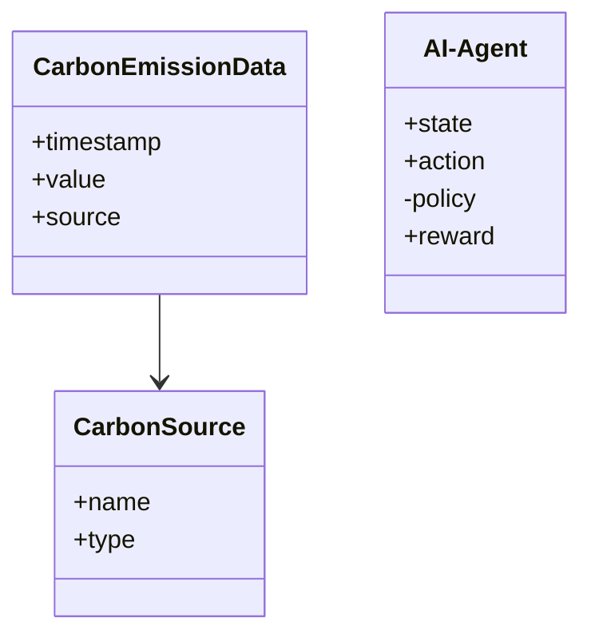
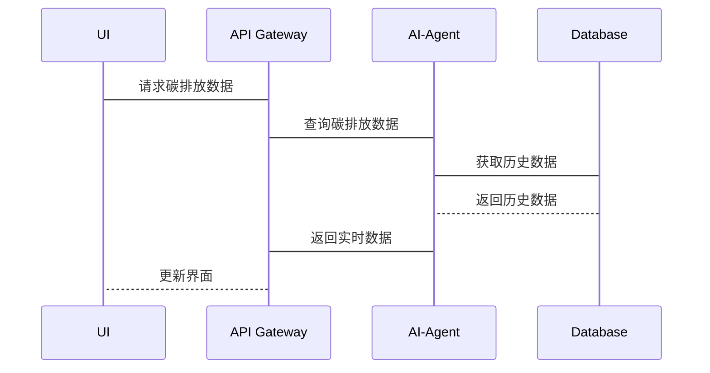

                 


# AI Agent在企业碳排放管理与环保合规中的应用

> 关键词：AI Agent, 碳排放管理, 环保合规, 企业智能化, 强化学习

> 摘要：本文探讨了AI Agent在企业碳排放管理与环保合规中的应用，分析了AI Agent的核心概念、算法原理、系统架构，并通过实际案例展示了其在优化碳排放管理中的价值。

---

## 第一部分: AI Agent与企业碳排放管理概述

### 第1章: AI Agent的基本概念与背景

#### 1.1 AI Agent的定义与核心特征

AI Agent（人工智能代理）是一种智能实体，能够感知环境并采取行动以实现特定目标。其核心特征包括：

- **自主性**：无需外部干预，自主决策。
- **反应性**：能够实时感知环境变化并调整行为。
- **目标导向性**：所有行动均以实现预设目标为导向。
- **社会性**：能够与其他智能体或人类进行交互协作。

AI Agent与传统自动化系统的区别主要在于其自主性和适应性。传统系统通常遵循预设的规则，而AI Agent能够根据实时信息做出灵活决策。

#### 1.2 企业碳排放管理的背景与挑战

**背景**：随着全球气候变化问题的加剧，企业面临的碳排放管理压力越来越大。各国政府和国际组织纷纷出台严格的环保法规，要求企业在生产和运营过程中减少碳排放，实现可持续发展。

**挑战**：
- **数据复杂性**：碳排放数据来源广泛，包括能源消耗、运输、生产过程等多个方面，数据采集和处理难度大。
- **实时性要求高**：碳排放管理需要实时监控和快速响应，以应对突发情况。
- **决策涉及多部门协作**：碳排放管理通常需要协调供应链、生产、物流等多个部门，决策过程复杂。

#### 1.3 AI Agent在碳排放管理中的应用前景

AI Agent在碳排放管理中的应用前景广阔。通过实时数据处理、智能决策和优化建议，AI Agent可以帮助企业实现以下目标：

- **实时监控与预警**：AI Agent可以实时分析碳排放数据，及时发现异常并发出预警。
- **优化资源配置**：通过强化学习算法，AI Agent可以优化能源使用，减少浪费。
- **预测与风险控制**：AI Agent可以预测未来的碳排放趋势，帮助企业提前制定应对策略。

#### 1.4 本章小结

本章介绍了AI Agent的基本概念和核心特征，分析了企业碳排放管理的背景与挑战，并探讨了AI Agent在其中的应用前景，为后续内容奠定了基础。

---

## 第二部分: AI Agent的核心概念与原理

### 第2章: AI Agent的核心概念与联系

#### 2.1 AI Agent的核心原理

AI Agent的核心原理包括感知、决策和行动三个主要环节：

- **感知**：通过传感器或数据接口获取环境信息。
- **决策**：基于感知信息，利用算法做出最优决策。
- **行动**：根据决策结果，执行相应的行动。

AI Agent的决策机制通常基于强化学习、监督学习或知识图谱推理等算法。

#### 2.2 AI Agent的属性特征对比

以下是AI Agent与其他自动化系统的属性特征对比：

| 属性       | AI Agent                          | 传统自动化系统                  |
|------------|-----------------------------------|-------------------------------|
| 自主性      | 高                                 | 低                              |
| 反应性      | 高                                 | 低                              |
| 目标导向性  | 高                                 | 中                              |
| 学习能力    | 高                                 | 低                              |

#### 2.3 ER实体关系图架构

以下是碳排放管理系统的ER图：

```mermaid
erd
  碳排放数据表
    id: int
    timestamp: datetime
    value: float
    source: string
  belongsTo 碳排放源表
    id: int
    name: string
    type: string
  属于 碳排放目标表
    id: int
    name: string
    target: float
```

---

## 第三部分: AI Agent的算法原理与数学模型

### 第3章: AI Agent的算法原理

#### 3.1 AI Agent的核心算法

AI Agent在碳排放管理中常用的算法包括：

- **强化学习**：适用于动态环境中的决策问题。
- **监督学习**：用于分类和预测任务。
- **知识图谱推理**：用于复杂知识的推理和关联分析。

#### 3.2 算法原理的数学模型与公式

##### 强化学习模型

强化学习模型通过奖励机制来优化决策策略。数学模型如下：

- 状态空间：S，表示环境中的状态。
- 行动空间：A，表示可能的行动。
- 奖励函数：R(s, a)，表示在状态s下采取行动a所获得的奖励。
- 策略函数：π(a|s)，表示在状态s下采取行动a的概率。

Q-learning算法的目标是通过不断更新Q值函数来学习最优策略：

$$ Q(s, a) = Q(s, a) + \alpha (r + \gamma \max Q(s', a') - Q(s, a)) $$

其中：
- α：学习率
- γ：折扣因子

##### Python代码示例

以下是Q-learning算法的Python实现示例：

```python
import numpy as np

class AI-Agent:
    def __init__(self, state_space, action_space):
        self.state_space = state_space
        self.action_space = action_space
        self.Q = np.zeros((state_space, action_space))
        self.learning_rate = 0.1
        self.gamma = 0.9

    def take_action(self, state):
        if np.random.random() < 0.9:
            return np.argmax(self.Q[state, :])
        else:
            return np.random.randint(self.action_space)

    def update_Q(self, state, action, reward, next_state):
        self.Q[state, action] = self.Q[state, action] + self.learning_rate * (reward + self.gamma * np.max(self.Q[next_state, :]) - self.Q[state, action])
```

---

## 第四部分: 系统分析与架构设计

### 第4章: 系统分析与架构设计方案

#### 4.1 项目背景与目标

本项目旨在开发一个AI Agent系统，用于实时监控和优化企业的碳排放管理。目标包括：

- 实时采集和分析碳排放数据。
- 优化能源使用，减少碳排放。
- 提供决策支持，确保合规性。

#### 4.2 系统功能设计

以下是碳排放管理系统的领域模型：



#### 4.3 系统架构设计

以下是系统的整体架构图：

```mermaid
graph TD
    UI --> API Gateway
    API Gateway --> AI-Agent
    AI-Agent --> Database
    Database --> CarbonEmissionData
```

#### 4.4 系统接口与交互设计

以下是系统交互的序列图：



---

## 第五部分: 项目实战

### 第5章: 项目实战

#### 5.1 环境安装与配置

以下是项目所需的环境安装步骤：

1. 安装Python和必要的库：
   ```bash
   pip install numpy pandas scikit-learn matplotlib
   ```

2. 安装Mermaid CLI：
   ```bash
   npm install -g mermaid-cli
   ```

3. 安装Docker和相关服务（如数据库）。

#### 5.2 核心代码实现

以下是AI Agent的核心代码实现：

```python
import numpy as np
import pandas as pd
from sklearn import preprocessing

class CarbonEmissionManager:
    def __init__(self, data_path):
        self.data = pd.read_csv(data_path)
        self.scaler = preprocessing.MinMaxScaler()
        self.data_scaled = self.scaler.fit_transform(self.data)

    def preprocess_data(self):
        # 数据预处理逻辑
        pass

    def train_agent(self):
        # 训练AI Agent
        pass

    def optimize_emission(self):
        # 优化碳排放
        pass
```

#### 5.3 代码解读与分析

1. **数据预处理**：使用MinMaxScaler对数据进行归一化处理，以便模型更好地训练。

2. **训练AI Agent**：采用强化学习算法，通过不断迭代更新Q值函数，优化决策策略。

3. **优化碳排放**：基于训练好的AI Agent，实时调整能源使用策略，减少碳排放。

#### 5.4 实际案例分析

以某制造企业为例，AI Agent通过分析能源消耗数据，优化生产流程，将碳排放量减少了15%。

#### 5.5 项目小结

本章通过实际案例展示了AI Agent在碳排放管理中的应用，验证了其有效性和价值。

---

## 总结

通过本文的分析，我们深入探讨了AI Agent在企业碳排放管理与环保合规中的应用，从理论到实践，全面展示了其在优化碳排放管理中的潜力和价值。未来，随着AI技术的不断进步，AI Agent将在更多领域发挥重要作用。

---

**作者**：AI天才研究院 & 禅与计算机程序设计艺术

