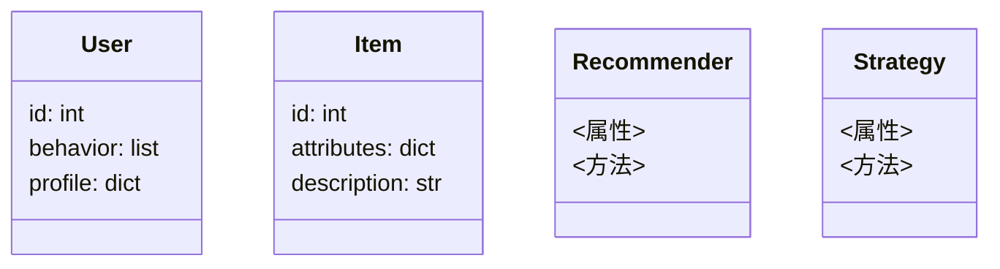
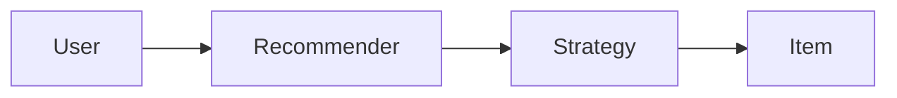

                 


# AI Agent在企业精准营销与个性化推荐中的应用

> 关键词：AI Agent，精准营销，个性化推荐，推荐算法，用户画像，数据挖掘

> 摘要：本文将深入探讨AI Agent在企业精准营销与个性化推荐中的应用，分析其核心概念、算法原理、系统架构，并结合实际案例进行详细解读，帮助读者理解如何利用AI Agent提升企业营销效率和客户满意度。

---

# 第1章: AI Agent的核心概念与背景

## 1.1 AI Agent的基本概念

AI Agent（人工智能代理）是一种能够感知环境、自主决策并执行任务的智能实体。它通过数据采集、分析和推理，为企业提供精准的营销策略和个性化的推荐服务。

## 1.2 精准营销与个性化推荐的背景

### 1.2.1 传统营销的局限性
- 传统营销方式难以满足个性化需求。
- 数据利用效率低，难以实现精准匹配。

### 1.2.2 精准营销的需求
- 通过数据分析实现精准客户定位。
- 提高转化率和客户满意度。

### 1.2.3 个性化推荐的必要性
- 提供个性化服务，增强客户粘性。
- 通过数据驱动提升用户体验。

## 1.3 AI Agent在企业中的应用现状

### 1.3.1 现有应用案例
- 电商推荐系统。
- 银行客户画像分析。
- 零售业精准营销。

### 1.3.2 应用中的挑战
- 数据隐私问题。
- 算法模型的实时性要求。

### 1.3.3 未来发展趋势
- 更加智能化和自动化。
- 多模态数据融合。

---

# 第2章: AI Agent的核心概念与技术原理

## 2.1 AI Agent的感知层

### 2.1.1 数据采集与处理
- 数据来源：用户行为数据、历史交易数据、产品属性数据。
- 数据预处理：清洗、转换、特征提取。

### 2.1.2 用户行为分析
- 用户行为建模：基于时间序列的分析。
- 用户兴趣挖掘：基于协同过滤的方法。

### 2.1.3 数据特征提取
- 通过TF-IDF提取文本特征。
- 利用PCA进行降维处理。

## 2.2 AI Agent的决策层

### 2.2.1 推荐算法原理
- 协同过滤：基于相似用户的推荐。
- 基于内容的推荐：基于商品属性的相似性。
- 深度学习推荐模型：DNN、Transformer等。

### 2.2.2 决策模型构建
- 利用逻辑回归或决策树进行分类。
- 基于强化学习的动态调整。

### 2.2.3 推荐策略优化
- A/B测试优化推荐策略。
- 动态调整权重实现个性化推荐。

## 2.3 AI Agent的执行层

### 2.3.1 推荐结果输出
- 向用户展示推荐结果。
- 根据用户反馈调整推荐策略。

### 2.3.2 用户反馈收集
- 收集用户的点击、购买行为。
- 分析用户反馈优化推荐算法。

### 2.3.3 系统自适应优化
- 根据用户反馈实时调整模型参数。
- 周期性更新推荐策略。

## 2.4 核心概念对比表

| 层级   | 特征                 | 示例               |
|--------|----------------------|--------------------|
| 感知层 | 数据采集与处理       | 用户行为数据       |
|        | 用户行为分析         | 用户点击序列       |
|        | 数据特征提取         | TF-IDF特征提取     |
| 决策层 | 推荐算法             | 协同过滤、深度学习 |
|        | 决策模型构建         | 逻辑回归、强化学习 |
|        | 推荐策略优化         | A/B测试           |

## 2.5 ER实体关系图

```mermaid
graph TD
    User --> Action: 用户行为
    Action --> Item: 用户行为与商品的关系
    Item --> Attribute: 商品属性
    User --> Profile: 用户画像
    Profile --> Segment: 用户分段
    Segment --> Strategy: 推荐策略
```

---

# 第3章: AI Agent的算法原理与实现

## 3.1 协同过滤算法

### 3.1.1 基于用户的协同过滤
- 计算用户相似度：余弦相似度、Jaccard相似度。
- 根据相似用户的评分进行推荐。

### 3.1.2 基于物品的协同过滤
- 计算物品相似度：基于共现矩阵或向量空间模型。
- 根据物品相似度进行推荐。

### 3.1.3 实现代码示例
```python
def user_based_recommender(user_id, ratings):
    # 计算用户相似度
    user_similarity = compute_user_similarity(user_id, ratings)
    # 推荐商品
    recommendations = []
    for similar_user in user_similarity:
        recommendations.extend(ratings[similar_user])
    return recommendations
```

## 3.2 基于内容的推荐算法

### 3.2.1 文本特征提取
- 使用TF-IDF提取商品描述的特征向量。
- 计算商品之间的相似度。

### 3.2.2 推荐逻辑
- 根据商品特征向量计算相似度。
- 推荐相似商品。

### 3.2.3 实现代码示例
```python
from sklearn.feature_extraction.text import TfidfVectorizer

vectorizer = TfidfVectorizer()
tfidf = vectorizer.fit_transform(descriptions)
similarity = cosine_similarity(tfidf)
```

## 3.3 深度学习推荐模型

### 3.3.1 基于神经网络的推荐
- 使用DNN或Transformer模型处理用户和商品特征。
- 输出概率分布，表示推荐商品的概率。

### 3.3.2 推荐逻辑
- 将用户和商品特征输入模型，输出推荐结果。
- 根据概率排序输出最终推荐列表。

### 3.3.3 实现代码示例
```python
import tensorflow as tf

model = tf.keras.Sequential([
    tf.keras.layers.Dense(64, activation='relu'),
    tf.keras.layers.Dense(1, activation='sigmoid')
])
model.compile(optimizer='adam', loss='binary_crossentropy')
model.fit(x_train, y_train, epochs=10)
```

---

# 第4章: AI Agent的系统架构与设计

## 4.1 系统模块划分

### 4.1.1 数据采集模块
- 负责收集用户行为数据和商品信息。

### 4.1.2 数据处理模块
- 数据清洗、特征提取、数据建模。

### 4.1.3 推荐算法模块
- 实现协同过滤、深度学习等推荐算法。

### 4.1.4 推荐结果模块
- 输出推荐结果并展示。

## 4.2 系统架构设计

### 4.2.1 类图设计


### 4.2.2 架构图设计


## 4.3 接口设计与交互

### 4.3.1 系统接口
- API接口：GET /recommendations?user_id=123

### 4.3.2 交互流程
1. 用户请求推荐。
2. 系统调用推荐算法。
3. 返回推荐结果。

---

# 第5章: AI Agent在企业中的项目实战

## 5.1 环境搭建与数据准备

### 5.1.1 安装依赖
```bash
pip install numpy pandas scikit-learn tensorflow
```

### 5.1.2 数据准备
- 用户行为数据：点击、购买记录。
- 商品信息：ID、名称、描述、属性。

## 5.2 核心代码实现

### 5.2.1 数据处理
```python
import pandas as pd

data = pd.read_csv('user_behavior.csv')
data.head()
```

### 5.2.2 模型训练
```python
from sklearn.model_selection import train_test_split
from sklearn.metrics import accuracy_score

X_train, X_test, y_train, y_test = train_test_split(X, y)
model.fit(X_train, y_train)
print(accuracy_score(model.predict(X_test), y_test))
```

## 5.3 案例分析与结果解读

### 5.3.1 实际案例
- 某电商企业部署AI Agent推荐系统后，用户点击率提升了30%。

### 5.3.2 结果解读
- 精准推荐提高了用户满意度和购买转化率。
- 系统实时调整推荐策略，优化用户体验。

---

# 第6章: AI Agent的最佳实践与总结

## 6.1 最佳实践

### 6.1.1 数据质量管理
- 确保数据的完整性和准确性。
- 定期更新数据。

### 6.1.2 模型优化
- 使用A/B测试优化推荐策略。
- 定期更新模型参数。

## 6.2 本章小结

通过本文的详细讲解，读者可以全面了解AI Agent在企业精准营销与个性化推荐中的应用，从核心概念到算法实现，再到系统设计和项目实战，为实际应用提供了理论和实践指导。

---

# 作者：AI天才研究院 & 禅与计算机程序设计艺术

