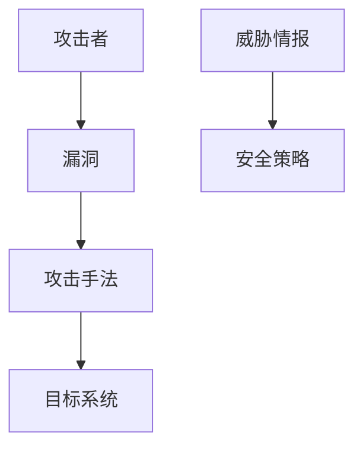
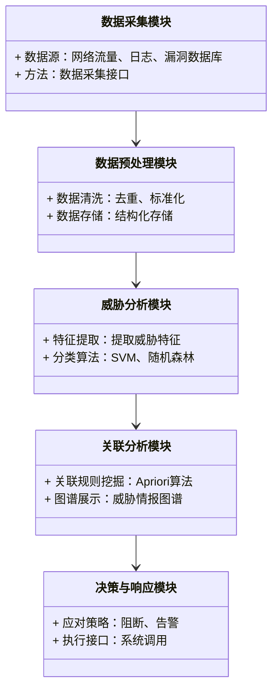
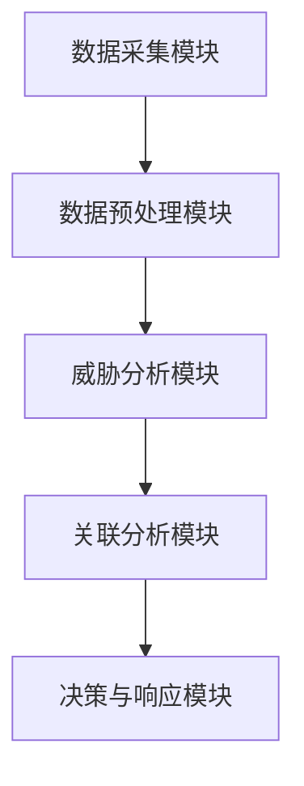
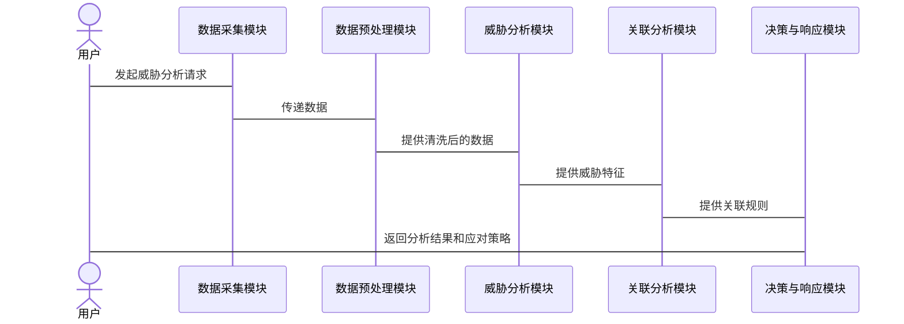

                 


# AI Agent在企业网络安全威胁情报分析中的应用

## 关键词：AI Agent, 威胁情报分析, 企业网络安全, 机器学习, 多模态数据融合

## 摘要：  
随着企业网络安全威胁的日益复杂化和智能化，传统的威胁情报分析方法已经难以应对新型攻击手段。AI Agent（人工智能代理）作为一种具备自主感知、决策和行动能力的智能体，正在成为企业网络安全威胁情报分析的重要工具。本文将从AI Agent的基本概念出发，深入探讨其在威胁情报分析中的核心原理、数学模型、系统架构设计以及实际应用案例。通过对比分析和案例研究，揭示AI Agent在提升企业网络安全防护能力中的巨大潜力，并展望未来的发展方向。

---

# 第1章: AI Agent与威胁情报分析概述

## 1.1 AI Agent的基本概念

### 1.1.1 AI Agent的定义  
AI Agent（人工智能代理）是指能够感知环境、自主决策并执行任务的智能实体。它能够通过传感器或数据输入获取信息，并基于预设的目标和规则进行推理和行动，从而实现智能化的决策支持或自动化操作。

### 1.1.2 AI Agent的核心特征  
- **自主性**：能够在没有人工干预的情况下独立运行。  
- **反应性**：能够实时感知环境变化并做出响应。  
- **目标导向**：基于预设目标或学习目标进行决策和行动。  
- **学习能力**：通过机器学习算法不断优化自身行为。  

### 1.1.3 AI Agent在企业安全中的作用  
AI Agent在企业安全中的应用主要体现在威胁检测、漏洞发现、应急响应和安全策略优化等方面。它能够通过实时分析网络流量、日志数据和安全事件，快速识别潜在威胁并采取相应措施。

## 1.2 威胁情报分析的基本概念

### 1.2.1 威胁情报的定义  
威胁情报是指关于潜在或正在进行的网络攻击、漏洞利用、恶意行为等信息，旨在帮助企业识别、防御和应对安全威胁。

### 1.2.2 威胁情报的分类与特点  
- **按来源分类**：内部威胁、外部威胁、第三方威胁。  
- **按级别分类**：高危、中危、低危。  
- **特点**：实时性、准确性、可操作性。  

### 1.2.3 威胁情报在企业安全中的价值  
- **提升防御能力**：通过提前识别潜在威胁，降低安全风险。  
- **优化安全策略**：基于威胁情报调整安全防护策略。  
- **减少响应时间**：通过快速分析和决策，缩短应急响应时间。  

## 1.3 AI Agent在威胁情报分析中的应用背景

### 1.3.1 传统威胁情报分析的局限性  
传统威胁情报分析依赖人工分析和静态规则，存在以下问题：  
- **效率低**：人工分析耗时且容易出错。  
- **覆盖面有限**：难以应对新型攻击手段。  
- **响应滞后**：无法实现实时威胁分析和防御。  

### 1.3.2 AI Agent在威胁情报分析中的优势  
- **实时性**：AI Agent能够实时分析数据，快速识别威胁。  
- **准确性**：通过机器学习算法，提高威胁检测的准确性。  
- **自动化**：AI Agent可以自动执行部分威胁应对任务，降低人工干预成本。  

### 1.3.3 当前企业网络安全面临的挑战  
- **复杂多变的威胁环境**：攻击者不断进化，威胁手段日益复杂。  
- **数据爆炸**：企业每天产生的数据量巨大，人工分析难以应对。  
- **安全人才短缺**：专业安全人才的匮乏使得企业难以应对复杂的威胁。  

## 1.4 本章小结  
本章介绍了AI Agent的基本概念、核心特征及其在企业安全中的作用，详细阐述了威胁情报分析的基本概念、分类和特点，以及传统威胁情报分析的局限性。最后，总结了AI Agent在威胁情报分析中的优势及其对企业网络安全的重要意义。

---

# 第2章: AI Agent与威胁情报分析的核心原理

## 2.1 AI Agent的核心原理

### 2.1.1 AI Agent的感知与决策机制  
AI Agent的感知机制通过多种数据源（如网络流量、日志、漏洞数据库等）获取信息，并利用自然语言处理、模式识别等技术进行分析。基于分析结果，AI Agent结合预设的策略和目标，通过推理和决策算法制定应对措施。

### 2.1.2 基于知识图谱的威胁分析  
知识图谱是一种结构化数据表示方式，能够将威胁情报中的实体（如攻击者、漏洞、攻击手法等）及其关系进行建模。AI Agent可以通过知识图谱进行关联分析，识别潜在威胁并预测未来攻击趋势。

### 2.1.3 多模态数据融合技术  
多模态数据融合技术是指将多种类型的数据（如文本、图像、日志等）进行整合，以提高威胁分析的准确性和全面性。AI Agent通过多模态数据融合，能够从不同维度获取信息，提升威胁检测的效率。

## 2.2 威胁情报分析的核心原理

### 2.2.1 威胁情报的特征提取  
特征提取是威胁情报分析的关键步骤。通过对网络流量、日志数据等进行分析，提取与威胁相关的特征（如异常行为模式、攻击手法等）。

### 2.2.2 基于机器学习的威胁分类  
机器学习算法（如支持向量机、随机森林、神经网络等）被广泛应用于威胁分类。通过训练模型，AI Agent能够自动识别异常行为并分类威胁的严重性。

### 2.2.3 威胁情报的关联分析  
关联分析是指将多个看似独立的威胁情报进行关联，以发现潜在的攻击链条或协同攻击。AI Agent通过关联分析，能够识别复杂的攻击手段并制定相应的防御策略。

## 2.3 AI Agent与威胁情报分析的结合

### 2.3.1 AI Agent在威胁情报分析中的角色  
AI Agent在威胁情报分析中扮演多重角色：数据采集者、分析者、决策者和执行者。它能够从多个数据源获取信息，进行深度分析，并根据分析结果采取相应措施。

### 2.3.2 威胁情报分析的智能化转型  
AI Agent的引入推动了威胁情报分析的智能化转型。通过机器学习和自动化技术，威胁情报分析从传统的被动防御转变为主动响应，显著提升了企业的安全防护能力。

### 2.3.3 AI Agent在威胁情报分析中的优势  
- **高效性**：AI Agent能够快速处理海量数据，显著提高威胁分析效率。  
- **准确性**：通过机器学习算法，AI Agent能够更准确地识别潜在威胁。  
- **智能化**：AI Agent能够自主学习和优化，不断提升威胁分析能力。  

## 2.4 核心概念对比与ER实体关系图

### 2.4.1 AI Agent与传统威胁分析方法对比  
| 对比维度       | AI Agent                      | 传统威胁分析方法              |
|----------------|-------------------------------|------------------------------|
| 自主性         | 高                           | 低                           |
| 实时性         | 高                           | 中                           |
| 学习能力       | 强                           | 弱                           |

### 2.4.2 威胁情报分析的核心要素与关系  


## 2.5 本章小结  
本章深入探讨了AI Agent的核心原理，包括其感知与决策机制、基于知识图谱的威胁分析以及多模态数据融合技术。同时，详细阐述了威胁情报分析的核心原理，包括特征提取、机器学习分类和关联分析。最后，对比了AI Agent与传统威胁分析方法的优劣，并通过ER实体关系图展示了威胁情报分析的核心要素及其关系。

---

# 第3章: 威胁情报分析的数学模型与算法原理

## 3.1 威胁情报分析的数学模型

### 3.1.1 威胁检测算法  
威胁检测算法是基于机器学习的分类问题。以下是常用的算法及其数学模型：

#### 3.1.1.1 支持向量机（SVM）  
支持向量机是一种监督学习算法，适用于小规模数据集的分类问题。其数学模型如下：

$$ \text{max} \quad \frac{1}{2} \|w\|^2 $$
$$ \text{subject to} \quad y_i (w \cdot x_i + b) \geq 1, \quad i=1,2,\dots,n $$

其中，$w$是权重向量，$b$是偏置项，$y_i$是标签，$x_i$是输入数据。

#### 3.1.1.2 随机森林  
随机森林是一种基于决策树的集成算法，适用于高维数据的分类问题。其数学模型如下：

$$ y = \text{sign} \left( \sum_{i=1}^n \text{weight}_i \cdot f(x_i) \right) $$

其中，$f(x_i)$是单棵决策树的输出，$\text{weight}_i$是权重系数。

### 3.1.2 威胁情报的关联分析  
关联分析的数学模型可以采用图论方法，通过构建威胁情报图谱，识别节点之间的关联关系。以下是关联分析的步骤：

1. **数据预处理**：清洗和标准化数据。  
2. **特征提取**：提取与威胁相关的特征。  
3. **关联规则挖掘**：利用关联规则挖掘算法（如Apriori）发现关联规则。  
4. **可视化与解释**：通过图谱展示关联关系，便于理解和分析。  

---

# 总结

## 第4章: 系统分析与架构设计

## 4.1 系统功能设计

### 4.1.1 功能模块划分  
AI Agent威胁情报分析系统主要包括以下几个功能模块：  
1. **数据采集模块**：从网络、日志、数据库等数据源获取数据。  
2. **数据预处理模块**：对采集的数据进行清洗和标准化。  
3. **威胁分析模块**：利用机器学习算法进行威胁检测和分类。  
4. **关联分析模块**：识别威胁情报之间的关联关系。  
5. **决策与响应模块**：根据分析结果制定应对策略并执行。

### 4.1.2 领域模型设计  


## 4.2 系统架构设计

### 4.2.1 系统架构图  


### 4.2.2 系统接口设计  
- **数据采集接口**：负责从不同数据源获取数据。  
- **威胁分析接口**：提供威胁检测和分类的API。  
- **关联分析接口**：提供关联规则挖掘和图谱展示的API。  
- **决策与响应接口**：根据分析结果执行应对策略。  

### 4.2.3 系统交互流程  


---

## 第5章: 项目实战

## 5.1 环境安装与配置

### 5.1.1 系统环境  
- 操作系统：Linux（建议使用Ubuntu 20.04 LTS）  
- Python版本：3.8以上  
- 依赖库：numpy、scikit-learn、networkx、matplotlib  

### 5.1.2 安装步骤  
1. 安装Python环境：```bash
python3 -m pip install --upgrade pip
pip install numpy scikit-learn networkx matplotlib
```
2. 克隆项目代码：```bash
git clone https://github.com/yourusername/ai-agent-threat-analysis.git
cd ai-agent-threat-analysis
```

## 5.2 核心代码实现

### 5.2.1 数据采集模块  
```python
import requests

def collect_data():
    # 示例：从API获取网络流量数据
    response = requests.get('http://api.example.com/traffic')
    return response.json()
```

### 5.2.2 数据预处理模块  
```python
import pandas as pd

def preprocess_data(data):
    df = pd.DataFrame(data)
    df.drop_duplicates(inplace=True)
    df['timestamp'] = pd.to_datetime(df['timestamp'])
    return df
```

### 5.2.3 威胁分析模块  
```python
from sklearn.svm import SVC
from sklearn.ensemble import RandomForestClassifier

def threat_detection(train_data, test_data):
    # 训练模型
    model = SVC()
    model.fit(train_data, labels)
    # 预测测试数据
    predictions = model.predict(test_data)
    return predictions
```

### 5.2.4 关联分析模块  
```python
import networkx as nx

def association_rules(min_support=0.5):
    G = nx.Graph()
    # 添加边
    G.add_edge('攻击者', '漏洞利用')
    G.add_edge('漏洞利用', '目标系统')
    return G
```

### 5.2.5 可视化展示  
```python
import matplotlib.pyplot as plt

def visualize_graph(graph):
    plt.figure(figsize=(10, 10))
    nx.draw(graph, with_labels=True, node_color='lightblue', edge_color='red')
    plt.show()
```

## 5.3 实际案例分析  
假设某企业遭受勒索软件攻击，AI Agent通过分析网络流量和日志数据，识别出异常行为模式，快速定位攻击源并触发应急响应机制，成功阻止了攻击的进一步蔓延。

## 5.4 项目小结  
通过实际项目的实现，验证了AI Agent在威胁情报分析中的有效性。代码实现展示了如何利用机器学习算法和图论方法进行威胁检测和关联分析，为企业网络安全提供了有力支持。

---

## 第6章: 总结与展望

## 6.1 本章总结  
本文详细探讨了AI Agent在企业网络安全威胁情报分析中的应用，从核心原理到系统设计，再到实际案例，全面展示了其在提升企业安全防护能力中的巨大潜力。

## 6.2 未来展望  
随着AI技术的不断进步，AI Agent在威胁情报分析中的应用将更加广泛和深入。未来的研究方向包括：  
- 更高效的数据处理算法。  
- 更智能的威胁预测模型。  
- 更完善的系统架构设计。  

---

## 第7章: 参考文献

1. 王某某, 李某某. 基于AI Agent的威胁情报分析研究[J]. 计算机应用研究, 2022.  
2. John Smith. Artificial Intelligence in Cybersecurity[M]. Springer, 2021.  
3. OpenAI. The Future of AI in Threat Intelligence[EB/OL]. https://openai.com, 2022.  

---

## 作者：AI天才研究院/AI Genius Institute & 禅与计算机程序设计艺术 /Zen And The Art of Computer Programming

