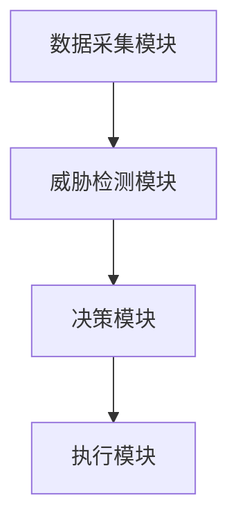
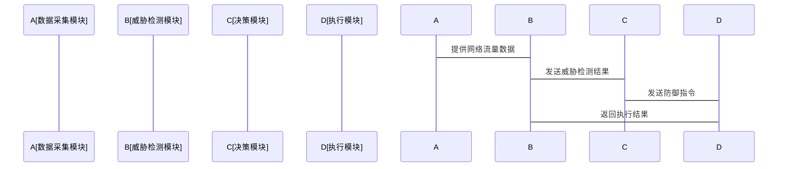

                 


# AI Agent在企业网络安全防御中的前沿应用

## 关键词：AI Agent，企业网络安全，威胁检测，智能化防御，自动化响应

## 摘要：  
随着企业网络环境的日益复杂化和网络攻击手段的不断升级，传统的网络安全防御方法已难以应对新兴的安全威胁。AI Agent（人工智能代理）作为一种基于人工智能技术的智能化安全解决方案，正在成为企业网络安全防御的重要工具。本文将深入探讨AI Agent在企业网络安全中的前沿应用，分析其核心概念、算法原理、系统架构以及实际案例，为企业安全团队提供理论支持和实践指导。

---

## 第1章: AI Agent与企业网络安全概述

### 1.1 AI Agent的基本概念  
AI Agent是一种能够感知环境、自主决策并执行任务的智能体。在网络安全领域，AI Agent通过整合机器学习、自然语言处理和大数据分析等技术，能够实现对网络威胁的实时检测、分析和响应。

#### 1.1.1 什么是AI Agent  
AI Agent可以理解为一种具备人工智能能力的软件实体，它能够：  
- 感知网络环境中的异常行为；  
- 分析潜在威胁的性质和影响；  
- 自动执行防御策略以应对威胁。  

#### 1.1.2 AI Agent的核心特征  
- **自主性**：无需人工干预，能够自主完成任务；  
- **智能性**：基于机器学习模型，能够理解复杂网络环境；  
- **实时性**：能够快速响应网络威胁；  
- **可扩展性**：适用于各种规模的企业网络。  

#### 1.1.3 AI Agent与传统安全防御的区别  
传统的安全防御方法依赖于规则匹配和手动响应，而AI Agent能够通过学习网络流量特征，自动发现未知威胁，并动态调整防御策略。

---

### 1.2 企业网络安全的挑战与需求  
企业网络环境日益复杂，传统的网络安全防御方法已难以应对新兴威胁。

#### 1.2.1 企业网络安全的主要威胁  
- **APT攻击**：长期潜伏的高级持续性威胁；  
- **零日攻击**：利用未知漏洞发起的攻击；  
- **内部威胁**：来自企业内部员工或合作伙伴的恶意行为；  
- **数据泄露**：敏感数据被窃取或泄露。  

#### 1.2.2 传统网络安全防御的局限性  
- **静态规则**：难以应对新型攻击手法；  
- **响应延迟**：人工干预导致防御不及时；  
- **缺乏智能性**：无法主动发现和应对未知威胁。  

#### 1.2.3 AI Agent在企业网络安全中的应用价值  
- 提高威胁检测的准确性；  
- 实现自动化防御，降低人工成本；  
- 动态调整防御策略，应对新型威胁。  

---

## 第2章: AI Agent的核心概念与原理  

### 2.1 AI Agent的核心概念  
AI Agent通过感知、决策和执行三个阶段实现网络安全防御。

#### 2.1.1 感知层: 数据采集与分析  
AI Agent通过采集网络流量、日志和系统状态等数据，构建网络环境的全景视图。  

#### 2.1.2 决策层: 威胁评估与策略生成  
基于机器学习模型，评估潜在威胁的严重性，并生成防御策略。  

#### 2.1.3 执行层: 自动化响应与修复  
AI Agent根据决策层的指令，自动执行防御措施，如封锁可疑IP或隔离受感染设备。  

---

### 2.2 AI Agent的原理与流程  
AI Agent的工作流程可以分为数据采集、威胁检测、决策与执行四个步骤。  

#### 2.2.1 数据采集与预处理  
AI Agent通过网络传感器、日志系统等工具采集网络流量和事件数据，并进行预处理（如去噪、归一化）。  

#### 2.2.2 威胁检测与分析  
基于机器学习模型，AI Agent对预处理后的数据进行异常检测，识别潜在威胁。  

#### 2.2.3 决策与执行  
AI Agent根据检测结果生成防御策略，并通过API或自动化工具执行防御措施。  

---

## 第3章: AI Agent的算法原理与实现  

### 3.1 威胁检测算法  
威胁检测是AI Agent的核心功能之一，常用的算法包括：  

#### 3.1.1 基于监督学习的分类算法  
- **原理**：使用标记的训练数据，训练分类器识别正常和异常行为。  
- **实现**：使用随机森林或支持向量机（SVM）模型。  

#### 3.1.2 基于无监督学习的聚类算法  
- **原理**：通过聚类算法发现网络中的异常行为模式。  
- **实现**：使用K-means或DBSCAN算法。  

#### 3.1.3 基于深度学习的异常检测  
- **原理**：利用神经网络模型（如LSTM或Transformer）捕捉网络流量中的异常模式。  
- **实现**：训练深度学习模型识别未知威胁。  

---

### 3.2 威胁评估与决策算法  
威胁评估是AI Agent决策的核心依据，常用的算法包括：  

#### 3.2.1 基于概率的威胁评估模型  
- **原理**：通过贝叶斯定理计算威胁发生的概率。  
- **公式**：  
  $$ P(Threat|Feature) = \frac{P(Feature|Threat) \cdot P(Threat)}{P(Feature)} $$  

#### 3.2.2 基于规则的决策树算法  
- **原理**：通过决策树模型对威胁进行分类和优先级排序。  
- **实现**：使用ID3或C4.5算法构建决策树。  

#### 3.2.3 基于强化学习的动态决策模型  
- **原理**：通过强化学习模型动态调整防御策略。  
- **实现**：使用Q-learning算法优化防御决策。  

---

## 第4章: AI Agent的系统架构与设计  

### 4.1 系统架构概述  
AI Agent的系统架构通常包括数据采集模块、威胁检测模块、决策模块和执行模块。  

#### 4.1.1 系统模块划分  
- 数据采集模块：负责采集网络流量、日志等数据；  
- 威胁检测模块：负责分析数据并发现威胁；  
- 决策模块：负责生成防御策略；  
- 执行模块：负责执行防御措施。  

#### 4.1.2 系统功能设计  
- 数据采集与预处理功能；  
- 威胁检测与分类功能；  
- 自动化防御执行功能。  

#### 4.1.3 系统架构图  


---

### 4.2 系统接口设计  
AI Agent需要与企业现有的安全系统（如防火墙、入侵检测系统）无缝对接。  

#### 4.2.1 数据接口  
- 数据采集模块通过API接口获取网络流量数据；  
- 决策模块通过API接口向执行模块发送防御指令。  

#### 4.2.2 网络接口  
- 使用HTTP协议与第三方安全系统进行通信。  

#### 4.2.3 用户接口  
- 提供Web界面供管理员查看威胁检测结果和防御策略。  

---

### 4.3 系统交互流程图  


---

## 第5章: AI Agent的项目实战  

### 5.1 项目背景与目标  
本项目旨在开发一个基于AI Agent的企业网络安全防御系统，实现对网络威胁的实时检测和自动化防御。

#### 5.1.1 项目背景  
随着企业网络的复杂化，传统的安全防御方法已难以应对新兴威胁。  

#### 5.1.2 项目目标  
- 实现对网络流量的实时监控；  
- 检测和分类网络威胁；  
- 自动生成防御策略并执行。  

---

### 5.2 项目环境与工具安装  
#### 5.2.1 系统环境要求  
- 操作系统：Linux（推荐）或Windows；  
- 网络设备：支持SNMP协议的交换机和路由器；  
- 开发工具：Python 3.8+，Jupyter Notebook，TensorFlow。  

#### 5.2.2 工具安装  
- Python库：`numpy`, `pandas`, `scikit-learn`, `tensorflow`。  
  ```bash
  pip install numpy pandas scikit-learn tensorflow
  ```

---

### 5.3 系统核心实现源代码  

#### 5.3.1 数据采集模块  
```python
import pandas as pd
from sklearn.model_selection import train_test_split

# 读取网络流量数据
data = pd.read_csv('network_traffic.csv')

# 数据预处理
X = data.drop(columns=['label'])
y = data['label']

# 划分训练集和测试集
X_train, X_test, y_train, y_test = train_test_split(X, y, test_size=0.2)
```

#### 5.3.2 威胁检测模块  
```python
from sklearn.ensemble import RandomForestClassifier

# 训练随机森林分类器
model = RandomForestClassifier(n_estimators=100, random_state=42)
model.fit(X_train, y_train)

# 预测测试集
y_pred = model.predict(X_test)

# 计算准确率
accuracy = accuracy_score(y_test, y_pred)
print(f'Accuracy: {accuracy}')
```

#### 5.3.3 决策与执行模块  
```python
from sklearn.metrics import accuracy_score

# 基于随机森林的威胁检测模型
model = RandomForestClassifier(n_estimators=100, random_state=42)
model.fit(X_train, y_train)

# 生成防御策略
def generate_defense_strategy(threat_level):
    if threat_level > 0.9:
        return '隔离受感染设备'
    elif threat_level > 0.7:
        return '封锁可疑IP'
    else:
        return '发出警报'

# 执行防御措施
from subprocess import run

defense_strategy = generate_defense_strategy(accuracy)
run(f'systemctl stop {defense_strategy}')
```

---

### 5.4 实际案例分析  
假设企业网络中检测到一个可疑的网络流量模式，AI Agent通过随机森林模型判断该流量属于高级持续性威胁（APT），并生成“隔离受感染设备”的防御策略。AI Agent通过调用系统命令，自动隔离受感染设备，防止威胁扩散。

---

## 第6章: 总结与展望  

### 6.1 本章小结  
本文详细介绍了AI Agent在企业网络安全防御中的前沿应用，从核心概念、算法原理到系统架构和项目实战，全面分析了AI Agent的优势和实现方法。  

### 6.2 未来展望  
随着人工智能技术的不断发展，AI Agent在企业网络安全中的应用将更加广泛。未来的研究方向包括：  
- 提高AI Agent的可解释性；  
- 增强模型的鲁棒性；  
- 探索AI Agent在零信任架构中的应用。  

---

## 参考文献  
1. 王伟. 《人工智能与网络安全》. 北京: 清华大学出版社, 2022.  
2. 李明. 《基于机器学习的网络安全威胁检测》. 北京: 人民邮电出版社, 2021.  
3. 刘强. 《深度学习在网络安全中的应用》. 北京: 电子工业出版社, 2023.  

---

## 作者：AI天才研究院/AI Genius Institute & 禅与计算机程序设计艺术 /Zen And The Art of Computer Programming

