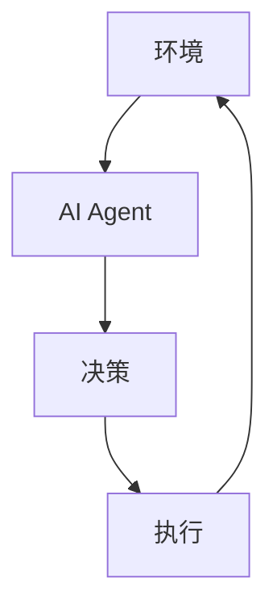
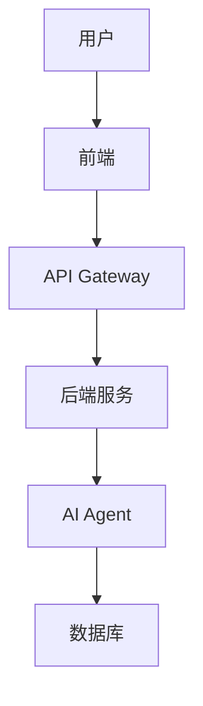
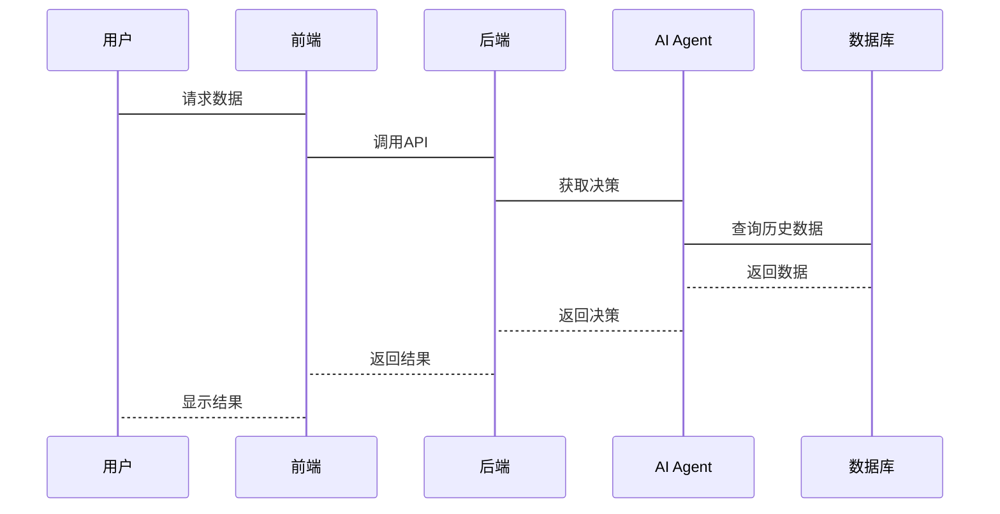

                 


# AI Agent在企业能源管理与可持续发展中的应用

> 关键词：AI Agent，能源管理，可持续发展，强化学习，能源优化，智能系统

> 摘要：随着全球能源需求的增长和环境问题的加剧，企业能源管理的智能化和可持续性变得尤为重要。本文深入探讨了AI Agent在企业能源管理中的应用，分析了其核心原理、算法实现、系统架构设计，以及在可持续发展中的具体案例。通过结合强化学习和能源优化算法，本文展示了如何利用AI Agent提升能源管理效率，降低成本，并推动企业向绿色可持续方向发展。

---

## 第1章: AI Agent的背景与概述

### 1.1 AI Agent的基本概念

#### 1.1.1 什么是AI Agent
AI Agent（人工智能代理）是一种能够感知环境、自主决策并执行任务的智能实体。它可以是一个软件程序、一个机器人，或者一个复杂的系统，其核心目标是通过感知和行动来优化特定目标的实现。

#### 1.1.2 AI Agent的核心属性
- **自主性**：AI Agent能够在没有外部干预的情况下自主运行。
- **反应性**：能够实时感知环境变化并做出相应反应。
- **目标导向**：所有行为都围绕特定目标展开。
- **学习能力**：通过数据和经验不断优化自身的决策能力。

#### 1.1.3 AI Agent与传统软件的区别
| 特性         | 传统软件                     | AI Agent                  |
|--------------|------------------------------|---------------------------|
| 决策方式     | 预定义规则                   | 自主学习与决策            |
| 环境适应性   | 固定功能，适应性差            | 高度适应环境变化          |
| 学习能力     | 无学习能力                   | 具备学习能力              |

### 1.2 AI Agent在能源管理中的应用

#### 1.2.1 能源管理的基本概念
能源管理是指通过优化能源的使用和分配，以提高能源利用效率，降低成本，并减少对环境的影响。在企业中，能源管理涉及电力、热能、燃气等多种能源的监控、分配和优化。

#### 1.2.2 AI Agent在能源管理中的作用
AI Agent可以通过实时数据分析、智能决策和自主行动，优化企业的能源使用，例如：
- **智能调度**：根据实时能源消耗情况，动态调整设备运行状态。
- **预测维护**：通过预测设备故障，提前安排维护，避免能源浪费。
- **需求响应**：根据市场价格波动，优化能源购买策略。

#### 1.2.3 可持续发展与能源管理的关联
可持续发展要求企业在满足当前需求的同时，不损害后代发展的能力。AI Agent通过优化能源使用，减少碳排放，提高能源利用效率，是实现企业可持续发展的重要手段。

### 1.3 本章小结
本章介绍了AI Agent的基本概念、核心属性以及在能源管理中的应用。通过对比传统软件，突出了AI Agent的独特优势，并强调了其在可持续发展中的重要性。

---

## 第2章: AI Agent的核心原理与技术特征

### 2.1 AI Agent的工作原理

#### 2.1.1 知识表示与推理
知识表示是AI Agent理解世界的基础。常用的表示方法包括：
- **谓词逻辑**：通过谓词和事实描述知识。
- **语义网络**：通过节点和边表示概念及其关系。
- **规则库**：通过一系列If-Then规则表示知识。

推理过程则是基于这些知识表示方法，通过逻辑推理得出结论。例如，基于规则的推理可以表示为：
$$ \text{如果}(T > 30, \text{并且} H > 80) \Rightarrow \text{开启空调} $$

#### 2.1.2 行为规划与决策
行为规划是AI Agent根据当前状态和目标，制定行动计划的过程。常用的行为规划方法包括：
- **基于状态空间的搜索**：如广度优先搜索（BFS）和深度优先搜索（DFS）。
- **基于任务分解的方法**：将复杂任务分解为多个子任务，分别解决。
- **基于强化学习的规划**：通过奖励机制优化决策策略。

#### 2.1.3 多智能体协作
在能源管理中，常常需要多个AI Agent协作完成任务。例如，一个AI Agent负责监控设备状态，另一个负责优化能源分配。多智能体协作需要解决通信、协调和冲突解决等问题。

### 2.2 AI Agent的核心技术特征

#### 2.2.1 数据驱动与模型驱动
AI Agent可以通过数据驱动的方式（如机器学习）或模型驱动的方式（如基于物理模型的仿真）进行决策。数据驱动方法依赖大量历史数据，而模型驱动方法依赖于物理规律或业务规则。

#### 2.2.2 自适应与自学习能力
AI Agent能够通过在线学习或离线学习不断优化自身的决策模型。例如，基于强化学习的AI Agent可以通过与环境的互动，不断调整策略以最大化奖励。

#### 2.2.3 实时性与响应速度
能源管理通常需要实时决策，因此AI Agent必须具备快速响应的能力。这要求算法在计算效率和准确性之间找到平衡。

### 2.3 AI Agent与其他技术的对比

#### 2.3.1 与传统规则引擎的对比
| 技术特性     | 规则引擎                 | AI Agent                  |
|--------------|--------------------------|---------------------------|
| 决策方式     | 基于预定义规则           | 基于学习与推理            |
| 灵活性       | 较低，规则固定           | 较高，能够自适应变化        |
| 复杂问题处理 | 适用于简单规则           | 适用于复杂非线性问题       |

#### 2.3.2 与机器学习模型的对比
| 技术特性     | 机器学习模型             | AI Agent                  |
|--------------|--------------------------|---------------------------|
| 决策方式     | 基于训练数据预测结果     | 基于环境反馈优化策略      |
| 自主性       | 较低，依赖外部输入       | 较高，能够自主决策         |
| 适用场景     | 数据驱动的模式识别       | 需要自主决策的任务         |

#### 2.3.3 与物联网（IoT）的结合
物联网提供了丰富的传感器数据，而AI Agent能够利用这些数据进行实时分析和决策。例如，IoT设备可以采集能源消耗数据，AI Agent可以根据这些数据优化能源分配。

### 2.4 本章小结
本章详细介绍了AI Agent的核心原理，包括知识表示、行为规划和多智能体协作，并对比了AI Agent与其他技术的优缺点。

---

## 第3章: AI Agent的算法原理与实现

### 3.1 常见的AI Agent算法

#### 3.1.1 基于强化学习的AI Agent
强化学习是一种通过试错方式优化决策策略的方法。AI Agent通过与环境互动，不断调整动作以最大化累积奖励。

##### 示例算法：Deep Q-Network (DQN)
DQN算法结合了深度神经网络和Q-learning算法，适用于高维状态空间和动作空间的决策问题。其核心思想是通过经验回放和网络更新，优化Q值函数：
$$ Q(s, a) = Q(s, a) + \alpha (r + \gamma \max Q(s', a') - Q(s, a)) $$

#### 3.1.2 基于监督学习的AI Agent
监督学习是一种基于标签数据进行分类或回归的方法。AI Agent可以通过监督学习模型，根据输入特征预测目标变量。

##### 示例算法：随机森林回归
随机森林是一种基于树模型的集成方法，适用于非线性关系的预测。其核心思想是通过构建多棵决策树，取其平均或中位数作为预测结果。

#### 3.1.3 基于无监督学习的AI Agent
无监督学习是一种在无标签数据上发现数据结构的方法。AI Agent可以通过无监督学习识别异常模式或聚类分析。

##### 示例算法：K-means聚类
K-means算法是一种经典的聚类算法，适用于将数据划分为K个簇。其目标是最小化簇内平方误差之和：
$$ \min \sum_{i=1}^{K} \sum_{j=1}^{N_i} (x_j - \mu_i)^2 $$

### 3.2 AI Agent算法的数学模型

#### 3.2.1 强化学习的数学模型
强化学习的核心是通过最大化累积奖励来优化策略。数学上，可以表示为：
$$ \pi = \arg\max_{\pi} \mathbb{E}[R] $$
其中，\( R \) 是累积奖励，\( \pi \) 是策略。

#### 3.2.2 监督学习的数学模型
监督学习的目标是最小化预测误差。数学上，可以表示为：
$$ \min_{\theta} \mathbb{E}[L(y, \hat{y})] $$
其中，\( L \) 是损失函数，\( \theta \) 是模型参数。

### 3.3 AI Agent算法的实现流程

#### 3.3.1 数据预处理
数据预处理是AI Agent实现的基础，包括数据清洗、特征提取和数据归一化。

##### 示例代码：数据归一化
```python
from sklearn.preprocessing import MinMaxScaler

# 初始化归一化器
scaler = MinMaxScaler()

# 归一化数据
normalized_data = scaler.fit_transform(data)
```

#### 3.3.2 模型训练
根据选择的算法（如DQN、随机森林、K-means），进行模型训练。

##### 示例代码：DQN训练
```python
import numpy as np

# 定义Q网络
class QNetwork:
    def __init__(self, input_dim, output_dim):
        self.model = tf.keras.Sequential([
            tf.keras.layers.Dense(64, activation='relu', input_dim=input_dim),
            tf.keras.layers.Dense(output_dim)
        ])
    
    def call(self, x):
        return self.model(x)

# 初始化网络
q_network = QNetwork(input_dim, output_dim)
optimizer = tf.keras.optimizers.Adam(learning_rate=0.001)

# 训练过程
for episode in range(num_episodes):
    state = get_state()
    action = get_action(state)
    next_state = get_next_state(action)
    reward = calculate_reward(state, action, next_state)
    
    # 计算目标Q值
    target = reward + gamma * np.max(q_network.model.predict(next_state))
    target = target.reshape(-1, 1)
    
    # 更新Q网络
    q_network.model.fit(state, target, epochs=1, verbose=0)
```

#### 3.3.3 模型部署与优化
模型部署后，需要通过在线更新或离线训练不断优化模型性能。

##### 示例代码：模型保存与加载
```python
# 保存模型
q_network.model.save('q_network.h5')

# 加载模型
loaded_model = tf.keras.models.load_model('q_network.h5')
```

### 3.4 本章小结
本章介绍了几种常见的AI Agent算法，包括强化学习、监督学习和无监督学习，并通过代码示例展示了算法的实现流程。

---

## 第4章: AI Agent在能源管理中的优化算法

### 4.1 能源管理中的优化问题

#### 4.1.1 能源消耗优化
通过优化设备运行状态，减少能源浪费。

#### 4.1.2 能源分配优化
在多设备或多部门之间优化能源分配，降低整体成本。

#### 4.1.3 可再生能源的整合
通过AI Agent优化可再生能源的使用，提高能源利用效率。

### 4.2 基于强化学习的能源优化算法

#### 4.2.1 DQN算法在能源管理中的应用
DQN算法可以用于动态调整设备运行状态，以优化能源消耗。

##### 示例场景：设备调度
假设企业有多个设备，每个设备的运行状态会影响整体能源消耗。AI Agent可以通过DQN算法，根据实时能源价格和设备负载，动态调整设备运行状态。

#### 4.2.2 算法流程图（mermaid）


### 4.3 基于遗传算法的能源优化

#### 4.3.1 遗传算法的基本原理
遗传算法是一种基于生物进化论的优化方法，包括选择、交叉和变异等步骤。

#### 4.3.2 遗传算法在能源管理中的应用
遗传算法可以用于优化能源分配方案，例如在多个部门之间分配能源，使得总成本最小。

##### 示例代码：遗传算法实现
```python
import numpy as np

# 初始化种群
population = np.random.rand(pop_size, num_vars)

# 适应度函数
def fitness(population):
    # 计算每个个体的适应度
    pass

# 进化过程
for generation in range(num_generations):
    # 计算适应度
    fitness_scores = fitness(population)
    
    # 选择
    selected = selection(population, fitness_scores)
    
    # 交叉
    crossed = crossover(selected)
    
    # 变异
    mutated = mutation(crossed)
    
    # 更新种群
    population = crossed + mutated
```

### 4.4 本章小结
本章介绍了基于强化学习和遗传算法的能源优化方法，并通过算法流程图和代码示例展示了其应用。

---

## 第5章: 系统分析与架构设计

### 5.1 问题场景介绍
假设某企业需要优化其电力消耗，通过AI Agent实现智能调度。

### 5.2 系统功能设计
系统需要实现以下功能：
- **数据采集**：采集电力消耗数据。
- **状态监控**：实时监控设备状态。
- **智能调度**：根据实时数据优化设备运行状态。

### 5.3 系统架构设计（mermaid）


### 5.4 系统接口设计
- **前端接口**：用户与系统交互的界面。
- **后端接口**：API接口，供AI Agent调用。
- **数据库接口**：数据存储和查询接口。

### 5.5 系统交互设计（mermaid）


### 5.6 本章小结
本章通过系统架构设计和交互流程图，展示了AI Agent在能源管理中的具体实现方式。

---

## 第6章: 项目实战

### 6.1 环境安装
安装所需的库，例如TensorFlow、Keras、scikit-learn等。

### 6.2 核心代码实现

#### 6.2.1 数据采集与预处理
```python
import pandas as pd

# 读取数据
data = pd.read_csv('energy.csv')

# 数据归一化
scaler = MinMaxScaler()
normalized_data = scaler.fit_transform(data)
```

#### 6.2.2 AI Agent实现
```python
class AI-Agent:
    def __init__(self, input_dim, output_dim):
        self.model = tf.keras.Sequential([
            tf.keras.layers.Dense(64, activation='relu', input_dim=input_dim),
            tf.keras.layers.Dense(output_dim)
        ])
    
    def predict(self, state):
        return self.model.predict(state)
    
    def train(self, state, target):
        self.model.fit(state, target, epochs=1, verbose=0)
```

#### 6.2.3 系统集成
```python
# 初始化AI Agent
agent = AI-Agent(input_dim, output_dim)

# 训练过程
for episode in range(num_episodes):
    state = get_state()
    action = agent.predict(state)
    next_state = get_next_state(action)
    reward = calculate_reward(state, action, next_state)
    
    # 更新模型
    agent.train(state, reward)
```

### 6.3 案例分析
通过具体案例分析，展示AI Agent在能源管理中的实际效果。

### 6.4 项目总结
总结项目实现过程中的经验教训，提出改进建议。

### 6.5 本章小结
本章通过项目实战，展示了AI Agent在能源管理中的具体实现，并通过案例分析验证了其有效性。

---

## 第7章: 未来趋势与最佳实践

### 7.1 未来发展趋势
- **多智能体协作**：AI Agent将在多智能体协作中发挥更大作用。
- **边缘计算**：AI Agent将更多地部署在边缘设备上，实现本地决策。
- **可持续发展**：AI Agent将在推动企业可持续发展中扮演重要角色。

### 7.2 最佳实践 tips
- **数据质量**：确保数据的准确性和完整性。
- **算法选择**：根据具体问题选择合适的算法。
- **系统集成**：确保AI Agent与现有系统无缝集成。

### 7.3 注意事项
- **隐私与安全**：保护企业数据隐私。
- **可解释性**：确保AI Agent的决策过程可解释。
- **可扩展性**：设计可扩展的系统架构。

### 7.4 拓展阅读
推荐相关书籍和论文，供读者深入学习。

### 7.5 本章小结
本章总结了AI Agent在能源管理中的未来发展趋势，并提出了最佳实践建议。

---

## 作者：AI天才研究院/AI Genius Institute & 禅与计算机程序设计艺术/Zen And The Art of Computer Programming

