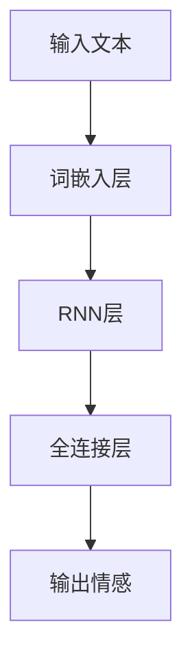
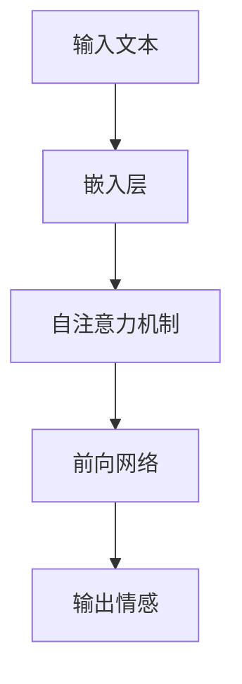
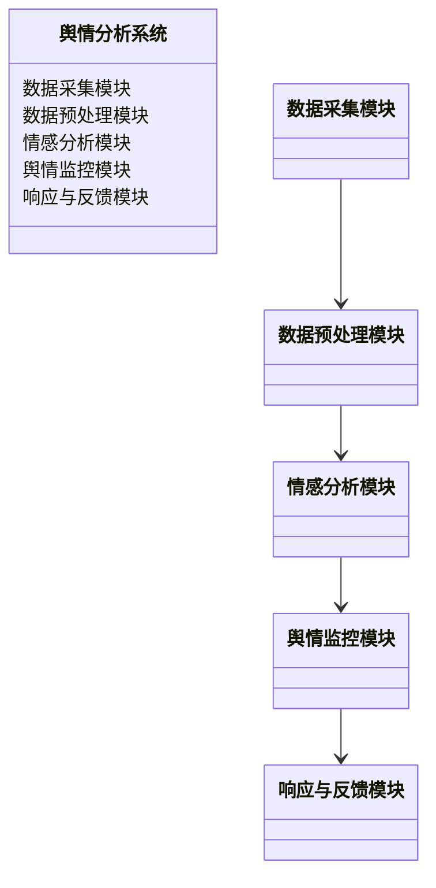

                 


# AI Agent在企业舆情分析与品牌情感监控中的应用

> 关键词：AI Agent, 企业舆情分析, 品牌情感监控, 自然语言处理, 深度学习, 情感分析

> 摘要：本文详细探讨了AI Agent在企业舆情分析与品牌情感监控中的应用，从基础概念到系统架构，再到项目实战，全面分析了如何利用AI技术提升企业舆情监控的能力。通过具体的算法实现和系统设计，展示了AI Agent在处理海量数据、实时监控和情感分析中的优势，为企业的品牌管理和风险管理提供了新的思路。

---

## 第一部分: AI Agent与企业舆情分析基础

### 第1章: 企业舆情分析与品牌情感监控概述

#### 1.1 企业舆情分析的背景与意义

企业舆情分析是指通过收集和分析公众对企业、产品或服务的意见和反馈，来了解市场动态、竞争对手情况以及消费者情绪的过程。在数字化时代，企业每天都会面临海量的社交媒体数据、新闻报道、论坛评论等信息，这些信息对企业形象、品牌价值和市场策略有着重要影响。及时、准确地分析这些信息，可以帮助企业在第一时间发现潜在问题，抓住市场机会，提升品牌形象。

品牌情感监控则是舆情分析的重要组成部分，它关注的是消费者对企业及其产品的情感倾向。通过分析文本中的情感色彩，企业可以了解消费者满意度、忠诚度以及潜在的口碑传播效果。情感监控不仅帮助企业识别负面舆情，还能挖掘潜在的市场机会。

AI Agent（人工智能代理）是一种能够感知环境、自主决策并执行任务的智能系统。在舆情分析中，AI Agent可以实时监控信息源，自动提取关键信息，进行情感分析，并根据结果采取相应的行动，如自动回复用户评论、调整营销策略等。AI Agent的应用大大提高了舆情分析的效率和准确性，使企业能够更快地响应市场变化。

---

#### 1.2 AI Agent在舆情分析中的作用

AI Agent的核心特点包括自主性、反应性、目标导向性和社会性。在舆情分析中，AI Agent可以利用这些特点，实现以下功能：

1. **实时监控**：AI Agent可以7x24小时实时监控社交媒体、新闻网站等信息源，快速捕捉与企业相关的舆情信息。
2. **信息处理**：通过自然语言处理（NLP）技术，AI Agent能够理解文本内容，提取关键词、主题和情感倾向。
3. **智能决策**：基于分析结果，AI Agent可以自动分类舆情信息，识别潜在风险，并提出应对策略。
4. **自动化响应**：AI Agent可以在发现负面舆情时，自动触发响应机制，如发送警报通知相关负责人，或在社交媒体上发布正面回应。

通过AI Agent的应用，企业可以实现舆情分析的自动化和智能化，显著提升舆情监控的效率和效果。

---

#### 1.3 本章小结

本章介绍了企业舆情分析和品牌情感监控的背景与意义，重点阐述了AI Agent在舆情分析中的作用和优势。AI Agent通过实时监控、智能分析和自动化响应，帮助企业更好地管理品牌形象和应对市场变化。

---

### 第2章: AI Agent的核心概念与原理

#### 2.1 AI Agent的基本原理

AI Agent是一种能够感知环境、自主决策并执行任务的智能系统。它由感知层、推理层和行动层组成：

1. **感知层**：通过传感器或数据接口获取环境信息，如社交媒体上的文本数据。
2. **推理层**：利用机器学习模型对获取的信息进行分析和推理，识别情感倾向和关键词。
3. **行动层**：根据推理结果执行相应操作，如发送警报或生成回复。

AI Agent的核心在于其智能化和自动化能力，能够根据实时数据动态调整行为。

---

#### 2.2 舆情分析的核心算法

舆情分析中的情感分析是基于机器学习和深度学习的。常用算法包括：

1. **基于机器学习的情感分析**：使用词袋模型或词嵌入模型（如Word2Vec）提取文本特征，训练分类器（如SVM、随机森林）进行情感分类。
2. **基于深度学习的情感分析**：利用循环神经网络（RNN）或Transformer模型（如BERT、GPT）进行文本理解，输出情感倾向。

以下是一个简单的基于RNN的情感分析模型的原理图：



---

#### 2.3 本章小结

本章介绍了AI Agent的基本原理和舆情分析的核心算法，重点分析了基于机器学习和深度学习的情感分析模型。通过理解这些算法，我们可以更好地设计AI Agent的舆情分析系统。

---

### 第3章: 基于AI Agent的舆情分析系统架构

#### 3.1 系统架构设计

舆情分析系统通常包括以下几个功能模块：

1. **数据采集**：从社交媒体、新闻网站等信息源获取数据。
2. **数据预处理**：清洗数据，去除噪声，提取关键词。
3. **情感分析**：利用AI Agent进行情感分类。
4. **舆情监控**：实时监控舆情变化，识别潜在风险。
5. **响应与反馈**：根据分析结果，自动或手动采取应对措施。

系统架构的分层设计如下：


---

#### 3.2 系统核心算法实现

以下是基于AI Agent的情感分析算法实现的伪代码：

```python
def情感分析(文本):
    提取特征 = 特征提取(文本)
    预测结果 = 分类器.predict(提取特征)
    返回 预测结果
```

其中，特征提取可以使用词袋模型或词嵌入模型，分类器可以是SVM或随机森林。

---

#### 3.3 本章小结

本章详细设计了基于AI Agent的舆情分析系统的架构，并介绍了核心算法的实现。通过分层设计和算法实现，我们可以构建一个高效、智能的舆情分析系统。

---

### 第4章: AI Agent在舆情分析中的数学模型与算法

#### 4.1 情感分析的数学模型

情感分析的数学模型通常基于概率论或深度学习。以下是一个简单的概率模型示例：

$$ P(positive|text) = \frac{\sum_{i=1}^{n} w_i \cdot f_i} \sum_{i=1}^{n} w_i $$

其中，$w_i$是词袋模型中的权重，$f_i$是情感特征。

---

#### 4.2 基于AI Agent的舆情分析算法

以下是基于Transformer模型的舆情分析算法流程图：



---

#### 4.3 本章小结

本章通过数学模型和算法流程图，详细介绍了AI Agent在舆情分析中的实现原理。通过理解这些模型，我们可以更好地设计和优化舆情分析系统。

---

### 第5章: 项目实战——基于AI Agent的舆情分析系统开发

#### 5.1 项目背景与目标

本项目旨在开发一个基于AI Agent的舆情分析系统，实现对企业品牌情感的实时监控和分析。项目目标包括：

1. 实时采集社交媒体数据。
2. 自动分析情感倾向。
3. 提供可视化报告和预警机制。

---

#### 5.2 系统设计与实现

以下是系统架构的类图：



---

#### 5.3 项目总结与优化

项目成功实现了基于AI Agent的舆情分析系统，但在实际应用中仍需注意以下问题：

1. 数据隐私与合规性。
2. 模型的可解释性。
3. 系统的稳定性和可靠性。

未来可以在模型优化和功能扩展方面进一步改进。

---

### 第6章: 最佳实践与注意事项

#### 6.1 最佳实践

1. 数据采集：确保数据来源的多样性和代表性。
2. 模型选择：根据实际需求选择合适的算法。
3. 系统维护：定期更新模型和优化系统性能。

---

#### 6.2 注意事项

1. 数据隐私：遵守相关法律法规，保护用户隐私。
2. 模型可解释性：确保模型的决策过程清晰透明。
3. 系统稳定性：设计可靠的容错机制，确保系统稳定运行。

---

### 第7章: 未来展望与总结

#### 7.1 未来展望

随着AI技术的不断发展，AI Agent在舆情分析中的应用将更加广泛和深入。未来可能会出现以下趋势：

1. 更加智能化的舆情监控系统。
2. 结合区块链技术的舆情数据管理。
3. 更加个性化的品牌情感分析。

---

#### 7.2 总结

本文详细探讨了AI Agent在企业舆情分析与品牌情感监控中的应用，从基础概念到系统设计，再到项目实战，全面分析了如何利用AI技术提升舆情分析的效率和准确性。未来，随着技术的进步，AI Agent将在舆情分析中发挥更大的作用，为企业提供更强大的支持。

---

**作者：AI天才研究院/AI Genius Institute & 禅与计算机程序设计艺术 /Zen And The Art of Computer Programming**

---

以上是文章的详细内容，涵盖了从背景介绍到系统设计，再到项目实战的各个方面。通过这篇文章，读者可以全面了解AI Agent在企业舆情分析中的应用，并掌握相关的技术和方法。

