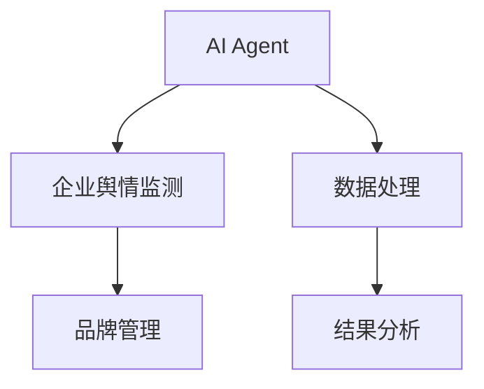
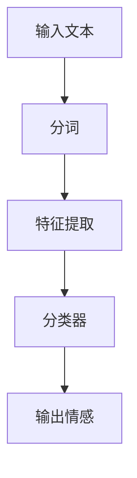
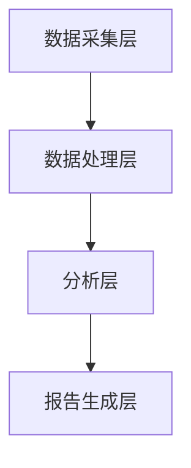
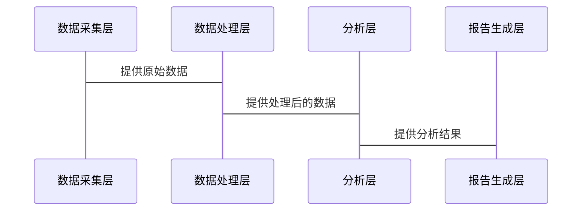

                 


# AI Agent在企业舆情监测与品牌管理中的应用

> 关键词：AI Agent, 企业舆情监测, 品牌管理, 自然语言处理, 情感分析, 信息抽取

> 摘要：随着人工智能技术的快速发展，AI Agent在企业舆情监测与品牌管理中的应用日益广泛。本文系统地介绍了AI Agent的核心概念、算法原理、系统架构，并通过项目实战展示了其在企业中的具体应用，最后总结了最佳实践和未来发展方向。

---

## 第1章: 背景与核心概念

### 1.1 问题背景
#### 1.1.1 企业舆情监测的重要性
企业舆情监测是识别和分析公众对企业及其产品的看法和反馈的重要手段。通过及时了解市场反馈，企业可以调整策略，提升品牌形象。

#### 1.1.2 品牌管理的挑战与需求
品牌管理需要实时监控市场动态，识别潜在风险，并制定应对策略。传统方法依赖人工分析，效率低且成本高。

#### 1.1.3 AI Agent在其中的角色
AI Agent能够实时处理大量数据，提供精准的分析结果，帮助企业在舆情监测和品牌管理中做出快速决策。

### 1.2 核心概念
#### 1.2.1 AI Agent的定义与特点
AI Agent是一种智能代理，能够感知环境、自主决策并执行任务。其特点包括自主性、反应性、目标导向和学习能力。

#### 1.2.2 企业舆情监测的定义与范围
舆情监测涉及收集、分析和报告公众对企业的看法，范围涵盖社交媒体、新闻媒体等多个渠道。

#### 1.2.3 品牌管理的定义与目标
品牌管理旨在提升品牌价值和市场地位，目标包括增强品牌认知度、维护品牌形象和提升客户忠诚度。

### 1.3 核心概念的联系
#### 1.3.1 AI Agent与企业舆情监测的关系
AI Agent通过NLP技术，帮助企业实时分析舆情，识别潜在风险。

#### 1.3.2 AI Agent与品牌管理的结合
AI Agent协助品牌管理，提供竞争对手分析和品牌策略优化建议。

#### 1.3.3 三者之间的关系图（Mermaid流程图）


---

## 第2章: AI Agent的核心原理

### 2.1 AI Agent的基本原理
#### 2.1.1 自然语言处理（NLP）的基本原理
NLP技术用于理解和生成人类语言，包括分词、句法分析和语义理解。

#### 2.1.2 信息抽取与分析
通过信息抽取技术，AI Agent从文本中提取关键信息，如实体识别和关系抽取。

#### 2.1.3 情感分析与主题识别
情感分析判断文本的情感倾向，主题识别提取文本主题。

### 2.2 算法原理
#### 2.2.1 基于NLP的情感分析算法
使用词袋模型或词嵌入模型（如Word2Vec）进行情感分类。

#### 2.2.2 主题模型（如LDA）的原理
主题模型通过概率分布发现文本的主题结构。

#### 2.2.3 实体识别与链接算法
使用CRF或BERT模型进行实体识别和链接。

### 2.3 算法实现
#### 2.3.1 Python代码实现（如情感分析）
```python
from sklearn.feature_extraction.text import TfidfVectorizer
from sklearn.svm import SVC
from sklearn.pipeline import Pipeline
import pandas as pd

data = pd.DataFrame({'text': ["负面评论", "正面评论"], 'label': [0, 1]})
vectorizer = TfidfVectorizer()
model = SVC()
pipeline = Pipeline([('tfidf', vectorizer), (' svc', model)])
pipeline.fit(data['text'], data['label'])
```

#### 2.3.2 算法流程图（Mermaid）


---

## 第3章: 企业舆情监测系统的架构设计

### 3.1 系统功能设计
#### 3.1.1 数据采集模块
从社交媒体、新闻网站等多渠道采集舆情数据。

#### 3.1.2 数据处理模块
对数据进行清洗、分词和特征提取。

#### 3.1.3 分析与预警模块
利用AI Agent进行情感分析和主题识别，实时预警负面舆情。

#### 3.1.4 报告生成模块
生成舆情分析报告，提供数据可视化。

### 3.2 系统架构设计
#### 3.2.1 分层架构设计（Mermaid架构图）


#### 3.2.2 模块之间的交互流程（Mermaid序列图）


---

## 第4章: 品牌管理中的AI Agent应用

### 4.1 品牌管理中的关键问题
#### 4.1.1 品牌声誉管理
通过实时舆情分析维护品牌声誉。

#### 4.1.2 竞争对手分析
监控竞争对手的市场动态，制定应对策略。

#### 4.1.3 品牌策略优化
基于数据驱动的分析，优化品牌推广策略。

### 4.2 AI Agent在品牌管理中的具体应用
#### 4.2.1 基于舆情分析的品牌声誉管理
AI Agent实时监测品牌相关舆情，识别潜在危机。

#### 4.2.2 竞争对手动态监测
通过分析竞争对手的舆情数据，了解市场动态。

#### 4.2.3 品牌策略优化建议
AI Agent提供数据支持，帮助制定精准的品牌策略。

---

## 第5章: 项目实战——构建企业舆情监测系统

### 5.1 项目环境搭建
#### 5.1.1 安装必要的库
安装NLTK、Scikit-learn、Flask等库，搭建开发环境。

#### 5.1.2 数据集准备
收集社交媒体评论、新闻报道等数据，进行清洗和标注。

### 5.2 系统核心实现
#### 5.2.1 数据采集模块
编写爬虫代码，采集舆情数据。

#### 5.2.2 数据处理模块
实现分词、去停用词等功能。

#### 5.2.3 分析与预警模块
开发情感分析和主题识别算法，实时预警负面舆情。

#### 5.2.4 报告生成模块
生成可视化报告，展示舆情分析结果。

### 5.3 代码实现与案例分析
#### 5.3.1 数据采集代码
```python
import requests
from bs4 import BeautifulSoup

def scrape_data(url):
    response = requests.get(url)
    soup = BeautifulSoup(response.text, 'html.parser')
    content = soup.find('div', {'id': 'content'})
    return content.text
```

#### 5.3.2 案例分析
通过实际案例，展示系统如何识别负面舆情并发出预警。

### 5.4 项目小结
总结项目实现的关键点，强调AI Agent在实际应用中的优势。

---

## 第6章: 总结与最佳实践

### 6.1 核心内容总结
总结AI Agent在企业舆情监测与品牌管理中的应用价值。

### 6.2 最佳实践
- 数据质量是关键，确保数据来源可靠。
- 定期优化算法，提升分析精度。
- 结合人工审核，避免误判。

### 6.3 注意事项
- 遵守数据采集和隐私保护的法律法规。
- 定期进行系统维护和更新。

### 6.4 拓展阅读
推荐相关书籍和资源，鼓励读者深入学习。

---

## 作者

作者：AI天才研究院/AI Genius Institute & 禅与计算机程序设计艺术 /Zen And The Art of Computer Programming

---

通过以上详细的内容结构，我们可以看到，文章涵盖了从背景到应用的各个方面，既有理论分析，又有实际案例和代码实现，帮助读者全面理解AI Agent在企业舆情监测与品牌管理中的应用。

