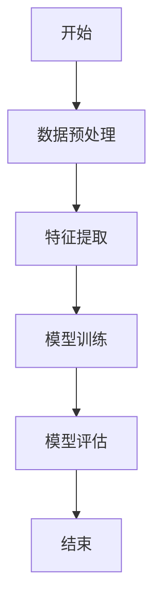

                 


# AI Agent在企业质量控制与产品追溯中的应用

## 关键词：
AI Agent, 企业质量控制, 产品追溯, 人工智能, 智能代理, 质量管理

## 摘要：
本文深入探讨AI Agent在企业质量控制与产品追溯中的应用，分析其核心技术、系统架构、实际案例及未来发展趋势，为企业质量管理的智能化转型提供参考。

---

# 第一部分: AI Agent与企业质量控制概述

## 第1章: AI Agent与企业质量控制概述

### 1.1 AI Agent的基本概念

#### 1.1.1 AI Agent的定义
AI Agent（人工智能代理）是指能够感知环境、自主决策并执行任务的智能实体。它通过传感器获取数据，利用算法处理信息，做出决策，并通过执行器完成目标。

#### 1.1.2 AI Agent的核心特征
- **自主性**：能够自主决策。
- **反应性**：能实时感知环境变化。
- **主动性**：主动采取行动。
- **社会能力**：能与其他系统或人类交互协作。

#### 1.1.3 AI Agent与传统自动化的区别
| 特性 | AI Agent | 传统自动化 |
|------|----------|------------|
| 决策能力 | 高 | 低 |
| 环境适应 | 强 | 弱 |
| 学习能力 | 强 | 无 |

### 1.2 企业质量控制的背景与挑战

#### 1.2.1 企业质量控制的重要性
质量控制是企业生存和发展的基石，直接影响客户满意度和市场竞争力。

#### 1.2.2 当前质量控制的主要挑战
- 数据量大且复杂。
- 人工质检效率低、易出错。
- 质量标准多样，难以统一管理。

#### 1.2.3 AI技术在质量控制中的应用前景
AI技术能够提高质检效率、降低成本，并实现精准的质量预测和优化。

### 1.3 产品追溯的定义与价值

#### 1.3.1 产品追溯的定义
产品追溯是指通过唯一标识，追踪产品从生产到交付的全生命周期信息。

#### 1.3.2 产品追溯的实现方式
- **物理标识**：如二维码、RFID标签。
- **数字记录**：如数据库、区块链。

#### 1.3.3 产品追溯对企业管理的价值
- 提高透明度。
- 便于问题追溯和召回。
- 优化生产流程。

### 1.4 AI Agent在质量控制与追溯中的应用价值

#### 1.4.1 提高质量控制效率
AI Agent能够快速分析大量数据，实现高效质检。

#### 1.4.2 降低质量控制成本
通过自动化和智能化，减少人工成本和资源浪费。

#### 1.4.3 提升产品追溯的准确性
AI Agent能够精准追踪产品信息，确保追溯的准确性。

## 1.5 本章小结
本章介绍了AI Agent的基本概念，分析了企业质量控制和产品追溯的背景与挑战，并探讨了AI Agent在其中的应用价值。

---

# 第二部分: AI Agent的核心技术与算法原理

## 第2章: AI Agent的核心算法原理

### 2.1 基于规则的推理算法

#### 2.1.1 基于规则的推理原理
基于规则的推理通过预定义的规则集进行决策。例如，如果检测到某个缺陷，则标记为不合格品。

#### 2.1.2 规则的表示与匹配
规则通常表示为条件-动作对，通过匹配输入数据与规则的条件部分来触发相应动作。

#### 2.1.3 规则推理的优缺点
- **优点**：简单易懂，易于部署。
- **缺点**：规则维护复杂，难以处理复杂场景。

### 2.2 基于机器学习的质量预测算法

#### 2.2.1 机器学习在质量预测中的应用
机器学习算法（如随机森林、神经网络）可以基于历史数据预测产品质量。

#### 2.2.2 常见的质量预测算法
- **随机森林**：适用于分类和回归任务。
- **神经网络**：适合处理复杂非线性关系。

#### 2.2.3 算法的优缺点分析
- **优点**：能够处理复杂数据，发现隐性模式。
- **缺点**：需要大量数据，计算资源消耗大。

### 2.3 自然语言处理在产品追溯中的应用

#### 2.3.1 NLP的基本原理
NLP通过文本处理技术（如分词、实体识别）分析产品文档，提取关键信息。

#### 2.3.2 NLP在产品追溯中的具体应用
- **缺陷描述分析**：识别缺陷原因。
- **文档自动分类**：分类产品文档。

#### 2.3.3 NLP技术的挑战与优化方向
- **挑战**：文本噪声多，语义理解难。
- **优化**：结合上下文理解，使用预训练模型（如BERT）。

### 2.4 算法流程图


### 2.5 本章小结
本章详细介绍了AI Agent的核心算法，包括基于规则的推理、机器学习和自然语言处理，并分析了它们在质量控制中的应用。

---

# 第三部分: AI Agent的系统架构与设计

## 第3章: 系统架构设计

### 3.1 系统功能模块划分

#### 3.1.1 数据采集模块
负责采集生产过程中的数据，包括传感器数据和文档信息。

#### 3.1.2 数据处理模块
对采集到的数据进行清洗、转换和标准化处理。

#### 3.1.3 AI Agent推理模块
基于处理后的数据进行质量预测和缺陷分类。

#### 3.1.4 追溯管理模块
实现产品的全生命周期追溯，记录每个产品的生产信息。

### 3.2 系统架构设计

#### 3.2.1 系统架构图


#### 3.2.2 实体关系图
```mermaid
er
    Customer --| 产品质量问题 | Product
    Product --| 属于 | Batch
    Batch --| 检测 | QualityCheck
```

### 3.3 系统接口设计

#### 3.3.1 接口描述
- **数据采集接口**：接收传感器数据。
- **推理接口**：调用AI Agent进行质量预测。
- **追溯查询接口**：根据产品ID查询生产信息。

### 3.4 系统交互设计

#### 3.4.1 交互流程图
```mermaid
sequenceDiagram
    Customer ->+> AI Agent: 提交质量查询
    AI Agent ->+> 数据处理模块: 请求处理数据
    数据处理模块 ->+> 数据采集模块: 获取原始数据
    数据处理模块 ->+> AI Agent: 返回处理后数据
    AI Agent ->+> 追溯管理模块: 查询产品信息
    追溯管理模块 --> AI Agent: 返回产品信息
    AI Agent --> Customer: 返回质量结果
```

## 3.5 本章小结
本章详细描述了AI Agent系统的架构设计，包括功能模块划分、系统架构图和交互流程图。

---

# 第四部分: 项目实战

## 第4章: 项目实战——汽车制造行业中的应用

### 4.1 项目背景与目标

#### 4.1.1 项目背景
汽车制造行业的质量控制要求高，且生产过程复杂，适合AI Agent的应用。

#### 4.1.2 项目目标
实现汽车零部件的质量预测和追溯。

### 4.2 环境配置与工具安装

#### 4.2.1 环境配置
- 操作系统：Linux
- 开发工具：PyCharm
- 依赖库：Python 3.8+, scikit-learn, TensorFlow

### 4.3 系统核心实现

#### 4.3.1 数据采集模块实现
```python
import pandas as pd

def collect_data():
    # 从数据库中读取数据
    data = pd.read_sql("SELECT * FROM sensor_data", conn)
    return data
```

#### 4.3.2 数据处理模块实现
```python
from sklearn.preprocessing import StandardScaler

def preprocess(data):
    # 标准化处理
    scaler = StandardScaler()
    data_scaled = scaler.fit_transform(data)
    return data_scaled
```

#### 4.3.3 AI Agent推理模块实现
```python
from sklearn.ensemble import RandomForestClassifier

def quality_prediction(data):
    # 训练随机森林模型
    model = RandomForestClassifier()
    model.fit(X_train, y_train)
    # 预测质量
    y_pred = model.predict(data)
    return y_pred
```

#### 4.3.4 追溯管理模块实现
```python
def trace_product(product_id):
    # 根据product_id查询生产信息
    production_info = db.query("SELECT * FROM production WHERE id = %s" % product_id)
    return production_info
```

### 4.4 项目案例分析与优化

#### 4.4.1 案例分析
通过实际案例分析，验证系统的有效性，如检测到某个批次的缺陷率较高，AI Agent能够准确识别并触发召回流程。

#### 4.4.2 系统优化
- 优化数据处理模块的效率。
- 提升AI Agent的推理速度。

## 4.5 本章小结
本章通过汽车制造行业的实际案例，详细介绍了AI Agent系统的实现过程，包括环境配置、核心代码实现和案例分析。

---

# 第五部分: 扩展与总结

## 第5章: 扩展与总结

### 5.1 最佳实践与经验分享

#### 5.1.1 数据质量管理
确保数据的准确性和完整性，是AI Agent系统成功的关键。

#### 5.1.2 模型优化
定期更新模型，保持其预测准确性。

#### 5.1.3 系统维护
及时修复系统漏洞，确保系统的稳定运行。

### 5.2 小结与展望

#### 5.2.1 小结
本文详细探讨了AI Agent在企业质量控制与产品追溯中的应用，分析了其核心技术、系统架构，并通过实际案例验证了其有效性。

#### 5.2.2 未来展望
随着AI技术的不断发展，AI Agent在质量管理中的应用将更加广泛，推动企业质量管理的智能化转型。

### 5.3 注意事项与风险提示

#### 5.3.1 数据隐私
注意保护企业的数据隐私，防止数据泄露。

#### 5.3.2 系统稳定性
确保系统的高可用性，避免因系统故障导致质量问题。

### 5.4 拓展阅读

#### 5.4.1 推荐书籍
- 《机器学习实战》
- 《深入浅出人工智能》

#### 5.4.2 推荐博客
- https://towardsdatascience.com
- https://medium.com/ai-in-business

## 5.5 本章小结
本章总结了本文的主要内容，并提出了未来的研究方向和建议。

---

# 作者：AI天才研究院 & 禅与计算机程序设计艺术

---

本文通过详细分析AI Agent在企业质量控制与产品追溯中的应用，结合实际案例，为企业质量管理的智能化转型提供了参考。如需进一步探讨，欢迎关注作者的博客或联系作者团队。

