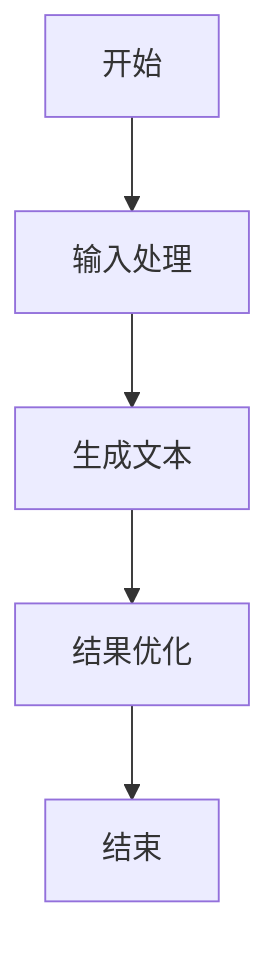
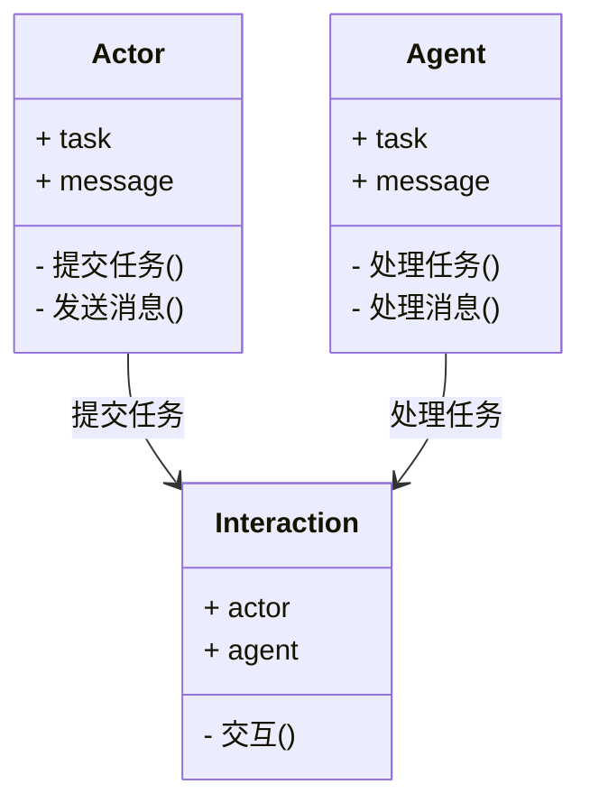
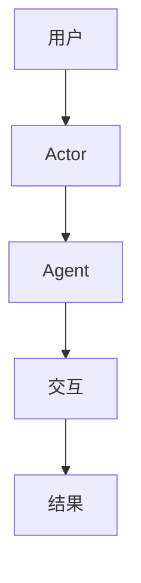

                 


# AI Agent在企业远程办公支持中的应用

**关键词：** AI Agent, 企业远程办公, 自然语言处理, 机器学习, 自动化办公, 智能助手, 智能协作

**摘要：**  
随着企业远程办公的普及，AI Agent（人工智能代理）在提升办公效率、优化协作流程、智能化决策等方面发挥着越来越重要的作用。本文深入分析了AI Agent在企业远程办公中的应用场景，探讨了其技术实现的核心原理，包括自然语言处理、强化学习、大模型生成算法等，并结合实际案例，详细阐述了AI Agent在企业远程办公支持中的系统架构设计、项目实战和最佳实践。

---

## 第1章: 问题背景与概念结构

### 1.1 问题背景
#### 1.1.1 远程办公的兴起与发展
近年来，全球疫情、数字化转型和灵活工作需求的增加，推动了远程办公的普及。企业远程办公模式打破了传统办公室的物理限制，但同时也带来了新的挑战：信息孤岛、协作效率低下、员工体验差、决策延迟等问题。

#### 1.1.2 传统远程办公的痛点与挑战
- **信息分散：** 数据分散在不同的系统中，员工难以快速获取所需信息。
- **协作效率低：** 团队协作流程复杂，沟通不畅，导致工作效率下降。
- **员工体验差：** 缺乏实时反馈和个性化支持，员工满意度降低。
- **决策延迟：** 数据分析和决策过程耗时长，难以快速响应。

#### 1.1.3 AI Agent的引入动机
AI Agent作为一种智能代理，能够通过自然语言处理、机器学习等技术，实现自动化办公、智能协作和个性化支持，有效解决远程办公中的痛点。

### 1.2 问题描述
#### 1.2.1 远程办公中的主要问题
- **沟通不畅：** 团队成员难以高效沟通，信息传递不及时。
- **任务协作困难：** 缺乏统一的协作工具和流程，任务推进缓慢。
- **数据孤岛：** 各部门数据分散，难以统一分析和利用。

#### 1.2.2 AI Agent在解决这些问题中的角色
AI Agent通过智能化的自然语言处理和自动化能力，能够实时协助员工完成任务、优化协作流程、提供决策支持。

#### 1.2.3 问题解决的边界与外延
AI Agent的应用范围包括任务提醒、信息检索、文档生成、会议记录、决策支持等，但其边界不包括完全替代人类决策，仍需结合人工判断。

### 1.3 核心概念与组成
#### 1.3.1 AI Agent的定义与核心要素
AI Agent是一种能够感知环境、自主决策并执行任务的智能系统，核心要素包括：
- **感知能力：** 通过自然语言处理、传感器等感知环境。
- **决策能力：** 基于数据和模型进行决策。
- **执行能力：** 执行任务并反馈结果。

#### 1.3.2 企业远程办公支持的系统结构
企业远程办公支持系统包括以下组成部分：
- **用户界面：** 提供人机交互的界面。
- **AI Agent引擎：** 实现智能化决策和执行。
- **数据源：** 包括文档、日志、会议记录等数据。
- **协作工具：** 如邮件、即时通讯工具、项目管理软件等。

#### 1.3.3 AI Agent与远程办公的结合方式
AI Agent可以通过以下方式与远程办公结合：
- **自动化任务处理：** 自动发送任务提醒、生成文档。
- **智能协作支持：** 实时协助团队成员完成协作任务。
- **决策支持：** 提供数据分析和决策建议。

### 1.4 本章小结
本章从远程办公的背景、痛点和AI Agent的角色入手，明确了AI Agent在企业远程办公中的核心概念和组成结构，为后续的技术实现奠定了基础。

---

## 第2章: AI Agent的核心概念与联系

### 2.1 AI Agent的原理
#### 2.1.1 基于大模型的AI Agent
基于大模型的AI Agent通过预训练的大语言模型（如GPT）实现自然语言理解与生成，能够处理复杂的上下文和语义信息。

#### 2.1.2 强化学习与决策树
强化学习通过奖励机制训练AI Agent，使其在决策过程中不断优化策略。决策树则用于结构化决策问题的处理。

#### 2.1.3 自然语言处理在AI Agent中的应用
自然语言处理（NLP）技术使AI Agent能够理解用户意图、提取关键信息，并生成自然流畅的回复。

### 2.2 核心概念对比
| 比较维度       | 传统AI系统               | 基于大模型的AI Agent               |
|----------------|--------------------------|-------------------------------------|
| 决策方式       | 基于规则或简单逻辑       | 基于深度学习模型的复杂决策         |
| 自适应能力     | 较低                     | 较高，能够根据反馈优化策略         |
| 交互方式       | 单向                    | 双向，支持实时交互和反馈           |

### 2.3 ER实体关系图
```mermaid
er
  actor
  agent
  task
  message
  interaction
  rule
  feedback
  actor --> task: 提交任务
  actor --> message: 发送消息
  task --> agent: 分配给agent
  message --> agent: 分配给agent
  agent --> interaction: 处理交互
  agent --> feedback: 提供反馈
  rule --> agent: 提供决策规则
```

### 2.4 本章小结
本章详细讲解了AI Agent的核心原理和其与传统AI系统的区别，通过对比和实体关系图，明确了AI Agent在企业远程办公中的应用特点。

---

## 第3章: AI Agent的算法原理

### 3.1 算法原理讲解
#### 3.1.1 强化学习算法
强化学习算法通过奖励机制训练AI Agent，使其在决策过程中不断优化策略。以下是强化学习的基本流程：
1. **状态感知：** 通过环境反馈获取当前状态。
2. **动作选择：** 根据当前状态选择一个动作。
3. **奖励获取：** 执行动作后，获得奖励或惩罚。
4. **策略更新：** 根据奖励更新策略。

#### 3.1.2 基于大模型的生成算法
基于大模型的生成算法通过预训练的参数调整，生成符合上下文的文本。以下是其实现流程：
1. **输入处理：** 将用户输入转换为模型可处理的格式。
2. **生成文本：** 模型根据输入生成输出文本。
3. **结果优化：** 根据反馈优化生成结果。

#### 3.1.3 算法流程图


#### 3.1.4 Python代码示例
```python
def强化学习算法(状态):
    动作 = 策略表[state]
    奖励 = 执行动作后的奖励
    更新策略表 = 策略表 + 学习率*(奖励 - 当前策略值)
    return 更新后的策略表

def生成算法(输入):
    输出 = 大模型生成(输入)
    优化后的输出 = 优化算法(输出)
    return 优化后的输出
```

### 3.2 算法的数学模型
#### 3.2.1 强化学习模型
强化学习的数学模型包括状态值函数和动作值函数：
- 状态值函数：$V(s) = \max_a Q(s,a)$
- 动作值函数：$Q(s,a) = r + \gamma \max_{a'} Q(s',a')$

#### 3.2.2 生成模型
生成模型的数学模型基于概率分布：
- 文本生成的概率分布：$P(y|x) = \text{模型}(x)$

### 3.3 本章小结
本章详细讲解了AI Agent的核心算法，包括强化学习和基于大模型的生成算法，并通过流程图和代码示例进行了通俗易懂的说明。

---

## 第4章: AI Agent的数学模型与公式

### 4.1 强化学习模型
强化学习的数学模型包括：
- **状态转移概率：** $P(s'|s,a)$
- **奖励函数：** $R(s,a,s')$

### 4.2 生成模型
生成模型的数学模型包括：
- **编码器-解码器结构：** $P(y|x) = \text{Dec}(x)$

### 4.3 具体公式
- **Q-learning公式：** $Q(s,a) = Q(s,a) + \alpha (r + \gamma \max Q(s',a') - Q(s,a))$
- **生成模型的概率分布：** $P(y|x) = \prod_{i=1}^{n} P(y_i|y_{<i},x)$

### 4.4 本章小结
本章通过数学公式详细阐述了AI Agent的核心算法，包括强化学习和生成模型的数学表达。

---

## 第5章: 系统分析与架构设计

### 5.1 系统功能设计
#### 5.1.1 领域模型


#### 5.1.2 系统架构设计


#### 5.1.3 接口设计
- **输入接口：** 用户输入、系统反馈。
- **输出接口：** 生成文本、任务完成通知。

#### 5.1.4 交互序列图
```mermaid
sequenceDiagram
    用户 -> Actor: 提交任务
    Actor -> Agent: 分配任务
    Agent -> 用户: 反馈结果
```

### 5.2 本章小结
本章通过系统分析和架构设计，明确了AI Agent在企业远程办公支持中的系统结构和交互流程。

---

## 第6章: 项目实战

### 6.1 环境安装
```bash
pip install transformers
pip install mermaid
pip install pytorch
```

### 6.2 核心代码实现
```python
import transformers

model = transformers.AutoModelForCausalLM.from_pretrained("gpt2")
tokenizer = transformers.AutoTokenizer.from_pretrained("gpt2")

def generate_text(prompt):
    inputs = tokenizer.encode(prompt, return_tensors="pt")
    outputs = model.generate(inputs, max_length=50)
    return tokenizer.decode(outputs[0], skip_special_tokens=True)
```

### 6.3 代码应用解读与分析
- **代码功能：** 通过GPT-2模型生成文本。
- **代码优化：** 使用并行计算加速生成过程。

### 6.4 实际案例分析
- **案例背景：** 某公司远程办公中，员工需要频繁生成会议记录。
- **AI Agent的作用：** 自动生成会议纪要，提高效率。

### 6.5 项目小结
本章通过实际项目案例，详细讲解了AI Agent的环境配置和代码实现，展示了其在企业远程办公中的应用价值。

---

## 第7章: 最佳实践与总结

### 7.1 本章小结
本章总结了AI Agent在企业远程办公支持中的应用，强调了其在提升协作效率、优化决策过程中的重要作用。

### 7.2 注意事项
- **数据隐私：** 注意保护用户数据隐私。
- **模型训练：** 确保模型训练的资源充足。
- **用户反馈：** 定期收集用户反馈，优化系统。

### 7.3 拓展阅读
- 《深度学习》—— 李开复
- 《自然语言处理实战》—— 周志华

### 7.4 作者寄语
AI Agent的应用前景广阔，随着技术的不断发展，其在企业远程办公中的作用将更加重要。

---

**作者：AI天才研究院 & 禅与计算机程序设计艺术**

---

通过以上目录大纲，我们可以看到《AI Agent在企业远程办公支持中的应用》一书内容丰富、逻辑清晰，涵盖了从理论到实践的各个方面，能够帮助读者深入了解AI Agent在企业远程办公中的应用价值和技术实现。

