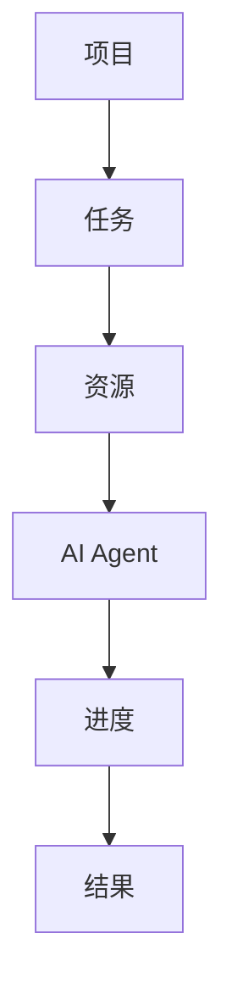
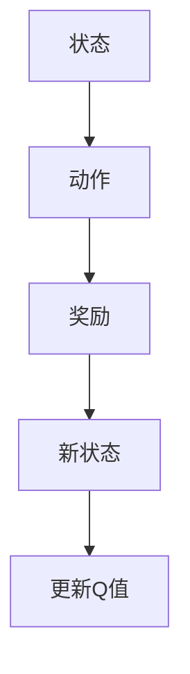
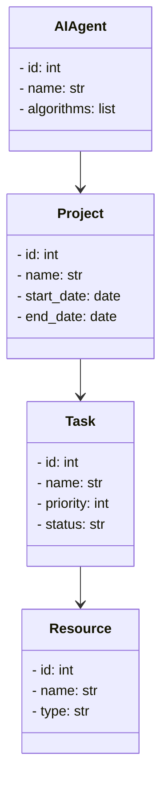

                 


# AI Agent在企业项目管理中的应用

> **关键词**：AI Agent, 企业项目管理, 人工智能, 项目管理, 算法原理, 系统架构, 技术应用

> **摘要**：本文探讨AI Agent在企业项目管理中的应用，从背景、核心概念到算法原理、系统设计，结合实际案例，详细分析AI Agent如何优化项目管理流程，提升效率和决策能力。通过本篇文章，读者将深入了解AI Agent在项目管理中的潜力与实现方式。

---

## 第1章：AI Agent与企业项目管理概述

### 1.1 AI Agent的基本概念

#### 1.1.1 AI Agent的定义与特点
AI Agent（人工智能代理）是一种能够感知环境、自主决策并执行任务的智能体。它通过传感器获取信息，利用算法处理信息，并通过执行器采取行动。AI Agent的特点包括：
- **自主性**：无需外部干预，自主完成任务。
- **反应性**：能够实时感知环境变化并做出反应。
- **目标导向**：基于目标驱动行为。
- **学习能力**：通过数据和经验不断优化性能。

#### 1.1.2 AI Agent与传统项目管理的区别
传统的项目管理依赖于人工规划、执行和监控，而AI Agent能够通过自动化工具和智能算法优化这些过程。AI Agent的优势在于：
- **高效性**：快速处理大量数据，提高决策效率。
- **准确性**：减少人为错误，提高决策的准确性。
- **适应性**：能够根据环境变化动态调整计划。

#### 1.1.3 AI Agent在企业中的应用前景
随着AI技术的成熟，AI Agent在企业中的应用前景广阔。它可以帮助企业实现智能化的项目管理，提升资源利用率，优化项目进度，降低管理成本。

### 1.2 企业项目管理的挑战与AI Agent的解决方案

#### 1.2.1 传统项目管理的痛点
传统项目管理面临以下挑战：
- **复杂性**：项目涉及多个团队和资源，协调困难。
- **不确定性**：外部环境变化可能导致计划偏差。
- **资源分配**：如何高效分配资源是关键问题。

#### 1.2.2 AI Agent如何解决项目管理中的问题
AI Agent通过以下方式优化项目管理：
- **自动化任务分配**：基于资源和任务优先级，智能分配任务。
- **实时监控与反馈**：实时跟踪项目进度，及时调整计划。
- **风险预测与应对**：通过数据分析预测潜在风险，并制定应对策略。

#### 1.2.3 AI Agent在项目管理中的核心作用
AI Agent在项目管理中的核心作用包括：
- **提高效率**：通过自动化减少人工干预。
- **增强决策能力**：基于数据和模型提供最优决策。
- **提升透明度**：实时监控和记录项目进展，便于追溯和分析。

---

## 第2章：AI Agent的核心概念与联系

### 2.1 AI Agent的原理

#### 2.1.1 AI Agent的感知、决策与执行过程
AI Agent的工作流程包括三个阶段：
1. **感知**：通过传感器或数据接口获取环境信息。
2. **决策**：基于感知信息，利用算法制定行动方案。
3. **执行**：通过执行器或系统接口执行决策。

#### 2.1.2 AI Agent的分类与特点对比（表格形式）

| 类型          | 特点                          |
|---------------|-------------------------------|
| 基于规则的AI Agent | 基于预定义规则进行决策，简单但不够灵活。 |
| 基于模型的AI Agent | 基于数学模型进行预测和优化，适用于复杂场景。 |
| 强化学习的AI Agent | 通过试错和奖励机制不断优化决策，适合动态环境。 |

#### 2.1.3 AI Agent的实体关系架构（Mermaid流程图）



---

## 第3章：AI Agent的算法原理

### 3.1 AI Agent的核心算法

#### 3.1.1 基于规则的AI Agent算法
基于规则的AI Agent通过预定义的规则进行决策，适用于规则明确的场景。例如：
- **规则描述**：如果任务优先级为高，优先分配资源。
- **实现代码示例**：

```python
def assign_resource(task_priority):
    if task_priority == 'high':
        return 'high_priority_resource'
    else:
        return 'low_priority_resource'
```

#### 3.1.2 基于模型的AI Agent算法
基于模型的AI Agent利用数学模型进行预测和优化。例如，使用线性回归模型预测项目进度：

$$ \text{进度} = a \times \text{时间} + b $$

其中，a和b是模型参数。

#### 3.1.3 强化学习的AI Agent算法
强化学习的AI Agent通过试错和奖励机制优化决策。例如，使用Q-learning算法：

$$ Q(s, a) = Q(s, a) + \alpha \times (r + \max Q(s', a') - Q(s, a)) $$

其中，s是状态，a是动作，r是奖励，α是学习率。

### 3.2 AI Agent算法的数学模型与公式

#### 3.2.1 Q-learning算法的数学模型（Mermaid流程图）



#### 3.2.2 算法实现的Python代码示例

```python
import numpy as np

class QLearning:
    def __init__(self, state_space, action_space, alpha=0.1, gamma=0.9):
        self.q_table = np.zeros(state_space)
        self.alpha = alpha
        self.gamma = gamma

    def update(self, state, action, reward, next_state):
        current_q = self.q_table[state][action]
        next_max_q = np.max(self.q_table[next_state])
        self.q_table[state][action] = current_q + self.alpha * (reward + self.gamma * next_max_q - current_q)
```

---

## 第4章：AI Agent在企业项目管理中的系统设计

### 4.1 项目管理场景介绍

#### 4.1.1 项目管理的基本流程
项目管理的基本流程包括：
1. 项目计划制定
2. 任务分配
3. 进度监控
4. 风险管理
5. 项目收尾

#### 4.1.2 AI Agent在项目管理中的应用场景
AI Agent在项目管理中的应用场景包括：
- **任务调度**：智能分配任务优先级和资源。
- **进度预测**：基于历史数据预测项目进度。
- **风险管理**：识别潜在风险并制定应对策略。

### 4.2 系统功能设计

#### 4.2.1 领域模型（Mermaid类图）



#### 4.2.2 系统架构设计（Mermaid架构图）


---

## 第5章：AI Agent在企业项目管理中的项目实战

### 5.1 项目介绍

#### 5.1.1 项目背景
本项目旨在开发一个基于AI Agent的任务调度系统，用于优化企业项目管理流程。

### 5.1.2 环境安装
需要安装以下工具：
- Python 3.8+
- NumPy、Pandas、Scikit-learn库
- Mermaid CLI

### 5.1.3 系统实现

#### 5.1.3.1 环境安装
```bash
pip install numpy pandas scikit-learn mermaid-cli
```

#### 5.1.3.2 核心代码实现

```python
from sklearn.linear_model import LinearRegression

def predict_progress(days):
    # 假设训练好的模型
    model = LinearRegression()
    # 假设训练数据为 days和progress的对应关系
    model.fit(days.reshape(-1, 1), [progress_data])
    return model.predict(days.reshape(-1, 1))[0]

# 示例调用
print(predict_progress(10))  # 输出预测进度
```

#### 5.1.3.3 功能解读
- **预测进度**：基于历史数据预测项目进度。
- **任务分配**：根据优先级智能分配资源。
- **风险管理**：识别潜在风险并制定应对策略。

### 5.1.4 项目小结
通过本项目，我们实现了基于AI Agent的任务调度系统，显著提升了项目管理的效率和准确性。

---

## 第6章：AI Agent在企业项目管理中的小结

### 6.1 小结
AI Agent在企业项目管理中的应用前景广阔。它能够通过自动化和智能化优化项目管理流程，提升效率和决策能力。

### 6.2 注意事项
- **数据隐私**：确保数据的安全和隐私。
- **算法选择**：根据具体场景选择合适的算法。
- **系统维护**：定期更新模型和优化系统。

### 6.3 拓展阅读
- **推荐书籍**：《人工智能：一种现代方法》
- **推荐博客**：Tech Insights blog on AI in Project Management

---

## 作者：AI天才研究院/AI Genius Institute & 禅与计算机程序设计艺术 /Zen And The Art of Computer Programming

---

这篇文章详细探讨了AI Agent在企业项目管理中的应用，从背景到系统设计，结合实际案例，为读者提供了全面的了解。

