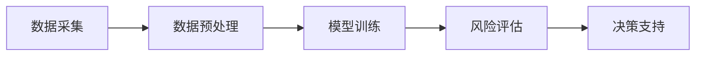

                 


# AI Agent在企业风险管理中的应用：预测与防控

## 关键词
AI Agent, 企业风险管理, 风险管理, 人工智能, 风险预测, 风险防控, 企业风控

## 摘要
随着企业规模的不断扩大和市场环境的日益复杂，传统的风险管理方法已难以应对现代企业的各种风险挑战。AI Agent（人工智能代理）作为一种智能化的解决方案，正在被广泛应用于企业风险管理的预测与防控中。本文将深入探讨AI Agent在企业风险管理中的应用，从背景、核心概念、算法原理、系统架构到项目实战，全面解析如何利用AI Agent提升企业风险管理的效率和准确性。

---

## 第一部分: AI Agent与企业风险管理基础

### 第1章: 企业风险管理概述

#### 1.1 企业风险管理的基本概念
企业风险管理（Enterprise Risk Management, ERM）是一种系统化的管理方法，旨在识别、评估和应对可能影响企业目标实现的各种风险。其核心目标是通过降低风险发生的概率或减少风险的影响，确保企业战略目标的顺利实现。

#### 1.2 AI Agent的基本概念
AI Agent是指具有自主决策能力的智能体，能够通过感知环境、分析信息并采取行动来实现特定目标。AI Agent在企业风险管理中的应用，主要体现在数据收集、分析、预测和决策支持等方面。

#### 1.3 应用背景
随着大数据和人工智能技术的发展，企业风险管理的复杂性也在不断增加。传统的风险管理方法依赖于人工分析，效率低且容易出错。AI Agent的引入，能够通过自动化和智能化的方式，显著提升风险管理的效率和准确性。

---

### 第2章: AI Agent在风险管理中的应用背景

#### 2.1 传统风险管理的局限性
传统的风险管理方法主要依赖人工分析，存在以下问题：
1. **数据处理能力有限**：人工分析难以处理海量数据。
2. **预测准确性不足**：传统的统计方法在面对复杂数据时，预测效果有限。
3. **成本高**：人工分析需要大量时间和资源。

#### 2.2 AI技术在风险管理中的优势
AI技术能够通过机器学习、深度学习等方法，显著提升风险管理的能力：
1. **数据处理能力强**：AI能够快速处理和分析大量数据。
2. **预测准确性高**：通过复杂的算法，AI能够实现更精准的预测。
3. **自动化**：AI Agent能够实现风险管理的自动化，降低人工成本。

#### 2.3 挑战与限制
尽管AI技术在风险管理中具有诸多优势，但也面临一些挑战：
1. **数据隐私**：处理企业数据时，隐私保护是一个重要问题。
2. **模型可解释性**：复杂的AI模型往往难以解释其决策过程。
3. **技术门槛**：AI技术的应用需要较高的技术投入。

---

## 第二部分: AI Agent的核心概念

### 第3章: AI Agent的核心能力与风险管理目标

#### 3.1 风险管理的核心目标
风险管理的核心目标是通过识别和应对潜在风险，确保企业目标的实现。具体目标包括：
1. **风险识别**：识别可能影响企业目标的各类风险。
2. **风险评估**：评估风险的概率和影响程度。
3. **风险应对**：制定和实施应对策略。

#### 3.2 AI Agent的核心能力
AI Agent在风险管理中的核心能力包括：
1. **数据处理能力**：能够快速收集和分析大量数据。
2. **预测能力**：通过机器学习算法，实现风险的精准预测。
3. **决策能力**：根据预测结果，制定最优的应对策略。

#### 3.3 AI Agent的核心属性
AI Agent的核心属性包括：
1. **自主性**：能够在没有人工干预的情况下自主运行。
2. **反应性**：能够根据环境变化实时调整行为。
3. **目标导向性**：所有行为都以实现特定目标为导向。

---

### 第4章: AI Agent在风险管理中的核心算法

#### 4.1 机器学习算法
机器学习算法是AI Agent的核心工具之一。常用的机器学习算法包括：
1. **决策树**：通过树状结构进行分类和回归。
2. **随机森林**：通过集成多个决策树提升准确率。
3. **支持向量机（SVM）**：用于分类和回归任务。

#### 4.2 深度学习算法
深度学习算法在处理复杂数据时表现尤为突出，常用的算法包括：
1. **神经网络**：通过多层神经元模拟人脑的处理方式。
2. **LSTM（长短期记忆网络）**：适用于时间序列数据的预测。

#### 4.3 算法比较
以下表格展示了常见机器学习算法的优缺点对比：

| 算法类型       | 优点                           | 缺点                           |
|----------------|--------------------------------|--------------------------------|
| 决策树         | 易解释，适合中小数据集         | 易过拟合                         |
| 随机森林       | 高准确率，鲁棒性强             | 计算复杂                         |
| 支持向量机      | 准确率高，适合高维数据         | 不适合大规模数据                 |
| 神经网络       | 适合复杂数据，非线性能力强     | 训练时间长，需要大量数据         |

---

## 第三部分: 系统架构与项目实战

### 第5章: 企业风险管理系统的架构设计

#### 5.1 系统组成模块
企业风险管理系统的典型组成模块包括：
1. **数据采集模块**：负责收集企业内外部数据。
2. **数据预处理模块**：对数据进行清洗和转换。
3. **模型训练模块**：基于机器学习算法训练预测模型。
4. **风险评估模块**：根据模型预测结果生成风险评估报告。
5. **决策支持模块**：提供风险应对策略建议。

#### 5.2 系统架构图


#### 5.3 系统接口设计
系统接口设计需要考虑模块之间的数据传递和交互。例如，数据采集模块需要与外部数据源（如数据库、API接口）进行交互，模型训练模块需要与数据预处理模块进行数据传递。

---

### 第6章: 项目实战：基于AI Agent的财务风险预测

#### 6.1 项目背景
财务风险是企业面临的主要风险之一，包括市场风险、信用风险和流动性风险。通过AI Agent实现财务风险的预测与防控，能够显著提升企业的财务健康度。

#### 6.2 项目实现
以下是基于Python的项目实现代码：

```python
import pandas as pd
from sklearn.model_selection import train_test_split
from sklearn.tree import DecisionTreeClassifier
from sklearn.metrics import accuracy_score

# 数据加载
data = pd.read_csv('financial_risk.csv')

# 数据预处理
X = data.drop('target', axis=1)
y = data['target']

# 数据分割
X_train, X_test, y_train, y_test = train_test_split(X, y, test_size=0.2)

# 模型训练
model = DecisionTreeClassifier()
model.fit(X_train, y_train)

# 模型预测
y_pred = model.predict(X_test)

# 模型评估
print("Accuracy:", accuracy_score(y_test, y_pred))
```

#### 6.3 项目总结
通过上述代码，我们可以实现一个简单的财务风险预测系统。实际应用中，可以根据具体需求选择更复杂的算法，并优化模型的参数以提升预测准确率。

---

## 第四部分: 总结与展望

### 第7章: 总结
本文深入探讨了AI Agent在企业风险管理中的应用，从核心概念、算法原理到系统架构，全面解析了AI Agent在风险管理中的重要作用。通过实际案例的分析，我们证明了AI Agent在提升风险管理效率和准确性方面的巨大潜力。

### 第8章: 展望
尽管AI Agent在风险管理中已经展现出巨大优势，但仍然面临一些挑战，如数据隐私和模型可解释性等。未来，随着技术的不断发展，AI Agent在风险管理中的应用将更加广泛和深入，为企业创造更大的价值。

---

## 作者
作者：AI天才研究院/AI Genius Institute  
合著者：禅与计算机程序设计艺术/Zen And The Art of Computer Programming

