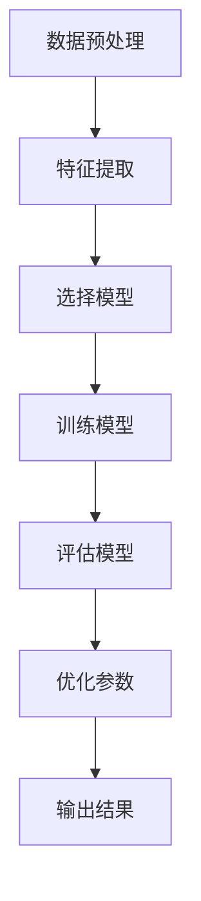
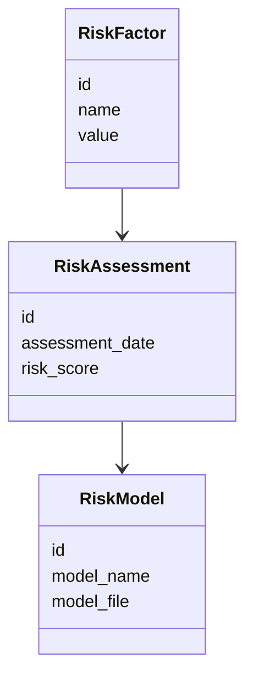
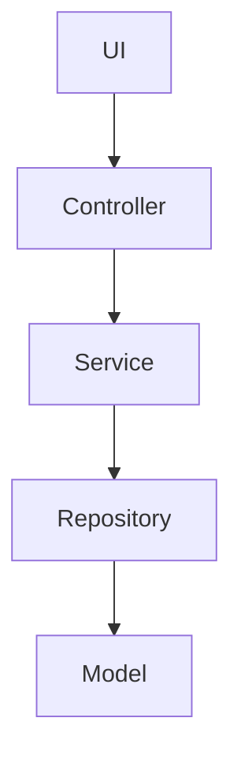
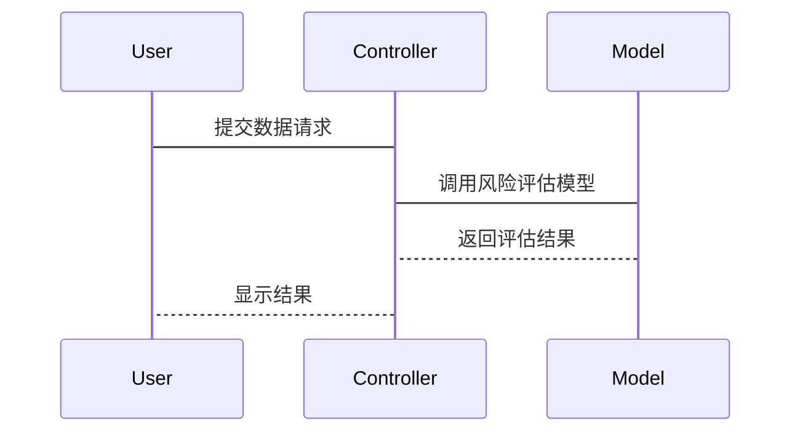

                 


# AI Agent在企业风险评估中的应用

## 关键词：企业风险评估、AI Agent、机器学习、风险预测、数据挖掘、风险控制、决策优化

## 摘要：  
本文探讨了AI Agent在企业风险评估中的应用，分析了传统方法的局限性，详细介绍了AI Agent的核心概念、算法原理、系统架构，并通过实际案例展示了其在风险预测、数据挖掘和决策优化中的优势。文章还提供了项目实战指南和最佳实践建议，帮助读者理解如何利用AI Agent提升企业风险管理能力。

---

# 第1章 企业风险评估的背景与挑战

## 1.1 企业风险评估的基本概念

### 1.1.1 什么是企业风险评估  
企业风险评估是指对企业在经营过程中可能面临的各种风险进行识别、量化和应对的过程。这些风险可能来自市场、财务、法律、运营等多个方面。通过评估，企业可以制定有效的风险管理策略，降低潜在损失。

### 1.1.2 企业风险评估的目的与意义  
- **目的**：识别潜在风险，评估其影响，制定应对措施，优化决策。  
- **意义**：帮助企业规避风险，保障稳定运营，提升竞争力。  

### 1.1.3 传统风险评估方法的局限性  
- 数据处理能力有限，难以应对海量数据。  
- 风险预测准确性不足，依赖人工经验。  
- 方法固定，难以动态调整。  

---

## 1.2 AI Agent的基本概念与特点

### 1.2.1 AI Agent的定义与分类  
- **定义**：AI Agent是具有感知环境、自主决策、执行任务能力的智能实体。  
- **分类**：按智能水平分为反应式、认知式和混合式Agent。  

### 1.2.2 AI Agent的核心技术  
- 机器学习、自然语言处理、计算机视觉、强化学习。  

### 1.2.3 AI Agent的优势与应用场景  
- **优势**：高效处理数据、实时监控、动态调整。  
- **应用场景**：金融、医疗、制造、物流等领域。  

---

## 1.3 本章小结  
本章介绍了企业风险评估的基本概念及其重要性，分析了传统方法的局限性，并阐述了AI Agent的核心概念和优势，为后续内容奠定了基础。

---

# 第2章 AI Agent在企业风险评估中的应用前景

## 2.1 企业风险评估的痛点

### 2.1.1 数据量大且复杂  
企业面临海量数据，传统方法难以高效处理。  

### 2.1.2 传统方法效率低  
依赖人工经验，耗时且成本高。  

### 2.1.3 风险预测准确性不足  
传统方法难以捕捉复杂关系，预测精度有限。  

---

## 2.2 AI Agent在风险评估中的优势

### 2.2.1 高效的数据处理能力  
AI Agent能够快速处理大量数据，提高效率。  

### 2.2.2 智能的风险识别与预测  
利用机器学习模型，精准识别潜在风险并预测其影响。  

### 2.2.3 实时监控与动态调整  
AI Agent实时分析数据，动态优化风险应对策略。  

---

## 2.3 企业风险评估的未来趋势

### 2.3.1 数字化转型的推动  
企业越来越依赖数字化工具进行风险管理。  

### 2.3.2 AI Agent的广泛应用  
AI Agent将在更多领域取代传统方法，成为主流工具。  

### 2.3.3 数据隐私与安全的挑战  
随着数据量的增加，保护数据隐私和安全变得尤为重要。  

---

## 2.4 本章小结  
本章分析了企业风险评估中的痛点，并详细阐述了AI Agent在解决这些问题中的优势，展望了未来的发展趋势。

---

# 第3章 AI Agent在企业风险评估中的核心概念

## 3.1 AI Agent与企业风险评估的关系

### 3.1.1 AI Agent作为风险评估工具  
AI Agent能够高效处理数据，提供精准的风险评估结果。  

### 3.1.2 AI Agent在风险识别中的作用  
AI Agent通过机器学习模型识别潜在风险因素。  

### 3.1.3 AI Agent在风险量化中的应用  
AI Agent利用数据挖掘技术量化风险影响。  

---

## 3.2 风险评估的核心要素

### 3.2.1 风险来源分析  
识别可能的风险来源，如市场波动、供应链中断等。  

### 3.2.2 风险影响评估  
评估风险对企业的潜在影响，如财务损失、声誉损害等。  

### 3.2.3 风险应对策略  
制定应对措施，如分散投资、购买保险等。  

---

## 3.3 AI Agent与传统风险评估方法的对比

### 3.3.1 数据处理能力对比  
AI Agent在数据处理速度和准确性上优于传统方法。  

### 3.3.2 风险预测准确性对比  
AI Agent通过机器学习模型实现更高精度的预测。  

### 3.3.3 实施成本与效率对比  
AI Agent初期投入较高，但长期来看效率和成本效益更优。  

---

## 3.4 本章小结  
本章探讨了AI Agent与企业风险评估的关系，分析了风险评估的核心要素，并对比了AI Agent与传统方法的优劣。

---

# 第4章 AI Agent在企业风险评估中的算法原理

## 4.1 机器学习在风险评估中的应用

### 4.1.1 机器学习模型的选择  
根据数据类型和任务选择合适的模型，如线性回归、随机森林等。  

### 4.1.2 机器学习算法的实现步骤  
1. 数据预处理：清洗、特征提取。  
2. 模型训练：选择算法，训练模型。  
3. 模型评估：验证准确率、召回率。  
4. 模型优化：调整参数，提升性能。  

---

## 4.2 基于机器学习的风险评估算法

### 4.2.1 算法流程图  


### 4.2.2 代码实现示例  
```python
import pandas as pd
from sklearn.model_selection import train_test_split
from sklearn.linear_model import LinearRegression

# 数据加载与预处理
data = pd.read_csv('risk_factors.csv')
X = data.drop('risk_score', axis=1)
y = data['risk_score']

# 数据分割
X_train, X_test, y_train, y_test = train_test_split(X, y, test_size=0.2)

# 模型训练
model = LinearRegression()
model.fit(X_train, y_train)

# 模型评估
score = model.score(X_test, y_test)
print(f'模型准确率：{score}')
```

### 4.2.3 数学模型与公式  
线性回归模型的数学公式为：  
$$ y = \beta_0 + \beta_1x_1 + \beta_2x_2 + \dots + \beta_nx_n $$  
其中，$y$ 是目标变量，$x_i$ 是自变量，$\beta_i$ 是系数。  

---

## 4.3 算法优化与改进

### 4.3.1 超参数调优  
通过网格搜索（Grid Search）等方法优化模型参数。  

### 4.3.2 模型集成  
使用集成学习（如随机森林、梯度提升）提高预测精度。  

---

## 4.4 本章小结  
本章详细讲解了机器学习在风险评估中的应用，通过流程图和代码示例展示了算法实现，并分析了数学模型和优化方法。

---

# 第5章 系统分析与架构设计方案

## 5.1 问题场景介绍

### 5.1.1 企业风险评估的典型场景  
例如，某企业面临市场波动风险，需通过AI Agent进行实时监控和预测。  

---

## 5.2 系统功能设计

### 5.2.1 领域模型设计  


---

## 5.3 系统架构设计

### 5.3.1 分层架构设计  


- **数据采集层**：收集企业内外部数据。  
- **数据处理层**：清洗、转换数据。  
- **模型服务层**：运行机器学习模型进行风险评估。  
- **应用层**：提供用户界面，展示结果。  

---

## 5.4 接口设计与交互流程

### 5.4.1 API接口设计  
- **输入**：企业数据请求。  
- **输出**：风险评估结果。  

### 5.4.2 交互流程图  


---

## 5.5 本章小结  
本章通过系统分析和架构设计，展示了AI Agent在企业风险评估中的实现方案，包括功能设计、架构设计和交互流程。

---

# 第6章 项目实战：AI Agent在企业风险评估中的应用

## 6.1 环境安装与配置

### 6.1.1 安装Python与相关库  
安装Python 3.8及以上版本，安装scikit-learn、pandas、numpy等库。  

### 6.1.2 安装AI框架  
安装TensorFlow或Scikit-learn框架。  

---

## 6.2 核心代码实现

### 6.2.1 数据加载与预处理  
```python
import pandas as pd
import numpy as np

# 加载数据
data = pd.read_csv('enterprise_risk.csv')

# 删除缺失值
data = data.dropna()

# 标准化数据
from sklearn.preprocessing import StandardScaler
scaler = StandardScaler()
data_scaled = scaler.fit_transform(data)
```

---

### 6.2.2 模型训练与评估  
```python
from sklearn.model_selection import train_test_split
from sklearn.ensemble import RandomForestRegressor

# 数据分割
X = data_scaled[:, :-1]
y = data_scaled[:, -1]
X_train, X_test, y_train, y_test = train_test_split(X, y, test_size=0.2)

# 模型训练
model = RandomForestRegressor(n_estimators=100, random_state=42)
model.fit(X_train, y_train)

# 模型评估
from sklearn.metrics import mean_squared_error
y_pred = model.predict(X_test)
mse = mean_squared_error(y_test, y_pred)
print(f'MSE: {mse}')
```

---

## 6.3 实际案例分析

### 6.3.1 案例背景  
某制造企业面临原材料价格波动风险，需通过AI Agent进行预测和优化。  

### 6.3.2 数据分析与建模  
使用随机森林模型预测原材料价格波动对企业利润的影响。  

### 6.3.3 结果解读  
模型预测未来三个月原材料价格波动可能导致10%的利润下降，企业可采取库存调整策略。  

---

## 6.4 本章小结  
本章通过实际案例展示了AI Agent在企业风险评估中的应用，提供了从环境配置到代码实现的详细指南。

---

# 第7章 最佳实践与总结

## 7.1 最佳实践 tips

### 7.1.1 数据质量管理  
确保数据准确、完整和及时更新。  

### 7.1.2 模型持续优化  
定期重新训练模型，更新参数，提升预测精度。  

### 7.1.3 风险应对策略  
根据模型预测结果，制定切实可行的风险应对措施。  

---

## 7.2 小结  
本文详细探讨了AI Agent在企业风险评估中的应用，从理论到实践，为读者提供了全面的指导。

---

## 7.3 注意事项

### 7.3.1 数据隐私保护  
遵守相关法律法规，保护数据隐私和安全。  

### 7.3.2 模型解释性  
确保模型可解释，便于企业理解和应用。  

### 7.3.3 技术局限性  
AI Agent的应用仍需结合企业实际情况，避免过度依赖技术。  

---

## 7.4 拓展阅读

### 7.4.1 推荐书籍  
1. 《机器学习实战》  
2. 《风险管理与控制》  

### 7.4.2 推荐博客与资源  
- AI Genius Institute博客：https://www.ai-genius-institute.com  
- Towards Data Science：https://towardsdatascience.com  

---

## 作者：AI天才研究院/AI Genius Institute & 禅与计算机程序设计艺术/Zen And The Art of Computer Programming  

---

**本文由AI天才研究院（AI Genius Institute）与“禅与计算机程序设计艺术”联合发布，转载请注明出处。**

