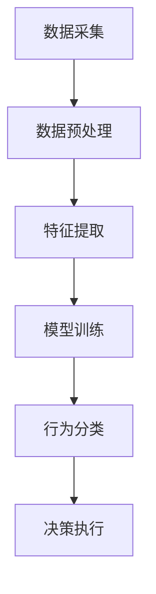
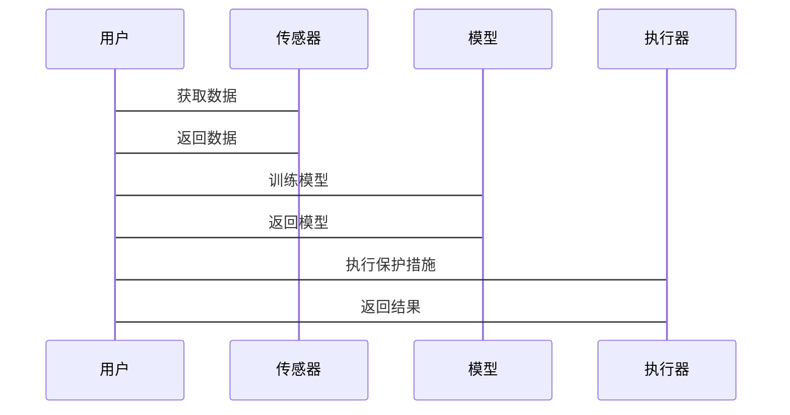

                 


# AI Agent在动物保护中的应用：行为分析与栖息地管理

> 关键词：AI Agent，动物保护，行为分析，栖息地管理，人工智能，动物监测

> 摘要：本文深入探讨了AI Agent在动物保护中的应用，重点分析了AI Agent在动物行为分析与栖息地管理中的核心原理与实际应用。文章从AI Agent的基本概念出发，详细阐述了其在动物行为分析中的算法原理、数学模型，以及在栖息地管理中的系统架构与设计。同时，本文还结合实际案例，展示了AI Agent在动物保护中的具体应用场景，并对未来的研究方向进行了展望。

---

## 第1章: AI Agent与动物保护的背景介绍

### 1.1 AI Agent的基本概念

#### 1.1.1 AI Agent的定义与特点
AI Agent（人工智能代理）是指能够感知环境、自主决策并执行任务的智能实体。AI Agent的核心特点包括：
- **自主性**：能够在没有外部干预的情况下自主完成任务。
- **反应性**：能够实时感知环境变化并做出反应。
- **学习能力**：能够通过数据学习和优化自身的决策能力。
- **协作性**：能够与其他AI Agent或人类进行协作。

#### 1.1.2 AI Agent的核心要素与功能
AI Agent的核心要素包括：
- **感知模块**：用于获取环境信息（如图像、声音、传感器数据等）。
- **决策模块**：基于感知信息进行分析和决策。
- **执行模块**：根据决策结果执行具体操作（如移动、发出指令等）。
- **学习模块**：通过机器学习算法优化自身的决策能力。

#### 1.1.3 AI Agent在动物保护中的应用背景
随着野生动物数量的减少和栖息地的破坏，传统的动物保护方法逐渐暴露出效率低、覆盖面小等局限性。AI Agent作为一种高效、智能的技术手段，能够帮助我们更好地保护濒危动物、监测动物行为、优化栖息地管理。

---

### 1.2 动物保护的挑战与需求

#### 1.2.1 动物保护的核心问题
- **濒危物种保护**：如何有效监测和保护濒危动物的生存环境。
- **动物行为研究**：如何准确分析动物行为，了解其生存需求。
- **栖息地优化**：如何通过技术手段优化动物栖息地，提高其生存环境质量。

#### 1.2.2 传统动物保护方法的局限性
- **人工监测效率低**：传统的人工监测方式耗时耗力，覆盖面有限。
- **数据获取难度大**：动物行为和栖息地数据获取成本高，难以实时监测。
- **保护措施滞后**：传统保护措施往往基于事后分析，缺乏实时性。

#### 1.2.3 AI Agent在动物保护中的潜在价值
- **高效监测**：AI Agent可以通过摄像头、传感器等设备实时监测动物行为和栖息地环境。
- **数据处理能力强**：AI Agent能够快速处理海量数据，提取有价值的信息。
- **智能决策**：AI Agent可以通过机器学习算法优化保护措施，提高保护效率。

---

### 1.3 本章小结
本章介绍了AI Agent的基本概念、核心要素及其在动物保护中的应用背景。AI Agent作为一种高效、智能的技术手段，能够帮助我们更好地保护濒危动物、监测动物行为、优化栖息地管理。接下来，我们将深入探讨AI Agent在动物行为分析与栖息地管理中的核心原理与实际应用。

---

## 第2章: AI Agent的核心概念与原理

### 2.1 AI Agent的行为分析模型

#### 2.1.1 行为分析的基本原理
AI Agent的行为分析模型基于机器学习算法，通过分析动物的行为数据（如图像、视频、传感器数据等），提取动物行为特征并进行分类。

#### 2.1.2 基于AI的动物行为分析流程
1. 数据采集：通过摄像头、传感器等设备获取动物行为数据。
2. 数据预处理：对数据进行清洗、归一化等处理。
3. 特征提取：提取动物行为的特征（如动作频率、空间分布等）。
4. 模型训练：基于特征数据训练分类模型。
5. 行为分类：根据训练好的模型对新数据进行分类。

#### 2.1.3 行为分析的数学模型
常用的行为分析模型包括：
- **线性回归模型**：用于预测动物行为的概率。
- **支持向量机（SVM）**：用于分类动物行为类型。
- **卷积神经网络（CNN）**：用于图像识别和行为分类。

---

### 2.2 AI Agent的栖息地管理模型

#### 2.2.1 栖息地管理的核心要素
- **栖息地环境**：包括气候、地形、植被等因素。
- **动物分布**：包括动物种群的数量、分布范围等。
- **保护措施**：包括栖息地优化、迁徙通道保护等。

#### 2.2.2 基于AI的栖息地优化算法
AI Agent可以通过以下步骤优化动物栖息地：
1. 数据采集：获取栖息地环境数据。
2. 数据分析：通过机器学习算法分析栖息地特征。
3. 优化决策：基于分析结果优化栖息地布局。

#### 2.2.3 栖息地管理的数学模型
常用的栖息地管理模型包括：
- **空间分析模型**：用于分析动物分布的空间特征。
- **网络流模型**：用于优化动物迁徙路径。

---

### 2.3 AI Agent的核心算法原理

#### 2.3.1 机器学习算法在行为分析中的应用
- **监督学习**：用于分类动物行为类型。
- **无监督学习**：用于聚类动物行为特征。

#### 2.3.2 深度学习算法在栖息地管理中的应用
- **卷积神经网络（CNN）**：用于图像识别和栖息地分析。
- **循环神经网络（RNN）**：用于时间序列数据的分析。

#### 2.3.3 算法的优缺点对比
- **监督学习**：优点是分类精度高，缺点是需要大量标注数据。
- **无监督学习**：优点是不需要标注数据，缺点是分类精度较低。
- **深度学习**：优点是能够处理复杂数据，缺点是计算资源需求高。

---

## 第3章: AI Agent的行为分析与数学模型

### 3.1 基于AI的行为分析模型

#### 3.1.1 行为分析的数学模型
$$
P(y|x) = \frac{P(x|y)P(y)}{P(x)}
$$

其中，$P(y|x)$ 表示在特征 $x$ 下行为 $y$ 的概率。

#### 3.1.2 基于监督学习的行为分类算法
- **线性回归**：用于预测行为概率。
- **支持向量机（SVM）**：用于分类行为类型。

#### 3.1.3 基于无监督学习的行为聚类算法
- **K-means**：用于聚类动物行为特征。

---

### 3.2 基于AI的栖息地管理模型

#### 3.2.1 栖息地管理的数学模型
$$
\text{优化目标} = \sum_{i=1}^{n} w_i x_i
$$

其中，$w_i$ 是权重，$x_i$ 是特征。

#### 3.2.2 基于强化学习的栖息地优化算法
- **Q-learning**：用于优化栖息地布局。
- **深度强化学习（DRL）**：用于复杂环境下的栖息地优化。

#### 3.2.3 基于图论的栖息地网络分析
- **图模型**：用于分析动物迁徙路径。

---

## 第4章: AI Agent的系统架构与设计

### 4.1 系统架构设计

#### 4.1.1 系统功能模块划分
- **数据采集模块**：负责采集动物行为和环境数据。
- **数据处理模块**：负责对数据进行清洗和预处理。
- **模型训练模块**：负责训练行为分析和栖息地管理模型。
- **决策执行模块**：负责根据模型结果执行保护措施。

#### 4.1.2 系统架构的ER图设计
```mermaid
erDiagram
    class AnimalBehavior {
        id : integer
        behavior_type : string
        timestamp : datetime
    }
    class HabitatFeature {
        id : integer
        feature_type : string
        value : float
    }
    class保护措施 {
        id : integer
        measure_type : string
        execution_time : datetime
    }
    AnimalBehavior --> HabitatFeature : 关联
    AnimalBehavior --> 保护措施 : 关联
```

#### 4.1.3 系统架构的流程图设计


---

### 4.2 系统接口设计

#### 4.2.1 系统功能
- **数据接口**：用于与传感器、摄像头等设备交互。
- **模型接口**：用于与机器学习模型交互。
- **用户接口**：用于与用户交互，展示保护结果。

#### 4.2.2 系统交互的序列图设计


---

## 第5章: 项目实战

### 5.1 项目环境安装

#### 5.1.1 安装Python环境
```bash
pip install python
pip install numpy
pip install pandas
pip install scikit-learn
pip install tensorflow
```

#### 5.1.2 安装AI框架
```bash
pip install keras
pip install matplotlib
pip install opencv-python
```

---

### 5.2 系统核心实现源代码

#### 5.2.1 行为分析代码
```python
import numpy as np
from sklearn.svm import SVC
from sklearn.metrics import accuracy_score

# 数据预处理
X_train = np.load('behavior_features.npy')
y_train = np.load('behavior_labels.npy')

# 模型训练
model = SVC()
model.fit(X_train, y_train)

# 模型预测
X_test = np.load('test_behavior_features.npy')
y_pred = model.predict(X_test)

# 评估准确率
print(accuracy_score(y_test, y_pred))
```

#### 5.2.2 栖息地优化代码
```python
import tensorflow as tf
from tensorflow.keras import layers

# 定义模型
model = tf.keras.Sequential([
    layers.Conv2D(32, (3,3), activation='relu', input_shape=(64,64,3)),
    layers.MaxPooling2D((2,2)),
    layers.Conv2D(64, (3,3), activation='relu'),
    layers.MaxPooling2D((2,2)),
    layers.Flatten(),
    layers.Dense(128, activation='relu'),
    layers.Dense(1, activation='sigmoid')
])

# 编译模型
model.compile(optimizer='adam', loss='binary_crossentropy', metrics=['accuracy'])

# 训练模型
model.fit(X_train, y_train, epochs=10, batch_size=32)
```

---

### 5.3 代码应用解读与分析

#### 5.3.1 行为分析代码解读
- **数据预处理**：将行为特征数据加载到模型中。
- **模型训练**：使用支持向量机（SVM）训练行为分类模型。
- **模型预测**：对测试数据进行预测并评估准确率。

#### 5.3.2 栖息地优化代码解读
- **模型定义**：定义一个卷积神经网络（CNN）模型，用于图像识别和栖息地优化。
- **模型训练**：使用Adam优化器训练模型。
- **模型评估**：评估模型的准确率和损失值。

---

### 5.4 实际案例分析

#### 5.4.1 案例背景
某自然保护区需要保护濒危物种，使用AI Agent技术进行动物行为分析和栖息地优化。

#### 5.4.2 实施步骤
1. 数据采集：部署摄像头和传感器设备。
2. 数据预处理：清洗和归一化数据。
3. 模型训练：训练行为分析和栖息地优化模型。
4. 模型部署：将模型部署到保护系统中。
5. 保护措施：根据模型结果优化栖息地布局。

---

### 5.5 项目小结
本项目展示了AI Agent在动物保护中的实际应用，通过行为分析和栖息地优化算法，帮助我们更好地保护濒危动物。未来的研究方向包括优化算法性能、提高模型的泛化能力以及探索新的应用场景。

---

## 第6章: 总结与展望

### 6.1 总结
本文深入探讨了AI Agent在动物保护中的应用，重点分析了其在行为分析与栖息地管理中的核心原理与实际应用。通过理论分析和实际案例，展示了AI Agent在动物保护中的巨大潜力。

### 6.2 展望
未来的研究方向包括：
1. **算法优化**：进一步优化AI Agent的行为分析和栖息地管理算法。
2. **多模态数据融合**：结合图像、声音、传感器等多种数据源，提高保护效率。
3. **智能决策系统**：开发更加智能化的决策系统，实现自动化的保护措施。

---

## 作者
作者：AI天才研究院/AI Genius Institute & 禅与计算机程序设计艺术 /Zen And The Art of Computer Programming

---

通过本文的详细讲解，我们希望读者能够深入了解AI Agent在动物保护中的应用，为未来的动物保护工作提供新的思路和方法。

