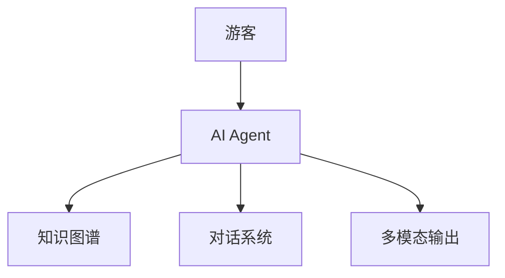
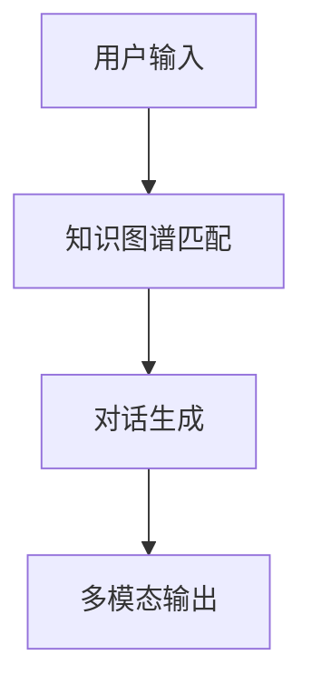

                 

# AI Agent在博物馆中的应用：智能导览与展品解说

**关键词**：AI Agent、智能导览、展品解说、博物馆应用、知识图谱、多模态交互

**摘要**：本文深入探讨AI Agent在博物馆中的应用，重点分析智能导览与展品解说的技术实现。通过背景介绍、核心概念、算法原理、系统设计和项目实战，全面解析AI Agent如何提升博物馆导览体验，为读者提供从理论到实践的详细指导。

---

## 第一部分: AI Agent在博物馆中的应用背景与核心概念

### 第1章: AI Agent与博物馆应用的背景介绍

#### 1.1 问题背景与问题描述

##### 1.1.1 博物馆导览服务的现状与挑战
博物馆作为重要的文化机构，传统导览服务主要依赖人工讲解员或静态的文字说明。这种方式存在以下问题：
- **资源限制**：讲解员数量有限，无法满足高峰时段的大量游客需求。
- **个性化不足**：难以根据游客的兴趣和知识水平提供定制化服务。
- **信息更新滞后**：展品信息更新时，静态说明无法及时调整。

##### 1.1.2 传统导览系统的局限性
现有的电子导览设备（如语音导览器）虽然可以提供一定程度的个性化服务，但仍存在以下缺陷：
- **缺乏互动性**：无法根据游客的实时反馈调整导览内容。
- **信息呈现单一**：仅限于文字或语音形式，缺乏生动的展示方式。
- **维护成本高**：需要定期更新内容，且设备维护复杂。

##### 1.1.3 AI Agent在博物馆中的应用价值
AI Agent（人工智能代理）通过自然语言处理、知识图谱和多模态交互等技术，能够提供实时、个性化、互动性强的导览服务，有效弥补传统导览系统的不足。其主要价值体现在：
- **提升用户体验**：通过智能对话生成，为游客提供深度、个性化的展品解说。
- **降低运营成本**：减少对大量讲解员的依赖，降低人力成本。
- **提高信息更新效率**：通过自动化系统快速更新展品信息，确保游客获得最新内容。

#### 1.2 问题解决与应用边界

##### 1.2.1 AI Agent如何解决导览问题
AI Agent通过以下方式实现智能导览：
- **自然语言理解**：通过NLU（Natural Language Understanding）技术解析游客的查询意图。
- **知识图谱构建**：建立博物馆展品的知识图谱，存储展品的详细信息及其关联关系。
- **对话生成**：基于知识图谱和对话历史，生成自然流畅的回复。
- **多模态交互**：结合文本、语音、图像等多种交互方式，提供丰富的导览体验。

##### 1.2.2 应用场景的边界与外延
AI Agent在博物馆中的应用边界主要集中在导览服务，具体包括：
- **展品解说**：提供展品的详细信息、背景故事、相关知识等。
- **路线规划**：根据游客的兴趣推荐最优参观路线。
- **互动问答**：实时回答游客的问题，提供深度解答。

其外延则包括：
- **虚拟导览**：通过VR/AR技术提供虚拟导览服务。
- **社交分享**：支持游客将导览内容分享到社交媒体。

##### 1.2.3 核心要素与概念结构
AI Agent在博物馆中的应用涉及以下核心要素：
- **知识图谱**：存储展品信息及其关联关系。
- **对话系统**：实现自然语言交互。
- **多模态输出**：支持文本、语音、图像等多种输出形式。

### 第2章: AI Agent的核心概念与联系

#### 2.1 核心概念原理

##### 2.1.1 AI Agent的基本原理
AI Agent是一种能够感知环境并采取行动以实现目标的智能实体。在博物馆导览场景中，AI Agent通过以下步骤实现智能导览：
1. **感知输入**：接收游客的查询或问题。
2. **理解意图**：通过NLU技术解析游客的需求。
3. **知识检索**：基于知识图谱检索相关信息。
4. **生成回复**：利用对话生成算法生成自然语言回复。
5. **输出反馈**：通过多模态交互将回复呈现给游客。

##### 2.1.2 知识图谱与对话生成机制
知识图谱是AI Agent的核心知识库，存储展品的名称、年代、作者、材质等信息，以及展品之间的关联关系（如同一作者的其他作品、同一时期的其他展品等）。对话生成机制基于知识图谱，结合对话历史和上下文，生成符合用户需求的回复。

##### 2.1.3 多模态交互技术
多模态交互是指通过多种感官通道（如视觉、听觉）与用户进行交互。在博物馆导览中，AI Agent可以通过以下方式实现多模态交互：
- **文本交互**：通过聊天界面提供文字解说。
- **语音交互**：通过语音助手提供实时语音导览。
- **视觉交互**：通过增强现实技术展示展品的三维模型或动态演示。

#### 2.2 核心概念属性对比

##### 2.2.1 AI Agent与传统导览系统的对比分析
| 特性                | AI Agent导览系统          | 传统导览系统          |
|---------------------|--------------------------|----------------------|
| 个性化程度          | 高，可根据用户需求定制   | 低，通常为固定内容    |
| 互动性              | 强，支持实时对话         | 弱，通常为单向信息传递|
| 维护成本            | 低，自动化更新           | 高，需要人工更新      |
| 可扩展性            | 高，支持大规模并发       | 低，受设备和人员限制  |

#### 2.3 实体关系图架构

---

## 第三部分: AI Agent的算法原理与数学模型

### 第3章: 基于知识图谱的对话生成算法

#### 3.1 算法流程

#### 3.2

---

**作者：AI天才研究院/AI Genius Institute & 禅与计算机程序设计艺术 /Zen And The Art of Computer Programming**

