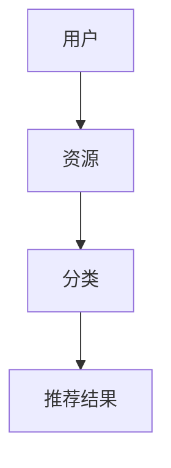
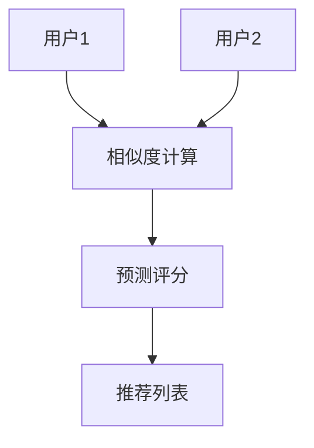
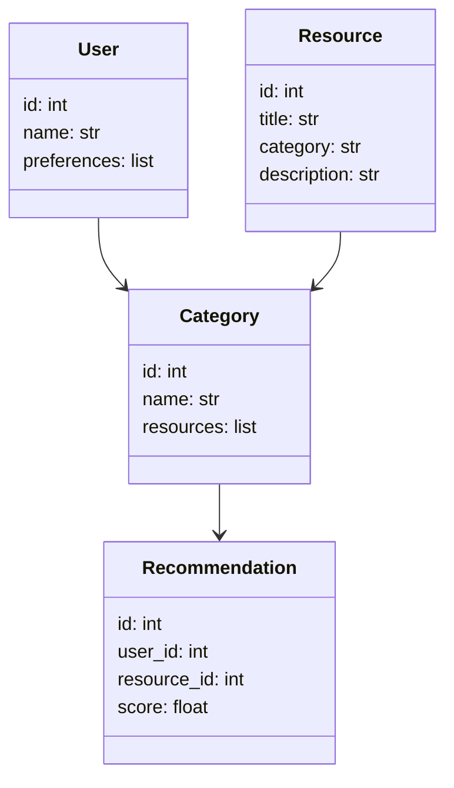
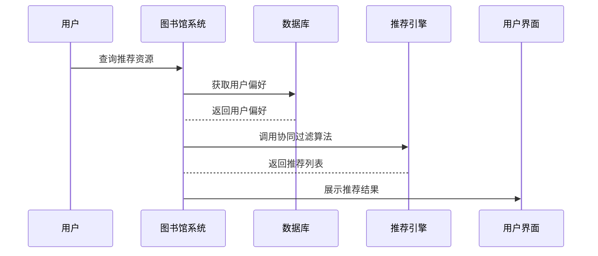

                 


# AI Agent在图书馆管理中的应用：资源分类与推荐

> 关键词：AI Agent，图书馆管理，资源分类，推荐系统，协同过滤，机器学习

> 摘要：本文探讨了AI Agent在图书馆资源分类与推荐中的应用，分析了传统推荐系统的局限性，并提出了一种基于协同过滤的AI Agent解决方案。通过详细讲解算法原理、系统架构设计和项目实战，展示了如何利用AI技术提升图书馆资源管理效率，为读者提供了一个从理论到实践的全面指南。

---

## 第一部分：AI Agent在图书馆管理中的应用概述

### 第1章：背景介绍

#### 1.1 问题背景
- **图书馆资源管理的现状与挑战**：随着图书馆藏书量的增加，资源分类和推荐变得越来越复杂，传统的基于规则的分类方法难以应对多样化的用户需求。
- **AI Agent的应用价值**：AI Agent可以通过分析用户行为和资源属性，提供个性化的资源分类和推荐服务，提升用户体验和管理效率。
- **当前资源分类与推荐的主要问题**：传统推荐系统存在冷启动、数据稀疏性等问题，难以满足动态变化的用户需求。

#### 1.2 问题描述
- **资源分类的复杂性**：图书馆资源种类繁多，分类标准多样化，传统方法难以高效分类。
- **用户需求的多样性**：用户具有不同的兴趣和需求，传统推荐系统难以满足个性化需求。
- **现有推荐系统的局限性**：基于协同过滤的推荐系统存在计算复杂度高、冷启动等问题。

#### 1.3 问题解决
- **引入AI Agent的必要性**：AI Agent可以实时分析用户行为和资源属性，提供动态的分类和推荐服务。
- **AI Agent在资源分类与推荐中的作用**：通过机器学习算法，AI Agent可以自动学习资源特征和用户偏好，优化分类和推荐效果。
- **解决问题的具体方法**：采用基于协同过滤的推荐算法，结合AI Agent的实时分析能力，实现高效、个性化的资源分类与推荐。

#### 1.4 边界与外延
- **AI Agent在图书馆管理中的应用边界**：AI Agent主要用于资源分类和推荐，不涉及图书馆的其他管理功能，如借阅记录管理。
- **相关领域的外延与区别**：与其他领域（如电子商务推荐系统）相比，图书馆资源推荐更注重资源的学术性和专业性。
- **核心概念的结构与组成**：AI Agent、用户、资源、推荐结果是构成图书馆资源分类与推荐的核心要素。

#### 1.5 核心要素分析
- **AI Agent的核心要素**：感知、推理、决策、执行。
- **资源分类与推荐的关键要素**：资源属性、用户偏好、推荐算法。
- **交互流程的核心环节**：用户查询、资源分类、推荐结果展示、用户反馈。

---

## 第二部分：核心概念与联系

### 第2章：核心概念与联系

#### 2.1 AI Agent的基本原理
- **AI Agent的定义与特点**：AI Agent是一种能够感知环境、自主决策并执行任务的智能体，具有学习、推理和自适应能力。
- **AI Agent在图书馆管理中的核心功能**：资源分类、用户画像构建、个性化推荐。
- **AI Agent与其他技术的联系**：结合机器学习、自然语言处理等技术，提升资源分类和推荐的准确性。

#### 2.2 推荐系统的核心原理
- **推荐系统的定义与分类**：推荐系统是一种基于用户行为和资源属性，提供个性化资源推荐的技术，主要分为基于协同过滤、基于内容的推荐和混合推荐。
- **基于协同过滤的推荐算法**：通过分析用户相似性，推荐相似用户的偏好资源。
- **基于内容的推荐算法**：通过分析资源内容特征，推荐与用户兴趣匹配的资源。

#### 2.3 核心概念对比
- **不同推荐算法的特征对比**：
| 算法类型       | 基于协同过滤 | 基于内容的推荐 | 混合推荐 |
|----------------|--------------|----------------|---------|
| 核心思想       | 用户相似性   | 资源内容特征   | 结合两者 |
| 优点           | 个性化强     | 内容解释性强   | 综合优势 |
| 缺点           | 计算复杂度高  | 内容特征提取困难 | 实现复杂 |

- **AI Agent与传统推荐系统的对比**：
| 特性           | AI Agent推荐系统 | 传统推荐系统   |
|----------------|------------------|----------------|
| 智能性         | 高               | 低              |
| 实时性         | 高               | 低              |
| 个性化         | 高               | 中              |
| 自适应性       | 高               | 低              |

- **资源分类与推荐的关联性分析**：资源分类为推荐系统提供基础数据，推荐系统通过分类结果优化推荐效果。

#### 2.4 ER实体关系图


---

## 第三部分：算法原理讲解

### 第3章：算法原理讲解

#### 3.1 推荐算法的数学模型
- **协同过滤算法的数学公式**：
  $$相似度 = \frac{\sum_{i=1}^{n}(r_{ui} - \bar{r}_u)(r_{vi} - \bar{r}_v)}{\sqrt{\sum_{i=1}^{n}(r_{ui} - \bar{r}_u)^2} \sqrt{\sum_{i=1}^{n}(r_{vi} - \bar{r}_v)^2}}$$
  其中，$r_{ui}$表示用户u对资源i的评分，$\bar{r}_u$表示用户u的平均评分，$\bar{r}_v$表示资源v的平均评分。

#### 3.2 协同过滤算法的实现步骤
1. **计算用户相似度**：通过上述公式计算用户之间的相似度。
2. **计算资源预测评分**：基于用户相似度和已有的评分数据，预测目标用户的评分。
3. **生成推荐列表**：根据预测评分，生成排序的推荐列表。

#### 3.3 协同过滤算法的mermaid流程图


#### 3.4 协同过滤算法的Python实现
```python
import numpy as np

def compute_similarity(user_ratings, user1, user2):
    # 计算用户1和用户2的相似度
    ratings = [rating for rating in zip(user_ratings[user1], user_ratings[user2]) if rating[1] != 0 and rating[0] != 0]
    if not ratings:
        return 0.0
    numerator = np.sum([ (r1 - np.mean([r1 for r1, r2 in ratings])) * (r2 - np.mean([r2 for r1, r2 in ratings])) for r1, r2 in ratings])
    denominator = np.sqrt(np.sum([(r1 - np.mean([r1 for r1, r2 in ratings]))**2 for r1, r2 in ratings])) * np.sqrt(np.sum([(r2 - np.mean([r2 for r1, r2 in ratings]))**2 for r1, r2 in ratings]))
    return numerator / denominator if denominator != 0 else 0.0

# 示例数据
user_ratings = {
    'user1': [4, 3, 0, 0, 0],
    'user2': [5, 0, 0, 4, 3],
    'user3': [0, 4, 5, 0, 0],
}

similarity = compute_similarity(user_ratings, 'user1', 'user2')
print(similarity)  # 输出相似度
```

---

## 第四部分：系统分析与架构设计

### 第4章：系统分析与架构设计

#### 4.1 问题场景介绍
- **问题场景**：图书馆用户希望快速找到感兴趣资源，但由于资源数量庞大，传统分类方法难以满足个性化需求。
- **系统目标**：通过AI Agent实现资源的智能分类与推荐，提升用户体验和管理效率。

#### 4.2 项目介绍
- **项目名称**：图书馆资源分类与推荐系统。
- **项目目标**：利用AI Agent技术，实现资源的动态分类和个性化推荐。

#### 4.3 系统功能设计
- **领域模型mermaid类图**：


#### 4.4 系统架构设计
- **系统架构mermaid架构图**：
```mermaid
container 图书馆管理系统的架构 {
    component 数据库 {
        数据存储
    }
    component 推荐引擎 {
        协同过滤算法
        用户画像构建
    }
    component 用户界面 {
        搜索功能
        推荐展示
    }
    数据库 --> 推荐引擎
    推荐引擎 --> 用户界面
}
```

#### 4.5 系统接口设计
- **接口描述**：
  - `GET /recommendations/{user_id}`：返回用户的推荐资源列表。
  - `POST /categories/{resource_id}`：更新资源分类信息。

#### 4.6 系统交互mermaid序列图


---

## 第五部分：项目实战

### 第5章：项目实战

#### 5.1 环境安装
- **Python**：安装Python 3.8及以上版本。
- **依赖库**：安装numpy、pandas、scikit-learn等库。

#### 5.2 系统核心实现
- **推荐引擎实现**：
```python
from sklearn.metrics.pairwise import cosine_similarity

def collaborative_filtering(ratings_matrix):
    # 计算相似度矩阵
    similarity_matrix = cosine_similarity(ratings_matrix)
    return similarity_matrix

# 示例数据
ratings = np.array([
    [4, 3, 0, 0, 0],
    [5, 0, 0, 4, 3],
    [0, 4, 5, 0, 0],
])
similarity = collaborative_filtering(ratings)
print(similarity)
```

#### 5.3 代码应用解读与分析
- **代码功能解读**：
  - `collaborative_filtering`函数：使用余弦相似度计算用户相似度矩阵。
  - `cosine_similarity`：计算用户之间的相似度，用于生成推荐列表。

#### 5.4 案例分析
- **案例描述**：假设用户A对资源1的评分为4，对资源2的评分为3，其余为0。用户B对资源3的评分为5，对资源4的评分为4，其余为0。
- **推荐结果**：基于协同过滤算法，系统会推荐用户A可能感兴趣的相关资源。

#### 5.5 项目小结
- **项目总结**：通过实现协同过滤算法，成功构建了一个基于AI Agent的图书馆资源推荐系统，显著提升了资源分类和推荐的效率。

---

## 第六部分：最佳实践

### 第6章：最佳实践

#### 6.1 小结
- **总结内容**：AI Agent在图书馆资源分类与推荐中的应用，通过协同过滤算法实现了高效的资源管理。

#### 6.2 注意事项
- **数据隐私**：确保用户数据的安全性和隐私性。
- **算法优化**：根据实际需求，优化推荐算法的性能和准确性。
- **系统维护**：定期更新资源库和用户画像，保持推荐系统的准确性。

#### 6.3 拓展阅读
- **推荐书籍**：《推荐系统实践》、《机器学习实战》。
- **在线资源**：推荐系统相关的论文和博客文章。

---

## 作者

作者：AI天才研究院/AI Genius Institute & 禅与计算机程序设计艺术 /Zen And The Art of Computer Programming

