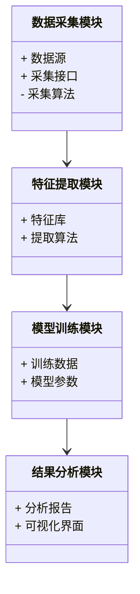

                 


# AI Agent在地质勘探中的应用：矿产资源识别

> **关键词**：AI Agent、地质勘探、矿产资源识别、深度学习、计算机视觉  
> **摘要**：本文探讨AI Agent在地质勘探中的应用，特别是如何利用机器学习和深度学习技术提高矿产资源识别的效率和准确性。通过分析地质数据、设计算法和系统架构，展示AI Agent在地质勘探中的实际应用价值。

---

# 目录

1. [背景介绍](#背景介绍)
   - 1.1 地质勘探的现状与挑战
   - 1.2 AI Agent的基本概念
   - 1.3 矿产资源识别的AI化趋势

2. [AI Agent的核心概念与原理](#ai-agent的核心概念与原理)
   - 2.1 AI Agent的基本原理
   - 2.2 不同类型AI Agent的比较

3. [算法原理与实现](#算法原理与实现)
   - 3.1 卷积神经网络（CNN）原理与实现
   - 3.2 循环神经网络（RNN）原理与实现

4. [系统分析与架构设计](#系统分析与架构设计)
   - 4.1 系统功能设计
   - 4.2 系统架构设计

5. [项目实战：基于AI Agent的矿产资源识别系统](#项目实战基于ai-agent的矿产资源识别系统)
   - 5.1 项目背景与目标
   - 5.2 数据采集与预处理
   - 5.3 系统实现与测试

6. [最佳实践与注意事项](#最佳实践与注意事项)
   - 6.1 实践中的经验总结
   - 6.2 应用中的注意事项

---

## 背景介绍

### 1.1 地质勘探的现状与挑战

地质勘探是一项复杂且耗时的任务，传统方法依赖于地质学家的经验和实地考察。然而，这种方法效率低下，且在复杂地形中难以全面覆盖。矿产资源的识别依赖于对地质数据的深度分析，包括岩石类型、矿物分布和地球物理数据等。数据的多样性和复杂性使得传统方法难以高效处理。

### 1.2 AI Agent的基本概念

AI Agent是一种智能体，能够感知环境并采取行动以实现目标。在地质勘探中，AI Agent可以用于数据处理、模式识别和决策支持。它通过传感器数据、地质数据库和遥感图像进行分析，辅助地质学家做出更准确的判断。

### 1.3 矿产资源识别的AI化趋势

随着AI技术的发展，矿产资源识别逐渐从人工主导转向数据驱动。深度学习和计算机视觉技术在地质勘探中的应用日益广泛，提高了矿产识别的效率和准确性。AI Agent通过处理大量数据，能够发现人类难以察觉的模式，从而在地质勘探中发挥重要作用。

---

## AI Agent的核心概念与原理

### 2.1 AI Agent的基本原理

AI Agent通过感知环境、分析数据和执行任务来实现目标。在地质勘探中，AI Agent能够从卫星图像、地质数据中提取特征，识别潜在的矿产资源。其核心在于数据处理能力，包括特征提取、模式识别和决策支持。

#### AI Agent的类型比较

| 类型       | 描述                                                                 | 优缺点                           |
|------------|----------------------------------------------------------------------|----------------------------------|
| 反应式AI   | 根据当前环境输入做出即时反应                                   | 响应速度快，但缺乏长期规划       |
| 认知式AI   | 具备问题解决能力，能够进行推理和规划                          | 复杂性强，但更接近人类思维模式     |
| 实用式AI   | 以效用函数为目标，选择最优行动                                 | 适合决策优化，但需要明确的目标函数 |

### 2.2 不同类型AI Agent的比较

不同类型AI Agent在地质勘探中的应用各有优劣。例如，反应式AI适合实时数据处理，而认知式AI适合复杂地质模型的构建。通过选择合适的AI Agent类型，可以提升地质勘探的效率和准确性。

---

## 算法原理与实现

### 3.1 卷积神经网络（CNN）原理与实现

CNN在图像处理中表现出色，适用于地质勘探中的矿物识别。其核心是卷积层和池化层，能够提取图像的局部特征。

#### CNN的流程图


#### CNN的Python实现示例

```python
import tensorflow as tf
from tensorflow.keras import layers

model = tf.keras.Sequential([
    layers.Conv2D(32, (3,3), activation='relu', input_shape=(64, 64, 3)),
    layers.MaxPooling2D((2,2)),
    layers.Conv2D(64, (3,3), activation='relu'),
    layers.MaxPooling2D((2,2)),
    layers.Flatten(),
    layers.Dense(128, activation='relu'),
    layers.Dense(10, activation='softmax')
])
```

### 3.2 循环神经网络（RNN）原理与实现

RNN适合处理序列数据，如地质勘探中的时间序列数据。其通过处理连续数据，识别潜在的模式。

#### RNN的流程图


#### RNN的Python实现示例

```python
import tensorflow as tf
from tensorflow.keras import layers

model = tf.keras.Sequential([
    layers.SimpleRNN(32, return_sequences=True, input_shape=(None, 10)),
    layers.Dense(10, activation='softmax')
])
```

---

## 系统分析与架构设计

### 4.1 系统功能设计

地质勘探系统需要具备数据采集、特征提取、模型训练和结果分析功能。模块化的设计能够提高系统的可维护性和扩展性。

#### 系统功能模块的类图



### 4.2 系统架构设计

系统采用分层架构，包括数据层、业务逻辑层和用户界面层。这种设计能够提高系统的稳定性和可扩展性。

#### 系统架构图


---

## 项目实战：基于AI Agent的矿产资源识别系统

### 5.1 项目背景与目标

本项目旨在开发一个基于AI Agent的矿产资源识别系统，利用深度学习技术提高识别效率和准确性。

### 5.2 数据采集与预处理

数据采集包括卫星图像、地质数据库和传感器数据。预处理步骤包括归一化、数据清洗和特征提取。

#### 数据预处理代码示例

```python
import pandas as pd
from sklearn.preprocessing import StandardScaler

data = pd.read_csv('geological_data.csv')
scaler = StandardScaler()
scaled_data = scaler.fit_transform(data)
```

### 5.3 系统实现与测试

系统实现包括数据输入、模型训练和结果输出。测试阶段需要验证模型的准确性和鲁棒性。

#### 模型训练代码示例

```python
model.compile(optimizer='adam', loss='sparse_categorical_crossentropy', metrics=['accuracy'])
model.fit(x_train, y_train, epochs=10, batch_size=32)
```

---

## 最佳实践与注意事项

### 6.1 实践中的经验总结

- 数据质量至关重要，需进行充分的预处理。
- 选择合适的算法和模型，根据具体场景进行调整。
- 模型的可解释性是实际应用中的重要考量。

### 6.2 应用中的注意事项

- 确保数据的代表性和多样性。
- 定期更新模型以适应新的数据和地质条件。
- 考虑模型的计算资源需求，优化部署环境。

---

## 总结

AI Agent在地质勘探中的应用为矿产资源识别带来了新的可能性。通过深度学习和计算机视觉技术，AI Agent能够高效处理复杂数据，提升识别的准确性和效率。然而，实际应用中仍需注意数据质量和模型优化，以充分发挥AI技术的潜力。

---

## 作者：AI天才研究院 & 禅与计算机程序设计艺术

