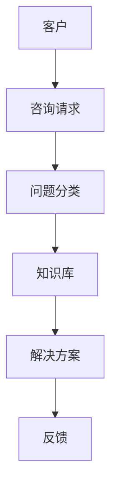
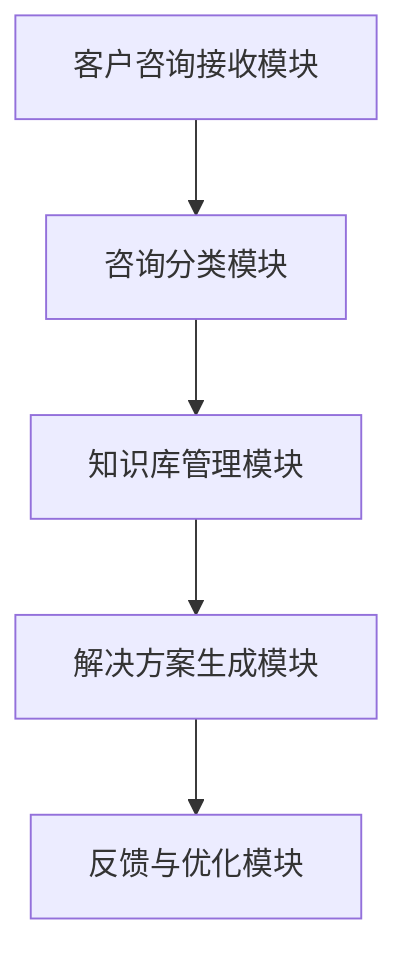
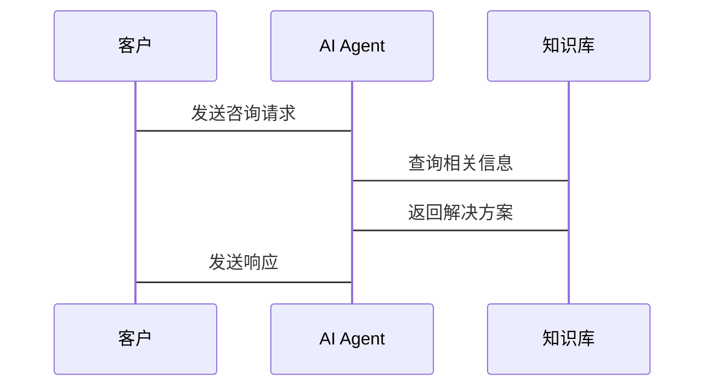

                 


# AI Agent在客户服务中的应用：提升响应速度与质量

> 关键词：AI Agent, 客户服务, 自然语言处理, 强化学习, 知识图谱, 机器学习, 系统架构

> 摘要：本文详细探讨了AI Agent在客户服务中的应用，从基本概念到算法原理，再到系统架构和项目实战，深入分析了如何通过AI技术提升客户服务的响应速度与质量。文章通过丰富的内容和详细的案例，展示了AI Agent在客户服务中的巨大潜力和实际应用价值。

---

## 第一部分: AI Agent在客户服务中的应用概述

### 第1章: AI Agent的基本概念与背景

#### 1.1 AI Agent的定义与核心特征
AI Agent（人工智能代理）是一种能够感知环境、自主决策并执行任务的智能系统。它通过自然语言处理、机器学习和强化学习等技术，能够理解和解决复杂问题，提供高效的服务。

##### 1.1.1 什么是AI Agent
AI Agent是一种智能代理，能够执行特定任务或提供服务。它不同于传统软件，具备自主性和智能性，能够根据输入的信息做出决策并采取行动。

##### 1.1.2 AI Agent的核心特征
- **自主性**：无需人工干预，自动执行任务。
- **反应性**：能够实时感知环境并做出反应。
- **学习能力**：通过数据和经验不断优化性能。
- **适应性**：能够根据环境变化调整策略。

##### 1.1.3 AI Agent与传统客服的区别
| 特性 | AI Agent | 传统客服 |
|------|----------|----------|
| 响应速度 | 实时响应 | 可能延迟 |
| 处理能力 | 可处理复杂问题 | 处理能力有限 |
| 可扩展性 | 高 | 低 |
| 成本 | 低 | 高 |

#### 1.2 客户服务中的AI Agent应用背景
随着客户期望的不断提高，传统客服模式逐渐暴露出效率低下、成本高昂等问题。AI Agent的引入，为客户服务带来了革命性的变化。

##### 1.2.1 客户服务面临的挑战
- 客户需求多样化，传统客服难以快速响应。
- 人工成本高，企业难以承受。
- 客服人员培训成本高，且难以覆盖所有知识领域。

##### 1.2.2 AI Agent在客户服务中的优势
- 24/7全天候服务，满足客户随时需求。
- 高效处理大量咨询，提升响应速度。
- 智能学习，不断优化服务质量。

##### 1.2.3 AI Agent的应用场景
- **在线咨询**：客户通过网站或APP进行咨询。
- **电话客服**：通过语音识别和自然语言处理提供服务。
- **社交媒体客服**：在社交媒体平台上实时响应客户咨询。

---

### 第2章: AI Agent的核心概念与联系

#### 2.1 AI Agent的核心概念
AI Agent的工作流程可以分为感知、决策和执行三个阶段。

##### 2.1.1 感知层
AI Agent通过自然语言处理技术，理解客户的咨询内容，提取关键信息。

##### 2.1.2 决策层
基于感知到的信息，AI Agent利用机器学习模型进行分析，生成解决方案。

##### 2.1.3 执行层
AI Agent根据决策结果，通过相应的接口或渠道（如邮件、短信）向客户发送响应。

#### 2.2 AI Agent的核心概念对比
通过对比不同类型的AI Agent，可以帮助更好地理解其优缺点。

##### 2.2.1 规则型AI Agent与学习型AI Agent对比
| 特性 | 规则型AI Agent | 学习型AI Agent |
|------|----------------|----------------|
| 实现方式 | 基于预设规则 | 基于机器学习模型 |
| 适应性 | 较低 | 较高 |
| 维护成本 | 低 | 高 |

##### 2.2.2 基于规则的AI Agent与基于模型的AI Agent对比
| 特性 | 基于规则的AI Agent | 基于模型的AI Agent |
|------|------------------|------------------|
| 处理方式 | 通过预设规则匹配 | 通过模型学习生成 |
| 灵活性 | 较低 | 较高 |
| 适用场景 | 简单规则场景 | 复杂场景 |

##### 2.2.3 基于知识图谱的AI Agent与基于机器学习的AI Agent对比
| 特性 | 基于知识图谱的AI Agent | 基于机器学习的AI Agent |
|------|---------------------|---------------------|
| 数据依赖 | 高度依赖结构化知识库 | 依赖大量非结构化数据 |
| 适用场景 | 知识库问答 | 多样化场景 |

#### 2.3 AI Agent的ER实体关系图



---

## 第二部分: AI Agent的算法原理

### 第3章: AI Agent的算法原理

#### 3.1 自然语言处理（NLP）在AI Agent中的应用
NLP是AI Agent实现自然语言理解的核心技术。

##### 3.1.1 NLP的基本原理
NLP通过文本处理、语义分析等技术，将客户的咨询内容转化为可理解的结构化信息。

##### 3.1.2 基于预训练语言模型的NLP实现
预训练语言模型（如BERT、GPT）在NLP任务中表现出色，能够处理复杂的语义信息。

##### 3.1.3 NLP在客服咨询中的应用案例
例如，使用BERT模型对客户咨询进行意图识别和实体抽取。

#### 3.2 强化学习在AI Agent中的应用
强化学习用于优化AI Agent的对话策略。

##### 3.2.1 强化学习的基本原理
通过与环境的交互，AI Agent学习最优策略，以最大化奖励。

##### 3.2.2 基于强化学习的对话策略优化
在客服对话中，AI Agent通过强化学习不断优化回复的准确性和客户满意度。

##### 3.2.3 强化学习在客服场景中的应用
例如，在复杂的客户投诉处理中，AI Agent通过强化学习选择最优的解决方案。

#### 3.3 NLP和强化学习的结合
通过结合NLP和强化学习，AI Agent能够更智能地理解客户需求并做出最佳回应。

---

### 第4章: AI Agent的数学模型与算法实现

#### 4.1 基于深度学习的NLP模型
使用Transformer架构的BERT模型进行文本编码和解码。

##### 4.1.1 BERT模型的结构
BERT模型通过多层自注意力机制，捕捉文本中的语义信息。

##### 4.1.2 BERT模型的应用
在客服咨询中，BERT模型可以用于意图识别和文本生成。

#### 4.2 基于强化学习的对话策略
通过策略梯度方法优化AI Agent的回复策略。

##### 4.2.1 对话策略的数学模型
定义一个策略函数 $\pi(a|s)$，表示在状态 $s$ 下选择动作 $a$ 的概率。

##### 4.2.2 奖励函数的设计
设计合理的奖励函数，引导AI Agent学习正确的行为。

---

## 第三部分: AI Agent的系统架构与实现

### 第5章: AI Agent的系统架构设计

#### 5.1 系统功能设计
AI Agent系统主要包括以下几个功能模块：

##### 5.1.1 客户咨询接收模块
接收客户的咨询请求，包括文本和语音输入。

##### 5.1.2 咨询分类模块
对客户的咨询进行分类，例如区分投诉、建议等。

##### 5.1.3 知识库管理模块
管理和更新AI Agent的知识库，确保信息的准确性和及时性。

##### 5.1.4 解决方案生成模块
根据分类结果，从知识库中提取相关信息，生成解决方案。

##### 5.1.5 反馈与优化模块
收集客户反馈，优化AI Agent的性能和响应策略。

#### 5.2 系统架构设计
采用微服务架构，各功能模块独立运行，便于维护和扩展。

##### 5.2.1 系统架构图


#### 5.3 系统接口设计
定义清晰的API接口，便于不同模块之间的通信和集成。

##### 5.3.1 API接口描述
- `POST /api/v1/receiveConsult`
- `GET /api/v1/classify`

#### 5.4 系统交互流程图


---

## 第四部分: 项目实战与优化

### 第6章: AI Agent的项目实战

#### 6.1 项目环境安装
安装必要的开发工具和库。

##### 6.1.1 安装Python和相关库
```bash
pip install numpy pandas tensorflow transformers
```

#### 6.2 核心代码实现
实现AI Agent的核心功能模块。

##### 6.2.1 数据预处理代码
```python
import pandas as pd

def preprocess_data(data):
    # 数据清洗和转换
    return processed_data
```

##### 6.2.2 模型训练代码
```python
import tensorflow as tf
from tensorflow.keras import layers

model = tf.keras.Sequential([
    layers.Dense(64, activation='relu'),
    layers.Dense(1, activation='sigmoid')
])
model.compile(optimizer='adam', loss='binary_crossentropy')
model.fit(X_train, y_train, epochs=10)
```

##### 6.2.3 API接口代码
```python
from flask import Flask, request, jsonify

app = Flask(__name__)

@app.route('/api/v1/consult', methods=['POST'])
def consult():
    data = request.json
    # 处理数据并生成响应
    return jsonify(response)
```

#### 6.3 代码解读与案例分析
详细解释代码的功能，并通过实际案例展示AI Agent的应用效果。

---

### 第7章: 最佳实践与优化建议

#### 7.1 最佳实践
- 定期更新知识库，保持信息的准确性。
- 监控系统性能，及时发现和解决问题。
- 收集客户反馈，持续优化AI Agent的性能。

#### 7.2 注意事项
- 确保数据安全，保护客户隐私。
- 设计合理的错误处理机制，避免系统崩溃。
- 提供多种交互方式，满足不同客户的需求。

#### 7.3 拓展阅读
推荐相关书籍和资源，帮助读者深入学习AI Agent和相关技术。

---

## 作者

作者：AI天才研究院/AI Genius Institute & 禅与计算机程序设计艺术 /Zen And The Art of Computer Programming

---

通过本文的详细讲解，读者可以全面了解AI Agent在客户服务中的应用，从理论到实践，掌握提升响应速度与质量的关键技术。希望本文能为相关领域的技术人员和企业决策者提供有价值的参考和启发。

