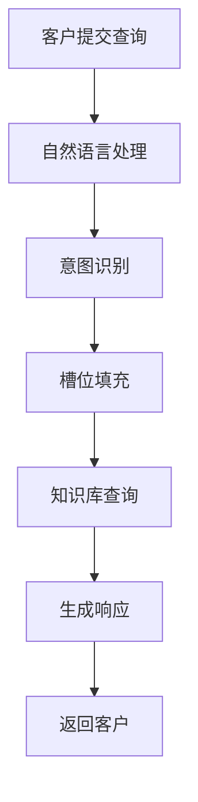
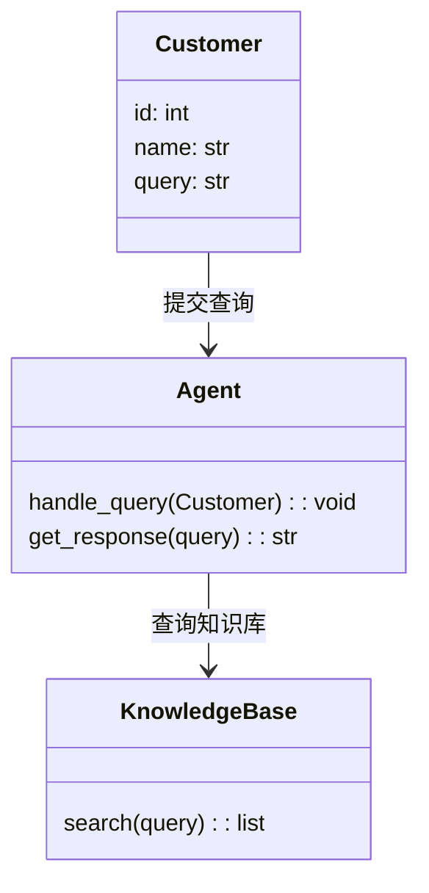

                 


# AI Agent在客户服务领域的应用实践

## 关键词：AI Agent，客户服务，自然语言处理，对话管理，意图识别，系统架构

## 摘要：AI Agent通过自然语言处理和机器学习技术，能够智能地理解和处理客户需求，提升客户服务的效率和质量。本文从背景、核心概念、算法原理、系统架构到项目实战，全面解析AI Agent在客户服务中的应用实践，为读者提供理论与实践相结合的深度解析。

---

# 第一部分: AI Agent在客户服务领域的背景与核心概念

## 第1章: AI Agent与客户服务概述

### 1.1 AI Agent的基本概念

#### 1.1.1 什么是AI Agent
AI Agent（人工智能代理）是指能够感知环境、自主决策并执行任务的智能系统。在客户服务领域，AI Agent通常以虚拟助手或聊天机器人的形式出现，通过自然语言处理（NLP）技术与客户进行交互。

#### 1.1.2 AI Agent的核心要素
- **感知能力**：通过NLP技术理解客户的需求和意图。
- **推理能力**：基于知识库或上下文进行逻辑推理。
- **执行能力**：根据推理结果生成响应或执行操作。
- **学习能力**：通过反馈不断优化自身的性能。

#### 1.1.3 AI Agent与传统客服系统的区别
- **实时性**：AI Agent能够24/7实时响应客户需求，而传统客服系统受限于人工工作时间。
- **智能化**：AI Agent具备自主学习和决策能力，而传统客服系统依赖于人工操作。
- **可扩展性**：AI Agent能够同时处理大量客户需求，而传统客服系统受限于人力。

### 1.2 客户服务领域的AI Agent应用背景

#### 1.2.1 客户服务的传统挑战
- **人力成本高**：传统客服需要大量人工坐席执行，成本高昂。
- **响应时间长**：人工客服无法在第一时间响应客户需求，影响客户体验。
- **服务质量不稳定**：人工客服的素质参差不齐，服务质量难以保证。

#### 1.2.2 AI Agent如何解决这些问题
- **降低人力成本**：AI Agent可以24/7工作，大幅减少对人力的依赖。
- **提升响应速度**：通过自动化处理，AI Agent可以在几秒内响应客户需求。
- **提高服务质量**：AI Agent基于预设的规则和知识库，提供一致且高质量的服务。

#### 1.2.3 AI Agent在客户服务中的边界与外延
AI Agent的应用边界主要集中在简单的客户咨询和问题处理，而对于复杂问题或需要情感支持的场景，仍然需要结合人工客服。其外延则包括智能推荐、客户行为分析等更高级的功能。

---

## 第2章: AI Agent的核心概念与联系

### 2.1 核心概念原理

#### 2.1.1 自然语言处理（NLP）在AI Agent中的作用
NLP技术用于理解和生成人类语言，是AI Agent实现智能交互的核心技术。通过分词、句法分析、实体识别等步骤，AI Agent能够准确理解客户的需求。

#### 2.1.2 意图识别与槽位填充
- **意图识别**：识别客户的意图，例如“查询订单状态”或“申请退款”。
- **槽位填充**：提取与意图相关的具体信息，例如订单号、金额等。

#### 2.1.3 对话管理策略
对话管理是AI Agent的核心功能，通过维护对话上下文，确保对话的连贯性和目标性。

### 2.2 核心概念对比表

| 对比维度       | AI Agent                | 传统客服系统          |
|----------------|-------------------------|-----------------------|
| 实时性         | 高                      | 低                    |
| 智能化         | 高                      | 低                    |
| 可扩展性       | 高                      | 低                    |
| 成本           | 低                      | 高                    |

### 2.3 ER实体关系图

```mermaid
er
  actor:客户
  agent:AI Agent
  kb:知识库
  action:操作
  intent:意图
  slot:槽位信息
  customer_query:客户查询
  agent_response:代理响应
  actor --> agent: 提交查询
  agent --> kb: 查询知识库
  agent --> action: 执行操作
  actor <-- agent: 返回响应
```

---

# 第三部分: AI Agent在客户服务领域的算法原理讲解

## 第3章: 算法原理

### 3.1 算法原理流程图



### 3.2 自然语言处理算法

#### 3.2.1 预处理阶段
```python
import spacy

nlp = spacy.load("en_core_web_sm")
doc = nlp("I want to cancel my subscription.")
for token in doc:
    print(token.text, token.pos_, token.lemma_)
```

#### 3.2.2 意图识别模型
```python
from transformers import pipeline

classifier = pipeline("text-classification", model="snunlp/kcc-ner")
result = classifier("I need help with my account.")
print(result)
```

### 3.3 对话管理策略

#### 3.3.1 基于规则的对话管理
```python
def handle_intent(intent):
    if intent == "cancel_subscription":
        return "请提供您的订阅信息。"
    elif intent == "check_balance":
        return "您的余额为100元。"
    else:
        return "抱歉，我无法理解您的请求。"
```

#### 3.3.2 基于强化学习的对话管理
```python
import torch
import torch.nn as nn

class PolicyNetwork(nn.Module):
    def __init__(self, input_size, output_size):
        super(PolicyNetwork, self).__init__()
        self.fc = nn.Linear(input_size, output_size)
    
    def forward(self, x):
        return torch.softmax(self.fc(x), dim=1)
```

---

## 第4章: 系统分析与架构设计方案

### 4.1 系统功能设计

#### 4.1.1 领域模型类图



### 4.2 系统架构设计

#### 4.2.1 分层架构


#### 4.2.2 接口设计

```mermaid
sequenceDiagram
    Customer ->+> Agent: 提交查询
    Agent ->+> KnowledgeBase: 查询知识库
    KnowledgeBase ->+> Agent: 返回结果
    Agent ->+> Customer: 返回响应
```

---

## 第5章: 项目实战

### 5.1 环境安装

```bash
pip install transformers spacy pytorch
python -m spacy download en_core_web_sm
```

### 5.2 核心代码实现

#### 5.2.1 意图识别

```python
from transformers import pipeline

intent_classifier = pipeline("text-classification", model="snunlp/kcc-ner")
intent = intent_classifier("I need help with my account.")[0]["label"]
print(intent)
```

#### 5.2.2 对话管理

```python
def handle_customer_query(query):
    intent = classify_query(query)
    response = generate_response(intent)
    return response

def classify_query(query):
    # 使用预训练模型进行意图分类
    pass

def generate_response(intent):
    # 根据意图生成响应
    pass
```

### 5.3 案例分析

#### 5.3.1 项目小结
通过实际案例分析，我们展示了AI Agent在客户服务中的实际应用。通过环境安装、代码实现和案例分析，读者可以深入了解AI Agent的核心技术和实现细节。

---

## 第6章: 最佳实践

### 6.1 小结
AI Agent通过自然语言处理和机器学习技术，显著提升了客户服务的效率和质量。本文从背景、核心概念、算法原理、系统设计到项目实战，全面解析了AI Agent在客户服务中的应用实践。

### 6.2 注意事项
- 确保数据质量和多样性，以提高模型的泛化能力。
- 定期更新知识库，以保持AI Agent的准确性。
- 结合人工客服，处理复杂问题和情感支持。

### 6.3 拓展阅读
- 《自然语言处理入门》
- 《机器学习实战》
- 《对话系统入门》

---

# 作者：AI天才研究院 & 禅与计算机程序设计艺术

---

通过本文的详细解析，读者可以全面了解AI Agent在客户服务领域的应用实践。从理论到实践，从算法到系统设计，本文为读者提供了丰富的知识和实用的指导。希望本文能够帮助读者在实际应用中更好地利用AI Agent提升客户服务的效率和质量。

