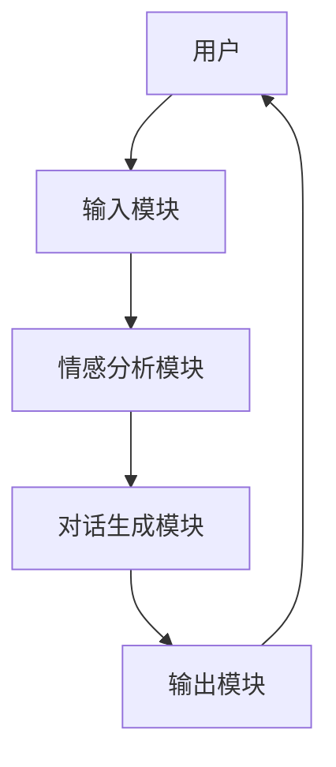
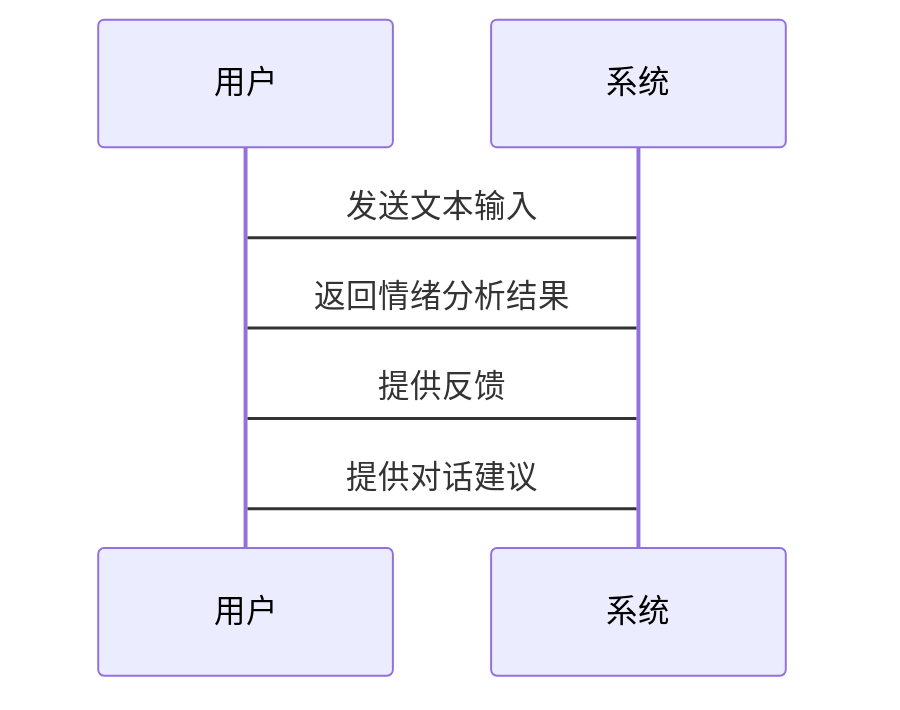

                 


# AI Agent在心理健康领域的应用：情绪支持与干预

关键词：AI Agent、心理健康、情绪支持、智能干预、人机交互

摘要：  
随着人工智能技术的快速发展，AI Agent（人工智能代理）在心理健康领域的应用逐渐成为研究热点。本文将从AI Agent的基本概念出发，深入分析其在心理健康支持与干预中的核心原理、系统架构以及实际应用场景。通过结合自然语言处理、情感分析、对话系统等技术，本文探讨了AI Agent如何有效识别、理解和应对用户的情绪问题，为用户提供智能化的心理健康支持。同时，本文还结合实际案例，展示了AI Agent在心理健康服务中的潜力与挑战。

---

## 第一章: AI Agent与心理健康概述

### 1.1 AI Agent的基本概念

#### 1.1.1 什么是AI Agent
AI Agent（人工智能代理）是指能够感知环境、自主决策并执行任务的智能实体。它通过与用户交互，能够理解用户的需求并提供相应的服务。AI Agent的核心特征包括自主性、反应性、目标导向性和社会性。

#### 1.1.2 AI Agent的核心特征
| 特征 | 描述 |
|------|------|
| 自主性 | 能够自主决策和行动，无需人工干预。 |
| 反应性 | 能够实时感知环境变化并做出反应。 |
| 目标导向性 | 具有明确的目标，能够优化行为以实现目标。 |
| 社会性 | 能够与其他系统或用户进行有效交互与协作。 |

#### 1.1.3 AI Agent与传统软件的区别
- **传统软件**：基于规则的处理，缺乏自主性和灵活性。  
- **AI Agent**：具备学习和自适应能力，能够根据环境动态调整行为。

### 1.2 心理健康领域的挑战

#### 1.2.1 当前心理健康问题的现状
- 全球范围内，心理健康问题呈现高发趋势，尤其是抑郁症、焦虑症等情绪障碍。
- 传统心理健康服务资源有限，难以满足海量需求。

#### 1.2.2 传统心理健康支持的局限性
- 人力资源不足：心理咨询师数量有限，无法覆盖所有需求。
- 时间限制：用户可能需要长时间等待才能获得专业帮助。
- 隐私问题：用户对隐私保护的担忧可能影响其求助意愿。

#### 1.2.3 技术在心理健康支持中的潜力
- 提供24/7的实时支持，满足用户的即时需求。
- 通过数据分析，精准识别用户情绪状态，提供个性化建议。
- 降低隐私风险，用户可以在匿名环境中寻求帮助。

### 1.3 AI Agent在心理健康中的应用前景

#### 1.3.1 AI Agent在心理健康支持中的优势
- **高效性**：快速响应用户需求，提供即时支持。
- **可扩展性**：能够同时服务大量用户，缓解资源短缺问题。
- **隐私保护**：通过匿名交互，保护用户隐私。

#### 1.3.2 AI Agent在心理健康干预中的潜力
- **情绪识别**：通过自然语言处理技术，准确识别用户情绪状态。
- **行为引导**：根据用户情绪，提供适当的心理干预策略。
- **数据驱动**：利用大数据分析，优化心理健康支持方案。

#### 1.3.3 未来发展趋势与挑战
- **技术进步**：深度学习和自然语言处理技术的不断进步将推动AI Agent的能力提升。
- **伦理问题**：如何在技术应用中平衡隐私与数据使用，仍需进一步探讨。
- **用户接受度**：用户对AI Agent的信任度和接受度是技术落地的关键。

## 1.4 本章小结
本章从AI Agent的基本概念出发，分析了心理健康领域的现状及其面临的挑战。同时，探讨了AI Agent在心理健康支持中的潜力和未来发展趋势，为后续章节的深入分析奠定了基础。

---

## 第二章: AI Agent的核心原理

### 2.1 自然语言处理技术

#### 2.1.1 NLP的基本概念
自然语言处理（NLP）是计算机科学与语言学的交叉学科，旨在让计算机能够理解、生成和处理人类语言。

#### 2.1.2 常见的NLP技术与模型
- **词袋模型（Bag-of-Words）**：将文本表示为词汇的集合。
- **TF-IDF（词频-逆文档频率）**：用于衡量词语的重要性。
- **Word2Vec**：通过上下文预测单词，生成词向量。
- **BERT（Bidirectional Encoder Representations from Transformers）**：基于Transformer的预训练模型，能够理解文本的上下文关系。

#### 2.1.3 NLP在心理健康支持中的应用
- **情绪分析**：通过NLP技术分析用户的文本，识别其情绪状态。
- **意图识别**：理解用户的意图，提供针对性的建议。

#### 2.1.4 示例：基于NLP的情绪分析
```python
# 使用预训练的情感分析模型进行情绪分类
from transformers import pipeline

sentiment_pipeline = pipeline("sentiment-analysis")
result = sentiment_pipeline("I feel really stressed lately")[0]
print(f"Sentiment: {result['label']}, Score: {result['score']}")
```

### 2.2 情感分析与情绪识别

#### 2.2.1 情感分析的基本原理
情感分析是通过计算机技术对文本的情感倾向进行分析，通常分为正面、负面和中性三种。

#### 2.2.2 基于深度学习的情感分析模型
- **LSTM（长短期记忆网络）**：适用于序列数据的处理，能够捕捉长距离依赖。
- **Transformer**：基于注意力机制，能够并行处理序列数据，性能优于LSTM。

#### 2.2.3 情绪识别在心理健康支持中的应用
- **实时情绪监控**：通过连续分析用户的文本，实时识别其情绪波动。
- **个性化干预**：根据用户的情绪状态，提供个性化的干预策略。

### 2.3 人机交互与对话系统

#### 2.3.1 对话系统的分类与特点
- **基于规则的对话系统**：通过预定义的规则进行对话，适用于简单的场景。
- **基于深度学习的对话系统**：利用神经网络进行对话生成，能够处理复杂场景。

#### 2.3.2 基于规则的对话系统
```python
# 示例：简单的基于规则的对话系统
def respond_to_user(input_text):
    if "hello" in input_text.lower():
        return "Hello! How can I help you today?"
    elif "goodbye" in input_text.lower():
        return "Goodbye! Hope to see you again."
    else:
        return "I'm here to help. Please tell me more about your feelings."
```

#### 2.3.3 基于深度学习的对话系统
- **预训练模型**：如GPT-3，能够生成自然流畅的对话。
- **微调模型**：根据具体任务对预训练模型进行微调，提升对话质量。

### 2.4 本章小结
本章详细介绍了AI Agent的核心技术，包括自然语言处理、情感分析和对话系统。这些技术为AI Agent在心理健康支持中的应用提供了理论基础和技术保障。

---

## 第三章: AI Agent在心理健康支持中的系统架构

### 3.1 系统功能模块划分

#### 3.1.1 用户输入与解析模块
- **功能**：接收用户的输入，解析其情绪和意图。
- **技术**：基于NLP技术进行文本解析。

#### 3.1.2 情感分析与情绪识别模块
- **功能**：对用户的输入进行情感分析，识别其情绪状态。
- **技术**：使用预训练的情感分析模型进行分类。

#### 3.1.3 对话生成与反馈模块
- **功能**：根据用户的情绪和意图生成相应的回应。
- **技术**：基于深度学习的对话生成模型。

#### 3.1.4 数据存储与分析模块
- **功能**：存储用户数据，分析情绪变化趋势。
- **技术**：使用数据库和大数据分析技术。

### 3.2 系统架构设计图


### 3.3 系统接口设计

#### 3.3.1 用户接口设计
- **输入接口**：接收用户的文本输入。
- **输出接口**：返回系统的回应。

#### 3.3.2 API接口设计
- **输入API**：接收用户的文本数据。
- **输出API**：返回情绪分析结果和对话建议。

#### 3.3.3 数据接口设计
- **输入数据**：用户文本数据。
- **输出数据**：情绪分析结果和对话建议。

### 3.4 系统交互流程图


### 3.5 本章小结
本章详细描述了AI Agent在心理健康支持中的系统架构，包括功能模块划分、系统架构设计和交互流程图。这些设计为后续的系统实现提供了清晰的指导。

---

## 第四章: 项目实战——构建一个AI情绪支持系统

### 4.1 项目背景
- **目标**：构建一个能够识别用户情绪并提供支持的AI Agent系统。
- **技术栈**：Python、深度学习框架（如TensorFlow）、自然语言处理库（如spaCy）。

### 4.2 核心代码实现

#### 4.2.1 数据预处理
```python
import pandas as pd

# 加载数据
data = pd.read_csv("emotion_dataset.csv")
# 分割文本和标签
texts = data["text"].tolist()
labels = data["label"].tolist()
```

#### 4.2.2 情感分析模型训练
```python
from tensorflow.keras import layers
from tensorflow.keras.models import Model

# 定义模型
input_layer = layers.Input(shape=(100,))  # 假设文本长度为100
embedding_layer = layers.Embedding(input_dim=10000, output_dim=16)(input_layer)
lstm_layer = layers.LSTM(64)(embedding_layer)
dense_layer = layers.Dense(3, activation="softmax")(lstm_layer)  # 3类情感分类

model = Model(inputs=input_layer, outputs=dense_layer)
model.compile(loss="sparse_categorical_crossentropy", optimizer="adam", metrics=["accuracy"])
model.fit(texts, labels, epochs=10, batch_size=32)
```

#### 4.2.3 对话生成模块
```python
from transformers import pipeline

# 初始化对话生成器
text_generator = pipeline("text-generation", model="gpt2")
# 生成对话回应
response = text_generator("How can I help you today?", max_length=50, num_return_sequences=1)
print(response[0]['generated_text'])
```

### 4.3 案例分析
- **案例1**：用户输入“我最近很焦虑”。系统分析情绪为“焦虑”，并生成回应：“我能理解你的感受。也许我们可以一起探讨一下原因。”
- **案例2**：用户输入“我觉得生活没有目标”。系统分析情绪为“沮丧”，并生成回应：“找到目标确实是一个挑战，也许我们可以一起制定一些小目标，逐步实现。”

### 4.4 本章小结
本章通过一个实际项目展示了AI Agent在心理健康支持中的应用。通过数据预处理、模型训练和对话生成，构建了一个能够识别用户情绪并提供支持的系统。

---

## 第五章: 最佳实践与注意事项

### 5.1 小结
- AI Agent在心理健康支持中的应用具有巨大的潜力，能够提供高效、个性化的服务。
- 通过结合NLP、情感分析和对话生成技术，AI Agent能够有效识别用户情绪并提供干预。

### 5.2 注意事项
- **数据隐私**：在处理用户数据时，必须严格遵守隐私保护法规。
- **模型可解释性**：确保模型的决策过程透明，让用户信任AI Agent的服务。
- **伦理问题**：在技术应用中，需平衡技术效益与伦理道德。

### 5.3 拓展阅读
- 推荐阅读《Deep Learning》（Ian Goodfellow等著），了解深度学习的核心概念。
- 推荐阅读《The AI Tsunami》（Andrew Ng著），了解AI技术的未来发展。

---

## 作者：AI天才研究院/AI Genius Institute & 禅与计算机程序设计艺术 /Zen And The Art of Computer Programming

---

以上是《AI Agent在心理健康领域的应用：情绪支持与干预》的技术博客文章的完整内容，涵盖了从基础概念到系统实现的全过程。

