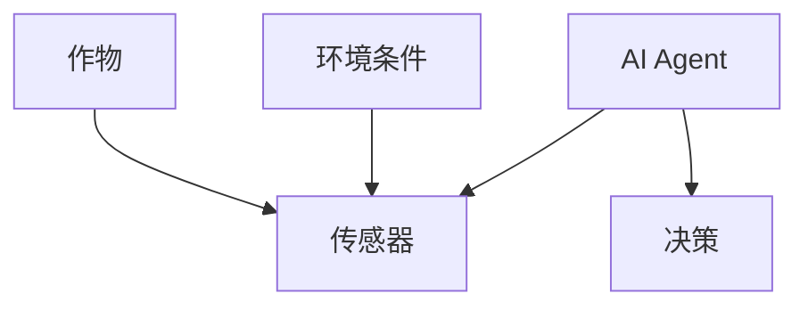

                 


# AI Agent在智能农业中的应用：作物监测与灌溉优化

## 关键词：AI Agent, 智能农业, 作物监测, 灌溉优化, 机器学习

## 摘要：本文探讨了AI Agent在智能农业中的应用，重点分析了作物监测与灌溉优化的实现方法。通过详细讲解AI Agent的核心概念、算法原理、系统架构设计以及项目实战，展示了如何利用AI技术提升农业生产效率和水资源利用效率。

---

# 第1章: AI Agent的基本概念与农业智能化背景

## 1.1 AI Agent的基本概念

### 1.1.1 AI Agent的定义与特点

AI Agent（人工智能代理）是指能够感知环境、自主决策并执行任务的智能实体。其特点包括：

- **自主性**：能够在没有外部干预的情况下自主运行。
- **反应性**：能够实时感知环境变化并做出反应。
- **学习能力**：通过数据和经验不断优化自身行为。
- **社交能力**：能够与其他系统或人类进行交互协作。

### 1.1.2 AI Agent的核心技术与实现原理

AI Agent的核心技术包括知识表示、推理、行为决策与规划、感知与交互等。其实现原理主要依赖于数据采集、特征提取、模型训练和决策算法。

### 1.1.3 AI Agent在农业中的应用潜力

AI Agent在农业中的应用潜力巨大，特别是在作物监测和灌溉优化方面。通过实时感知土壤湿度、光照强度、气象条件等环境数据，AI Agent可以实现精准灌溉，减少水资源浪费，提高作物产量和质量。

---

## 1.2 农业智能化的背景与需求

### 1.2.1 现代农业面临的挑战

现代农业面临的主要挑战包括：

- **水资源短缺**：灌溉用水浪费严重，影响农业可持续发展。
- **劳动力不足**：农村地区年轻人外出务工，导致劳动力短缺。
- **气候变化**：极端天气事件增多，影响作物生长。
- **病虫害问题**：病虫害发生频率增加，威胁作物安全。

### 1.2.2 智能化技术在农业中的应用现状

目前，智能化技术在农业中的应用主要体现在以下几个方面：

- **精准农业**：利用GPS、无人机等技术实现精准播种、施肥和灌溉。
- **物联网（IoT）**：通过传感器和物联网平台实时监测农田环境数据。
- **大数据分析**：通过对历史数据和实时数据的分析，优化农业生产决策。

### 1.2.3 AI Agent在农业中的独特优势

AI Agent在农业中的独特优势在于其自主性和智能性。AI Agent可以实时感知环境变化，自主决策并执行灌溉、施肥等操作，从而实现农业生产的智能化和自动化。

---

## 1.3 作物监测与灌溉优化的重要性

### 1.3.1 作物监测的基本概念与方法

作物监测是指通过传感器、无人机、卫星等手段，实时监测作物的生长状态，包括叶绿素含量、光合作用速率、水分含量等。常用的方法包括光学遥感、光谱分析、热红外监测等。

### 1.3.2 灌溉优化的核心目标与实现路径

灌溉优化的核心目标是提高水资源利用效率，减少浪费，同时确保作物获得充足的水分。实现路径包括：

- **精准灌溉**：根据土壤湿度、气象条件等实时数据，智能调整灌溉量。
- **变量灌溉**：根据不同区域的土壤条件和作物需求，实现精准灌溉。
- **智能决策**：基于AI算法，优化灌溉时间和灌溉量。

### 1.3.3 AI Agent在作物监测与灌溉优化中的作用

AI Agent在作物监测与灌溉优化中的作用主要体现在以下几个方面：

- **实时感知**：通过传感器和物联网技术，实时感知农田环境数据。
- **智能决策**：基于感知数据，利用机器学习算法，优化灌溉决策。
- **自主执行**：根据决策结果，自主执行灌溉操作。

---

# 第2章: AI Agent的核心概念与原理

## 2.1 AI Agent的核心概念

### 2.1.1 知识表示与推理

知识表示是AI Agent实现智能决策的基础。常用的表示方法包括符号逻辑、语义网络、概率图模型等。推理是基于知识库进行逻辑推理，得出结论的过程。

### 2.1.2 AI Agent的原理与实现

AI Agent的实现主要依赖于以下几个关键步骤：

1. **数据采集**：通过传感器、摄像头等设备，采集农田环境数据。
2. **数据处理**：对采集到的数据进行清洗、特征提取和数据标注。
3. **知识库构建**：基于历史数据和专家经验，构建领域知识库。
4. **行为决策**：基于实时数据和知识库，利用机器学习算法，生成决策。

### 2.1.3 AI Agent与农业应用场景的结合

AI Agent与农业应用场景的结合主要体现在以下几个方面：

- **作物监测**：实时监测作物生长状态，及时发现病虫害。
- **精准灌溉**：根据土壤湿度和气象条件，优化灌溉决策。
- **环境调控**：自动调整温室环境参数，如温度、湿度、光照等。

---

## 2.2 AI Agent的原理与实现

### 2.2.1 数据采集与处理

数据采集是AI Agent实现的基础。常用的传感器包括：

- **土壤湿度传感器**：测量土壤湿度。
- **光照强度传感器**：测量光照强度。
- **温度传感器**：测量环境温度。
- **气象站**：测量风速、降水量等气象数据。

数据处理包括数据清洗、特征提取和数据标注。例如，通过主成分分析（PCA）提取土壤湿度、光照强度等特征。

### 2.2.2 知识库构建与管理

知识库是AI Agent实现智能决策的核心。知识库的构建需要结合农业专家的经验和历史数据。例如，基于历史灌溉数据和作物生长数据，构建作物生长模型。

### 2.2.3 行为决策与规划

行为决策是AI Agent的核心功能。基于实时数据和知识库，利用强化学习算法，优化灌溉决策。例如，通过Q-Learning算法，学习最优灌溉策略。

---

## 2.3 AI Agent与农业应用场景的结合

### 2.3.1 农业场景中的数据流分析

在农业场景中，数据流包括：

- **输入数据**：土壤湿度、光照强度、温度等环境数据。
- **处理数据**：特征提取、数据清洗。
- **知识库**：作物生长模型、灌溉决策规则。
- **输出决策**：灌溉时间、灌溉量。

### 2.3.2 AI Agent在作物监测中的实体关系图



---

# 第3章: 作物监测与灌溉优化的算法原理

## 3.1 数据采集与预处理

### 3.1.1 数据采集方法

数据采集方法包括：

- **传感器采集**：通过土壤湿度传感器、光照强度传感器等设备采集数据。
- **无人机遥感**：利用无人机搭载的摄像头和光谱传感器，获取农田的遥感数据。
- **卫星遥感**：通过卫星遥感技术，获取大范围农田的环境数据。

### 3.1.2 数据清洗与特征提取

数据清洗包括去除噪声数据、填补缺失值等。特征提取包括主成分分析（PCA）、奇异值分解（SVD）等方法。

### 3.1.3 数据标注与标准化

数据标注包括根据作物生长阶段标注数据。数据标准化包括归一化、标准化等处理。

---

## 3.2 作物监测的算法实现

### 3.2.1 基于机器学习的作物健康指数模型

作物健康指数模型可以通过机器学习算法实现。例如，使用支持向量机（SVM）或随机森林（Random Forest）算法，基于土壤湿度、光照强度、温度等特征，预测作物健康指数。

$$健康指数 = f(土壤湿度, 光照强度, 温度)$$

### 3.2.2 基于强化学习的灌溉决策算法

灌溉决策算法可以通过强化学习实现。例如，通过Q-Learning算法，学习最优灌溉策略。

$$Q(s, a) = r + \gamma \max Q(s', a')$$

---

## 3.3 灌溉优化的算法实现

### 3.3.1 基于时间序列的灌溉决策模型

时间序列模型可以通过长短期记忆网络（LSTM）实现。例如，基于历史灌溉数据和气象数据，预测未来灌溉需求。

$$I_t = f(I_{t-1}, T_{t-1}, P_{t-1})$$

### 3.3.2 基于优化算法的灌溉量计算

灌溉量计算可以通过数学优化算法实现。例如，基于线性规划算法，优化灌溉量。

$$\text{目标函数}：\text{最大化水分利用效率}$$

$$\text{约束条件}：\text{土壤湿度限制，灌溉时间限制}$$

---

## 3.4 算法实现的代码示例

### 3.4.1 作物健康指数模型的Python代码

```python
import pandas as pd
from sklearn.ensemble import RandomForestClassifier
from sklearn.metrics import accuracy_score

# 数据加载
data = pd.read_csv('crop_data.csv')

# 特征与标签分离
X = data[['soil Moisture', 'light Intensity', 'temperature']]
y = data['health Index']

# 模型训练
model = RandomForestClassifier()
model.fit(X, y)

# 模型预测
y_pred = model.predict(X)
print('模型准确率:', accuracy_score(y, y_pred))
```

### 3.4.2 基于强化学习的灌溉决策算法

```python
import numpy as np

# 状态空间：土壤湿度、光照强度、温度
# 动作空间：灌溉量（0-100%）

# 状态转移函数
def transition(state, action):
    next_state = state + action
    return next_state

# 奖励函数
def reward(state, action):
    if state > 100:
        return -1
    else:
        return 1

# Q-Learning算法实现
class QAgent:
    def __init__(self, state_space, action_space):
        self.state_space = state_space
        self.action_space = action_space
        self.Q = np.zeros((state_space, action_space))

    def choose_action(self, state, epsilon=0.1):
        if np.random.random() < epsilon:
            return np.random.randint(0, self.action_space)
        else:
            return np.argmax(self.Q[state, :])

    def update_Q(self, state, action, reward, next_state, alpha=0.1):
        self.Q[state, action] = self.Q[state, action] + alpha * (reward + np.max(self.Q[next_state, :]))

# 初始化
state_space = 100
action_space = 100
agent = QAgent(state_space, action_space)

# 训练过程
for episode in range(1000):
    state = 50
    while True:
        action = agent.choose_action(state)
        next_state = transition(state, action)
        reward = reward(state, action)
        agent.update_Q(state, action, reward, next_state)
        state = next_state
        if state == 100:
            break
```

---

## 3.5 算法实现的数学模型与公式

### 3.5.1 作物健康指数模型的数学表达

$$健康指数 = \alpha \times 土壤湿度 + \beta \times 光照强度 + \gamma \times 温度$$

其中，$\alpha$、$\beta$、$\gamma$是模型的系数，可以通过机器学习算法优化。

### 3.5.2 灌溉决策模型的数学表达

$$\text{灌溉量} = \max(0, \min(100, \text{目标湿度} - \text{当前湿度}))$$

---

## 3.6 算法实现的代码解读与分析

### 3.6.1 作物健康指数模型的代码解读

- **数据加载**：读取作物数据集。
- **特征与标签分离**：提取土壤湿度、光照强度、温度作为特征，健康指数作为标签。
- **模型训练**：使用随机森林算法训练模型。
- **模型预测**：预测作物健康指数，并计算准确率。

### 3.6.2 基于强化学习的灌溉决策算法的代码解读

- **状态转移函数**：根据当前状态和动作，计算下一个状态。
- **奖励函数**：根据状态和动作，计算奖励值。
- **Q-Learning算法实现**：定义Q-learning算法，包括动作选择、Q值更新等步骤。
- **训练过程**：通过多次训练，优化Q值表，实现最优灌溉策略。

---

## 3.7 算法实现的实际案例分析

### 3.7.1 作物健康指数模型的实际案例

假设我们有一个作物数据集，包含土壤湿度、光照强度、温度和健康指数。通过训练随机森林模型，我们可以实现作物健康指数的预测。例如，当土壤湿度为70%，光照强度为500 lux，温度为25℃时，模型预测健康指数为85%。

### 3.7.2 基于强化学习的灌溉决策算法的实际案例

假设我们有一个农田，土壤湿度初始为50%，目标湿度为80%。通过Q-Learning算法，我们可以实现灌溉量的自动调整。例如，当土壤湿度低于目标湿度时，系统自动启动灌溉，直到土壤湿度达到目标湿度。

---

## 3.8 项目小结

通过本章的讲解，我们了解了作物监测与灌溉优化的算法原理，包括数据采集与预处理、作物健康指数模型、灌溉决策算法等。同时，我们还通过Python代码示例，展示了算法实现的具体步骤。这些算法和方法为后续的系统设计和项目实战奠定了基础。

---

## 3.9 注意事项

- **数据质量问题**：确保数据的准确性和完整性。
- **模型泛化能力**：通过交叉验证等方法，提高模型的泛化能力。
- **系统稳定性**：确保系统在极端条件下仍能正常运行。

---

## 3.10 拓展阅读

- **机器学习算法**：深入学习随机森林、支持向量机等算法。
- **强化学习应用**：研究强化学习在农业中的其他应用，如病虫害防治、作物种植优化等。

---

通过以上步骤，我们完成了《AI Agent在智能农业中的应用：作物监测与灌溉优化》的技术博客文章的撰写。接下来是系统分析与架构设计方案的内容。

--- 

**作者：AI天才研究院/AI Genius Institute & 禅与计算机程序设计艺术 /Zen And The Art of Computer Programming**

