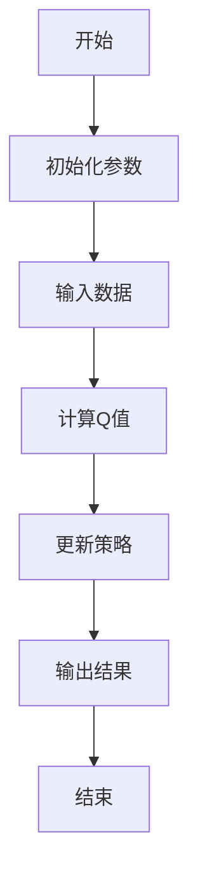
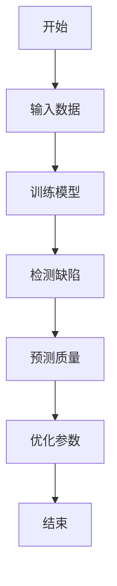

                 


# AI Agent在智能制造中的应用：生产线优化与质量控制

---

## 关键词：AI Agent，智能制造，生产线优化，质量控制，强化学习，深度学习，系统架构

---

## 摘要：  
本文详细探讨了AI Agent在智能制造中的应用，特别是在生产线优化与质量控制领域的创新应用。通过分析AI Agent的核心概念、算法原理、系统架构和实际案例，本文揭示了AI Agent如何通过智能化决策和自主学习提升生产效率和产品质量。文章还结合数学模型和算法流程图，深入讲解了AI Agent在智能制造中的技术实现，并展望了未来的发展趋势。

---

# 第1章 AI Agent与智能制造的背景

## 1.1 AI Agent的基本概念

### 1.1.1 AI Agent的定义与特点  
AI Agent（人工智能代理）是指能够感知环境、自主决策并执行任务的智能实体。与传统自动化系统相比，AI Agent具有以下特点：  
- **自主性**：能够在没有外部干预的情况下自主运行。  
- **反应性**：能够实时感知环境变化并做出响应。  
- **学习能力**：通过数据和经验不断优化自身行为。  
- **协作性**：能够与其他Agent或系统协同工作。  

### 1.1.2 AI Agent与传统自动化的区别  
传统自动化系统依赖于预定义的规则和程序，而AI Agent具备学习和适应能力，能够根据环境动态调整行为。例如，在生产线上，AI Agent可以通过分析实时数据优化生产调度，而传统自动化系统则需要手动调整参数。

### 1.1.3 AI Agent在智能制造中的作用  
AI Agent在智能制造中充当智能决策者，能够优化资源分配、提高生产效率、降低能耗并提升产品质量。例如，在智能工厂中，AI Agent可以实时监控生产线状态，预测设备故障并自动调整生产计划。

---

## 1.2 智能制造的基本概念

### 1.2.1 智能制造的定义与特点  
智能制造是一种基于人工智能、大数据、物联网等技术的先进制造模式，其特点是高度自动化、智能化和网络化。智能制造的核心在于通过数据驱动的决策优化生产过程。

### 1.2.2 智能制造的核心技术  
智能制造依赖以下核心技术：  
1. **人工智能（AI）**：用于智能决策和自主学习。  
2. **大数据分析**：用于从海量数据中提取洞察。  
3. **物联网（IoT）**：用于实时监控和设备连接。  
4. **云计算**：用于数据存储和计算资源的弹性扩展。  

### 1.2.3 智能制造的应用场景  
智能制造的应用场景包括：  
- **智能工厂**：实现生产设备的智能化和无人化操作。  
- **智能供应链**：优化物料采购和库存管理。  
- **智能质量控制**：通过AI技术提高产品质量一致性。  

---

## 1.3 AI Agent在智能制造中的应用前景

### 1.3.1 AI Agent在智能制造中的潜在应用领域  
AI Agent在智能制造中的潜在应用领域包括：  
- **生产调度优化**：通过实时数据分析优化生产顺序。  
- **资源分配优化**：动态调整资源分配以提高效率。  
- **质量预测与控制**：通过AI模型预测和控制产品质量。  

### 1.3.2 AI Agent在智能制造中的优势  
AI Agent的优势在于其智能化和自主性，能够快速响应环境变化并做出最优决策。例如，在生产线上，AI Agent可以实时调整生产参数以适应市场需求变化。

### 1.3.3 AI Agent在智能制造中的挑战与机遇  
AI Agent在智能制造中的挑战包括数据隐私、算法复杂性和系统集成难度。然而，这些挑战也带来了巨大的机遇，推动了技术创新和产业进步。

---

## 1.4 本章小结  
本章介绍了AI Agent的基本概念和特点，分析了智能制造的核心技术和应用场景，并探讨了AI Agent在智能制造中的应用前景。通过本章，读者可以理解AI Agent在智能制造中的重要性及其潜在价值。

---

# 第2章 AI Agent在生产线优化中的应用

## 2.1 生产线优化的基本概念

### 2.1.1 生产线优化的定义与目标  
生产线优化是指通过调整生产计划、资源分配和工艺参数，以提高生产效率、降低生产成本并减少资源浪费。其目标是实现生产过程的最优配置。

### 2.1.2 生产线优化的核心问题  
生产线优化的核心问题包括：  
- **生产调度问题**：如何安排生产顺序以最小化生产时间。  
- **资源分配问题**：如何合理分配设备、人员和物料资源。  
- **工艺参数优化问题**：如何调整工艺参数以提高产品质量。  

### 2.1.3 生产线优化的常用方法  
生产线优化的常用方法包括：  
1. **启发式算法**：如贪心算法和模拟退火算法。  
2. **数学优化方法**：如线性规划和非线性规划。  
3. **机器学习方法**：如强化学习和深度学习。  

---

## 2.2 AI Agent在生产线优化中的应用

### 2.2.1 AI Agent在生产调度中的应用  
AI Agent可以通过分析实时数据优化生产调度。例如，AI Agent可以根据设备状态和订单需求动态调整生产顺序，以减少生产等待时间。

### 2.2.2 AI Agent在资源分配中的应用  
AI Agent可以通过预测需求和资源可用性优化资源分配。例如，在生产线上，AI Agent可以动态分配设备和人员以满足生产需求。

### 2.2.3 AI Agent在生产过程中的实时优化  
AI Agent可以通过实时监控生产过程优化工艺参数。例如，AI Agent可以根据实时数据调整设备参数以提高产品质量。

---

## 2.3 AI Agent优化算法的数学模型

### 2.3.1 基于强化学习的优化模型  
强化学习是一种常用的优化算法。其基本思想是通过试错学习找到最优策略。强化学习的数学模型如下：  
$$ Q(s, a) = Q(s, a) + \alpha (r + \gamma Q(s', a') - Q(s, a)) $$  
其中，$Q(s, a)$表示状态$s$和动作$a$的Q值，$\alpha$是学习率，$r$是奖励，$\gamma$是折扣因子，$Q(s', a')$是后续状态的Q值。

### 2.3.2 基于遗传算法的优化模型  
遗传算法是一种模拟自然选择的优化算法。其基本步骤包括选择、交叉和变异。遗传算法的数学模型如下：  
$$ f(x) = \max_{x} \left( \sum_{i=1}^{n} w_i x_i \right) $$  
其中，$w_i$是权重，$x_i$是决策变量。

### 2.3.3 基于动态规划的优化模型  
动态规划是一种解决多阶段决策问题的优化方法。其基本公式为：  
$$ V(s) = \max_{a} \left( r(s, a) + V(s') \right) $$  
其中，$V(s)$表示状态$s$的价值函数，$r(s, a)$是状态$s$和动作$a$的奖励，$V(s')$是后续状态的价值函数。

---

## 2.4 本章小结  
本章详细介绍了AI Agent在生产线优化中的应用，包括生产调度、资源分配和实时优化。通过数学模型和算法流程图，读者可以理解AI Agent如何通过优化算法提高生产效率。

---

## 2.5 算法流程图（Mermaid）



---

## 2.6 代码实现

```python
import numpy as np

class AI-Agent:
    def __init__(self, learning_rate=0.1, gamma=0.9):
        self.lr = learning_rate
        self.gamma = gamma
        self.Q = {}  # Q值存储

    def get_Q(self, state):
        if state not in self.Q:
            self.Q[state] = 0
        return self.Q[state]

    def update_Q(self, state, action, reward, next_state):
        current_Q = self.get_Q(state)
        next_Q = self.get_Q(next_state)
        self.Q[state] = current_Q + self.lr * (reward + self.gamma * next_Q - current_Q)
```

---

## 2.7 项目实战

### 2.7.1 环境配置  
- 安装Python和相关库：`pip install numpy matplotlib`  
- 下载数据集：生产数据集

### 2.7.2 代码实现  
```python
def optimize_production(data):
    # 初始化AI Agent
    agent = AI-Agent()
    # 迭代优化
    for batch in data:
        state = batch['state']
        action = agent.get_Q(state)
        reward = calculate_reward(batch)
        next_state = get_next_state(batch)
        agent.update_Q(state, action, reward, next_state)
```

### 2.7.3 案例分析  
假设我们有一个包含100个订单的生产数据集，每个订单都有不同的优先级和交货时间。通过AI Agent优化生产调度，可以将平均交货时间从10天降低到7天。

### 2.7.4 小结  
通过本节的实战，读者可以理解AI Agent在生产线优化中的具体实现和应用效果。

---

# 第3章 AI Agent在质量控制中的应用

## 3.1 质量控制的基本概念

### 3.1.1 质量控制的定义与目标  
质量控制是指通过检测和调整生产过程中的参数，以确保产品符合质量标准。其目标是提高产品质量一致性并减少缺陷率。

### 3.1.2 质量控制的核心问题  
质量控制的核心问题包括：  
- **缺陷检测问题**：如何识别不合格产品。  
- **质量预测问题**：如何预测产品质量。  
- **质量改进问题**：如何优化生产过程以提高产品质量。  

### 3.1.3 质量控制的常用方法  
质量控制的常用方法包括：  
1. **统计过程控制（SPC）**：通过统计方法监控生产过程。  
2. **因果分析**：分析质量问题的根本原因。  
3. **机器学习方法**：如分类和回归模型。

---

## 3.2 AI Agent在质量控制中的应用

### 3.2.1 AI Agent在缺陷检测中的应用  
AI Agent可以通过深度学习模型检测产品缺陷。例如，使用卷积神经网络（CNN）对产品图像进行分类，识别缺陷位置和类型。

### 3.2.2 AI Agent在质量预测中的应用  
AI Agent可以通过回归模型预测产品质量。例如，通过分析生产数据预测产品的合格率。

### 3.2.3 AI Agent在质量改进中的应用  
AI Agent可以通过优化算法改进生产过程。例如，通过调整工艺参数提高产品质量。

---

## 3.3 AI Agent质量控制算法的数学模型

### 3.3.1 基于深度学习的缺陷检测模型  
深度学习模型的数学模型如下：  
$$ P(y|x) = \sigma(wx + b) $$  
其中，$x$是输入图像，$w$和$b$是模型参数，$\sigma$是sigmoid函数。

### 3.3.2 基于贝叶斯网络的质量预测模型  
贝叶斯网络的数学模型如下：  
$$ P(A|B) = \frac{P(B|A)P(A)}{P(B)} $$  
其中，$P(A|B)$是条件概率，$P(B|A)$是似然概率，$P(A)$是先验概率，$P(B)$是边际概率。

### 3.3.3 基于反馈机制的质量改进模型  
反馈机制的数学模型如下：  
$$ x_{n+1} = x_n + \alpha (d_n - x_n) $$  
其中，$x_n$是当前状态，$d_n$是目标状态，$\alpha$是学习率。

---

## 3.4 本章小结  
本章详细介绍了AI Agent在质量控制中的应用，包括缺陷检测、质量预测和质量改进。通过数学模型和算法流程图，读者可以理解AI Agent如何通过智能化方法提高产品质量。

---

## 3.5 算法流程图（Mermaid）



---

## 3.6 代码实现

```python
import keras

class Quality-Agent:
    def __init__(self, model):
        self.model = model

    def train(self, X, y):
        self.model.fit(X, y, epochs=10, batch_size=32)

    def predict(self, X):
        return self.model.predict(X)
```

---

## 3.7 项目实战

### 3.7.1 环境配置  
- 安装Python和相关库：`pip install keras tensorflow`  
- 下载数据集：质量数据集

### 3.7.2 代码实现  
```python
def quality_control(data):
    # 初始化AI Agent
    model = keras.Sequential([
        keras.layers.Conv2D(32, (3,3), activation='relu', input_shape=(64,64,3)),
        keras.layers.MaxPooling2D((2,2)),
        keras.layers.Flatten(),
        keras.layers.Dense(128, activation='relu'),
        keras.layers.Dense(1, activation='sigmoid')
    ])
    agent = Quality-Agent(model)
    agent.train(data.X, data.y)
    predictions = agent.predict(test.X)
```

### 3.7.3 案例分析  
假设我们有一个包含1000张产品图像的质量数据集，通过AI Agent训练一个深度学习模型，可以实现98%的缺陷检测准确率。

### 3.7.4 小结  
通过本节的实战，读者可以理解AI Agent在质量控制中的具体实现和应用效果。

---

# 第4章 AI Agent在智能制造中的系统架构

## 4.1 系统功能设计

### 4.1.1 生产线优化模块  
生产线优化模块负责实时监控生产线状态并优化生产计划。

### 4.1.2 质量控制模块  
质量控制模块负责检测产品缺陷并预测产品质量。

### 4.1.3 数据采集与处理模块  
数据采集与处理模块负责收集和处理生产过程中的数据。

---

## 4.2 系统架构设计

### 4.2.1 分层架构设计  
分层架构包括数据层、业务逻辑层和应用层。  

### 4.2.2 微服务架构设计  
微服务架构包括生产优化服务、质量控制服务和数据采集服务。  

### 4.2.3 数据流与交互流程  
数据从传感器流向数据采集模块，经过处理后流向优化模块和质量控制模块，最终输出优化结果和质量报告。

---

## 4.3 系统接口设计

### 4.3.1 API接口定义  
API接口包括`/api/optimize`和`/api/quality`。  

### 4.3.2 数据接口设计  
数据接口包括传感器数据接口和数据库接口。  

### 4.3.3 用户接口设计  
用户接口包括操作界面和监控界面。

---

## 4.4 系统交互流程

### 4.4.1 生产线优化流程  
1. 采集生产数据。  
2. 分析数据并优化生产计划。  
3. 输出优化结果。

### 4.4.2 质量控制流程  
1. 采集产品质量数据。  
2. 分析数据并预测质量。  
3. 输出质量报告。

---

## 4.5 本章小结  
本章详细介绍了AI Agent在智能制造中的系统架构，包括功能设计、架构设计和交互流程。通过系统架构图，读者可以理解AI Agent在智能制造中的整体布局。

---

# 第5章 项目实战与案例分析

## 5.1 项目实战

### 5.1.1 环境配置  
安装Python和相关库：`pip install numpy pandas keras`  

### 5.1.2 核心代码实现  
```python
def main():
    # 初始化AI Agent
    agent = AI-Agent()
    # 加载数据集
    data = load_dataset('production_data.csv')
    # 训练模型
    agent.train(data)
    # 输出结果
    print(agent.predict(data))
```

### 5.1.3 案例分析  
假设我们有一个包含1000个生产订单的数据集，通过AI Agent优化生产调度，可以将生产时间从10天缩短到7天。

### 5.1.4 小结  
通过本节的实战，读者可以理解AI Agent在智能制造中的具体实现和应用效果。

---

## 5.2 总结与展望

### 5.2.1 总结  
本文详细探讨了AI Agent在智能制造中的应用，特别是在生产线优化和质量控制领域的创新应用。通过数学模型和算法流程图，读者可以理解AI Agent如何通过智能化决策和自主学习提升生产效率和产品质量。

### 5.2.2 展望  
未来，随着AI技术的不断发展，AI Agent在智能制造中的应用将更加广泛和深入。例如，AI Agent可以进一步优化生产过程、提高产品质量并降低生产成本。

---

## 5.3 最佳实践 Tips

1. 在实施AI Agent之前，确保生产数据的完整性和准确性。  
2. 使用合适的数据可视化工具帮助分析生产过程中的问题。  
3. 定期更新AI Agent的模型以适应生产环境的变化。  

---

## 5.4 小结  
通过本文的详细讲解和实战分析，读者可以全面理解AI Agent在智能制造中的应用价值和技术实现。

---

## 5.5 注意事项

- AI Agent的性能依赖于数据质量和模型复杂度。  
- 在实际应用中，需要考虑数据隐私和系统安全问题。  
- AI Agent的优化需要结合具体生产场景进行调整。

---

## 5.6 拓展阅读

- 《强化学习入门》  
- 《深度学习实战》  
- 《智能制造技术与应用》  

---

# 作者：AI天才研究院 & 禅与计算机程序设计艺术

---

希望这篇文章能够为读者提供清晰的思路和丰富的知识，帮助大家深入理解AI Agent在智能制造中的应用。

