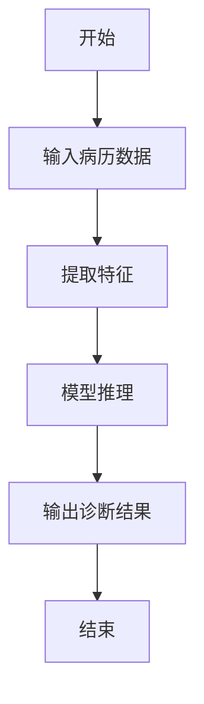
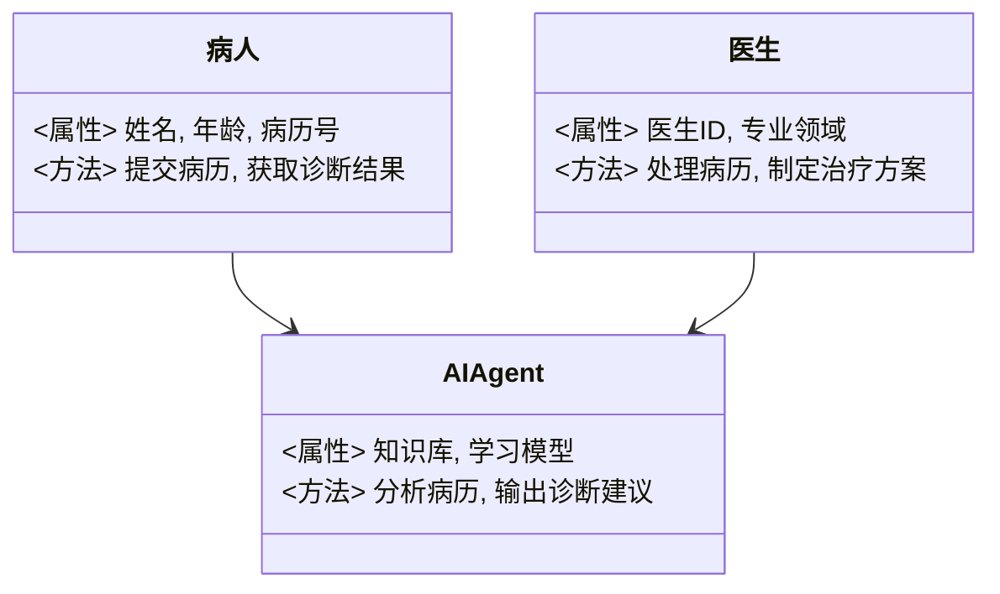
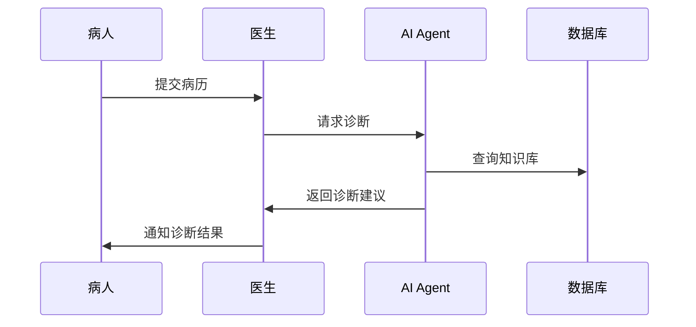

                 


# AI Agent在智能医疗中的应用：辅助诊断与治疗方案制定

> **关键词**：AI Agent, 智能医疗, 辅助诊断, 治疗方案, 人工智能, 机器学习

> **摘要**：本文探讨了AI Agent在智能医疗中的应用，重点分析了其在辅助诊断与治疗方案制定中的核心作用。通过详细的技术分析，包括算法原理、系统架构设计和实际项目案例，本文为读者提供了全面的理解和实践指导。

---

# 引言

随着人工智能技术的飞速发展，AI Agent（人工智能代理）在医疗领域的应用逐渐成为研究热点。AI Agent能够通过学习和推理，帮助医生更高效地进行诊断和制定治疗方案。本文将从AI Agent的基本概念、算法原理、系统架构设计等方面展开分析，并通过实际案例展示其在医疗领域的应用价值。

---

## 第1章: AI Agent的基本概念与背景介绍

### 1.1 AI Agent的定义与核心概念

#### 1.1.1 AI Agent的基本定义
AI Agent是一种能够感知环境并采取行动以实现目标的智能实体。在医疗领域，AI Agent通常用于辅助诊断、制定治疗方案和优化医疗流程。

#### 1.1.2 AI Agent的核心要素
- **感知能力**：通过输入数据（如病历、影像等）进行信息处理。
- **决策能力**：基于数据和知识库进行推理和决策。
- **行动能力**：输出诊断结果或治疗建议。

#### 1.1.3 AI Agent与传统医疗工具的区别
AI Agent能够主动学习和自适应，而传统医疗工具通常依赖固定的规则和数据。

### 1.2 AI Agent在智能医疗中的应用背景

#### 1.2.1 智能医疗的发展现状
医疗领域正逐步向智能化方向转型，AI技术的应用显著提升了医疗效率和准确性。

#### 1.2.2 AI Agent在医疗领域的优势
- 提高诊断准确率。
- 优化治疗方案。
- 减少人为错误。

#### 1.2.3 医疗行业对AI Agent的需求分析
随着医疗数据的爆炸式增长，AI Agent的需求日益迫切。

---

## 第2章: AI Agent的核心概念与联系

### 2.1 AI Agent的核心原理

#### 2.1.1 AI Agent的基本工作原理
AI Agent通过感知环境、分析数据、制定决策并采取行动来实现目标。

#### 2.1.2 AI Agent的决策机制
决策机制通常包括监督学习、强化学习和无监督学习三种模式。

#### 2.1.3 AI Agent的学习与自适应能力
通过机器学习算法，AI Agent能够不断优化自身的诊断和治疗能力。

### 2.2 AI Agent的属性特征对比

#### 2.2.1 AI Agent的分类与特点
| 类型       | 特点                     |
|------------|--------------------------|
| 知识驱动型 | 基于知识库进行推理       |
| 数据驱动型 | 基于大量数据进行训练     |
| 混合驱动型 | 结合知识和数据进行决策   |

#### 2.2.2 AI Agent的核心属性特征表
| 属性       | 描述                     |
|------------|--------------------------|
| 感知能力   | 数据输入和处理能力       |
| 决策能力   | 基于数据的推理能力       |
| 自适应能力 | 学习和优化能力           |

### 2.3 AI Agent的ER实体关系图

```mermaid
er
actor: 医生
actor: 病人
actor: 医疗机构
object: 病历数据
object: 治疗方案
object: 诊断结果
```

---

## 第3章: AI Agent的算法原理

### 3.1 AI Agent的核心算法

#### 3.1.1 强化学习算法
强化学习通过奖励机制优化AI Agent的决策过程。

#### 3.1.2 监督学习算法
监督学习基于标记数据进行分类和预测。

#### 3.1.3 无监督学习算法
无监督学习通过数据聚类发现潜在模式。

### 3.2 AI Agent的算法流程图



### 3.3 AI Agent的数学模型

#### 3.3.1 线性回归模型
$$ y = \beta_0 + \beta_1x + \epsilon $$

#### 3.3.2 支持向量机模型
$$ \text{目标函数}：\max(\text{间隔}) $$
$$ \text{约束条件}：y_i(w \cdot x_i + b) \geq 1 $$

---

## 第4章: AI Agent的系统分析与架构设计

### 4.1 系统功能设计

#### 4.1.1 领域模型类图



### 4.2 系统架构设计

#### 4.2.1 系统架构图


### 4.3 系统接口设计

#### 4.3.1 API接口定义
- 输入接口：接收病历数据。
- 输出接口：返回诊断结果。

### 4.4 系统交互流程图



---

## 第5章: 项目实战

### 5.1 环境安装

- Python 3.8+
- TensorFlow 2.0+
- Scikit-learn 0.24+

### 5.2 核心代码实现

```python
import numpy as np
from sklearn import svm

# 数据预处理
X = np.array([[40, 120], [50, 100], [60, 90], [70, 80]])
y = np.array(['正常', '正常', '异常', '异常'])

# 训练模型
model = svm.SVC()
model.fit(X, y)

# 预测
new_case = np.array([[55, 95]])
print(model.predict(new_case))
```

### 5.3 案例分析

- **案例背景**：一名患者出现类似心脏病症状。
- **诊断过程**：AI Agent分析病历数据，结合知识库和学习模型，得出诊断结果。
- **结果输出**：诊断为心脏病，建议进一步检查。

### 5.4 项目小结

通过实际案例，展示了AI Agent在诊断过程中的高效性和准确性。

---

## 第6章: 最佳实践与总结

### 6.1 小结

AI Agent在智能医疗中的应用显著提升了诊断效率和准确性，是未来医疗发展的重要方向。

### 6.2 注意事项

- 数据隐私保护。
- 算法模型的可解释性。
- 系统的鲁棒性。

### 6.3 拓展阅读

- 《深度学习》——Ian Goodfellow
- 《人工智能：一种现代的方法》—— Stuart Russell

---

# 结语

AI Agent作为人工智能的核心技术，在智能医疗中的应用前景广阔。通过不断优化算法和系统架构，AI Agent将为医疗行业带来更大的变革。

---

**作者：AI天才研究院/AI Genius Institute & 禅与计算机程序设计艺术 /Zen And The Art of Computer Programming**

