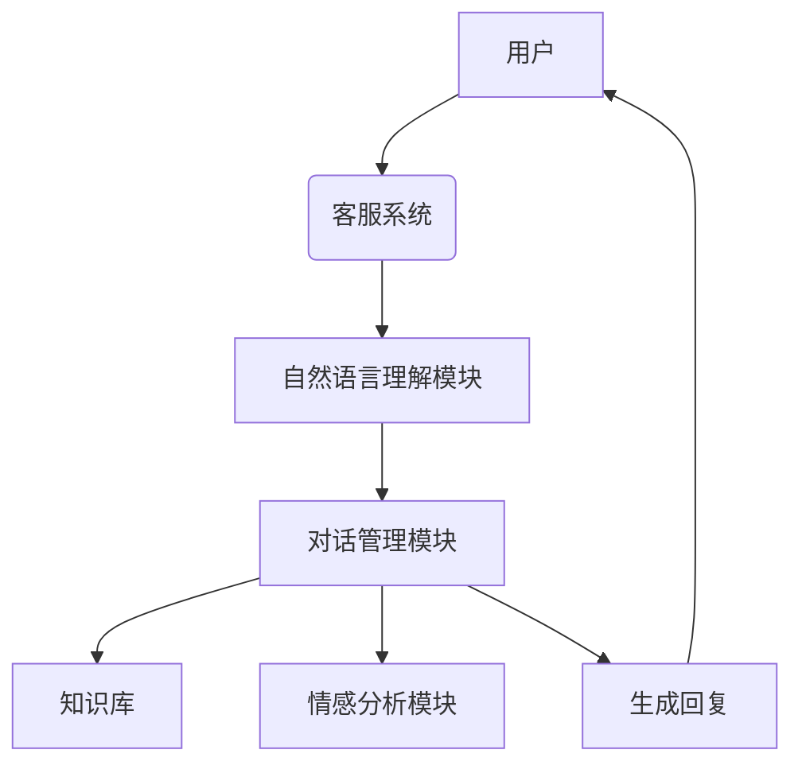
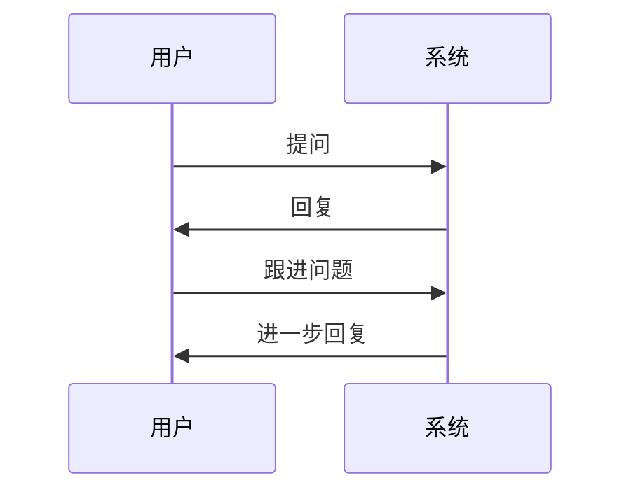

                 


---

# AI Agent在智能客服中的应用：多轮对话与情感理解

**关键词：** AI Agent, 智能客服, 多轮对话, 情感理解, 机器学习, 深度学习, 自然语言处理

**摘要：**  
本文深入探讨AI Agent在智能客服中的应用，重点分析多轮对话与情感理解的核心技术。通过理论分析与实践结合，阐述AI Agent如何通过多轮对话和情感理解提升智能客服的用户体验。文章涵盖AI Agent的基本概念、多轮对话的算法原理、情感理解的实现方法，以及智能客服系统的架构设计，旨在为读者提供全面的技术视角和实践指导。

---

## 第1章: AI Agent与智能客服的背景介绍

### 1.1 AI Agent的基本概念
- **AI Agent的定义与特点：** AI Agent（人工智能代理）是指能够感知环境、自主决策并执行任务的智能实体。其特点包括自主性、反应性、目标导向和学习能力。
- **AI Agent的核心要素：** 包括感知模块（获取环境信息）、推理模块（分析信息）和行动模块（执行任务）。
- **AI Agent在智能客服中的应用价值：** 提供24/7的实时支持，提高响应速度，降低人工成本。

### 1.2 多轮对话与情感理解的背景
- **多轮对话的定义与特点：** 多轮对话是指在一次交互中进行多次来回的对话，特点是连续性、上下文依赖性和目标导向。
- **情感理解的定义与重要性：** 情感理解是指识别和分析用户在对话中的情感状态，其重要性在于提升用户体验和对话效果。
- **多轮对话与情感理解的结合：** 通过结合情感理解，AI Agent能够更好地理解用户需求，提供更个性化的服务。

### 1.3 AI Agent在智能客服中的应用现状
- **智能客服的发展历程：** 从简单的自动应答到复杂的AI Agent服务，智能客服逐渐成为企业提升客户体验的重要工具。
- **应用案例：** 某些大型企业已成功部署AI Agent，用于处理常见客户问题和提供个性化服务。
- **当前问题与挑战：** 包括对话流畅性不足、情感理解准确性低、用户信任度等问题。

### 1.4 本章小结
- AI Agent与智能客服的核心关系在于提供高效、智能的服务。
- 多轮对话与情感理解是提升AI Agent能力的关键技术。
- 未来发展方向包括优化算法、提升用户体验和拓展应用场景。

---

## 第2章: AI Agent的核心概念与原理

### 2.1 AI Agent的核心概念
- **AI Agent的类型：** 包括基于规则的Agent、基于机器学习的Agent和基于深度学习的Agent。
- **AI Agent的决策机制：** 包括基于规则的决策和基于模型的决策。
- **AI Agent的学习能力：** 通过监督学习、无监督学习和强化学习提升性能。

### 2.2 多轮对话的核心原理
- **对话流程：** 包括用户输入、系统解析、生成回复、用户反馈等步骤。
- **记忆机制：** 通过记录对话历史和上下文信息，确保对话的连贯性。
- **目标动态调整：** 根据用户反馈和对话进展，实时调整对话目标。

### 2.3 情感理解的核心原理
- **情感分析：** 基于文本的情感分类，包括正面、负面和中性情感。
- **情感特征提取：** 通过词袋模型、TF-IDF和词嵌入技术提取情感特征。
- **情感记忆：** 建立情感状态的关联，用于后续对话的调整。

### 2.4 AI Agent与多轮对话的结合
- **AI Agent的角色：** 作为对话的主导者，协调用户需求和系统响应。
- **情感反馈机制：** 根据用户情感调整对话策略，提升用户体验。
- **情感理解对对话质量的影响：** 情感理解能够显著提升对话的自然性和用户满意度。

---

## 第3章: 多轮对话的算法原理与实现

### 3.1 多轮对话的算法原理
- **记忆网络模型：** 通过记忆网络记录对话历史，确保信息的连贯性。
- **序列到序列模型：** 使用编码器-解码器结构处理对话内容。
- **注意力机制：** 聚焦关键信息，提升对话的准确性和流畅性。

### 3.2 多轮对话的实现步骤
- **数据准备：** 收集和整理多轮对话数据，建立训练语料库。
- **模型训练：** 使用深度学习框架（如TensorFlow或PyTorch）训练对话模型。
- **对话生成：** 基于训练好的模型生成实时对话回复。

### 3.3 代码实现
```python
import tensorflow as tf
from tensorflow.keras import layers

# 定义记忆网络模型
class MemoryNetwork:
    def __init__(self, input_dim, memory_dim):
        self.encoder = layers.Dense(memory_dim, activation='relu')
        self.decoder = layers.Dense(input_dim, activation='sigmoid')

    def call(self, inputs):
        # 编码
        encoded = self.encoder(inputs)
        # 解码
        decoded = self.decoder(encoded)
        return decoded

# 初始化模型
model = MemoryNetwork(input_dim=100, memory_dim=50)
```

---

## 第4章: 情感理解的算法原理与实现

### 4.1 情感理解的算法原理
- **基于词嵌入的情感分析：** 使用Word2Vec或GloVe提取词向量。
- **深度学习模型：** 借助LSTM或BERT进行情感分类。
- **情感预测：** 输出情感标签或情感概率。

### 4.2 情感理解的实现步骤
- **数据预处理：** 文本清洗、分词和标注情感标签。
- **模型训练：** 使用标注数据训练情感分析模型。
- **情感预测：** 对未标注文本进行情感预测并输出结果。

### 4.3 代码实现
```python
import tensorflow as tf
from tensorflow.keras import layers

# 定义情感分析模型
class SentimentAnalysis:
    def __init__(self, vocab_size):
        self.embedding = layers.Embedding(vocab_size, 50)
        self.lstm = layers.LSTM(100, return_sequences=False)
        self.dense = layers.Dense(1, activation='sigmoid')

    def call(self, inputs):
        # 嵌入层
        embedded = self.embedding(inputs)
        # LSTM层
        lstm_output = self.lstm(embedded)
        # 全连接层
        output = self.dense(lstm_output)
        return output

# 初始化模型
model = SentimentAnalysis(vocab_size=10000)
```

---

## 第5章: AI Agent在智能客服中的系统架构设计

### 5.1 系统功能设计
- **领域模型：** 包括用户交互模块、对话管理模块和知识库模块。
- **系统架构：** 使用分层架构，包括数据层、业务逻辑层和表现层。
- **交互流程：** 用户输入请求，系统解析并生成回复。

### 5.2 系统架构图


### 5.3 交互序列图


---

## 第6章: 项目实战与代码实现

### 6.1 环境安装
- 安装Python、TensorFlow、Keras等依赖库。

### 6.2 核心代码实现
```python
import tensorflow as tf
from tensorflow.keras import layers

# 定义AI Agent模型
class AI_Agent:
    def __init__(self):
        self.memory = {}
        self.model = self.build_model()

    def build_model(self):
        inputs = layers.Input(shape=(100,))
        encoded = layers.Dense(50, activation='relu')(inputs)
        outputs = layers.Dense(100, activation='sigmoid')(encoded)
        return tf.keras.Model(inputs=inputs, outputs=outputs)

    def call(self, inputs):
        return self.model(inputs)

# 初始化AI Agent
agent = AI_Agent()
```

### 6.3 实际案例分析
- 案例背景：用户咨询产品问题。
- 对话过程：用户多次提问，系统通过多轮对话解决问题。
- 案例结果：提升用户体验，减少人工客服压力。

---

## 第7章: 最佳实践与未来展望

### 7.1 小结
- 本文系统介绍了AI Agent在智能客服中的应用，重点分析了多轮对话和情感理解的技术细节。
- 通过代码实现和案例分析，展示了AI Agent的实际应用价值。

### 7.2 注意事项
- 数据质量对模型性能影响巨大，需确保数据的多样性和代表性。
- 情感理解的准确性需要不断优化，结合领域知识提升效果。

### 7.3 未来展望
- 情感计算的深度化：提升情感分析的精度，实现更复杂的情感理解。
- 对话系统的智能化：结合知识图谱和强化学习，打造更智能的对话系统。
- 多模态交互：整合视觉、语音等多种交互方式，提升用户体验。

### 7.4 拓展阅读
- 推荐阅读《Deep Learning》（Ian Goodfellow）和《自然语言处理入门》（NLP入坑）等书籍，深入了解相关技术细节。

---

**作者：AI天才研究院/AI Genius Institute & 禅与计算机程序设计艺术 /Zen And The Art of Computer Programming**

---

**全文完。**

