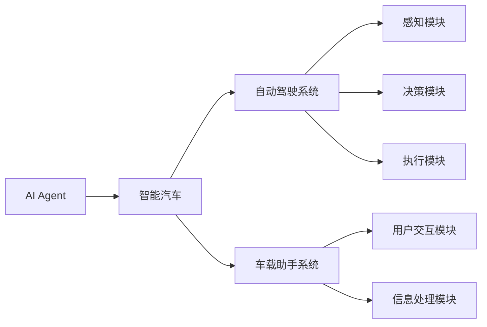
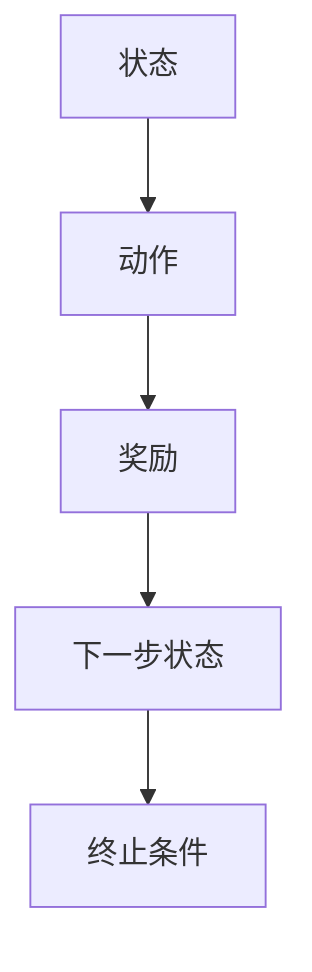
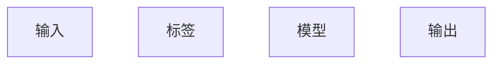
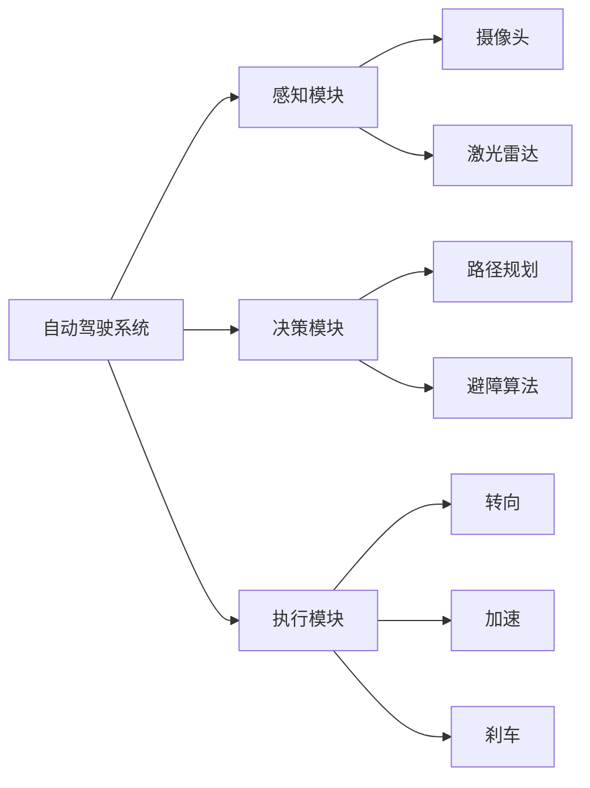
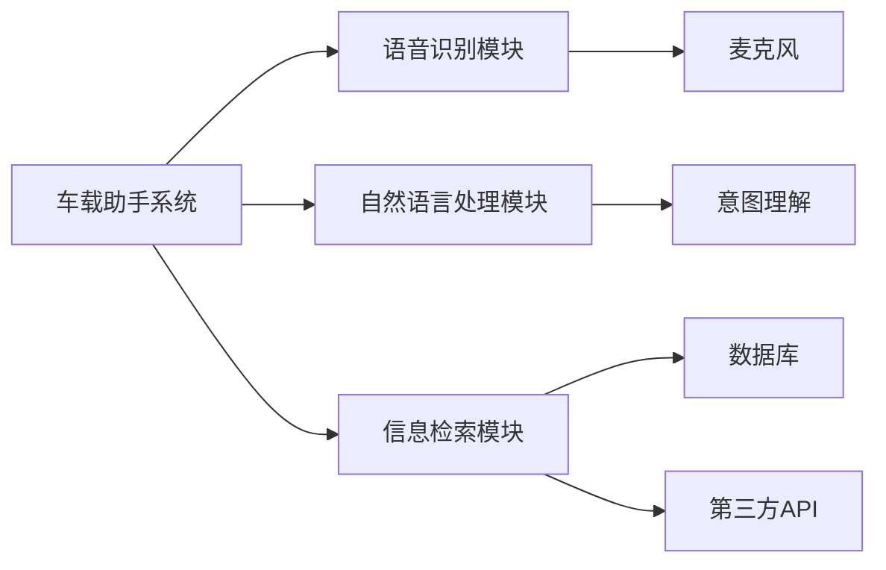

                 


# AI Agent在智能汽车中的应用：自动驾驶与车载助手

## 关键词：AI Agent, 智能汽车, 自动驾驶, 车载助手, 强化学习, 系统架构

## 摘要：AI Agent在智能汽车中的应用是当前人工智能领域的重要研究方向。本文将从AI Agent的基本概念出发，详细探讨其在自动驾驶和车载助手中的具体应用。通过分析自动驾驶和车载助手的核心技术、算法原理和系统架构，结合实际项目案例，深入解读AI Agent在智能汽车中的实现过程和优化方法。本文旨在为读者提供一个全面的技术视角，帮助他们更好地理解和应用AI Agent在智能汽车中的潜力。

---

## 第一部分: AI Agent与智能汽车的背景介绍

### 第1章: AI Agent与智能汽车概述

#### 1.1 AI Agent的基本概念

##### 1.1.1 AI Agent的定义与特点
AI Agent（人工智能代理）是指能够感知环境、做出决策并执行动作的智能实体。AI Agent的特点包括：
- **自主性**：能够在没有外部干预的情况下自主运行。
- **反应性**：能够实时感知环境并做出响应。
- **目标导向性**：具有明确的目标，并通过行为实现目标。
- **学习能力**：能够通过经验改进自身的性能。

##### 1.1.2 AI Agent的核心要素与组成
AI Agent的核心要素包括：
- **感知模块**：通过传感器或数据输入感知环境。
- **决策模块**：基于感知信息做出决策。
- **执行模块**：根据决策执行动作。

##### 1.1.3 AI Agent与智能汽车的关系
AI Agent是智能汽车的核心组成部分，通过AI Agent实现自动驾驶和智能化的车载功能。

#### 1.2 智能汽车的发展背景

##### 1.2.1 智能汽车的定义与分类
智能汽车是指通过先进的传感器、计算平台、执行机构和智能算法的安装和应用，实现安全、高效、舒适的汽车。智能汽车可以分为：
- **辅助驾驶**：如车道保持辅助、自适应巡航控制。
- **自动驾驶**：如完全自动驾驶（Level 5）。

##### 1.2.2 智能汽车的发展历程
智能汽车的发展经历了从早期的机械控制到现代的全自动驾驶的演变。随着AI技术的进步，智能汽车的功能日益强大。

##### 1.2.3 智能汽车的市场现状与趋势
当前，智能汽车市场增长迅速，主要厂商包括特斯拉、谷歌、苹果等。未来，智能汽车将更加普及，AI Agent将在其中发挥关键作用。

---

### 第2章: AI Agent在智能汽车中的应用背景

#### 2.1 自动驾驶的背景与挑战

##### 2.1.1 自动驾驶的定义与级别划分
自动驾驶是指车辆能够自主完成从识别环境到做出决策和执行的动作。根据国际汽车工程师协会（SAE）的定义，自动驾驶分为Level 0到Level 5六个级别。

##### 2.1.2 自动驾驶的核心问题与技术难点
自动驾驶的核心问题包括：
- **环境感知**：如何准确识别道路、车辆、行人等。
- **决策制定**：如何做出合理的驾驶决策。
- **实时性**：如何在短时间内完成感知和决策。

##### 2.1.3 自动驾驶的现状与未来展望
目前，大多数自动驾驶技术仍处于测试阶段，未来随着AI技术的进步，自动驾驶将更加普及。

#### 2.2 车载助手的背景与应用

##### 2.2.1 车载助手的定义与功能
车载助手是指安装在车内的智能系统，能够为驾驶员提供信息查询、语音交互、导航等功能。

##### 2.2.2 车载助手的核心技术与实现
车载助手的核心技术包括：
- **语音识别**：通过语音命令实现交互。
- **自然语言处理**：理解用户的意图并做出响应。
- **信息检索**：从数据库中获取所需信息。

##### 2.2.3 车载助手的市场应用与用户需求
车载助手的应用场景广泛，用户需求主要集中在安全、便捷和娱乐方面。

---

## 第二部分: AI Agent的核心概念与联系

### 第3章: AI Agent的核心原理

#### 3.1 AI Agent的核心原理

##### 3.1.1 AI Agent的感知模块
感知模块通过传感器收集环境数据，如摄像头、激光雷达等。

##### 3.1.2 AI Agent的决策模块
决策模块基于感知数据做出决策，如路径规划、避障等。

##### 3.1.3 AI Agent的执行模块
执行模块根据决策结果执行动作，如转向、加速、刹车等。

#### 3.2 AI Agent与智能汽车的实体关系图


#### 3.3 AI Agent的核心算法与数学模型

##### 3.3.1 强化学习算法


##### 3.3.2 监督学习算法


---

## 第三部分: AI Agent在智能汽车中的系统架构

### 第4章: 自动驾驶的系统架构

#### 4.1 自动驾驶的系统功能设计
自动驾驶系统功能包括：
- **环境感知**：识别道路、车辆、行人等。
- **路径规划**：制定行驶路线。
- **决策控制**：根据环境信息做出驾驶决策。

#### 4.2 自动驾驶的系统架构设计


#### 4.3 自动驾驶的接口与交互
自动驾驶系统通过标准接口与车辆的控制系统进行交互。

---

### 第5章: 车载助手的系统架构

#### 5.1 车载助手的系统功能设计
车载助手的功能包括：
- **语音交互**：通过语音命令实现功能调用。
- **信息查询**：提供天气、导航等信息。
- **娱乐功能**：播放音乐、 podcasts等。

#### 5.2 车载助手的系统架构设计


#### 5.3 车载助手的接口与交互
车载助手通过HMI（人机交互界面）与用户进行交互。

---

## 第四部分: AI Agent在智能汽车中的算法实现

### 第6章: AI Agent的核心算法实现

#### 6.1 强化学习算法实现

##### 6.1.1 强化学习的基本原理
强化学习通过智能体与环境的交互，通过试错学习来优化策略。

##### 6.1.2 强化学习的实现步骤
1. 初始化策略参数。
2. 与环境交互，获取状态和奖励。
3. 更新策略参数，以最大化累积奖励。

##### 6.1.3 强化学习的Python实现
```python
import numpy as np

# 初始化策略参数
theta = np.random.randn(1,1)

# 定义环境
class Environment:
    def __init__(self):
        pass
    def step(self, action):
        # 返回状态和奖励
        return next_state, reward
    def reset(self):
        # 初始化环境
        return initial_state

# 定义智能体
class Agent:
    def __init__(self, theta):
        self.theta = theta
    def take_action(self, state):
        # 根据策略选择动作
        return action
    def update_theta(self, reward):
        # 更新策略参数
        self.theta += learning_rate * reward * self.theta.grad
```

#### 6.2 监督学习算法实现

##### 6.2.1 监督学习的基本原理
监督学习通过训练数据，学习输入与输出之间的映射关系。

##### 6.2.2 监督学习的实现步骤
1. 收集训练数据。
2. 构建模型。
3. 训练模型。
4. 评估模型。

##### 6.2.3 监督学习的Python实现
```python
import torch

# 定义模型
model = torch.nn.Sequential(
    torch.nn.Linear(2, 4),
    torch.nn.ReLU(),
    torch.nn.Linear(4, 1)
)

# 定义损失函数
criterion = torch.nn.MSELoss()
optimizer = torch.optim.Adam(model.parameters(), lr=0.01)

# 训练过程
for epoch in range(100):
    outputs = model(X)
    loss = criterion(outputs, y)
    loss.backward()
    optimizer.step()
```

---

## 第五部分: 系统优化与部署

### 第7章: 系统优化

#### 7.1 系统性能优化
通过优化算法、减少计算量等方式提高系统性能。

#### 7.2 系统部署
将AI Agent系统部署到实际的智能汽车中，确保系统的稳定性和可靠性。

---

## 第六部分: 项目实战与案例分析

### 第8章: 项目实战

#### 8.1 项目介绍
一个基于AI Agent的自动驾驶系统开发项目。

#### 8.2 项目实现
```python
import numpy as np

# 初始化参数
theta = np.random.randn(1,1)

# 定义环境
class Environment:
    def __init__(self):
        self.state = 0
    def step(self, action):
        # 更新状态
        self.state += action
        # 返回状态和奖励
        return self.state, 1.0
    def reset(self):
        self.state = 0
        return self.state

# 定义智能体
class Agent:
    def __init__(self, theta):
        self.theta = theta
    def take_action(self, state):
        # 根据策略选择动作
        return np.dot(state, self.theta)[0]
    def update_theta(self, reward):
        # 更新策略参数
        self.theta += learning_rate * reward * self.theta

# 初始化环境和智能体
env = Environment()
agent = Agent(theta)
learning_rate = 0.1

# 训练过程
for _ in range(100):
    state = env.reset()
    action = agent.take_action(state)
    next_state, reward = env.step(action)
    agent.update_theta(reward)
```

#### 8.3 项目分析
通过对项目的分析，总结AI Agent在智能汽车中的应用优势和挑战。

---

## 第七部分: 总结与展望

### 第9章: 总结

#### 9.1 核心内容回顾
本文详细介绍了AI Agent在智能汽车中的应用，包括自动驾驶和车载助手的核心技术、算法实现和系统架构。

#### 9.2 本文的创新点
本文通过实际项目案例，详细解读了AI Agent在智能汽车中的实现过程和优化方法。

### 第10章: 展望

#### 10.1 未来的研究方向
未来，AI Agent在智能汽车中的应用将更加广泛，研究方向包括更高效的算法、更智能的系统架构等。

#### 10.2 对读者的建议
建议读者进一步学习AI Agent的相关技术，关注智能汽车领域的最新动态。

---

## 作者：AI天才研究院 & 禅与计算机程序设计艺术

---

感谢您的阅读！希望本文能为您提供有价值的技术见解和启发！

