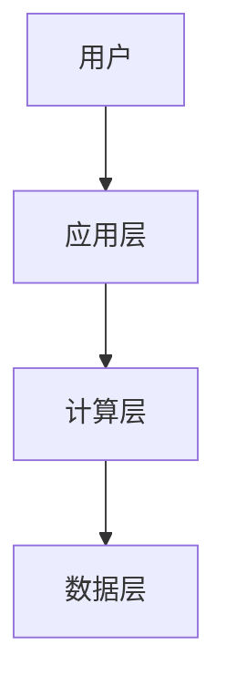
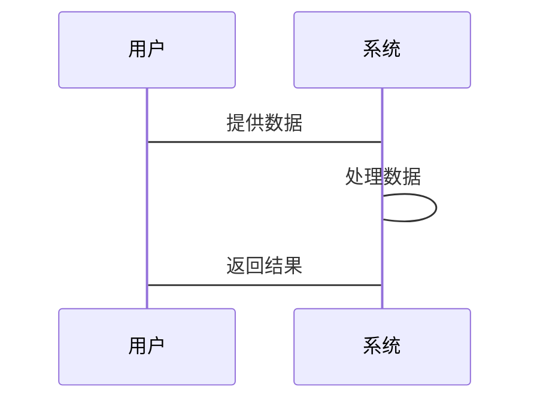

                 


# AI Agent在智能零售中的应用：库存管理与销售预测

> 关键词：AI Agent, 智能零售, 库存管理, 销售预测, 机器学习, 强化学习

> 摘要：本文探讨了AI Agent在智能零售中的应用，重点分析了库存管理和销售预测两个核心领域。通过介绍AI Agent的技术基础、核心算法、系统设计和实际案例，展示了AI Agent如何通过数据驱动的方法优化零售运营效率，提升客户体验。

---

# 第一部分: AI Agent与智能零售概述

## 第1章: AI Agent的基本概念

### 1.1 AI Agent的定义与特点
AI Agent（人工智能代理）是指能够感知环境并采取行动以实现目标的智能实体。其特点包括：
- **自主性**：能够自主决策，无需外部干预。
- **反应性**：能够实时感知环境并做出反应。
- **学习能力**：能够通过数据和经验不断优化自身的决策能力。
- **社交能力**：能够与其他系统或人类进行交互。

### 1.2 AI Agent在智能零售中的作用
AI Agent在智能零售中的作用主要体现在以下几个方面：
- **库存管理**：通过预测需求和优化库存水平，减少缺货和过剩。
- **销售预测**：利用历史数据和市场趋势，预测未来的销售情况，帮助制定销售策略。
- **客户推荐**：通过分析客户的购买行为和偏好，推荐个性化的产品，提升客户满意度和忠诚度。

### 1.3 智能零售的核心技术
智能零售的核心技术包括：
- **人工智能**：用于数据挖掘、模式识别和决策支持。
- **大数据分析**：通过对海量数据的处理和分析，提取有价值的信息。
- **机器学习**：通过训练模型，预测未来的趋势和行为。

---

# 第二部分: AI Agent在库存管理中的应用

## 第2章: 库存管理的挑战与AI Agent的解决方案

### 2.1 库存管理的挑战
传统的库存管理存在以下问题：
- **信息不及时**：依赖人工记录和处理，导致信息滞后。
- **预测不准确**：基于历史数据的预测模型难以适应市场变化。
- **库存积压或缺货**：由于预测不准确，导致库存积压或缺货，影响客户满意度和企业利润。

### 2.2 AI Agent在库存管理中的应用
AI Agent通过以下方式优化库存管理：
- **实时数据采集**：通过物联网设备实时采集销售数据，更新库存信息。
- **智能预测**：利用机器学习模型预测未来的需求，优化库存水平。
- **动态调整**：根据实时数据和预测结果，动态调整库存策略，减少浪费和成本。

### 2.3 AI Agent的核心算法

#### 2.3.1 基于强化学习的库存优化算法
强化学习是一种通过试错机制优化决策的算法。在库存管理中，AI Agent可以使用强化学习来选择最优的库存水平。

**算法流程**：
1. **状态定义**：当前库存水平、需求预测、成本参数。
2. **动作选择**：决定是否增加或减少库存。
3. **奖励机制**：根据库存成本和销售情况计算奖励。
4. **策略优化**：通过不断试错，优化策略以最大化奖励。

**数学模型**：
- 状态空间：$S = \{s_1, s_2, ..., s_n\}$
- 动作空间：$A = \{a_1, a_2, ..., a_m\}$
- 奖励函数：$R(s, a) = r_{ij}$，其中$i$表示状态，$j$表示动作。

#### 2.3.2 基于监督学习的库存预测模型
监督学习是一种基于历史数据预测未来趋势的算法。在库存管理中，AI Agent可以使用监督学习模型预测需求。

**算法流程**：
1. **数据收集**：收集历史销售数据、季节性因素、促销活动等。
2. **特征工程**：提取有用的特征，如历史销售量、时间、价格等。
3. **模型训练**：使用回归或分类模型训练预测模型。
4. **预测与优化**：根据预测结果调整库存策略。

**数学模型**：
- 回归模型：$y = \beta_0 + \beta_1x_1 + \beta_2x_2 + ... + \beta_kx_k + \epsilon$
- 分类模型：$P(y=1|x) = \sigma(\beta_0 + \beta_1x_1 + ... + \beta_kx_k)$

---

# 第三部分: AI Agent在销售预测中的应用

## 第3章: 销售预测的挑战与AI Agent的解决方案

### 3.1 销售预测的挑战
传统的销售预测存在以下问题：
- **数据不足**：依赖历史销售数据，难以预测未来的市场变化。
- **复杂性**：市场需求受多种因素影响，如季节、促销、竞争等。
- **实时性**：难以快速响应市场变化，错失销售机会。

### 3.2 AI Agent在销售预测中的应用
AI Agent通过以下方式优化销售预测：
- **实时数据分析**：通过实时采集销售数据，更新预测模型。
- **多因素分析**：综合考虑市场趋势、客户行为、促销活动等多因素，提高预测准确性。
- **动态调整**：根据实时数据和预测结果，动态调整销售策略，抓住市场机会。

### 3.3 AI Agent的核心算法

#### 3.3.1 基于机器学习的销售预测模型
机器学习模型广泛应用于销售预测，如线性回归、随机森林、神经网络等。

**算法流程**：
1. **数据收集**：收集历史销售数据、市场数据、客户行为数据等。
2. **特征工程**：提取有用的特征，如历史销售量、时间、价格、促销活动等。
3. **模型训练**：使用机器学习算法训练预测模型。
4. **预测与优化**：根据预测结果制定销售策略。

**数学模型**：
- 线性回归：$y = \beta_0 + \beta_1x_1 + \beta_2x_2 + ... + \beta_kx_k + \epsilon$
- 神经网络：$y = f(Wx + b)$，其中$f$为激活函数。

#### 3.3.2 基于时间序列的销售预测模型
时间序列分析是一种基于历史数据预测未来趋势的算法。常用的模型包括ARIMA、LSTM等。

**算法流程**：
1. **数据预处理**：平滑数据、处理缺失值、异常值。
2. **模型选择**：选择适合的时间序列模型。
3. **模型训练**：使用历史数据训练模型。
4. **预测与优化**：根据预测结果调整销售策略。

**数学模型**：
- ARIMA模型：$y_t = \phi y_{t-1} + \theta y_{t-2} + \epsilon_t$
- LSTM模型：$y_t = f(y_{t-1}, y_{t-2}, ..., y_{t-n})$

---

# 第四部分: 系统设计与实现

## 第4章: AI Agent在智能零售中的系统架构

### 4.1 系统功能设计
系统功能包括：
- **数据采集**：实时采集销售数据、库存数据、客户行为数据等。
- **数据处理**：清洗、转换、特征提取。
- **模型训练**：训练库存优化和销售预测模型。
- **决策制定**：根据模型结果优化库存和销售策略。
- **结果展示**：可视化库存和销售预测结果。

### 4.2 系统架构设计
系统架构包括：
- **数据层**：数据库存储原始数据和处理后的数据。
- **计算层**：处理数据和训练模型的计算节点。
- **应用层**：用户交互界面和决策展示。

**系统架构图**：


### 4.3 接口设计
接口设计包括：
- **数据接口**：与销售系统、库存系统对接。
- **模型接口**：与第三方机器学习平台对接。
- **用户接口**：提供可视化界面供用户查看结果。

### 4.4 交互流程
交互流程包括：
1. 用户输入需求。
2. 系统采集数据。
3. 系统处理数据并训练模型。
4. 系统输出结果。

**交互流程图**：


---

# 第五部分: 项目实战

## 第5章: AI Agent在库存管理和销售预测中的实战案例

### 5.1 环境配置
- **硬件要求**：高性能计算服务器，GPU加速。
- **软件要求**：Python 3.8+, TensorFlow 2.0+, Pandas, Scikit-learn。

### 5.2 核心代码实现

#### 5.2.1 库存管理代码
```python
import numpy as np
import pandas as pd
from sklearn.linear_model import LinearRegression

# 数据准备
data = pd.DataFrame({
    '销量': [100, 120, 90, 150, 130],
    '成本': [50, 55, 52, 58, 56]
})

# 模型训练
model = LinearRegression()
model.fit(np.array(data['销量']).reshape(-1,1), data['成本'])

# 预测库存成本
预测销量 = 140
预测成本 = model.predict(预测销量.reshape(-1,1))
print(预测成本)
```

#### 5.2.2 销售预测代码
```python
import tensorflow as tf
from tensorflow.keras import layers

# 数据准备
train_data = np.random.rand(100, 1)
train_labels = np.sin(train_data).flatten()

# 模型训练
model = tf.keras.Sequential([
    layers.Dense(64, activation='relu'),
    layers.Dense(1)
])
model.compile(optimizer='adam', loss='mean_squared_error')
model.fit(train_data, train_labels, epochs=100, batch_size=32)

# 预测销售量
预测数据 = np.random.rand(10, 1)
预测结果 = model.predict(预测数据)
print(预测结果)
```

### 5.3 案例分析
通过上述代码实现，我们可以看到AI Agent如何优化库存管理和销售预测。例如，库存管理中的线性回归模型可以帮助预测库存成本，从而优化库存水平；销售预测中的神经网络模型可以预测未来销售量，帮助制定销售策略。

### 5.4 项目总结
本项目展示了AI Agent在智能零售中的实际应用，证明了其在库存管理和销售预测中的巨大潜力。通过数据驱动的方法，企业可以显著提高运营效率和客户满意度。

---

# 第六部分: 总结与展望

## 第6章: 总结与展望

### 6.1 总结
本文详细探讨了AI Agent在智能零售中的应用，特别是库存管理和销售预测。通过介绍AI Agent的技术基础、核心算法、系统设计和实际案例，展示了AI Agent如何通过数据驱动的方法优化零售运营效率，提升客户体验。

### 6.2 展望
未来，随着AI技术的不断发展，AI Agent在智能零售中的应用将更加广泛和深入。例如，结合区块链技术实现更加安全的库存管理和销售预测；结合增强现实技术提供更加个性化的购物体验。

---

作者：AI天才研究院/AI Genius Institute & 禅与计算机程序设计艺术 /Zen And The Art of Computer Programming

