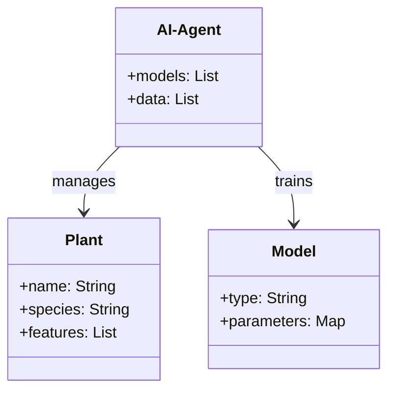
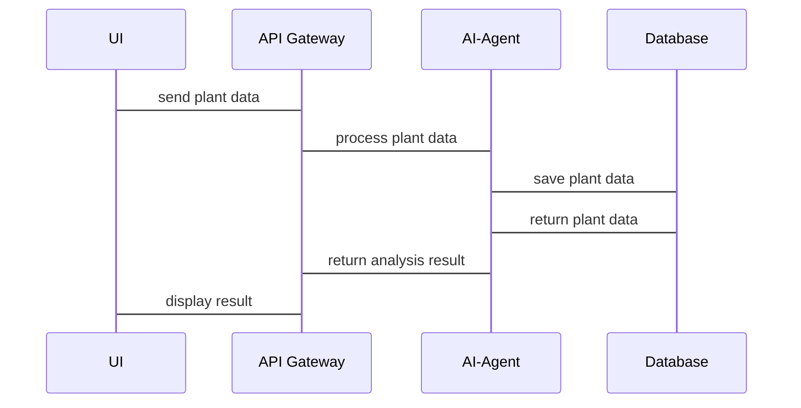

                 


# AI Agent在植物学中的应用：物种识别与生态监测

> 关键词：AI Agent，植物学，物种识别，生态监测，数学模型，算法实现

> 摘要：本文探讨了AI Agent在植物学中的应用，特别是物种识别与生态监测方面。通过详细分析AI Agent的核心概念、算法实现、系统架构及实际案例，展示了如何利用AI技术提升植物学研究的效率与准确性。文章还结合了数学模型和实际代码示例，帮助读者深入理解AI Agent在植物学中的应用原理与实现方法。

---

## 第一部分: AI Agent与植物学的结合

### 第1章: AI Agent的基本概念

#### 1.1 AI Agent的核心特征

AI Agent（人工智能代理）是一种能够感知环境、做出决策并执行任务的智能实体。其核心特征包括：

- **自主性**：能够在没有外部干预的情况下自主运行。
- **反应性**：能够实时感知环境变化并做出相应的反应。
- **主动性**：主动采取行动以实现目标。
- **社会性**：能够与其他AI Agent或人类进行交互与协作。

#### 1.2 植物学的基本概念

植物学是研究植物的形态、结构、分类、生理、生态等的科学。其研究内容包括：

- **植物分类学**：研究植物的分类、命名及分布。
- **植物生态学**：研究植物与环境之间的相互作用。
- **植物生理学**：研究植物的生理功能。

#### 1.3 AI Agent在植物学中的应用前景

AI Agent在植物学中的应用前景广阔，尤其是在物种识别和生态监测方面。通过AI技术，植物学家可以更高效地处理大量数据，提高研究的准确性和效率。

---

### 第2章: AI Agent在物种识别中的应用

#### 2.1 物种识别的基本概念

物种识别是通过分析植物的形态特征、生理特征等信息，确定其所属物种的过程。其核心要素包括：

- **特征提取**：从植物图像或数据中提取关键特征。
- **分类算法**：利用算法对提取的特征进行分类。
- **决策模型**：基于分类结果做出最终的物种识别决策。

#### 2.2 AI Agent在物种识别中的作用

AI Agent在物种识别中的作用主要体现在以下几个方面：

- **数据处理**：AI Agent能够快速处理大量的植物图像或数据，提取关键特征。
- **分类与决策**：通过机器学习算法，AI Agent能够对提取的特征进行分类，确定植物的物种。
- **实时监测**：AI Agent可以实时监测植物的生长状态，及时发现异常情况。

#### 2.3 物种识别的数学模型与算法

##### 2.3.1 分类算法的数学模型

常用的分类算法包括支持向量机（SVM）和随机森林（Random Forest）。以下是SVM的数学模型：

$$
\text{最大化} \quad \frac{1}{2} \|w\|^2 \\
\text{约束} \quad y_i (w \cdot x_i + b) \geq 1 \quad \forall i
$$

其中，\(w\) 是超平面的法向量，\(b\) 是偏置项，\(y_i\) 是样本的标签。

##### 2.3.2 分类算法的实现流程

以下是基于SVM的分类算法实现流程：

1. 数据预处理：对植物图像进行归一化处理。
2. 特征提取：提取植物图像的关键特征。
3. 模型训练：利用SVM算法对提取的特征进行训练。
4. 模型预测：利用训练好的模型对新数据进行分类。

##### 2.3.3 分类算法的优缺点对比

| 算法 | 优点 | 缺点 |
|------|------|------|
| SVM  | 高准确性，适合小样本数据 | 对大规模数据处理能力较弱 |
| Random Forest | 高准确性，适合大规模数据 | 对特征工程依赖较大 |

#### 2.4 本章小结

本章详细介绍了AI Agent在物种识别中的应用，包括物种识别的基本概念、AI Agent的作用以及分类算法的数学模型和实现流程。

---

### 第3章: AI Agent在生态监测中的应用

#### 3.1 生态监测的基本概念

生态监测是通过监测植物的生长状态、环境条件等信息，评估生态系统健康状况的过程。其核心要素包括：

- **环境数据**：温度、湿度、光照等环境参数。
- **植物数据**：植物的生长状态、健康状况等。
- **数据处理**：对环境数据和植物数据进行分析和处理。

#### 3.2 AI Agent在生态监测中的作用

AI Agent在生态监测中的作用主要体现在以下几个方面：

- **数据采集**：AI Agent能够实时采集植物的生长数据和环境数据。
- **数据分析**：通过机器学习算法对采集的数据进行分析，识别异常情况。
- **预警与反馈**：根据分析结果，AI Agent可以发出预警信号，并采取相应的反馈措施。

#### 3.3 生态监测的数学模型与算法

##### 3.3.1 分类算法的数学模型

以下是随机森林算法的数学模型：

$$
\text{决策树构建} \quad \text{特征选择} \quad \text{投票或加权}
$$

##### 3.3.2 分类算法的实现流程

以下是基于随机森林的分类算法实现流程：

1. 数据预处理：对植物图像进行归一化处理。
2. 特征提取：提取植物图像的关键特征。
3. 模型训练：利用随机森林算法对提取的特征进行训练。
4. 模型预测：利用训练好的模型对新数据进行分类。

#### 3.4 本章小结

本章详细介绍了AI Agent在生态监测中的应用，包括生态监测的基本概念、AI Agent的作用以及分类算法的数学模型和实现流程。

---

### 第4章: AI Agent在植物学中的综合应用

#### 4.1 综合应用的基本概念

综合应用是指将AI Agent技术应用于植物学的多个领域，包括物种识别、生态监测等。其核心要素包括：

- **多领域应用**：AI Agent可以在植物学的多个领域中应用。
- **数据融合**：将不同领域的数据进行融合，提高分析的准确性。
- **智能决策**：基于融合后的数据，AI Agent可以做出智能决策。

#### 4.2 AI Agent在综合应用中的作用

AI Agent在综合应用中的作用主要体现在以下几个方面：

- **数据融合**：AI Agent可以将不同领域的数据进行融合，提高分析的准确性。
- **智能决策**：基于融合后的数据，AI Agent可以做出智能决策。
- **实时监控**：AI Agent可以实时监控植物的生长状态和环境条件。

#### 4.3 综合应用的数学模型与算法

##### 4.3.1 分类算法的数学模型

以下是集成学习算法的数学模型：

$$
\text{集成模型构建} \quad \text{特征选择} \quad \text{投票或加权}
$$

##### 4.3.2 分类算法的实现流程

以下是基于集成学习的分类算法实现流程：

1. 数据预处理：对植物图像进行归一化处理。
2. 特征提取：提取植物图像的关键特征。
3. 模型训练：利用集成学习算法对提取的特征进行训练。
4. 模型预测：利用训练好的模型对新数据进行分类。

#### 4.4 本章小结

本章详细介绍了AI Agent在植物学中的综合应用，包括综合应用的基本概念、AI Agent的作用以及分类算法的数学模型和实现流程。

---

## 第二部分: 系统分析与架构设计方案

### 第5章: 系统架构设计

#### 5.1 问题场景介绍

本节将介绍AI Agent在植物学中的应用系统架构设计。系统主要用于植物的物种识别和生态监测。

#### 5.2 项目介绍

本项目旨在开发一个基于AI Agent的植物学研究系统，实现植物的物种识别和生态监测。

#### 5.3 系统功能设计

以下是系统功能设计的类图：



#### 5.4 系统架构设计

以下是系统架构设计的架构图：

```mermaid
graph TD

    UI --> API Gateway
    API Gateway --> AI-Agent
    AI-Agent --> Database
    Database --> Plant
    Database --> Model
```

#### 5.5 系统接口设计

以下是系统接口设计的序列图：



---

## 第三部分: 项目实战

### 第6章: 项目实战

#### 6.1 环境安装

以下是项目实战的环境安装步骤：

1. 安装Python和相关库：
   ```bash
   pip install numpy
   pip install scikit-learn
   pip install matplotlib
   ```

2. 安装Jupyter Notebook：
   ```bash
   pip install jupyter
   ```

#### 6.2 系统核心实现源代码

以下是系统核心实现的源代码：

```python
import numpy as np
from sklearn import svm
from sklearn.ensemble import RandomForestClassifier

# 数据预处理
def preprocess_data(data):
    # 归一化处理
    data = (data - np.mean(data)) / np.std(data)
    return data

# 特征提取
def extract_features(data):
    # 提取主成分
    pca = PCA(n_components=2)
    features = pca.fit_transform(data)
    return features

# 模型训练
def train_model(features, labels):
    # 使用SVM进行训练
    clf = svm.SVC()
    clf.fit(features, labels)
    return clf

# 模型预测
def predict_species(model, new_data):
    # 预处理新数据
    processed_data = preprocess_data(new_data)
    # 提取新特征
    features = extract_features(processed_data)
    # 进行预测
    prediction = model.predict(features)
    return prediction
```

#### 6.3 代码应用解读与分析

以下是代码应用的解读与分析：

1. 数据预处理：对植物图像进行归一化处理，确保数据的均匀性。
2. 特征提取：通过主成分分析（PCA）提取植物图像的关键特征，降低数据维度。
3. 模型训练：使用支持向量机（SVM）对提取的特征进行训练，构建分类模型。
4. 模型预测：利用训练好的模型对新数据进行分类，确定植物的物种。

#### 6.4 实际案例分析

以下是实际案例分析：

1. 案例背景：某地区发现了新的植物种群，需要进行物种识别。
2. 数据采集：采集该种植物的图像数据。
3. 数据处理：对图像数据进行预处理和特征提取。
4. 模型训练：利用SVM算法对提取的特征进行训练，构建分类模型。
5. 模型预测：利用训练好的模型对新数据进行分类，确定植物的物种。

#### 6.5 项目小结

本章通过实际案例展示了AI Agent在植物学中的应用，详细讲解了系统核心实现的源代码，并对代码进行了应用解读与分析。

---

## 第四部分: 总结与展望

### 第7章: 总结与展望

#### 7.1 本章总结

本章总结了AI Agent在植物学中的应用，包括物种识别和生态监测的核心概念、算法实现、系统架构及实际案例。通过详细分析，展示了AI Agent在植物学研究中的巨大潜力。

#### 7.2 未来展望

未来，随着AI技术的不断发展，AI Agent在植物学中的应用将更加广泛和深入。特别是在多模态数据融合、实时监测和智能决策方面，AI Agent将发挥更大的作用。

---

## 作者：AI天才研究院/AI Genius Institute & 禅与计算机程序设计艺术 /Zen And The Art of Computer Programming

---

这篇文章详细探讨了AI Agent在植物学中的应用，包括物种识别和生态监测的核心概念、算法实现、系统架构及实际案例。通过理论与实践相结合的方式，帮助读者深入了解AI Agent在植物学研究中的潜力与价值。

