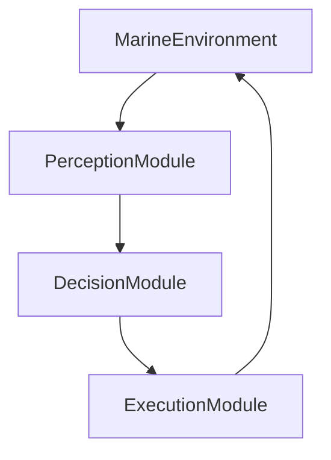
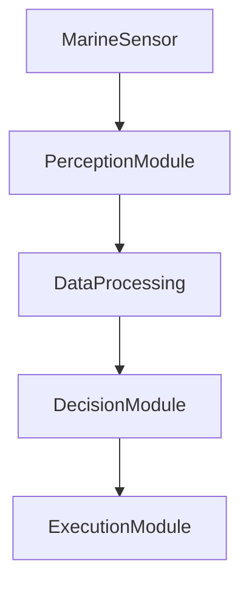
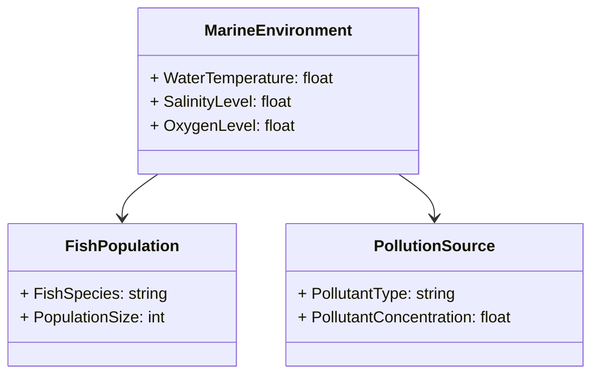
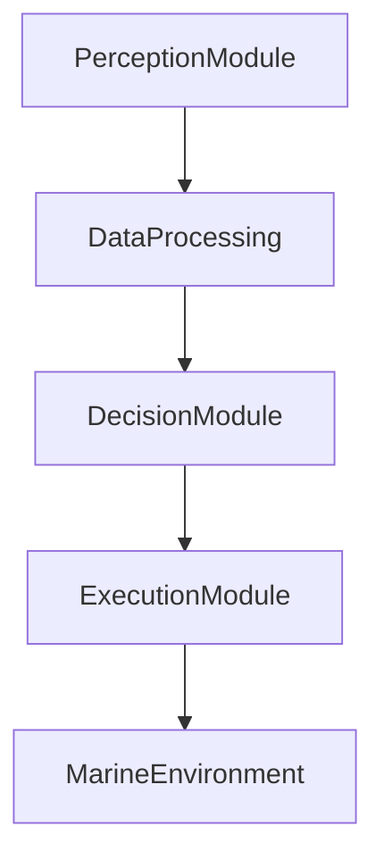
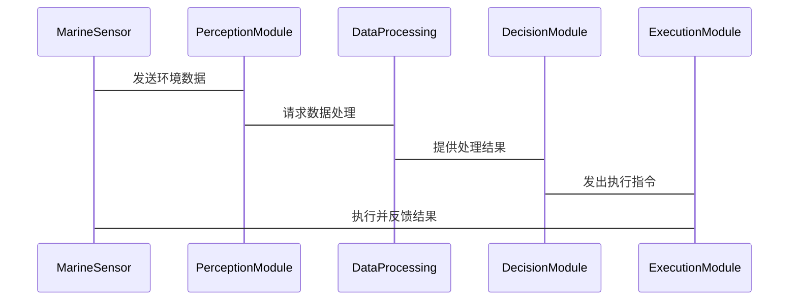

                 


# AI Agent在海洋科学中的应用：海洋资源管理与保护

> 关键词：AI Agent, 海洋科学, 海洋资源管理, 海洋环境保护, 人工智能, 海洋科学研究

> 摘要：本文系统探讨了AI Agent在海洋科学中的应用，特别是在海洋资源管理与保护方面的创新与实践。文章从AI Agent的核心原理出发，结合海洋资源管理与环境保护的实际需求，详细分析了AI Agent在海洋资源监测、优化与保护中的具体应用，结合项目实战案例，深入解读了AI Agent在海洋科学领域的潜力与价值。

---

## 第1章: AI Agent的基本概念与核心原理

### 1.1 AI Agent的定义与特点

#### 1.1.1 AI Agent的定义
AI Agent（人工智能代理）是指在计算机系统中，能够感知环境、自主决策并执行任务的智能实体。它能够根据外部输入的信息和内部状态，采取适当的行动以实现目标。

#### 1.1.2 AI Agent的核心特点
1. **自主性**：AI Agent能够在没有外部干预的情况下独立运行。
2. **反应性**：能够实时感知环境并做出反应。
3. **目标导向性**：所有行动都围绕特定目标展开。
4. **学习能力**：通过数据和经验不断优化自身行为。

#### 1.1.3 AI Agent与传统AI的区别
AI Agent不仅是一个静态的知识库或算法，而是一个动态的、能够与环境交互的实体。它结合了感知、决策和执行能力，形成了一个闭环系统。

### 1.2 AI Agent的核心原理

#### 1.2.1 感知模块
感知模块负责从环境中获取信息，包括数据采集、特征提取和信息融合。例如，在海洋环境中，AI Agent可以通过卫星、传感器等设备获取水温、盐度、氧气含量等数据。

#### 1.2.2 决策模块
决策模块基于感知到的信息，结合预设的目标和规则，生成行动方案。例如，在渔业管理中，AI Agent可以根据鱼群分布和捕捞限制，优化捕捞策略。

#### 1.2.3 执行模块
执行模块负责将决策模块生成的指令转化为实际行动。例如，在污染治理中，AI Agent可以控制无人船进行清理。

---

## 第2章: AI Agent在海洋科学中的应用背景

### 2.1 海洋科学的挑战与机遇

#### 2.1.1 海洋资源管理的复杂性
海洋资源管理涉及渔业、石油、天然气等多个领域，需要考虑生态平衡、经济利益和社会责任。

#### 2.1.2 海洋环境保护的重要性
海洋污染、过度捕捞等问题严重威胁海洋生态系统的健康，亟需智能化的解决方案。

#### 2.1.3 海洋科学研究的前沿性
海洋科学涉及海洋生态系统、气候变化等多个前沿领域，需要借助AI技术进行复杂的数据分析。

### 2.2 AI Agent在海洋科学中的应用前景

#### 2.2.1 AI Agent在海洋资源管理中的潜力
AI Agent可以优化渔业捕捞、监测海洋资源分布，提高资源利用效率。

#### 2.2.2 AI Agent在海洋环境保护中的作用
AI Agent可以实时监测污染源，预测环境变化，协助制定保护策略。

#### 2.2.3 AI Agent在海洋科学研究中的应用
AI Agent可以处理海量数据，支持海洋生态模型的构建和优化。

---

## 第3章: AI Agent的核心概念与联系

### 3.1 AI Agent的核心概念

#### 3.1.1 实体关系图（ER图）
```mermaid
er
  MarineEnvironment {
    --> WaterTemperature
    --> SalinityLevel
    --> OxygenLevel
  }
  FishPopulation {
    --> FishSpecies
    --> PopulationSize
  }
  PollutionSource {
    --> PollutantType
    --> PollutantConcentration
  }
```

#### 3.1.2 系统架构图


#### 3.1.3 数据流图


### 3.2 AI Agent的核心原理

#### 3.2.1 感知模块的实现原理
感知模块通过多种传感器获取数据，如温度、盐度、氧气含量等，经过预处理后提取特征。

#### 3.2.2 决策模块的实现原理
决策模块基于感知数据和预设规则，通过机器学习算法生成最优决策。例如，使用强化学习优化捕捞策略。

#### 3.2.3 执行模块的实现原理
执行模块根据决策结果，通过无人设备或系统执行具体操作，如调整捕捞量或清理污染。

---

## 第4章: AI Agent的算法原理讲解

### 4.1 算法原理概述

#### 4.1.1 算法的基本原理
AI Agent的核心算法包括感知算法、决策算法和执行算法。感知算法用于数据处理，决策算法用于策略选择，执行算法用于行动优化。

#### 4.1.2 算法的数学模型
决策模块可以使用强化学习模型，数学表达如下：
$$
V(s) = \max_a Q(s, a)
$$
其中，\( V(s) \) 表示状态 \( s \) 的价值函数，\( Q(s, a) \) 表示状态-动作对的价值函数。

#### 4.1.3 算法的实现步骤
1. 数据预处理：清洗、归一化、特征提取。
2. 模型训练：使用强化学习框架训练决策模型。
3. 模型优化：调整超参数，提升模型性能。

### 4.2 算法实现的详细步骤

#### 4.2.1 数据预处理
```python
import numpy as np
from sklearn.preprocessing import MinMaxScaler

# 假设data为原始数据
scaler = MinMaxScaler()
data_normalized = scaler.fit_transform(data)
```

#### 4.2.2 模型训练
```python
import tensorflow as tf
from tensorflow.keras import layers

model = tf.keras.Sequential([
    layers.Dense(64, activation='relu'),
    layers.Dense(1, activation='linear')
])
model.compile(optimizer='adam', loss='mse')
model.fit(data_normalized, labels, epochs=100, batch_size=32)
```

#### 4.2.3 模型优化
```python
# 超参数调整
from sklearn.model_selection import GridSearchCV
from tensorflow.keras.wrappers import KerasRegressor

def create_model(neurons=64):
    model = tf.keras.Sequential([
        layers.Dense(neurons, activation='relu'),
        layers.Dense(1, activation='linear')
    ])
    model.compile(optimizer='adam', loss='mse')
    return model

# 参数搜索
param_grid = {'neurons': [32, 64, 128]}
grid = GridSearchCV(estimator=KerasRegressor(build_fn=create_model), 
                    param_grid=param_grid, cv=3)
grid_result = grid.fit(data_normalized, labels)
```

---

## 第5章: AI Agent在海洋资源管理中的应用

### 5.1 渔业资源管理

#### 5.1.1 渔业资源的监测与评估
AI Agent可以通过卫星和传感器实时监测鱼群分布，评估渔业资源的可持续性。

#### 5.1.2 渔业资源的保护与优化
AI Agent可以优化捕捞策略，避免过度捕捞，保护濒危物种。

#### 5.1.3 渔业资源管理的案例分析
例如，在北太平洋某渔场，AI Agent通过分析水温、光照等数据，优化捕捞计划，提高了资源利用率。

### 5.2 石油与天然气资源管理

#### 5.2.1 海洋能源的探测与评估
AI Agent可以分析海底地形和地质数据，评估石油和天然气的储量。

#### 5.2.2 海洋能源的开发与保护
AI Agent可以监控钻井平台的运行状态，预测潜在风险，确保开发过程中的环境保护。

#### 5.2.3 石油与天然气资源管理的案例分析
例如，在墨西哥湾，AI Agent通过实时监测环境数据，优化钻井计划，降低了环境风险。

---

## 第6章: AI Agent在海洋环境保护中的应用

### 6.1 海洋污染监测

#### 6.1.1 污染源的识别与追踪
AI Agent可以分析水质数据，识别污染源，追踪污染物扩散路径。

#### 6.1.2 污染影响的评估与预测
AI Agent可以通过建立数学模型，预测污染对海洋生态系统的长期影响。

#### 6.1.3 污染治理的优化与执行
AI Agent可以优化污染治理方案，协调无人设备进行污染清理。

#### 6.1.4 海洋污染监测的案例分析
例如，在马六甲海峡，AI Agent通过监测水质数据，及时发现并处理污染事件。

---

## 第7章: 系统分析与架构设计方案

### 7.1 问题场景介绍
在海洋资源管理中，AI Agent需要协调多个传感器、数据处理系统和执行设备，形成一个闭环系统。

### 7.2 系统功能设计

#### 7.2.1 领域模型


#### 7.2.2 系统架构


#### 7.2.3 系统接口设计
系统接口包括数据采集接口、决策接口和执行接口，通过API实现模块之间的通信。

#### 7.2.4 系统交互


---

## 第8章: 项目实战

### 8.1 环境安装

#### 8.1.1 安装Python
```bash
python --version
pip install --upgrade pip
```

#### 8.1.2 安装依赖库
```bash
pip install numpy pandas tensorflow scikit-learn
```

### 8.2 系统核心实现源代码

#### 8.2.1 感知模块
```python
import numpy as np
from sklearn.preprocessing import MinMaxScaler

class PerceptionModule:
    def __init__(self):
        self.scaler = MinMaxScaler()

    def preprocess_data(self, data):
        return self.scaler.fit_transform(data)
```

#### 8.2.2 决策模块
```python
import tensorflow as tf
from tensorflow.keras import layers

class DecisionModule:
    def __init__(self):
        self.model = tf.keras.Sequential([
            layers.Dense(64, activation='relu'),
            layers.Dense(1, activation='linear')
        ])
        self.model.compile(optimizer='adam', loss='mse')

    def train(self, input_data, target):
        self.model.fit(input_data, target, epochs=100, batch_size=32)
```

#### 8.2.3 执行模块
```python
class ExecutionModule:
    def execute_action(self, action):
        print(f"执行动作：{action}")
```

### 8.3 代码应用解读与分析
通过上述代码，我们可以实现一个简单的AI Agent系统，用于监测海洋环境数据并优化捕捞策略。

### 8.4 实际案例分析
以渔业管理为例，AI Agent可以实时监测水温、氧气含量等数据，优化捕捞计划，避免过度捕捞。

### 8.5 项目小结
通过本项目，我们可以看到AI Agent在海洋科学中的巨大潜力，特别是在资源管理和环境保护方面。

---

## 第9章: 总结与展望

### 9.1 本章总结
本文系统探讨了AI Agent在海洋科学中的应用，特别是在海洋资源管理与保护方面，展示了其巨大的潜力和价值。

### 9.2 未来展望
未来，随着AI技术的不断发展，AI Agent在海洋科学中的应用将更加广泛和深入，特别是在海洋环境保护和资源优化管理方面。

---

## 作者：AI天才研究院/AI Genius Institute & 禅与计算机程序设计艺术 /Zen And The Art of Computer Programming

---

以上是文章的完整内容，希望对您有所帮助！如果需要进一步修改或补充，请随时告知。

