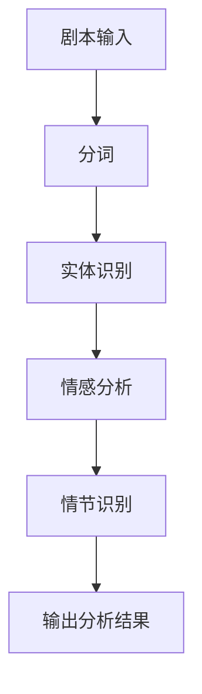
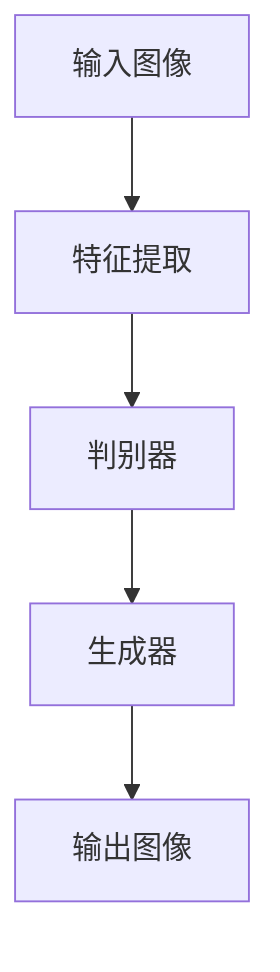
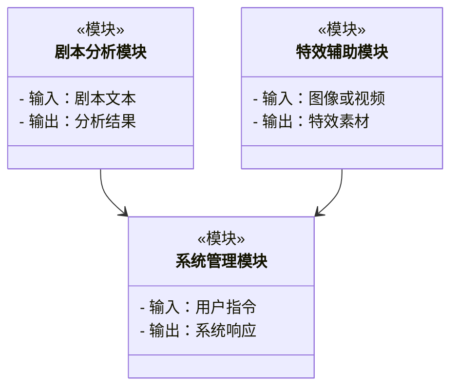
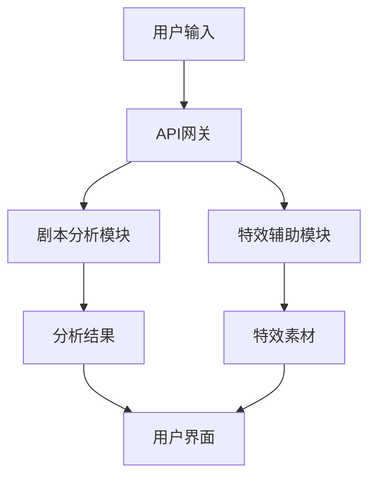
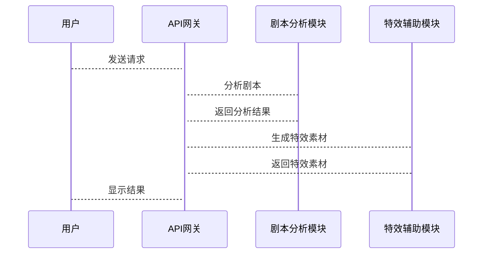

                 


# AI Agent在电影制作中的应用：剧本分析与特效辅助

## 关键词：AI Agent, 电影制作, 剧本分析, 特效辅助, 深度学习, 自然语言处理

## 摘要：  
随着人工智能技术的飞速发展，AI Agent在电影制作中的应用越来越广泛。本文将从AI Agent的基本概念入手，详细探讨其在剧本分析与特效辅助中的应用。通过分析AI Agent的核心算法原理、系统架构设计以及实际项目案例，本文旨在揭示AI技术如何为电影制作带来革命性的改变，帮助电影制作者提高效率、降低成本并拓展创作可能性。  

---

## 第一部分: AI Agent在电影制作中的应用概述

### 第1章: AI Agent与电影制作的背景介绍

#### 1.1 AI Agent的基本概念  
- **1.1.1 什么是AI Agent**  
  AI Agent（人工智能代理）是指能够感知环境并采取行动以实现目标的智能系统。它能够通过数据输入、分析和决策，辅助人类完成复杂任务。  
- **1.1.2 AI Agent的核心特点**  
  - 自主性：能够独立执行任务。  
  - 反应性：能够根据环境反馈调整行为。  
  - 学习能力：能够通过经验改进性能。  
- **1.1.3 AI Agent与传统电影制作的区别**  
  传统电影制作依赖人工劳动和经验，而AI Agent能够通过自动化技术提高效率并拓展创作可能性。  

#### 1.2 电影制作的基本流程  
- **1.2.1 剧本创作阶段**  
  剧本创作是电影制作的起点，涉及故事构思、角色设定和情节安排。  
- **1.2.2 拍摄阶段**  
  拍摄阶段包括场景布置、演员调度和镜头设计。  
- **1.2.3 后期制作阶段**  
  后期制作包括剪辑、特效和配音等环节。  

#### 1.3 AI Agent在电影制作中的应用背景  
- **1.3.1 电影制作中的痛点**  
  - 剧本创作缺乏创新性。  
  - 后期制作成本高、效率低。  
  - 特效制作周期长、技术复杂。  
- **1.3.2 AI技术如何解决这些痛点**  
  - 提供创新的剧本创作思路。  
  - 自动化处理后期制作中的重复性任务。  
  - 快速生成高质量特效素材。  
- **1.3.3 当前AI Agent在电影制作中的应用现状**  
  AI Agent已经在剧本分析、特效辅助和观众反馈分析等领域得到了广泛应用。  

---

### 第2章: AI Agent在剧本分析中的核心概念与联系  

#### 2.1 剧本分析的基本原理  
- **2.1.1 剧本分析的定义**  
  剧本分析是对剧本内容进行结构化分析，以提取关键信息并辅助创作。  
- **2.1.2 剧本分析的关键要素**  
  - 情节分析：识别故事的主要情节和转折点。  
  - 角色分析：分析角色的性格特点和动机。  
  - 语言风格分析：识别剧本的语言风格和情感倾向。  
- **2.1.3 AI Agent如何辅助剧本分析**  
  AI Agent可以通过自然语言处理技术提取剧本中的关键信息，并生成改进建议。  

#### 2.2 剧本分析的核心算法原理  
- **2.2.1 基于自然语言处理的剧本分析**  
  - 使用分词、实体识别和情感分析等技术对剧本进行结构化分析。  
- **2.2.2 基于深度学习的剧本情感分析**  
  - 使用LSTM（长短期记忆网络）模型对剧本的情感倾向进行分类。  
- **2.2.3 剧本结构分析的算法流程图**  



- **2.2.4 剧本分析的数学模型与公式**  
  - 情感分析的数学模型：  
    $$ \text{概率} = \frac{\text{正面词汇数}}{\text{总词汇数}} \times 100 $$  
  - 剧本主题识别的数学公式：  
    $$ \text{主题相似度} = \cos(\theta_1, \theta_2) $$  

#### 2.3 剧本分析的数学模型与公式  
- **2.3.1 情感分析的数学模型**  
  使用词袋模型对剧本文本进行特征提取，再通过朴素贝叶斯算法进行分类。  
- **2.3.2 剧本主题识别的数学公式**  
  $$ \text{主题相似度} = \cos(\theta_1, \theta_2) $$  
  其中，$\theta_1$和$\theta_2$分别是两个主题的向量表示。  

---

### 第3章: AI Agent在特效辅助中的算法原理  

#### 3.1 特效辅助的基本原理  
- **3.1.1 特效辅助的定义**  
  特效辅助是指利用AI技术生成或优化电影中的特效场景。  
- **3.1.2 特效辅助的关键技术**  
  - 图像生成：使用GAN（生成对抗网络）生成逼真的特效素材。  
  - 视频修复：通过深度学习技术修复低质量的视频素材。  
  - 3D建模：利用AI技术辅助生成三维模型。  
- **3.1.3 AI Agent在特效辅助中的作用**  
  AI Agent可以通过自动化生成特效素材，大幅缩短特效制作周期。  

#### 3.2 基于计算机视觉的特效辅助算法  
- **3.2.1 基于深度学习的图像识别**  
  - 使用卷积神经网络（CNN）对图像进行分类和识别。  
- **3.2.2 基于神经网络的图像生成**  
  - 使用GAN生成逼真的特效素材。  
- **3.2.3 特效辅助的算法流程图**  



- **3.2.4 特效辅助的数学模型与公式**  
  - 图像生成的数学模型：  
    $$ G(z) = \min_{G} \max_{D} \mathbb{E}_{z\sim p_z}[\log D(G(z))] + \mathbb{E}_{x\sim p_x}[\log(1 - D(x))] $$  
  其中，$G$是生成器，$D$是判别器，$z$是随机噪声，$x$是真实图像。  

#### 3.3 特效辅助的数学模型与公式  
- **3.3.1 图像识别的数学模型**  
  使用卷积神经网络（CNN）对图像进行分类，模型结构如下：  
  $$ \text{输出} = \text{激活函数}(\text{卷积}(\text{输入})) $$  
- **3.3.2 图像生成的数学公式**  
  $$ G(z) = \sigma(W_z h + b) $$  
  其中，$W_z$是权重矩阵，$h$是隐藏层输出，$b$是偏置项，$\sigma$是激活函数。  

---

## 第二部分: 系统分析与架构设计  

### 第4章: AI Agent在电影制作中的系统架构设计  

#### 4.1 问题场景介绍  
- AI Agent在电影制作中的应用场景包括剧本分析、特效辅助和观众反馈分析等。  

#### 4.2 系统功能设计  
- **领域模型设计**  



- **系统架构设计**  



- **系统接口设计**  
  - 输入接口：接收剧本文本或图像数据。  
  - 输出接口：返回分析结果或特效素材。  

- **系统交互设计**  



---

## 第三部分: 项目实战  

### 第5章: 基于AI Agent的电影制作辅助系统实现  

#### 5.1 环境安装与配置  
- 安装Python 3.8及以上版本。  
- 安装深度学习框架（如TensorFlow或PyTorch）。  
- 安装自然语言处理库（如NLTK或spaCy）。  

#### 5.2 系统核心实现  
- **剧本分析模块**  
  ```python
  import nltk
  from sklearn.feature_extraction.text import TfidfVectorizer
  from sklearn.naive_bayes import MultinomialNB

  # 文本分词
  def text_tokenize(text):
      return nltk.word_tokenize(text)

  # 特征提取
  vectorizer = TfidfVectorizer()
  features = vectorizer.fit_transform(corpus)

  # 情感分析
  model = MultinomialNB()
  model.fit(features, labels)
  ```

- **特效辅助模块**  
  ```python
  import tensorflow as tf
  from tensorflow.keras import layers

  # GAN模型实现
  def generator():
      model = tf.keras.Sequential()
      model.add(layers.Dense(256, activation='relu', input_dim=100))
      model.add(layers.Dense(784, activation='sigmoid'))
      return model

  def discriminator():
      model = tf.keras.Sequential()
      model.add(layers.Dense(256, activation='relu', input_dim=784))
      model.add(layers.Dense(1, activation='sigmoid'))
      return model
  ```

#### 5.3 案例分析与结果展示  
- 剧本分析案例：  
  使用AI Agent对《复仇者联盟3》的剧本进行分析，提取关键情节和角色关系。  
- 特效辅助案例：  
  使用AI Agent生成电影中的特效场景，如超级英雄的战斗场景。  

#### 5.4 项目总结与优化建议  
- 本项目展示了AI Agent在电影制作中的巨大潜力。  
- 未来可以进一步优化算法，提高分析精度和生成效果。  

---

## 第四部分: 总结与扩展阅读  

### 第6章: 总结与扩展阅读  

#### 6.1 总结  
- AI Agent在电影制作中的应用涵盖了剧本分析和特效辅助等多个方面。  
- 通过深度学习和自然语言处理技术，AI Agent能够显著提高电影制作的效率和质量。  

#### 6.2 最佳实践 tips  
- 在剧本分析中，确保输入数据的多样性和代表性。  
- 在特效辅助中，注重模型的训练数据质量和生成效果的优化。  

#### 6.3 注意事项  
- 数据隐私问题需要特别注意。  
- 确保AI系统的稳定性和可靠性。  

#### 6.4 拓展阅读  
- 《深度学习实战》  
- 《自然语言处理入门》  
- 《计算机视觉：算法与应用》  

---

## 作者：AI天才研究院/AI Genius Institute & 禅与计算机程序设计艺术 /Zen And The Art of Computer Programming

