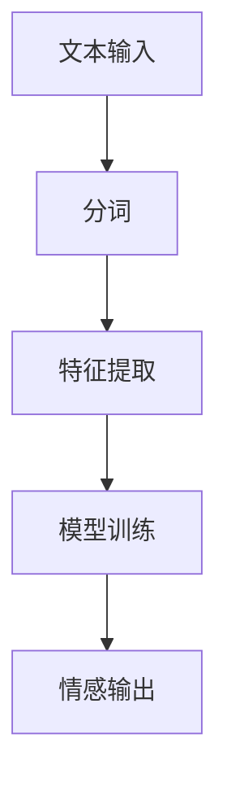
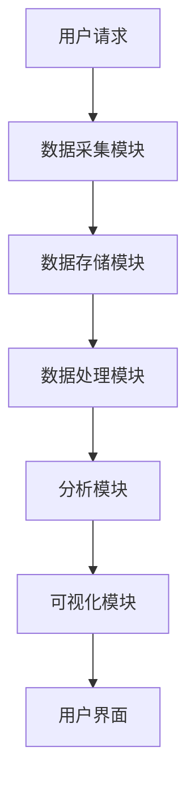

                 


```markdown
# AI Agent在社交网络分析中的应用：舆情监测与影响力评估

> 关键词：AI Agent, 社交网络分析, 舆情监测, 影响力评估, 自然语言处理, 图论, 机器学习

> 摘要：本文系统地探讨了AI Agent在社交网络分析中的应用，重点分析了舆情监测与影响力评估的关键技术。通过详细阐述AI Agent的工作原理、核心算法、系统架构以及实际案例，本文为读者提供了从理论到实践的全面指导，帮助数据科学家和研究人员更好地理解和应用这些技术。

---

# 第一部分: 背景与概念

## 第1章: AI Agent与社交网络分析的背景

### 1.1 AI Agent的基本概念
#### 1.1.1 AI Agent的定义
AI Agent是指具备自主决策和学习能力的智能体，能够在复杂环境中执行特定任务。它通过感知环境、处理信息和采取行动来实现目标。

#### 1.1.2 社交网络分析的核心概念
社交网络分析研究的是个体间的关系和互动，通过图论和统计方法来揭示网络的结构特征和动态变化。

#### 1.1.3 舆情监测与影响力评估的重要性
舆情监测帮助企业及时了解公众意见，而影响力评估则帮助识别关键用户，这两者对企业的声誉管理和市场策略至关重要。

---

## 第2章: 舆情监测与影响力评估的挑战

### 2.1 舆情监测的主要挑战
#### 2.1.1 数据量大与实时性要求
社交网络产生的数据量巨大，要求实时处理和分析。

#### 2.1.2 多语言与多文化的影响
全球化的社交网络涉及多种语言和文化背景，增加了分析的复杂性。

### 2.2 影响力评估的主要挑战
#### 2.2.1 用户行为的复杂性
用户行为受到多种因素影响，难以用简单的模型描述。

#### 2.2.2 网络结构的动态变化
社交网络的结构不断变化，需要动态更新分析结果。

---

# 第二部分: 核心概念与技术原理

## 第3章: 自然语言处理在舆情监测中的应用

### 3.1 情感分析算法
#### 3.1.1 基于词袋模型的情感分析
使用词袋模型对文本进行特征提取，并通过机器学习算法进行分类。

#### 3.1.2 预训练模型的应用
利用BERT等预训练模型进行深度学习情感分析。

#### 3.1.3 情感分析的流程图


---

## 第4章: 图论与影响力评估

### 4.1 社交网络的图论模型
#### 4.1.1 用户-用户关系图
构建用户之间的关系图，分析用户之间的互动频率和强度。

#### 4.1.2 用户-内容关系图
分析用户对内容的互动行为，构建用户-内容关系图。

#### 4.1.3 社群检测
通过图论算法检测社交网络中的社群结构，识别关键社群。

---

# 第三部分: 算法实现与系统架构

## 第5章: 舆情监测系统的算法实现

### 5.1 情感分析算法实现
#### 5.1.1 数据预处理
对文本数据进行清洗、分词和标注。

#### 5.1.2 特征提取
使用TF-IDF提取文本特征。

#### 5.1.3 模型训练
基于机器学习算法（如SVM、随机森林）进行分类训练。

#### 5.1.4 情感分析的代码实现
```python
from sklearn.feature_extraction.text import TfidfVectorizer
from sklearn.svm import SVC

# 数据预处理
corpus = ["This is a good product", "This is a bad product"]
vectorizer = TfidfVectorizer()
X = vectorizer.fit_transform(corpus)
y = [1, 0]

# 模型训练
model = SVC()
model.fit(X, y)

# 预测
test_text = "This is an excellent product"
test_X = vectorizer.transform([test_text])
print(model.predict(test_X))
```

---

## 第6章: 影响力评估的系统架构

### 6.1 系统功能设计
#### 6.1.1 数据采集模块
负责从社交平台获取实时数据。

#### 6.1.2 数据处理模块
对数据进行清洗、转换和存储。

#### 6.1.3 分析模块
基于图论和机器学习算法进行影响力评估。

#### 6.1.4 可视化模块
将分析结果以图表形式展示给用户。

### 6.2 系统架构设计


---

# 第四部分: 项目实战与总结

## 第7章: 舆情监测系统的实战

### 7.1 项目背景与目标
本项目旨在开发一个实时舆情监测系统，帮助用户了解公众对特定话题的评价。

### 7.2 项目实现
#### 7.2.1 环境配置
安装必要的库（如Python、scikit-learn、networkx）。

#### 7.2.2 数据采集
从社交媒体API获取数据。

#### 7.2.3 数据处理与分析
清洗数据并进行情感分析。

#### 7.2.4 结果可视化
使用Matplotlib或Seaborn绘制情感分布图。

### 7.3 项目总结与优化
总结项目实施过程中的经验和不足，提出优化建议。

---

## 第8章: 总结与展望

### 8.1 本章总结
本文详细探讨了AI Agent在社交网络分析中的应用，从理论到实践，全面介绍了舆情监测与影响力评估的关键技术。

### 8.2 未来研究方向
未来可以进一步研究动态网络分析、多模态数据融合以及更高效的影响力评估算法。

---

# 作者：AI天才研究院 & 禅与计算机程序设计艺术

---

* 本文为AI Agent在社交网络分析中的应用：舆情监测与影响力评估的技术博客文章，版权归作者所有，未经授权不得转载。
```

