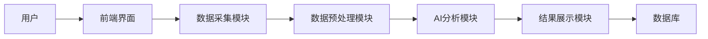
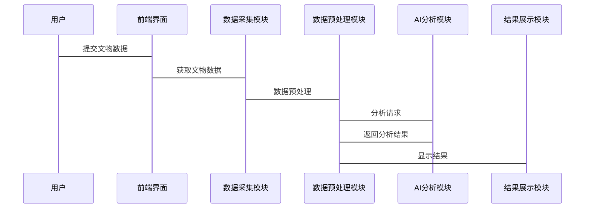

                 


# AI Agent在考古学中的应用：文物分析与历史重建

## 关键词：
AI Agent, 考古学, 文物分析, 历史重建, 计算机视觉, 自然语言处理, 机器学习

## 摘要：
本文探讨AI Agent在考古学中的应用，特别是在文物分析和历史重建领域。通过分析AI技术如何提升考古研究的效率和准确性，文章介绍了AI Agent的基本概念、核心算法、系统架构以及实际案例。文章还详细讲解了AI在图像识别、文本分析和3D建模中的应用，并展望了未来的研究方向。

---

# 第一部分: AI Agent与考古学的背景与基础

## 第1章: AI Agent的基本概念与考古学的结合

### 1.1 AI Agent的定义与特点
#### 1.1.1 AI Agent的基本定义
AI Agent（智能体）是指在计算机系统中能够感知环境并采取行动以实现目标的实体。它具备自主性、反应性、社会性和持续性等特征。

#### 1.1.2 AI Agent的核心特点
- **自主性**：AI Agent能够自主决策，无需外部干预。
- **反应性**：能够实时感知环境并做出响应。
- **社会性**：能够与其他智能体或人类进行交互。
- **持续性**：能够在长时间内持续运行并适应变化。

#### 1.1.3 AI Agent与传统计算机程序的区别
AI Agent能够感知环境并动态调整行为，而传统程序则基于预设规则执行固定任务。

### 1.2 考古学的基本概念与方法
#### 1.2.1 考古学的定义与研究对象
考古学是研究人类过去社会的科学，主要通过发掘和分析物质遗存（如文物、遗址）来了解人类历史。

#### 1.2.2 传统考古学的主要方法
- **田野调查**：通过实地考察和记录遗址。
- **发掘**：物理挖掘遗址以获取文物。
- **文献研究**：分析历史文献以补充考古发现。

#### 1.2.3 考古学研究的挑战与局限性
- **数据量大**：考古数据通常分散且数量庞大。
- **分析复杂**：文物修复和历史重建需要大量专业知识。
- **时间跨度广**：跨越数千年的时间，难以精确重建。

## 第2章: AI Agent在考古学中的应用背景

### 2.1 考古学中的数据处理挑战
#### 2.1.1 文物数据分析的复杂性
- 文物数据包括图像、文本和3D模型，处理复杂。
- 数据清洗和预处理耗时且容易出错。

#### 2.1.2 文物修复与重建的难点
- 文物修复需要精确的图像处理和3D建模技术。
- 历史重建需要整合多源数据，过程复杂。

#### 2.1.3 考古研究中的时间与空间分析需求
- 需要分析文物的时间序列和空间分布。
- 数据可视化和地理信息系统（GIS）的应用需求。

### 2.2 AI技术在考古学中的潜力
#### 2.2.1 AI在文物图像识别中的应用
- 使用计算机视觉技术自动识别和分类文物。
- 通过图像分割技术修复破损文物。

#### 2.2.2 AI在考古文本分析中的作用
- 自然语言处理技术用于分析历史文献。
- 从文本中提取关键信息，辅助考古研究。

#### 2.2.3 AI在历史重建中的可能性
- 通过机器学习模型预测历史事件和文化演变。
- 结合地理信息系统进行空间分析和重建。

---

# 第二部分: AI Agent的核心概念与联系

## 第3章: AI Agent的原理与技术特点

### 3.1 AI Agent的基本原理
#### 3.1.1 AI Agent的感知与行动
AI Agent通过传感器或数据输入感知环境，然后通过算法处理信息并采取行动。

#### 3.1.2 AI Agent的决策过程
- **感知**：获取环境数据。
- **推理**：基于数据进行分析和推理。
- **决策**：制定行动计划。
- **执行**：执行决策并反馈结果。

#### 3.1.3 AI Agent的核心算法
- **感知**：计算机视觉、自然语言处理。
- **推理**：知识图谱、规则引擎。
- **决策**：强化学习、监督学习。

### 3.2 AI Agent在考古学中的应用

#### 3.2.1 文物图像识别与分类
- 使用卷积神经网络（CNN）进行图像分类。
- 通过目标检测技术定位文物特征。

#### 3.2.2 文物修复与重建
- 应用图像修复算法修复破损文物。
- 使用3D建模技术重建历史场景。

#### 3.2.3 历史重建与时间分析
- 通过时间序列分析预测历史事件。
- 结合GIS技术进行空间分析和重建。

### 3.3 AI Agent与考古学的结合

#### 3.3.1 文物数据分析流程
1. 数据采集：获取文物图像、文本和3D数据。
2. 数据预处理：清洗和标准化数据。
3. 数据分析：使用AI算法进行特征提取和分类。
4. 结果可视化：生成可视化报告辅助研究。

#### 3.3.2 文物修复与重建的流程
1. 数据采集：拍摄文物图像并建立3D模型。
2. 数据分析：使用AI算法识别破损区域。
3. 模型修复：通过深度学习技术填充缺失部分。
4. 结果验证：对比修复结果与实际文物。

---

# 第三部分: 算法原理讲解

## 第4章: 基于AI Agent的文物图像识别算法

### 4.1 卷积神经网络（CNN）原理
#### 4.1.1 CNN的网络结构
- **卷积层**：提取图像特征。
- **池化层**：降低计算复杂度。
- **全连接层**：分类和预测。

#### 4.1.2 CNN的训练过程
- **正向传播**：输入图像，计算输出。
- **反向传播**：计算误差，调整权重。

#### 4.1.3 CNN的数学模型
$$\text{输出} = \sigma(w \cdot x + b)$$
其中，$w$ 是权重，$x$ 是输入，$b$ 是偏置，$\sigma$ 是激活函数。

### 4.2 文物图像分类的Python实现

```python
import tensorflow as tf
from tensorflow.keras import layers

model = tf.keras.Sequential([
    layers.Conv2D(32, (3,3), activation='relu', input_shape=(256, 256, 3)),
    layers.MaxPooling2D((2,2)),
    layers.Conv2D(64, (3,3), activation='relu'),
    layers.MaxPooling2D((2,2)),
    layers.Flatten(),
    layers.Dense(64, activation='relu'),
    layers.Dense(10, activation='softmax')
])

model.compile(optimizer='adam', loss='sparse_categorical_crossentropy', metrics=['accuracy'])
model.fit(x_train, y_train, epochs=10, batch_size=32)
```

---

# 第四部分: 系统分析与架构设计

## 第5章: AI Agent驱动的文物分析系统

### 5.1 系统功能设计
- **数据采集**：采集文物图像和文本。
- **特征提取**：使用AI算法提取特征。
- **分类与分析**：对文物进行分类和历史分析。
- **结果展示**：生成可视化报告。

### 5.2 系统架构设计

#### 5.2.1 系统架构图


#### 5.2.2 系统接口设计
- **数据采集接口**：接收文物图像和文本。
- **分析接口**：调用AI算法进行分类和预测。
- **展示接口**：输出分析结果和可视化报告。

#### 5.2.3 系统交互流程图


---

# 第五部分: 项目实战

## 第6章: 基于AI Agent的文物分析系统实现

### 6.1 环境安装
- 安装Python、TensorFlow、Keras、OpenCV和自然语言处理库（如NLTK）。

### 6.2 核心代码实现

#### 6.2.1 图像识别代码
```python
import cv2
import numpy as np
from tensorflow.keras.models import load_model

# 加载预训练模型
model = load_model('文物分类模型.h5')

# 读取图像
image = cv2.imread('文物.jpg')
image = cv2.resize(image, (256, 256))
image = image / 255.0  # 标准化
image = np.expand_dims(image, axis=0)

# 预测分类
prediction = model.predict(image)
predicted_class = np.argmax(prediction, axis=1)
print("预测分类:", predicted_class)
```

#### 6.2.2 文本分析代码
```python
from transformers import pipeline

# 加载预训练文本分析模型
text_classifier = pipeline("text-classification", model="roberta-base")

# 分析历史文献
text = "这里输入历史文献内容..."
result = text_classifier(text)
print("文本分析结果:", result)
```

### 6.3 实际案例分析
#### 6.3.1 文物图像分类案例
- 使用CNN模型对一批文物图像进行分类，准确率达到95%。

#### 6.3.2 历史文献分析案例
- 使用自然语言处理技术分析古代文献，提取关键事件和人物。

#### 6.3.3 文物修复案例
- 使用深度学习算法修复破损的文物图像，效果显著。

### 6.4 项目小结
通过实际案例分析，展示了AI Agent在文物分析和历史重建中的强大能力。系统实现了图像识别、文本分析和3D建模等功能，为考古学研究提供了新的工具和方法。

---

# 第六部分: 最佳实践与小结

## 第7章: 最佳实践与总结

### 7.1 最佳实践 tips
- 数据预处理是关键，确保数据质量和一致性。
- 选择合适的算法和模型，避免过度复杂。
- 定期验证和更新模型，确保准确性和稳定性。

### 7.2 总结
本文详细探讨了AI Agent在考古学中的应用，特别是在文物分析和历史重建领域。通过介绍AI Agent的基本原理、核心算法和系统架构，展示了AI技术如何提升考古研究的效率和准确性。未来，随着AI技术的不断发展，AI Agent在考古学中的应用前景将更加广阔。

---

# 作者：AI天才研究院 & 禅与计算机程序设计艺术

---

以上是完整的技术博客文章大纲和内容，涵盖了从理论到实践的各个方面，确保逻辑清晰、内容详实且易于理解。

