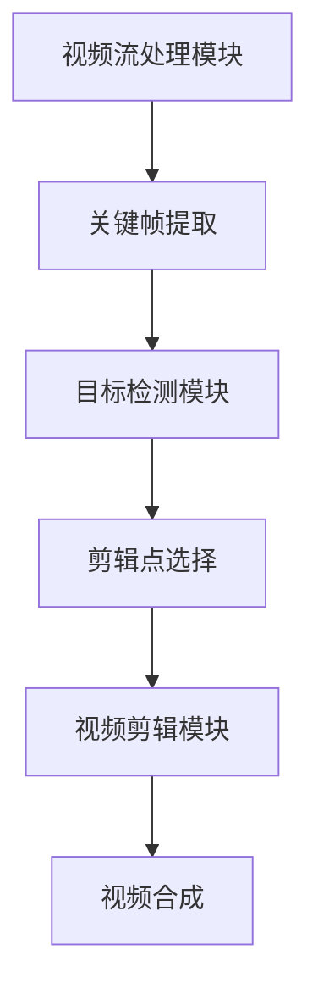

                 


# AI Agent在视频编辑中的应用：自动剪辑与特效添加

> 关键词：AI Agent, 视频编辑, 自动剪辑, 特效添加, 深度学习, 目标检测, 图像处理

> 摘要：本文探讨了AI Agent在视频编辑中的应用，重点分析了自动剪辑与特效添加的技术实现。文章从背景介绍、核心概念、算法原理、系统架构到项目实战，详细阐述了AI Agent如何通过深度学习、目标检测和图像处理等技术，实现视频内容的智能化编辑，为视频编辑领域带来了新的可能性。

---

# 第一部分: AI Agent在视频编辑中的应用概述

## 第1章: AI Agent与视频编辑的结合

### 1.1 AI Agent的基本概念
#### 1.1.1 AI Agent的定义与特点
- **AI Agent**（人工智能代理）是指能够感知环境、自主决策并执行任务的智能体。其特点包括：
  - **自主性**：能够独立执行任务，无需外部干预。
  - **反应性**：能够实时感知环境并做出反应。
  - **目标导向**：通过优化目标函数实现特定目标。
  - **学习能力**：能够通过数据学习和优化自身性能。

#### 1.1.2 AI Agent的核心功能与应用场景
- **核心功能**：
  - 数据分析与处理
  - 自动决策与执行
  - 与用户的交互与反馈
- **应用场景**：
  - 自动化推荐系统
  - 智能客服
  - 自动驾驶
  - 智能视频编辑

#### 1.1.3 视频编辑的基本概念与流程
- **视频编辑**是指对视频内容进行剪辑、特效添加、音频处理等操作，以达到特定的视觉效果或叙事目的。
- **视频编辑流程**：
  1. **素材采集**：收集视频素材。
  2. **剪辑处理**：根据需求剪辑视频片段。
  3. **特效添加**：添加转场效果、字幕、滤镜等。
  4. **音频处理**：同步音频与视频内容。
  5. **最终输出**：生成最终视频文件。

### 1.2 AI Agent在视频编辑中的应用背景
#### 1.2.1 视频编辑的历史与发展
- 传统视频编辑依赖人工操作，效率低且成本高。
- 随着AI技术的发展，智能化视频编辑逐渐成为可能。

#### 1.2.2 AI技术在视频编辑中的潜力
- **自动化剪辑**：AI Agent可以通过分析视频内容自动识别剪辑点。
- **智能特效添加**：AI Agent可以根据视频内容自动生成合适的特效。
- **个性化推荐**：AI Agent可以根据用户偏好推荐编辑方案。

#### 1.2.3 AI Agent在视频编辑中的优势与挑战
- **优势**：
  - 提高编辑效率。
  - 实现个性化、智能化编辑。
  - 降低人工成本。
- **挑战**：
  - 视频内容复杂，需要处理大量数据。
  - AI模型的训练需要大量标注数据，成本高。
  - 特效生成的多样性与用户需求的匹配度问题。

### 1.3 AI Agent与视频编辑的结合方式
#### 1.3.1 自动剪辑的实现原理
- AI Agent通过分析视频内容，识别关键帧或场景变换点，自动剪辑视频片段。

#### 1.3.2 特效添加的AI实现
- AI Agent可以根据视频内容自动生成合适的特效，例如风格迁移、图像增强等。

#### 1.3.3 AI Agent在视频编辑中的创新应用
- 结合自然语言处理技术，实现语音识别与字幕自动生成。
- 基于用户反馈优化编辑效果。

### 1.4 本章小结
- 介绍了AI Agent的基本概念与核心功能。
- 分析了视频编辑的传统流程与AI Agent的应用潜力。
- 展示了AI Agent在视频编辑中的创新应用场景。

---

# 第二部分: AI Agent的核心原理与技术实现

## 第2章: AI Agent的核心原理

### 2.1 AI Agent的核心概念
#### 2.1.1 AI Agent的决策机制
- **基于规则的决策**：根据预定义规则做出决策。
- **基于模型的决策**：通过深度学习模型预测最优决策。
- **基于反馈的决策**：根据用户反馈优化决策策略。

#### 2.1.2 AI Agent的学习与优化
- **监督学习**：通过标注数据训练模型。
- **无监督学习**：通过聚类分析等技术发现数据中的规律。
- **强化学习**：通过与环境交互获得奖励，优化决策策略。

#### 2.1.3 AI Agent的感知能力
- **视频流处理**：实时分析视频流数据。
- **多模态数据融合**：结合图像、音频等多种数据源进行分析。

### 2.2 AI Agent在视频编辑中的技术实现
#### 2.2.1 视频内容的理解与分析
- **视频分割**：将视频划分为多个片段，分析每个片段的内容。
- **目标检测**：识别视频中的目标物体，例如人物、场景等。
- **场景识别**：根据视频内容识别场景类别，例如室内、室外等。

#### 2.2.2 剪辑点的自动识别与选择
- **关键帧检测**：通过算法检测视频中的关键帧，作为剪辑点。
- **场景变换检测**：识别视频中场景变换的点，作为剪辑依据。
- **情感分析**：根据视频的情感变化选择剪辑点。

#### 2.2.3 特效效果的自动生成与添加
- **特效生成**：通过AI模型生成特效，例如风格迁移、滤镜添加等。
- **特效应用**：将生成的特效应用到视频片段中，实现智能化特效添加。

### 2.3 AI Agent的核心算法与模型
#### 2.3.1 基于深度学习的视频分析模型
- **YOLO目标检测模型**：用于检测视频中的目标物体。
- **ResNet图像分类模型**：用于识别视频中的场景类别。
- **CycleGAN图像风格迁移模型**：用于生成不同风格的视频特效。

#### 2.3.2 剪辑点识别的算法实现
- **基于YOLO的目标检测算法**：
  ```python
  def detect_objects(image):
      # 使用YOLO模型检测视频中的目标物体
      # 返回检测结果
      return results
  ```

#### 2.3.3 特效生成的AI模型
- **基于CycleGAN的风格迁移**：
  ```python
  def style_transfer(source_image, target_style):
      # 使用CycleGAN模型将source_image转换为目标风格
      return stylized_image
  ```

### 2.4 本章小结
- 介绍了AI Agent的核心概念与决策机制。
- 分析了视频内容理解与分析的技术实现。
- 展示了AI Agent在视频编辑中的具体应用技术。

---

# 第三部分: 视频编辑技术的AI实现

## 第3章: 视频剪辑的AI实现

### 3.1 视频剪辑的基本原理
#### 3.1.1 视频剪辑的概念与流程
- **视频剪辑**：通过对视频片段的剪切、拼接等操作，生成新的视频内容。
- **剪辑流程**：
  1. 识别关键帧。
  2. 分割视频片段。
  3. 合成视频片段。

#### 3.1.2 剪辑点选择的规则与策略
- **规则驱动**：基于预定义规则选择剪辑点，例如固定时间间隔。
- **数据驱动**：基于视频内容分析选择剪辑点，例如场景变换点。
- **混合驱动**：结合规则与数据驱动的方法选择剪辑点。

#### 3.1.3 剪辑效果的评估与优化
- **剪辑效果评估**：通过主观评分或客观指标评估剪辑效果。
- **效果优化**：基于评估结果优化剪辑点选择策略。

### 3.2 AI Agent在视频剪辑中的应用
#### 3.2.1 基于目标检测的剪辑点识别
- **目标检测算法**：YOLO、Faster R-CNN等。
- **检测结果应用**：根据检测结果选择剪辑点。

#### 3.2.2 基于场景识别的剪辑点选择
- **场景识别模型**：ResNet、Inception等。
- **场景变换检测**：识别视频中场景变换的点，作为剪辑点。

#### 3.2.3 基于情感分析的剪辑优化
- **情感分析模型**：用于分析视频的情感变化。
- **剪辑优化**：根据情感变化调整剪辑点，优化视频节奏。

### 3.3 剪辑效果的优化策略
#### 3.3.1 基于反馈的剪辑优化
- **用户反馈**：收集用户的反馈信息。
- **优化剪辑点**：根据反馈优化剪辑点选择策略。

#### 3.3.2 基于强化学习的剪辑优化
- **强化学习模型**：通过与环境交互获得奖励，优化剪辑策略。
- **模型训练**：使用强化学习算法训练剪辑优化模型。

### 3.4 本章小结
- 介绍了视频剪辑的基本概念与流程。
- 分析了基于目标检测与场景识别的剪辑点识别技术。
- 展示了基于情感分析与强化学习的剪辑优化策略。

---

# 第四部分: 特效添加的AI实现

## 第4章: 特效添加的核心技术

### 4.1 特效添加的基本原理
#### 4.1.1 特效添加的概念与流程
- **特效添加**：在视频中添加字幕、滤镜、转场效果等。
- **特效流程**：
  1. 分析视频内容。
  2. 生成特效效果。
  3. 应用特效到视频片段。

#### 4.1.2 特效生成的规则与策略
- **规则驱动**：基于预定义规则生成特效。
- **数据驱动**：基于视频内容分析生成特效。
- **混合驱动**：结合规则与数据驱动生成特效。

#### 4.1.3 特效效果的评估与优化
- **效果评估**：通过主观评分或客观指标评估特效效果。
- **效果优化**：根据评估结果优化特效生成策略。

### 4.2 AI Agent在特效添加中的应用
#### 4.2.1 基于风格迁移的特效生成
- **风格迁移模型**：CycleGAN、StyleGAN等。
- **特效生成**：将视频片段转换为目标风格。

#### 4.2.2 基于图像增强的特效添加
- **图像增强技术**：对比度增强、锐化等。
- **特效应用**：将图像增强效果应用到视频片段中。

#### 4.2.3 基于目标检测的特效定位
- **目标检测算法**：YOLO、Faster R-CNN等。
- **特效定位**：根据检测结果定位特效应用的位置。

### 4.3 特效效果的优化策略
#### 4.3.1 基于反馈的特效优化
- **用户反馈**：收集用户的反馈信息。
- **优化特效**：根据反馈优化特效生成策略。

#### 4.3.2 基于强化学习的特效优化
- **强化学习模型**：通过与环境交互获得奖励，优化特效生成策略。
- **模型训练**：使用强化学习算法训练特效优化模型。

### 4.4 本章小结
- 介绍了特效添加的基本概念与流程。
- 分析了基于风格迁移与图像增强的特效生成技术。
- 展示了基于目标检测与强化学习的特效优化策略。

---

# 第五部分: 项目实战与系统架构设计

## 第5章: 系统架构设计与实现

### 5.1 项目实战: 自动剪辑系统实现

#### 5.1.1 系统概述
- **系统目标**：实现一个基于AI Agent的自动剪辑系统。
- **系统功能**：
  - 自动识别剪辑点。
  - 自动剪辑视频片段。
  - 输出最终视频文件。

#### 5.1.2 环境安装与配置
- **开发环境**：Python 3.8以上版本。
- **依赖库安装**：
  ```bash
  pip install numpy
  pip install tensorflow
  pip install opencv-python
  ```

#### 5.1.3 系统核心实现
##### 5.1.3.1 视频流处理模块
- **视频流读取**：使用OpenCV库读取视频流。
- **关键帧提取**：提取视频中的关键帧。
  ```python
  def extract_key_frames(video_path):
      cap = cv2.VideoCapture(video_path)
      key_frames = []
      while cap.isOpened():
          ret, frame = cap.read()
          if not ret:
              break
          key_frames.append(frame)
      cap.release()
      return key_frames
  ```

##### 5.1.3.2 剪辑点识别模块
- **目标检测算法**：使用YOLO模型检测视频中的目标物体。
- **剪辑点选择**：根据检测结果选择剪辑点。
  ```python
  def detect_and_choose_cuts(key_frames):
      # 使用YOLO模型检测每个关键帧中的目标物体
      # 根据检测结果选择剪辑点
      cuts = []
      for frame in key_frames:
          results = detect_objects(frame)
          if len(results) > 0:
              cuts.append(frame)
      return cuts
  ```

##### 5.1.3.3 视频剪辑模块
- **视频剪辑**：根据剪辑点分割视频片段。
- **视频合成**：将分割后的片段合成最终视频。
  ```python
  def cut_and_concatenate(video_path, cuts):
      cap = cv2.VideoCapture(video_path)
      cuts_indices = [cap.get(cv2.CAP_PROP_POS_MSEC) for cut in cuts]
      # 分割视频片段并合成最终视频
      # 具体实现细节略
  ```

#### 5.1.4 系统功能测试与优化
- **测试案例**：选择不同类型的视频进行测试。
- **性能优化**：优化算法实现，提高系统运行效率。

### 5.2 系统架构设计
#### 5.2.1 系统功能模块划分
- **视频流处理模块**：负责视频流的读取与关键帧提取。
- **剪辑点识别模块**：负责目标检测与剪辑点选择。
- **视频剪辑模块**：负责视频片段的分割与合成。

#### 5.2.2 系统架构图


#### 5.2.3 系统交互流程
- **用户输入**：用户提供视频文件。
- **系统处理**：系统自动处理视频文件，生成剪辑后的视频。
- **用户反馈**：用户查看剪辑结果并提供反馈。
- **系统优化**：系统根据反馈优化剪辑策略。

### 5.3 本章小结
- 介绍了自动剪辑系统的实现过程。
- 展示了系统架构设计与功能模块划分。
- 分析了系统实现的关键技术与优化策略。

---

# 第六部分: 总结与展望

## 第6章: 总结与展望

### 6.1 总结
- 本文详细探讨了AI Agent在视频编辑中的应用，重点分析了自动剪辑与特效添加的技术实现。
- 通过系统架构设计与项目实战，展示了AI Agent在视频编辑中的巨大潜力。

### 6.2 展望
- **技术创新**：进一步优化AI Agent的算法，提高视频编辑的智能化水平。
- **应用拓展**：探索AI Agent在更多视频编辑任务中的应用，例如视频修复、视频生成等。
- **生态构建**：构建AI视频编辑生态系统，推动视频编辑领域的智能化转型。

### 6.3 最佳实践 Tips
- **数据质量**：高质量的标注数据是AI模型训练的基础。
- **模型调优**：通过调优模型参数提高编辑效果。
- **用户反馈**：结合用户反馈优化编辑策略。

### 6.4 本章小结
- 总结了AI Agent在视频编辑中的应用成果。
- 展望了未来的发展方向与技术趋势。

---

作者：AI天才研究院/AI Genius Institute & 禅与计算机程序设计艺术 /Zen And The Art of Computer Programming

