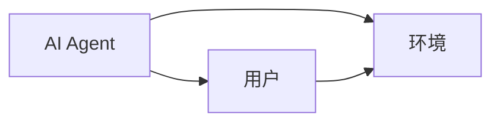
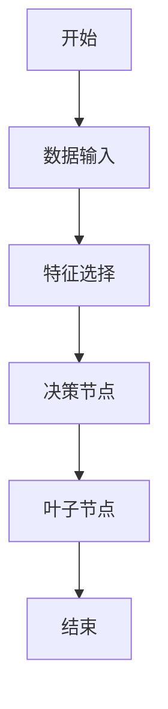
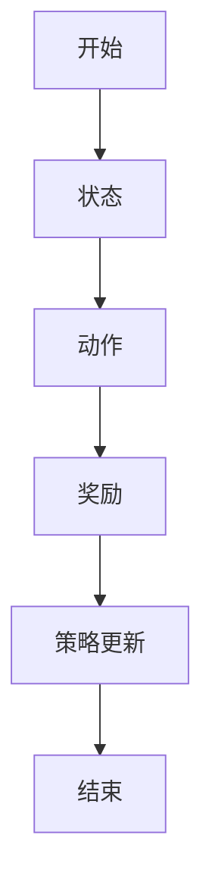
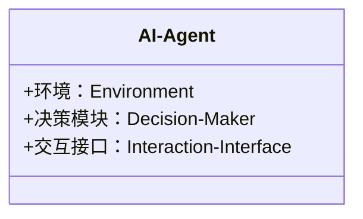
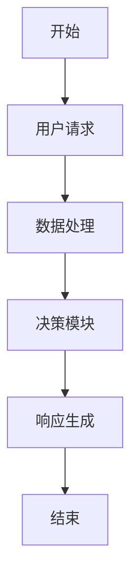
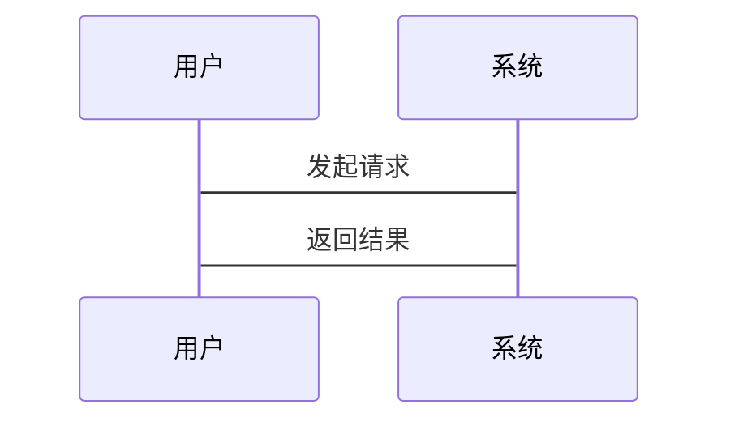

                 


# AI Agent开发中的法律合规与伦理考量

## 关键词：AI Agent, 法律合规, 伦理考量, 算法原理, 系统架构

## 摘要：本文深入探讨AI Agent开发中的法律合规与伦理问题，涵盖背景、核心概念、算法原理、系统架构、项目实战及最佳实践，分析法律与伦理在AI Agent设计中的重要性。

---

# 第1章 背景介绍

## 1.1 问题背景

### 1.1.1 AI Agent的定义与应用领域

AI Agent是一种智能体，能够感知环境并自主决策。常见于推荐系统、自动驾驶和机器人等领域。

### 1.1.2 当前AI Agent开发中的法律问题

数据隐私和责任划分是主要法律挑战。例如，自动驾驶中的责任归属尚未明确。

### 1.1.3 伦理问题的重要性

涉及隐私、透明度和公平性。例如，算法偏见可能导致歧视，需确保AI决策过程透明公正。

## 1.2 问题描述

AI Agent开发中需解决法律合规和伦理问题，确保产品合法、合乎道德。

## 1.3 问题解决

### 1.3.1 法律合规的解决方案

遵循数据隐私法规，如GDPR，明确责任划分。

### 1.3.2 伦理考量的应对策略

确保算法透明，避免偏见，保护用户隐私。

## 1.4 边界与外延

### 1.4.1 法律合规的边界

明确适用范围，避免过度合规或遗漏关键点。

### 1.4.2 伦理考量的外延

扩展至社会影响，如AI对就业的影响。

## 1.5 核心概念组成

### 1.5.1 AI Agent的基本构成

感知环境、自主决策、与环境交互。

### 1.5.2 法律与伦理的关系

法律是底线，伦理是理想，两者相辅相成。

---

# 第2章 核心概念与联系

## 2.1 核心概念原理

AI Agent通过感知和行动与环境互动，法律和伦理为其设定行为规范。

## 2.2 概念属性特征对比

| 概念 | 属性 | 特征 |
|------|------|------|
| AI Agent | 智能性 | 自主决策 |
| 法律合规 | 强制性 | 须遵守法规 |

## 2.3 ER实体关系图



---

# 第3章 算法原理讲解

## 3.1 AI Agent的算法流程

### 3.1.1 决策树算法



### 3.1.2 强化学习算法



## 3.2 算法实现代码

```python
import numpy as np

def decision_tree_algorithm(X, y):
    pass

def reinforcement_learning_algorithm(env):
    pass
```

## 3.3 数学模型与公式

### 3.3.1 决策树的分裂标准

$$ Gini指数 = \sum_{i=1}^{n} p_i (1 - p_i) $$

### 3.3.2 强化学习的Q-learning公式

$$ Q(s, a) = Q(s, a) + \alpha [r + \max Q(s', a') - Q(s, a)] $$

---

# 第4章 系统分析与架构设计

## 4.1 问题场景介绍

### 4.1.1 问题场景描述

设计一个AI Agent，需满足法律合规和伦理要求。

## 4.2 系统功能设计

### 4.2.1 领域模型设计



### 4.2.2 系统架构设计



### 4.2.3 接口设计与交互



---

# 第5章 项目实战

## 5.1 环境安装

安装Python和相关库，如TensorFlow和Pandas。

## 5.2 系统核心实现

### 5.2.1 核心代码实现

```python
class AI-Agent:
    def __init__(self):
        self.model = model

    def decide(self, input):
        return self.model.predict(input)
```

### 5.2.2 代码功能解读

AI-Agent类初始化模型，decide方法根据输入生成决策。

## 5.3 实际案例分析

案例：开发一个推荐系统，确保数据隐私和算法透明。

---

# 第6章 总结

## 6.1 最佳实践 tips

- 遵守法律，确保透明度。
- 定期伦理审查。
- 保持责任感。

## 6.2 小结

AI Agent开发中，法律和伦理是基石，需贯穿开发始终。

## 6.3 注意事项

- 避免算法偏见。
- 明确责任划分。

## 6.4 拓展阅读

推荐书籍：《人工智能：法律与伦理》。

---

# 作者：AI天才研究院

# 文章结束

