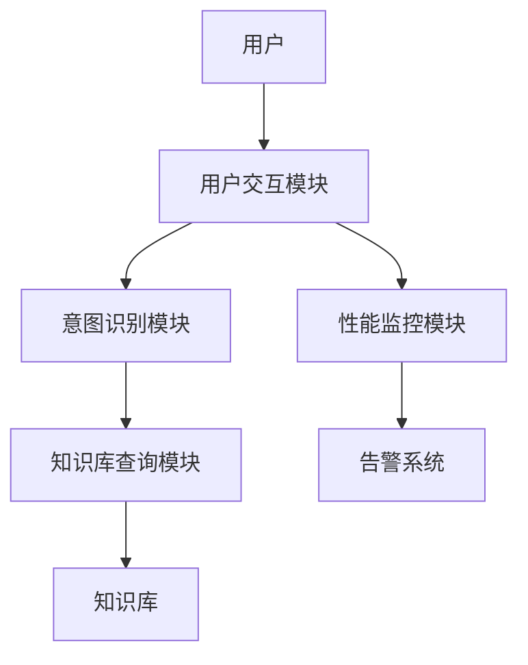
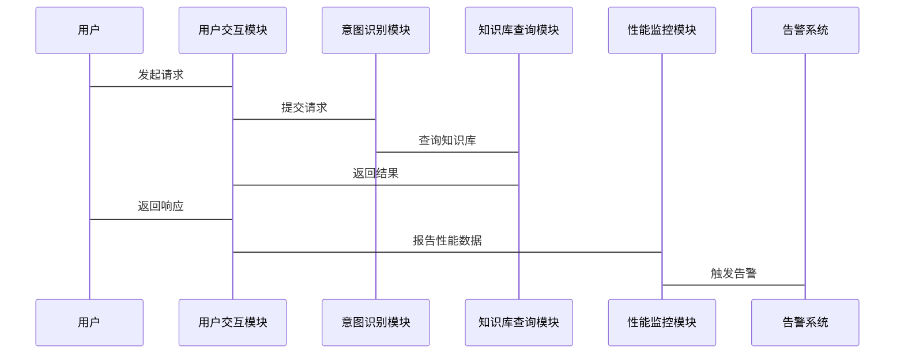

                 


# AI Agent性能优化：监控、分析与调优技巧

---

## 关键词：AI Agent，性能优化，监控，分析，调优技巧

---

## 摘要：

AI Agent（人工智能代理）作为人工智能领域的重要组成部分，广泛应用于自动驾驶、智能助手、机器人控制、游戏AI等领域。随着AI Agent的应用场景越来越复杂，其性能优化变得至关重要。本文从AI Agent的性能优化出发，详细探讨了监控、分析与调优的具体技巧。通过系统化的分析，本文不仅介绍了性能优化的基本概念和核心方法，还结合实际案例，深入分析了AI Agent在监控、分析和调优过程中的关键点，为读者提供了一套完整的优化方案。

---

## 第一部分：AI Agent性能优化基础

### 第1章：AI Agent概述

#### 1.1 AI Agent的基本概念

##### 1.1.1 什么是AI Agent
AI Agent（人工智能代理）是指能够感知环境、自主决策并执行任务的智能实体。它可以是一个软件程序，也可以是一个物理设备，通过传感器和执行器与环境交互。AI Agent的核心目标是通过感知和行动来实现特定任务，同时具备一定的智能性和适应性。

##### 1.1.2 AI Agent的核心特点
- **自主性**：能够在没有外部干预的情况下自主决策和行动。
- **反应性**：能够实时感知环境变化并做出响应。
- **目标导向**：所有行为都围绕实现特定目标展开。
- **学习能力**：通过经验或数据不断优化自身的性能。

##### 1.1.3 AI Agent与传统AI的区别
传统的AI（如专家系统）通常基于规则和逻辑推理，而AI Agent更强调与环境的动态交互和自主决策能力。AI Agent能够主动感知环境、调整策略，并在复杂环境中完成任务。

---

#### 1.2 AI Agent的分类与应用场景

##### 1.2.1 分类
AI Agent可以根据不同的标准进行分类：
- **按智能水平**：分为简单反应式Agent、基于模型的反应式Agent、目标导向Agent、效用导向Agent等。
- **按应用领域**：分为自动驾驶Agent、智能助手Agent、机器人控制Agent、游戏AI Agent等。
- **按决策方式**：分为基于规则的Agent、基于机器学习的Agent、基于强化学习的Agent等。

##### 1.2.2 应用场景
AI Agent的应用场景非常广泛，主要包括：
- **自动驾驶**：如自动驾驶汽车中的路径规划和避障系统。
- **智能助手**：如Siri、Alexa等智能语音助手。
- **机器人控制**：如工业机器人和家庭服务机器人。
- **游戏AI**：如游戏中的NPC行为控制和自动游戏代理。
- **智能推荐系统**：如电商平台的个性化推荐系统。

---

#### 1.3 AI Agent的性能优化背景

##### 1.3.1 优化的必要性
随着AI Agent应用场景的复杂化，其性能优化变得至关重要。例如，在自动驾驶中，任何性能瓶颈都可能导致决策延迟或错误，进而引发安全隐患。在智能推荐系统中，性能优化可以显著提升用户体验和系统响应速度。

##### 1.3.2 优化的目标与指标
- **优化目标**：提高AI Agent的运行效率、响应速度、决策准确性和资源利用率。
- **优化指标**：包括处理时间、响应延迟、资源消耗（如CPU、内存）、任务完成率、错误率等。

---

### 第2章：AI Agent性能优化的核心概念

#### 2.1 性能监控的基本原理

##### 2.1.1 监控指标的定义
性能监控的核心是通过收集和分析特定指标来评估AI Agent的性能。常见的监控指标包括：
- **响应时间**：AI Agent对请求的响应时间。
- **吞吐量**：单位时间内完成的任务数量。
- **资源使用率**：CPU、内存、GPU等资源的使用情况。
- **错误率**：任务执行过程中出现的错误数量。
- **延迟**：任务执行的时间差。

##### 2.1.2 监控工具的分类
常用的AI Agent性能监控工具包括：
- **日志分析工具**：如ELK（Elasticsearch、Logstash、Kibana）。
- **性能分析工具**：如JMeter、LoadRunner。
- **可视化工具**：如Prometheus、Grafana。
- **调试工具**：如Visual Studio、PyCharm的调试功能。

##### 2.1.3 监控数据的采集与处理
监控数据的采集可以通过日志文件、性能计数器、API调用等多种方式实现。采集的数据需要经过清洗、转换和存储，以便后续分析。常用的存储方式包括数据库存储和时序数据库（如InfluxDB）。

---

#### 2.2 性能分析的关键方法

##### 2.2.1 数据分析的基本流程
性能分析的基本流程包括数据采集、数据清洗、数据分析和结果可视化。数据分析的核心是通过统计分析、机器学习等方法，发现数据中的规律和异常点。

##### 2.2.2 性能瓶颈的定位方法
性能瓶颈的定位可以通过以下步骤实现：
1. **数据采集**：收集系统的运行数据。
2. **数据清洗**：去除无效数据，确保数据的准确性和完整性。
3. **数据分析**：通过统计分析或机器学习模型，发现系统的瓶颈。
4. **问题定位**：结合业务逻辑，定位具体的问题原因。

##### 2.2.3 性能优化的策略制定
在定位了性能瓶颈之后，需要制定具体的优化策略。例如，如果问题是由于算法效率低下导致的，可以通过优化算法或更换更高效的算法来解决问题。

---

#### 2.3 性能优化的数学模型

##### 2.3.1 数据采集模型
数据采集模型可以表示为：
$$
D = \{d_1, d_2, \ldots, d_n\}
$$
其中，$D$ 是数据集合，$d_i$ 是数据点。

##### 2.3.2 数据分析模型
数据分析模型可以通过回归分析、聚类分析等方法实现。例如，线性回归模型可以表示为：
$$
y = \beta_0 + \beta_1x + \epsilon
$$
其中，$y$ 是目标变量，$x$ 是自变量，$\beta_0$ 和 $\beta_1$ 是回归系数，$\epsilon$ 是误差项。

##### 2.3.3 数据可视化模型
数据可视化可以通过折线图、柱状图、散点图等方式实现。例如，使用折线图可以直观地展示系统的响应时间变化趋势。

---

### 第3章：AI Agent性能优化的算法原理

#### 3.1 常见的性能优化算法

##### 3.1.1 贪心算法
贪心算法是一种简单的优化算法，它通过逐个选择当前最优解，最终达到全局最优解。例如，在资源分配问题中，可以通过贪心算法优先分配资源给最重要的任务。

##### 3.1.2 分支限界算法
分支限界算法是一种用于解决组合优化问题的算法。它通过生成所有可能的分支，并对每个分支进行评估，选择最优的分支继续探索。

##### 3.1.3 动态规划算法
动态规划算法是一种通过将问题分解为子问题，并存储子问题的解来优化计算效率的算法。例如，在路径规划问题中，可以通过动态规划算法计算最优路径。

---

#### 3.2 算法的实现与优化

##### 3.2.1 算法实现的基本步骤
1. **问题建模**：将实际问题转化为数学模型。
2. **算法选择**：根据问题特点选择合适的算法。
3. **算法实现**：将算法转化为代码实现。
4. **算法优化**：通过优化算法的时间复杂度和空间复杂度，提升算法的性能。

##### 3.2.2 算法优化的关键点
- **时间复杂度**：通过减少计算次数或优化循环结构来降低时间复杂度。
- **空间复杂度**：通过减少内存占用或优化数据结构来降低空间复杂度。
- **并行计算**：通过并行计算加速算法的执行。

##### 3.2.3 算法复杂度分析
算法的复杂度可以通过大O符号表示。例如，线性搜索的时间复杂度为 $O(n)$，而二分搜索的时间复杂度为 $O(\log n)$。

---

### 第4章：AI Agent性能优化的系统架构设计

#### 4.1 问题场景介绍

##### 4.1.1 系统需求分析
假设我们正在开发一个智能客服AI Agent系统，其核心需求包括：
- **用户交互**：支持多轮对话。
- **意图识别**：准确识别用户的意图。
- **知识库查询**：快速检索知识库中的信息。
- **性能优化**：确保系统在高并发情况下的稳定性和响应速度。

##### 4.1.2 系统约束条件
- **资源限制**：系统运行在有限的计算资源上。
- **安全性要求**：用户数据必须加密存储和传输。
- **实时性要求**：系统必须在限定时间内响应用户请求。

##### 4.1.3 系统性能目标
- **响应时间**：小于2秒。
- **吞吐量**：每分钟处理至少100个请求。
- **错误率**：小于1%。

---

#### 4.2 系统架构设计

##### 4.2.1 系统功能模块划分
智能客服AI Agent系统可以划分为以下几个功能模块：
- **用户交互模块**：负责与用户的交互，包括接收输入和发送响应。
- **意图识别模块**：负责识别用户的意图。
- **知识库查询模块**：负责查询知识库中的信息。
- **性能监控模块**：负责监控系统的性能，并在出现异常时触发告警。

##### 4.2.2 系统架构图


##### 4.2.3 系统接口设计
系统接口设计包括：
- **用户交互接口**：提供API接口供用户调用。
- **知识库查询接口**：提供API接口供意图识别模块调用。
- **性能监控接口**：提供API接口供性能监控模块调用。

---

#### 4.3 系统交互设计

##### 4.3.1 系统交互流程


---

### 第5章：AI Agent性能优化的项目实战

#### 5.1 环境安装与配置

##### 5.1.1 开发环境搭建
假设我们使用Python和深度学习框架TensorFlow进行开发。开发环境的搭建步骤如下：
1. 安装Python和TensorFlow：
   ```bash
   pip install python tensorflow
   ```
2. 安装其他依赖库：
   ```bash
   pip install numpy pandas scikit-learn
   ```

##### 5.1.2 工具安装与配置
安装以下工具：
- **日志分析工具**：使用ELK（Elasticsearch、Logstash、Kibana）。
- **性能分析工具**：使用Profiling工具，如Pystack。
- **可视化工具**：使用Grafana。

##### 5.1.3 系统初始化
初始化系统配置文件，包括：
- **配置文件路径**：指定AI Agent的配置文件路径。
- **日志文件路径**：指定日志文件的存储路径。
- **性能监控参数**：配置性能监控的采样频率和监控指标。

---

#### 5.2 系统核心实现

##### 5.2.1 性能监控模块实现
实现性能监控模块的具体步骤如下：
1. **数据采集**：通过性能监控工具采集系统的运行数据。
2. **数据存储**：将采集到的数据存储到数据库中。
3. **数据分析**：通过数据分析工具分析数据，发现性能瓶颈。
4. **告警触发**：当性能指标超出预设阈值时，触发告警。

##### 5.2.2 性能分析模块实现
实现性能分析模块的具体步骤如下：
1. **数据清洗**：去除无效数据，确保数据的准确性和完整性。
2. **数据分析**：通过统计分析或机器学习模型分析数据，发现性能瓶颈。
3. **问题定位**：结合业务逻辑，定位具体的问题原因。

##### 5.2.3 性能优化模块实现
实现性能优化模块的具体步骤如下：
1. **优化策略制定**：根据性能分析结果制定优化策略。
2. **算法优化**：通过优化算法或更换更高效的算法来提升系统性能。
3. **系统调优**：通过调整系统参数或优化系统架构来提升系统性能。

---

#### 5.3 代码应用解读与分析

##### 5.3.1 性能监控模块代码示例
```python
import time
from psutil import cpu_percent, virtual_memory

def monitor_system_performance(interval=1):
    while True:
        current_time = time.strftime("%Y-%m-%d %H:%M:%S", time.localtime())
        cpu_usage = cpu_percent()
        memory_usage = virtual_memory().percent
        print(f"{current_time} | CPU Usage: {cpu_usage}% | Memory Usage: {memory_usage}%")
        time.sleep(interval)

if __name__ == "__main__":
    monitor_system_performance()
```

##### 5.3.2 性能分析模块代码示例
```python
import pandas as pd
from sklearn import linear_model

# 加载数据
data = pd.read_csv('performance_data.csv')

# 数据预处理
data = data.dropna()

# 训练线性回归模型
model = linear_model.LinearRegression()
model.fit(data[['CPU Usage', 'Memory Usage']], data['Response Time'])

# 预测性能
predicted_time = model.predict([[80, 80]])
print(f"预测的响应时间为：{predicted_time[0]}秒")
```

##### 5.3.3 性能优化模块代码示例
```python
import numpy as np

def optimize_algorithm(input_data):
    # 使用动态规划算法优化问题
    n = len(input_data)
    dp = np.zeros(n)
    dp[0] = input_data[0]
    for i in range(1, n):
        dp[i] = max(input_data[i], dp[i-1])
    return dp[-1]

if __name__ == "__main__":
    input_data = [1, 2, 3, 4, 5]
    print(optimize_algorithm(input_data))
```

---

## 第六部分：结论与展望

### 6.1 结论
本文从AI Agent的性能优化出发，详细探讨了监控、分析与调优的具体技巧。通过系统化的分析，我们不仅介绍了性能优化的基本概念和核心方法，还结合实际案例，深入分析了AI Agent在监控、分析和调优过程中的关键点，为读者提供了一套完整的优化方案。

### 6.2 展望
随着AI技术的不断发展，AI Agent的性能优化将面临更多的挑战和机遇。未来的研究方向可能包括：
- **更高效的算法设计**：开发更高效的算法，以应对更复杂的任务。
- **更智能的监控系统**：通过人工智能技术实现更智能的性能监控和预测。
- **更优化的系统架构**：设计更高效的系统架构，以提升系统的整体性能。

---

## 作者：AI天才研究院 & 禅与计算机程序设计艺术

---

通过这篇文章，读者可以系统地了解AI Agent性能优化的核心概念、监控方法、分析技巧和调优策略。无论是理论知识还是实际案例，都能为读者提供宝贵的参考和启示。

