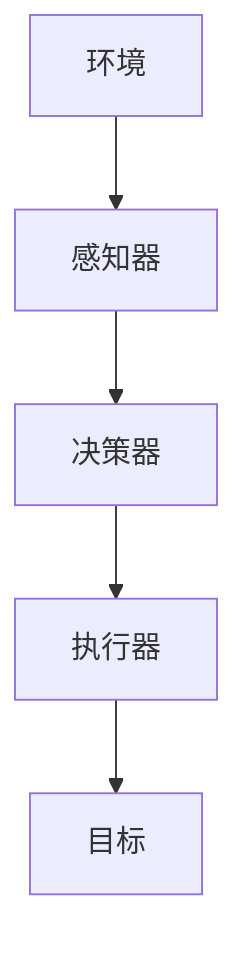
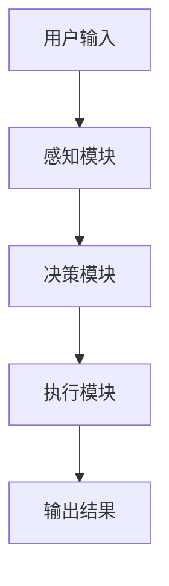
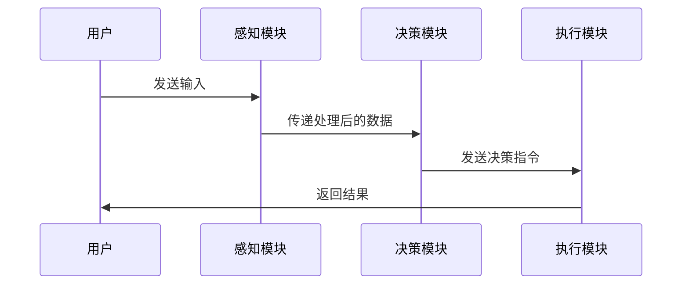

                 


# AI Agent架构设计：从概念到实现

> 关键词：AI Agent，架构设计，感知，决策，执行，数学模型

> 摘要：本文将从AI Agent的基本概念出发，逐步深入探讨其核心原理、算法实现、系统架构设计以及实际项目应用。通过详细分析感知、决策和执行模块的实现过程，结合具体代码示例和数学公式，帮助读者全面掌握AI Agent的架构设计方法。

---

## 第一部分: AI Agent的基本概念与背景

### 第1章: AI Agent的基本概念与背景

#### 1.1 AI Agent的定义与特点
AI Agent（智能体）是指能够感知环境、自主决策并执行任务的实体。其核心特点包括：
- **自主性**：能够在没有外部干预的情况下独立运作。
- **反应性**：能够实时感知环境并做出相应反应。
- **目标导向性**：所有行为都围绕实现特定目标展开。
- **学习能力**：通过经验改进自身的决策能力。

#### 1.2 AI Agent的应用场景
AI Agent广泛应用于多个领域，包括：
- **智能助手**：如Siri、Alexa等，通过语音交互帮助用户完成日常任务。
- **自动交易系统**：在金融市场中，AI Agent可以实时分析数据并执行交易。
- **智能推荐系统**：根据用户行为推荐个性化内容。

#### 1.3 AI Agent的发展历程
AI Agent的发展经历了以下几个阶段：
1. **简单智能体阶段**：基于规则的智能体，仅能处理简单任务。
2. **基于机器学习的智能体阶段**：引入机器学习技术，提升智能体的决策能力。
3. **大模型推动阶段**：借助大规模预训练模型（如GPT系列），AI Agent的感知和决策能力得到显著提升。
4. **当前趋势**：AI Agent逐渐向通用化、智能化方向发展。

---

## 第二部分: AI Agent的核心概念与联系

### 第2章: AI Agent的核心概念与联系

#### 2.1 AI Agent的感知、决策与执行
AI Agent的三大核心模块：
- **感知模块**：通过传感器或数据输入接口获取环境信息。
- **决策模块**：基于感知信息，结合目标和约束条件，生成决策方案。
- **执行模块**：将决策方案转化为具体行动，实现目标。

#### 2.2 AI Agent的类型与分类
AI Agent可以根据功能和能力分为以下几类：

| 类型         | 特性                           | 适用场景                     |
|--------------|--------------------------------|------------------------------|
| 反应式AI Agent | 基于当前环境信息做出反应       | 适用于实时性要求较高的场景     |
| 规划式AI Agent | 基于预设目标进行路径规划       | 适用于任务明确的复杂场景       |
| 学习式AI Agent | 通过学习提升决策能力           | 适用于需要长期优化的任务       |

#### 2.3 AI Agent的实体关系图


---

## 第三部分: AI Agent的算法原理

### 第3章: AI Agent的算法原理

#### 3.1 感知算法
感知算法负责从环境中获取信息并进行处理，常见的感知算法包括：
- **基于规则的感知算法**：通过预设规则提取特征。
- **基于机器学习的感知算法**：如支持向量机（SVM）、随机森林等。
- **基于深度学习的感知算法**：如卷积神经网络（CNN）和循环神经网络（RNN）。

#### 3.2 决策算法
决策算法基于感知信息生成最优决策，常用的决策算法包括：
- **基于规则的决策算法**：通过预设规则进行决策。
- **基于Q-learning的决策算法**：通过强化学习优化决策策略。
- **基于DQN（Deep Q-Network）的决策算法**：结合深度学习和强化学习，提升决策能力。

#### 3.3 执行算法
执行算法将决策转化为具体行动，常用的执行算法包括：
- **基于PID控制的执行算法**：通过比例-积分-微分控制实现精确调整。
- **基于强化学习的执行算法**：通过试错学习优化执行策略。
- **基于反馈机制的执行算法**：通过实时反馈调整执行行为。

---

## 第四部分: AI Agent的数学模型与公式

### 第4章: AI Agent的数学模型与公式

#### 4.1 感知模型
感知模型负责从环境中提取特征并进行分类，常用的数学模型包括：
- **感知器模型**：$$ y = \text{sign}(w \cdot x + b) $$
- **支持向量机（SVM）模型**：$$ y = \text{sign}(\sum_{i=1}^{n} \alpha_i y_i x_i \cdot x + b) $$
- **卷积神经网络（CNN）模型**：通过卷积层、池化层和全连接层提取特征并进行分类。

#### 4.2 决策模型
决策模型基于感知信息生成决策，常用的数学模型包括：
- **决策树模型**：通过信息熵或信息增益构建决策树。
- **Q-learning模型**：$$ Q(s, a) = r + \gamma \max_{a'} Q(s', a') $$
- **DQN模型**：通过深度神经网络近似Q值函数。

#### 4.3 执行模型
执行模型将决策转化为具体行动，常用的数学模型包括：
- **PID控制模型**：$$ u(t) = K_p e(t) + K_i \int_{0}^{t} e(\tau) d\tau + K_d \frac{d}{dt} e(t) $$
- **强化学习执行模型**：通过奖励函数优化执行策略。
- **反馈机制执行模型**：通过实时反馈调整执行行为。

---

## 第五部分: AI Agent的系统架构设计

### 第5章: AI Agent的系统架构设计

#### 5.1 问题场景介绍
以智能助手为例，AI Agent需要完成以下任务：
- 感知用户输入（语音或文本）。
- 根据输入生成相应的决策。
- 执行决策并返回结果。

#### 5.2 系统功能设计
系统功能模块包括：
- 感知模块：负责接收用户输入并进行初步处理。
- 决策模块：基于用户输入生成响应。
- 执行模块：将决策结果转化为具体行动。

#### 5.3 系统架构设计


#### 5.4 系统接口设计
系统接口设计包括：
- 用户与AI Agent之间的交互接口。
- 感知模块与决策模块之间的数据接口。
- 决策模块与执行模块之间的控制接口。

#### 5.5 系统交互流程图


---

## 第六部分: AI Agent的项目实战

### 第6章: AI Agent的项目实战

#### 6.1 环境安装
- 安装Python和必要的库：
  ```bash
  pip install numpy scikit-learn tensorflow
  ```

#### 6.2 系统核心实现
- 感知模块实现：
  ```python
  def感知器(input_data):
      # 处理输入数据并返回特征向量
      return feature_vector
  ```

- 决策模块实现：
  ```python
  def决策器(feature_vector):
      # 基于特征向量生成决策
      return decision
  ```

- 执行模块实现：
  ```python
  def执行器(decision):
      # 执行决策并返回结果
      return result
  ```

#### 6.3 代码应用解读与分析
- 感知模块代码示例：
  ```python
  import numpy as np
  from sklearn.svm import SVC

  def感知器(input_data):
      # 假设input_data是一个二维数组
      model = SVC()
      model.fit(X_train, y_train)
      return model.predict(input_data)
  ```

- 决策模块代码示例：
  ```python
  import numpy as np

  def决策器(feature_vector):
      # 假设feature_vector是一个一维数组
      X = np.array([feature_vector])
      y = model.predict(X)
      return y[0]
  ```

- 执行模块代码示例：
  ```python
  def执行器(decision):
      # 假设decision是一个标签
      print(f"输出结果：{decision}")
      return decision
  ```

#### 6.4 实际案例分析
以智能助手为例，用户输入“今天天气如何？”，AI Agent通过感知模块获取输入，决策模块生成响应“请提供您所在城市”，执行模块将响应返回给用户。

#### 6.5 项目小结
通过实际项目，我们验证了AI Agent架构设计的可行性，并掌握了感知、决策和执行模块的具体实现方法。

---

## 第七部分: AI Agent的最佳实践

### 第7章: AI Agent的最佳实践

#### 7.1 小结
- AI Agent的核心模块包括感知、决策和执行。
- 各模块之间需要高效协同，确保系统整体性能。

#### 7.2 注意事项
- **数据质量**：感知模块需要确保输入数据的准确性和完整性。
- **算法选择**：决策模块需要根据任务特点选择合适的算法。
- **执行效率**：执行模块需要确保行动的实时性和准确性。

#### 7.3 拓展阅读
- 推荐书籍：《机器学习实战》、《深度学习》。
- 推荐论文：Nature的DQN论文、imagenet的分类任务论文。

---

## 作者：AI天才研究院 & 禅与计算机程序设计艺术

---

通过以上内容，我们从概念到实现，全面探讨了AI Agent的架构设计。希望读者能够通过本文，掌握AI Agent的核心原理和实际应用方法。

