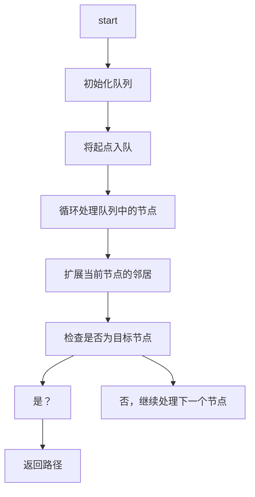
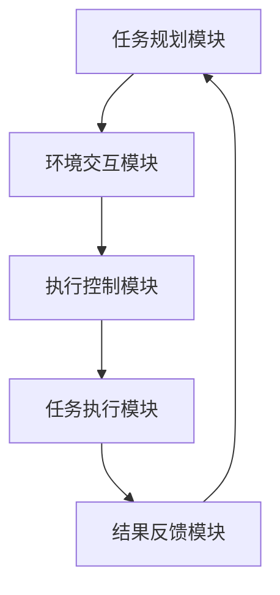
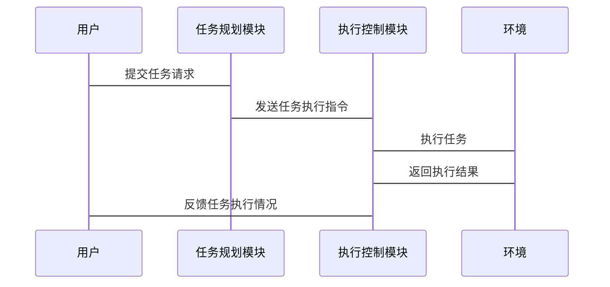

                 


# AI Agent的任务规划与执行框架

> 关键词：AI Agent, 任务规划, 执行框架, 算法原理, 系统设计, 项目实战

> 摘要：本文详细探讨了AI Agent的任务规划与执行框架，从核心概念到算法原理，再到系统设计和项目实战，全面剖析了AI Agent在任务规划中的应用。通过具体的案例分析和系统架构设计，深入讲解了AI Agent的任务规划与执行框架的实现过程，为读者提供了从理论到实践的完整指南。

---

## 第1章: 引言

### 1.1 AI Agent的基本概念

#### 1.1.1 AI Agent的定义
AI Agent（人工智能代理）是指能够感知环境、自主决策并执行任务的智能实体。AI Agent可以是软件程序、机器人或其他智能系统，其核心目标是通过感知和行动来优化任务执行的效果。

#### 1.1.2 任务规划的重要性
任务规划是AI Agent的核心功能之一，它决定了AI Agent如何在复杂环境中高效地完成目标。有效的任务规划能够帮助AI Agent在动态变化的环境中灵活调整策略，从而提高任务执行的成功率。

#### 1.1.3 任务规划的背景与问题描述
在实际应用中，AI Agent的任务规划面临许多挑战，例如环境的不确定性、任务的复杂性以及资源的限制等。本文将从理论和实践两个方面探讨如何设计和实现高效的AI Agent任务规划与执行框架。

---

## 第2章: AI Agent的任务规划框架

### 2.1 核心概念与原理

#### 2.1.1 状态空间与动作空间
- **状态空间**：表示AI Agent在某一时刻所处的所有可能状态的集合。
- **动作空间**：表示AI Agent在某一状态下可以执行的所有可能动作的集合。

#### 2.1.2 目标表示与约束条件
- **目标表示**：明确AI Agent需要完成的目标，通常以状态或动作的形式表示。
- **约束条件**：包括时间、资源、环境等限制条件，这些条件会影响任务规划的决策过程。

#### 2.1.3 环境模型与动态模型
- **环境模型**：描述AI Agent所处环境的结构和特性。
- **动态模型**：描述环境在AI Agent执行动作后的状态变化。

### 2.2 核心概念对比表

| 概念 | 定义 | 示例 |
|------|------|------|
| 状态空间 | 所有可能状态的集合 | {s1, s2, s3} |
| 动作空间 | 所有可能动作的集合 | {a1, a2, a3} |
| 目标表示 | 需要达到的状态或动作 | 目标状态s4 |
| 约束条件 | 任务执行的限制条件 | 时间限制、资源限制 |

### 2.3 ER实体关系图

```mermaid
er
    %% ER图：AI Agent任务规划的核心概念
    entity 状态空间 {
        分类: 状态
        属性: s1, s2, s3
    }
    entity 动作空间 {
        分类: 动作
        属性: a1, a2, a3
    }
    entity 目标表示 {
        分类: 目标
        属性: 目标状态
    }
    entity 约束条件 {
        分类: 限制条件
        属性: 时间限制, 资源限制
    }
    状态空间 --| 操作 |-- 动作空间
    状态空间 --| 属于 |-- 目标表示
    约束条件 --| 限制 |-- 状态空间
```

---

## 第3章: 任务规划的算法原理

### 3.1 常用算法介绍

#### 3.1.1 A*算法
A*算法是一种基于启发式搜索的最短路径算法，适用于静态或低动态性的环境。

**流程图：**

```mermaid
graph TD
    A[start] --> B[检查目标节点]
    B --> C[是？]
    C --> D[计算f(n)]
    D --> E[找到邻居节点]
    E --> F[计算g(n)和h(n)]
    F --> G[选择下一个扩展节点]
    G --> H[扩展节点]
    H --> I[重复直到找到目标节点]
```

**数学模型：**
- $$f(n) = g(n) + h(n)$$
  - $$g(n)$$：从起点到当前节点n的实际成本。
  - $$h(n)$$：从当前节点n到目标节点的估算成本。

#### 3.1.2 BFS算法
BFS算法是一种广度优先搜索算法，适用于无权图的最短路径问题。

**流程图：**



---

## 第4章: 系统分析与架构设计

### 4.1 项目介绍

#### 4.1.1 项目背景
本项目旨在设计一个AI Agent的任务规划与执行框架，能够支持多种任务场景的应用。

#### 4.1.2 系统功能设计
- **任务规划模块**：负责生成任务执行的详细步骤。
- **执行控制模块**：负责任务的执行和监控。
- **环境交互模块**：负责与外部环境进行信息交换。

### 4.2 系统架构设计



### 4.3 接口设计与交互流程

#### 4.3.1 接口设计
- **输入接口**：接收任务目标和环境信息。
- **输出接口**：输出任务执行的详细步骤和结果。

#### 4.3.2 交互流程


---

## 第5章: 项目实战

### 5.1 环境安装与配置

#### 5.1.1 环境需求
- Python 3.8+
- pip
- Mermaid CLI

#### 5.1.2 安装依赖
```bash
pip install mermaid-cli
```

### 5.2 核心实现代码

#### 5.2.1 A*算法实现
```python
import heapq

def a_star_search(graph, start, goal):
    open_set = {start}
    came_from = {}
    g_score = {node: float('inf') for node in graph.nodes}
    g_score[start] = 0
    f_score = {node: float('inf') for node in graph.nodes}
    f_score[start] = graph.heuristic(start, goal)

    while open_set:
        current = heapq.heappop(open_set, key=lambda x: f_score[x])
        if current == goal:
            break
        for neighbor in graph.neighbors(current):
            tentative_g_score = g_score[current] + graph.weight(current, neighbor)
            if tentative_g_score < g_score[neighbor]:
                came_from[neighbor] = current
                g_score[neighbor] = tentative_g_score
                f_score[neighbor] = g_score[neighbor] + graph.heuristic(neighbor, goal)
                heapq.heappush(open_set, neighbor)
    return came_from, g_score[goal]
```

### 5.3 案例分析与解读

#### 5.3.1 案例场景
假设有一个迷宫环境，AI Agent需要从起点到终点找到最短路径。

#### 5.3.2 代码实现
```python
class Graph:
    def __init__(self, nodes, edges):
        self.nodes = nodes
        self.edges = edges
        self.weights = {}

    def neighbors(self, node):
        return self.edges[node]

    def weight(self, node1, node2):
        return self.weights[(node1, node2)]

    def heuristic(self, node, goal):
        return 0  # 简单的启发函数，适用于测试

# 创建迷宫图
nodes = ['A', 'B', 'C', 'D', 'E']
edges = {
    'A': ['B', 'C'],
    'B': ['A', 'D'],
    'C': ['A', 'D', 'E'],
    'D': ['B', 'C', 'E'],
    'E': ['C', 'D']
}
graph = Graph(nodes, edges)

# 定义权重
graph.weights = {
    ('A', 'B'): 1,
    ('A', 'C'): 1,
    ('B', 'D'): 1,
    ('C', 'D'): 1,
    ('C', 'E'): 1,
    ('D', 'E'): 1,
}

start = 'A'
goal = 'E'

came_from, total_cost = a_star_search(graph, start, goal)
```

### 5.4 项目小结

---

## 第6章: 总结与展望

### 6.1 本文总结
本文详细探讨了AI Agent的任务规划与执行框架，从核心概念到算法原理，再到系统设计和项目实战，全面剖析了AI Agent在任务规划中的应用。

### 6.2 未来展望
未来的研究方向包括动态环境下的任务规划、多智能体协作任务规划、强化学习在任务规划中的应用等。

---

## 作者

作者：AI天才研究院/AI Genius Institute & 禅与计算机程序设计艺术 /Zen And The Art of Computer Programming

---

# 完

