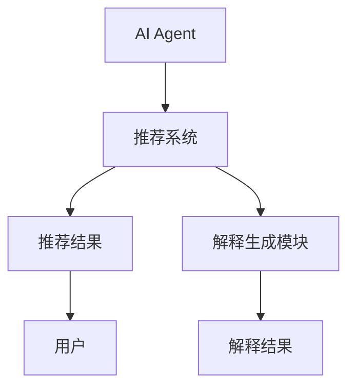
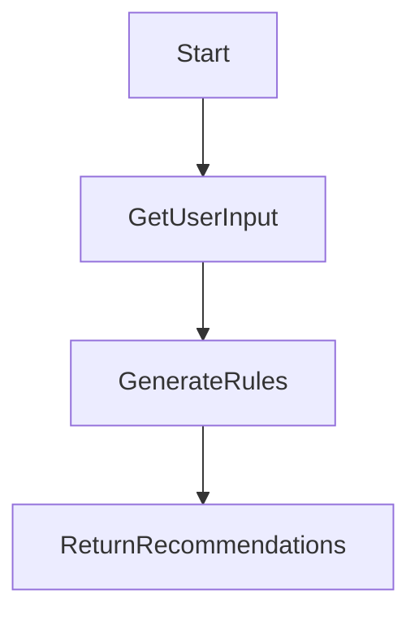
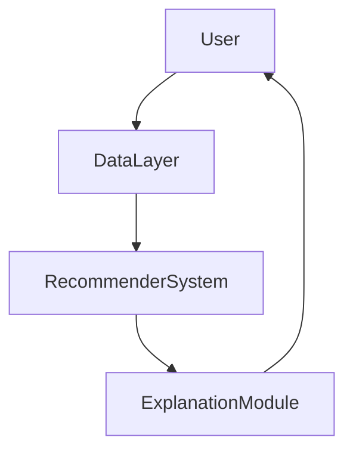

                 


# AI Agent的可解释推荐：提高LLM决策的透明度

> **关键词**：AI Agent，可解释推荐，LLM，决策透明度，推荐系统，算法原理

> **摘要**：本文深入探讨了AI Agent在可解释推荐中的作用，分析了提高LLM决策透明度的关键技术，包括核心概念、算法原理、系统设计和最佳实践。通过详细的技术分析和实际案例，本文为读者提供了全面的解决方案，帮助实现更透明、更可靠的推荐系统。

---

## 第1章：背景介绍

### 1.1 问题背景

AI Agent作为智能系统的核心组件，负责处理复杂决策任务。然而，现有推荐系统的决策过程往往缺乏透明度，导致用户信任缺失。例如，用户无法理解为何推荐系统会推荐特定产品或内容。

### 1.2 问题描述

推荐系统的不透明性主要体现在以下几个方面：
1. **缺乏解释性**：用户无法理解推荐结果的原因。
2. **信任缺失**：用户对推荐结果的公正性产生怀疑。
3. **难以调试**：开发者难以定位推荐错误的根本原因。

### 1.3 问题解决

为了提高透明度，我们需要实现可解释推荐：
1. **可解释性机制**：通过规则或模型生成可理解的解释。
2. **透明决策过程**：展示推荐背后的逻辑和数据支持。

### 1.4 边界与外延

- **边界**：仅关注推荐系统的可解释性，不涉及其他AI决策过程。
- **外延**：可扩展至其他需要透明决策的应用场景，如医疗诊断和金融投资。

---

## 第2章：核心概念与联系

### 2.1 核心概念

| 概念 | 描述 | 示例 |
|------|------|------|
| AI Agent | 具备自主决策能力的智能体 | 推荐系统中的个性化推荐算法 |
| 可解释推荐 | 推荐结果可被用户理解和验证 | 解释为何推荐某电影 |
| 解释生成机制 | 生成解释的方法 | 基于规则或概率的解释 |

### 2.2 实体关系图



---

## 第3章：推荐算法原理

### 3.1 基于规则的推荐

#### 3.1.1 工作原理



#### 3.1.2 代码实现

```python
def get_recommendations(user_input):
    rules = generate_rules(user_input)
    return apply_rules(rules)
```

---

## 第4章：数学模型与公式

### 4.1 矩阵分解

$$X = U \cdot V^T$$

其中：
- $X$：用户-物品评分矩阵
- $U$：用户嵌入矩阵
- $V$：物品嵌入矩阵

---

## 第5章：系统分析与架构设计

### 5.1 问题场景

一个电商推荐系统，用户点击和购买数据用于生成推荐。

### 5.2 系统架构



---

## 第6章：项目实战

### 6.1 环境安装

```bash
pip install numpy pandas scikit-learn
```

### 6.2 核心代码实现

```python
def preprocess_data(data):
    # 数据预处理
    pass

def train_model(data):
    # 模型训练
    pass

def generate_explanation(model, data):
    # 生成解释
    pass
```

---

## 第7章：最佳实践

### 7.1 实用建议

1. **平衡准确性与可解释性**：优先选择解释性更强的算法，即使准确率稍低。
2. **收集用户反馈**：定期收集用户对推荐结果的反馈，优化解释生成机制。
3. **监控模型性能**：持续监控推荐系统的性能，及时调整模型参数。

---

## 第8章：总结

本文详细探讨了AI Agent在可解释推荐中的应用，分析了算法原理和系统设计，并提供了实际案例和最佳实践。通过本文的学习，读者可以掌握提高LLM决策透明度的关键技术。

---

**作者：AI天才研究院/AI Genius Institute & 禅与计算机程序设计艺术 /Zen And The Art of Computer Programming**

---

**参考文献**：
1. "Explainable AI: The Model Cards Toolkit" by D. Gunning et al.
2. "Deep Learning" by Ian Goodfellow et al.

---

**索引**：
- AI Agent：第1章
- 可解释推荐：第2章
- 推荐系统：第3章
- 算法原理：第4章
- 系统设计：第5章
- 项目实战：第6章
- 最佳实践：第7章

