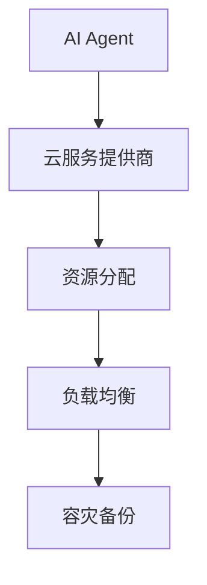

                 


# AI Agent的多云部署策略：提高可用性与灵活性

> 关键词：AI Agent, 多云部署, 可用性, 灵活性, 负载均衡, 容灾备份, 系统架构

> 摘要：随着AI技术的快速发展，AI Agent在多个云服务提供商之间的部署变得越来越重要。为了提高AI Agent的可用性和灵活性，多云部署策略成为关键。本文详细探讨了AI Agent的多云部署策略，包括核心概念、负载均衡算法、容灾备份策略、系统架构设计和项目实战等内容。通过这些策略，可以有效提升AI Agent在多云环境中的性能和可靠性。

---

# 目录

## 第1章: AI Agent与多云部署的背景

### 1.1 AI Agent的基本概念
- 1.1.1 AI Agent的定义与特点
- 1.1.2 AI Agent的核心功能与应用场景
- 1.1.3 多云部署的背景与趋势

### 1.2 多云部署的背景与挑战
- 1.2.1 多云部署的定义与特点
- 1.2.2 多云部署的驱动力与优势
- 1.2.3 多云部署的主要挑战

### 1.3 AI Agent与多云部署的结合
- 1.3.1 AI Agent在多云环境中的角色
- 1.3.2 多云部署对AI Agent性能的影响
- 1.3.3 提高可用性与灵活性的目标与意义

### 1.4 本章小结

## 第2章: 多云部署策略的核心概念

### 2.1 多云部署的分类与特点
- 2.1.1 按服务类型划分的多云部署
- 2.1.2 按资源分配方式划分的多云部署
- 2.1.3 按地理位置划分的多云部署

### 2.2 AI Agent的多云部署架构
- 2.2.1 分层架构设计
- 2.2.2 分布式架构设计
- 2.2.3 负载均衡与容灾备份机制

### 2.3 多云部署中的关键概念
- 2.3.1 负载均衡算法
- 2.3.2 容灾备份策略
- 2.3.3 跨云通信机制

### 2.4 核心概念对比表格
- 表2-1: 多云部署与单云部署对比

### 2.5 ER实体关系图
- 图2-1: 多云部署中的实体关系图（Mermaid）



## 第3章: 多云部署中的负载均衡算法

### 3.1 负载均衡算法的原理
- 3.1.1 基于轮询的负载均衡
- 3.1.2 基于随机的负载均衡
- 3.1.3 基于加权的负载均衡

### 3.2 负载均衡算法的实现
- 3.2.1 基于数学模型的负载均衡
- 3.2.2 基于动态调整的负载均衡
- 3.2.3 基于机器学习的负载均衡

### 3.3 负载均衡算法的比较
- 3.3.1 算法复杂度对比
- 3.3.2 算法性能对比
- 3.3.3 算法适用场景对比

### 3.4 负载均衡算法的数学模型
- 图3-1: 负载均衡算法流程图（Mermaid）

```mermaid
graph TD
    Start --> Check Load
    Check Load --> Choose Algorithm
    Choose Algorithm --> Distribute Load
    Distribute Load --> End
```

## 第4章: 多云部署中的容灾备份策略

### 4.1 容灾备份的原理
- 4.1.1 数据备份的实现
- 4.1.2 数据恢复的策略

### 4.2 容灾备份策略的实现
- 4.2.1 基于定期备份的容灾策略
- 4.2.2 基于增量备份的容灾策略
- 4.2.3 基于连续备份的容灾策略

### 4.3 容灾备份策略的比较
- 4.3.1 策略复杂度对比
- 4.3.2 策略性能对比
- 4.3.3 策略适用场景对比

### 4.4 容灾备份策略的数学模型
- 图4-1: 容灾备份策略流程图（Mermaid）

```mermaid
graph TD
    Start --> Check Failure
    Check Failure --> Trigger Backup
    Trigger Backup --> Restore Data
    Restore Data --> End
```

## 第5章: 系统架构与接口设计

### 5.1 系统架构设计
- 5.1.1 领域模型设计（Mermaid类图）
- 5.1.2 系统架构图（Mermaid架构图）

### 5.2 系统接口设计
- 5.2.1 接口功能描述
- 5.2.2 接口交互流程（Mermaid序列图）

## 第6章: 项目实战与代码实现

### 6.1 环境安装与配置
- 6.1.1 开发环境搭建
- 6.1.2 依赖库安装

### 6.2 核心代码实现
- 6.2.1 负载均衡算法的Python实现
- 6.2.2 容灾备份策略的Python实现

### 6.3 代码解读与分析
- 6.3.1 负载均衡算法的代码解读
- 6.3.2 容灾备份策略的代码解读

## 第7章: 总结与展望

### 7.1 本章总结
- 7.1.1 核心内容回顾
- 7.1.2 实践中的收获与体会

### 7.2 未来展望
- 7.2.1 多云部署的未来趋势
- 7.2.2 AI Agent技术的未来发展

### 7.3 最佳实践 tips
- 7.3.1 部署中的注意事项
- 7.3.2 系统优化建议

## 作者信息

作者：AI天才研究院（AI Genius Institute） & 禅与计算机程序设计艺术（Zen And The Art of Computer Programming）

---

通过以上目录，文章将系统地探讨AI Agent的多云部署策略，涵盖背景、核心概念、算法实现、系统设计和项目实战，帮助读者全面理解和掌握多云部署的关键技术。

