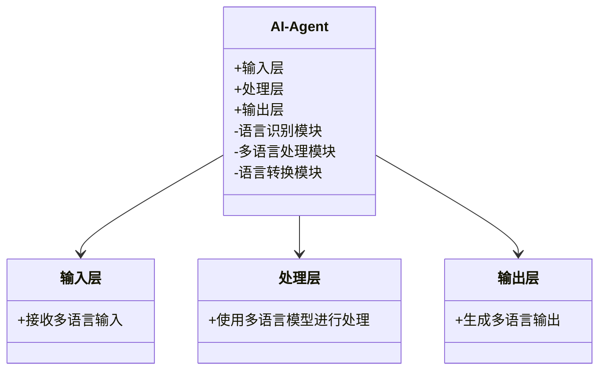
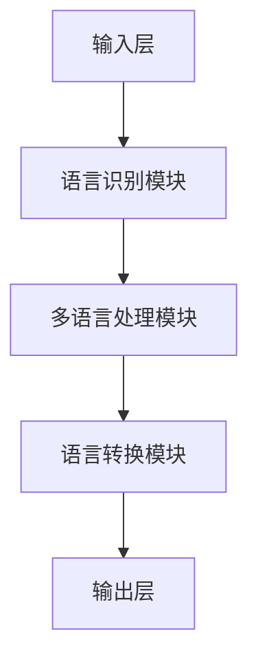
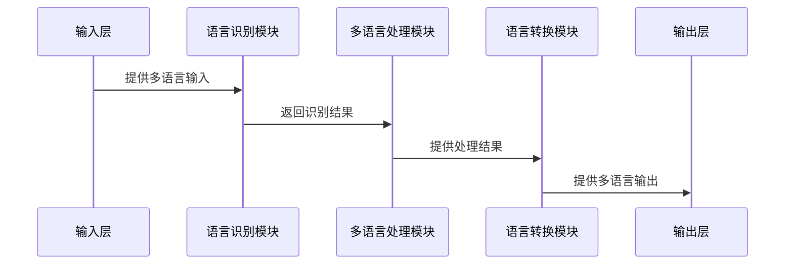

                 


# AI Agent的多语言支持：跨国企业应用策略

---

## 关键词：AI Agent，多语言支持，跨国企业，自然语言处理，系统架构，算法原理

---

## 摘要：  
AI Agent的多语言支持是跨国企业在智能化转型中面临的重要挑战之一。本文将从AI Agent的基本概念出发，深入探讨多语言支持的核心原理、算法实现、系统架构设计以及在跨国企业中的实际应用场景。通过结合技术原理和实际案例，本文旨在为跨国企业提供一套完整的多语言支持策略，帮助其在复杂的全球化背景下高效实现AI Agent的多语言能力。

---

# 第1章: AI Agent与多语言支持的背景介绍

## 1.1 AI Agent的基本概念  
### 1.1.1 AI Agent的定义与特点  
AI Agent（人工智能代理）是指能够感知环境、自主决策并执行任务的智能实体。其特点包括：  
- **自主性**：能够在没有外部干预的情况下独立运行。  
- **反应性**：能够实时感知环境并做出反应。  
- **目标导向性**：基于目标驱动行为。  
- **学习能力**：能够通过数据和经验不断优化自身性能。  

### 1.1.2 AI Agent的核心要素  
AI Agent的核心要素包括：  
- **感知模块**：用于获取环境信息（如语言输入）。  
- **决策模块**：基于感知信息做出决策。  
- **执行模块**：将决策转化为具体行动。  
- **学习模块**：通过数据优化性能。  

### 1.1.3 多语言支持在AI Agent中的重要性  
多语言支持是AI Agent在跨国企业中实现高效沟通和协作的关键能力。通过支持多种语言，AI Agent能够更好地满足跨国企业的全球化需求，提升用户体验和业务效率。

---

## 1.2 多语言支持的背景与应用  
### 1.2.1 全球化背景下AI Agent的需求  
随着跨国企业的全球化扩张，对AI Agent的多语言支持需求日益增长。企业需要AI Agent能够理解并处理多种语言的输入，以支持客户服务、业务沟通和数据处理。  

### 1.2.2 多语言支持的技术挑战  
多语言支持面临以下技术挑战：  
1. **语言差异**：不同语言的语法、语义差异较大，增加了模型训练的复杂性。  
2. **数据稀缺性**：某些语言的数据量较少，导致模型训练效果不佳。  
3. **计算资源需求**：多语言模型通常需要更多的计算资源。  

### 1.2.3 跨国企业对AI Agent多语言支持的需求  
跨国企业对AI Agent的多语言支持需求主要体现在以下方面：  
- **客户服务**：为全球客户提供本地化支持。  
- **业务协作**：支持跨国团队之间的多语言沟通。  
- **数据处理**：处理多语言的业务数据。  

---

## 1.3 跨国企业中的AI Agent应用场景  
### 1.3.1 客户服务与支持  
AI Agent可以通过多语言支持为全球客户提供7×24小时的客户服务，提升客户满意度。  

### 1.3.2 跨境业务处理  
AI Agent可以协助跨国企业处理跨境业务，例如跨国支付、订单管理等。  

### 1.3.3 跨文化沟通与协调  
AI Agent可以通过多语言支持促进跨国团队之间的跨文化沟通与协调，提升协作效率。  

---

## 1.4 本章小结  
本章从AI Agent的基本概念出发，探讨了多语言支持在跨国企业中的重要性，并分析了跨国企业中AI Agent的主要应用场景。接下来，我们将深入探讨AI Agent的多语言支持的核心原理和技术实现。

---

# 第2章: AI Agent与多语言支持的核心原理

## 2.1 AI Agent的多语言支持原理  
### 2.1.1 多语言支持的实现机制  
多语言支持的核心机制包括：  
1. **语言识别**：通过语言检测技术确定输入语言。  
2. **多语言模型**：使用支持多语言的NLP模型进行处理。  
3. **语言转换**：将输入语言转换为目标语言进行处理。  

### 2.1.2 多语言模型的训练与优化  
多语言模型的训练需要考虑以下因素：  
- **数据多样性**：使用多种语言的数据进行训练。  
- **模型共享**：通过共享参数减少模型复杂度。  
- **语言特征提取**：提取语言特征求改善模型性能。  

### 2.1.3 多语言支持的性能评估  
多语言支持的性能评估指标包括：  
- **准确率**：模型在多语言任务中的正确率。  
- **响应时间**：模型处理多语言任务的时延。  
- **语言覆盖范围**：模型支持的语言种类。  

---

## 2.2 多语言NLP模型的原理与特点  
### 2.2.1 多语言NLP模型的定义  
多语言NLP模型是指能够在多种语言之间共享参数的自然语言处理模型。  

### 2.2.2 多语言模型的训练方法  
多语言模型的训练方法包括：  
1. **多任务学习**：同时训练多种语言任务。  
2. **预训练模型**：使用大规模多语言数据进行预训练。  
3. **语言自适应**：针对特定语言进行微调。  

### 2.2.3 多语言模型的优缺点  
- **优点**：支持多种语言，减少模型训练成本。  
- **缺点**：模型在某些语言上的性能可能不如单语言模型。  

---

## 2.3 AI Agent中的多语言支持架构  
### 2.3.1 多语言支持的系统架构  
多语言支持的系统架构包括：  
- **输入层**：接收多语言输入。  
- **处理层**：使用多语言模型进行处理。  
- **输出层**：生成多语言输出。  

### 2.3.2 多语言支持的模块划分  
多语言支持模块包括：  
- **语言识别模块**：识别输入语言。  
- **多语言处理模块**：处理多语言任务。  
- **语言转换模块**：将结果转换为目标语言。  

### 2.3.3 多语言支持的接口设计  
多语言支持的接口设计需要考虑：  
- **输入格式**：支持多种语言的输入格式。  
- **输出格式**：支持多种语言的输出格式。  

---

## 2.4 本章小结  
本章从AI Agent的多语言支持原理出发，探讨了多语言NLP模型的训练与优化方法，并分析了多语言支持的系统架构设计。接下来，我们将深入探讨多语言NLP模型的算法实现。

---

# 第3章: 多语言NLP模型的算法实现

## 3.1 多语言NLP模型的训练流程  
### 3.1.1 数据预处理  
数据预处理包括：  
1. **数据清洗**：去除噪音数据。  
2. **数据标注**：为数据添加标签。  
3. **数据分割**：将数据划分为训练集、验证集和测试集。  

### 3.1.2 模型训练  
模型训练包括：  
1. **选择模型**：选择适合多语言任务的模型架构。  
2. **参数初始化**：初始化模型参数。  
3. **训练迭代**：通过反向传播优化模型参数。  

### 3.1.3 模型调优  
模型调优包括：  
1. **超参数优化**：通过网格搜索优化超参数。  
2. **模型评估**：通过验证集评估模型性能。  
3. **模型保存**：保存最优模型。  

---

## 3.2 多语言NLP模型的算法选择  
### 3.2.1 常见多语言NLP算法  
常见的多语言NLP算法包括：  
- **BERT**：支持多语言的预训练模型。  
- **XLM**：专为多语言任务设计的模型。  
- **Marian**：支持多语言机器翻译的模型。  

### 3.2.2 算法选择的依据  
算法选择的依据包括：  
- **任务需求**：根据具体任务选择适合的模型。  
- **计算资源**：考虑模型的计算复杂度。  
- **语言覆盖范围**：选择支持目标语言的模型。  

---

## 3.3 多语言NLP模型的数学公式  
### 3.3.1 模型训练的数学表达式  
模型训练的目标是最小化损失函数：  
$$ L = -\sum_{i=1}^{n} \log P(y_i|x_i) $$  

### 3.3.2 模型调优的数学模型  
模型调优可以通过优化器（如Adam）进行：  
$$ \theta_{t+1} = \theta_t - \eta \nabla_\theta L $$  

### 3.3.3 算法实现的代码示例  
以下是一个基于BERT的多语言模型训练代码示例：  
```python
from transformers import AutoTokenizer, AutoModelForMaskedLM
from torch import nn

model_name = "bert-base-multilingual-cased"
tokenizer = AutoTokenizer.from_pretrained(model_name)
model = AutoModelForMaskedLM.from_pretrained(model_name)
optimizer = torch.optim.Adam(model.parameters(), lr=1e-5)
criterion = nn.CrossEntropyLoss()

for epoch in range(num_epochs):
    for batch in dataloader:
        inputs = tokenizer(batch.text, padding=True, truncation=True, return_tensors="pt")
        labels = inputs.input_ids.clone().detach()
        labels[labels == tokenizer.mask_token_id] = -100
        outputs = model(**inputs)
        loss = criterion(outputs.logits, labels)
        loss.backward()
        optimizer.step()
```

---

## 3.4 本章小结  
本章详细探讨了多语言NLP模型的训练流程和算法实现，并通过代码示例展示了模型的实现过程。接下来，我们将从系统架构设计的角度进一步探讨AI Agent的多语言支持实现。

---

# 第4章: 跨国企业AI Agent系统的架构设计

## 4.1 系统功能设计  
### 4.1.1 系统功能模块划分  
系统功能模块包括：  
- **语言识别模块**：识别输入语言。  
- **多语言处理模块**：处理多语言任务。  
- **语言转换模块**：将结果转换为目标语言。  

### 4.1.2 系统功能的交互流程  
系统功能的交互流程包括：  
1. **输入接收**：接收多语言输入。  
2. **语言识别**：识别输入语言。  
3. **任务处理**：使用多语言模型处理任务。  
4. **结果转换**：将结果转换为目标语言。  
5. **输出生成**：生成多语言输出。  

---

## 4.2 系统架构设计  
### 4.2.1 领域模型的Mermaid类图  


### 4.2.2 系统架构的Mermaid架构图  


### 4.2.3 系统接口与交互的Mermaid序列图  


---

## 4.3 本章小结  
本章从系统架构设计的角度，探讨了AI Agent的多语言支持实现。通过领域模型、架构图和序列图，我们详细展示了系统各模块的功能和交互流程。接下来，我们将通过项目实战进一步验证和优化系统设计。

---

# 第5章: 项目实战——AI Agent多语言支持的实现

## 5.1 环境安装  
### 5.1.1 安装Python与相关库  
安装Python和以下库：  
- `transformers`：用于加载多语言模型。  
- `torch`：用于模型训练。  
- `mermaid`：用于绘制图表。  

### 5.1.2 安装步骤  
1. 安装Python：`python --version`  
2. 安装库：`pip install transformers torch mermaid`  

---

## 5.2 系统核心功能实现  
### 5.2.1 语言识别模块  
代码实现：  
```python
from transformers import AutoTokenizer

model_name = "bert-base-multilingual-cased"
tokenizer = AutoTokenizer.from_pretrained(model_name)

def detect_language(text):
    inputs = tokenizer(text, return_tensors="pt")
    outputs = model(**inputs)
    # 实现语言检测逻辑
    return detected_language
```

### 5.2.2 多语言处理模块  
代码实现：  
```python
from transformers import AutoModelForMaskedLM

model_name = "bert-base-multilingual-cased"
model = AutoModelForMaskedLM.from_pretrained(model_name)

def process_task(text, target_language):
    inputs = tokenizer(text, padding=True, truncation=True, return_tensors="pt")
    outputs = model(**inputs)
    processed_result = outputs logits.argmax(dim=-1)
    return processed_result
```

### 5.2.3 语言转换模块  
代码实现：  
```python
from transformers import AutoTokenizer, AutoModelForSeq2Seq

model_name = "facebook/m2m-large-4m"
tokenizer = AutoTokenizer.from_pretrained(model_name)
model = AutoModelForSeq2Seq.from_pretrained(model_name)

def translate_to_target_language(text, target_language):
    inputs = tokenizer(text, return_tensors="pt")
    outputs = model.generate(**inputs)
    translated_text = tokenizer.decode(outputs[0], skip_special_tokens=True)
    return translated_text
```

---

## 5.3 代码应用解读与分析  
### 5.3.1 语言识别模块解读  
语言识别模块通过多语言模型检测输入文本的语言，并返回检测结果。  

### 5.3.2 多语言处理模块解读  
多语言处理模块使用预训练的多语言模型处理输入文本，并生成处理结果。  

### 5.3.3 语言转换模块解读  
语言转换模块将处理结果转换为目标语言，并返回目标语言的文本。  

---

## 5.4 实际案例分析  
### 5.4.1 案例背景  
假设跨国企业需要将客户反馈的多种语言文本进行分析和翻译。  

### 5.4.2 案例实现  
1. 语言识别模块检测输入文本的语言。  
2. 多语言处理模块分析文本内容。  
3. 语言转换模块将分析结果转换为目标语言。  

### 5.4.3 案例结果  
输出目标语言的分析结果，满足客户需求。  

---

## 5.5 本章小结  
本章通过项目实战，详细展示了AI Agent多语言支持的实现过程，包括环境安装、核心功能实现和实际案例分析。接下来，我们将总结最佳实践，并提出注意事项和未来的研究方向。

---

# 第6章: 最佳实践、小结、注意事项与拓展阅读

## 6.1 最佳实践  
1. **选择合适的多语言模型**：根据任务需求选择适合的多语言模型。  
2. **优化系统架构**：确保系统架构的可扩展性和可维护性。  
3. **数据质量管理**：保证训练数据的质量和多样性。  
4. **模型调优**：通过超参数优化和模型微调提升性能。  

## 6.2 本章小结  
本文从AI Agent的多语言支持背景出发，深入探讨了其核心原理、算法实现和系统架构设计，并通过项目实战展示了其实现过程。通过本文的分析和实践，读者可以全面了解AI Agent的多语言支持技术，并能够在跨国企业中进行实际应用。

## 6.3 注意事项  
1. **数据隐私与安全**：跨国企业需要关注数据隐私和安全问题。  
2. **模型性能监控**：需要实时监控模型的性能，及时优化。  
3. **多语言支持的边界**：明确多语言支持的边界和限制。  

## 6.4 拓展阅读  
1. **多语言NLP模型的研究进展**：阅读相关学术论文，了解最新研究成果。  
2. **AI Agent的前沿技术**：关注AI Agent领域的最新技术动态。  
3. **系统架构设计的优化**：学习更多系统架构设计的优化方法。

---

# 作者：AI天才研究院/AI Genius Institute & 禅与计算机程序设计艺术 /Zen And The Art of Computer Programming

