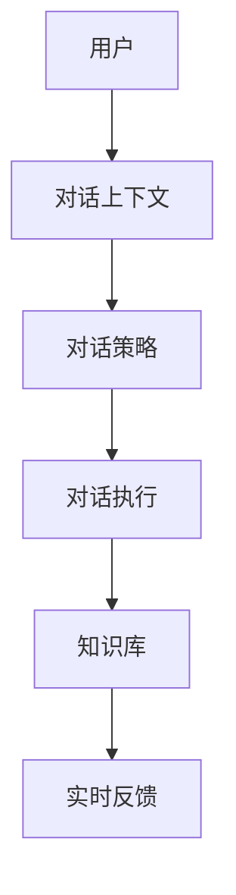
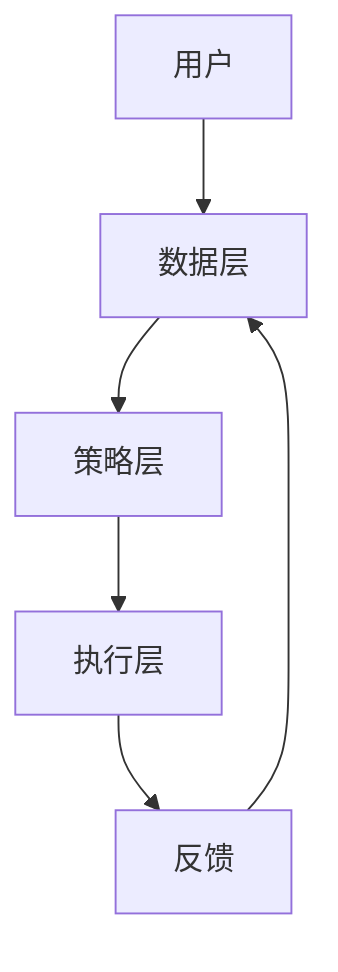
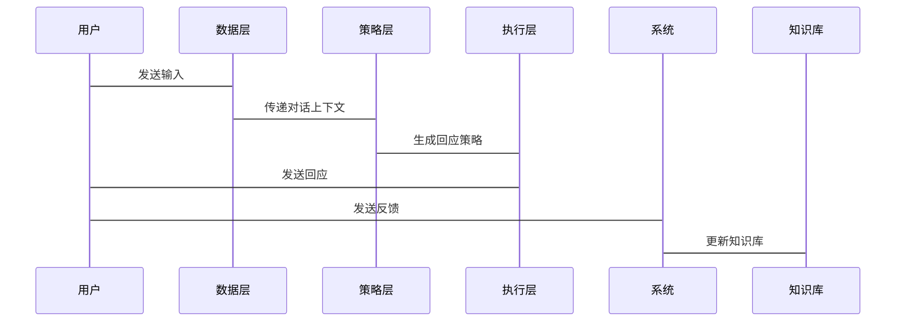

                 


# AI Agent的实时自适应对话管理系统

## 关键词：AI Agent，实时自适应对话管理，自然语言处理，强化学习，对话系统架构

## 摘要：  
本文详细探讨了AI Agent的实时自适应对话管理系统的构建与实现，从背景、核心概念、算法原理到系统架构，再到项目实战和最佳实践，系统性地剖析了该领域的关键技术和实现细节。通过深入分析对话管理系统的实时性和自适应性，结合强化学习算法和系统架构设计，为读者提供了一个全面的技术视角。

---

# 第1章: AI Agent与实时自适应对话管理概述

## 1.1 AI Agent的基本概念

### 1.1.1 AI Agent的定义与特点  
AI Agent（智能体）是指能够感知环境并采取行动以实现目标的实体。在对话系统中，AI Agent通常表现为一个可以与用户交互的智能体，其特点包括：  
- **自主性**：能够在没有外部干预的情况下独立运行。  
- **反应性**：能够实时感知输入并做出响应。  
- **学习能力**：通过与用户的交互不断优化自身的对话策略。  

### 1.1.2 对话管理的核心问题  
对话管理是AI Agent实现人机交互的核心技术，其主要问题包括：  
1. 如何理解用户的输入并生成合适的回应。  
2. 如何根据对话上下文动态调整对话策略。  
3. 如何处理对话中的不确定性与歧义性。  

### 1.1.3 实时自适应对话管理的必要性  
在实时对话中，用户的行为和需求可能随时变化，因此对话系统需要具备快速响应和动态调整的能力。实时自适应对话管理能够显著提升用户体验，降低对话失败率。

---

## 1.2 实时自适应对话管理的背景

### 1.2.1 当前对话系统的主要挑战  
当前的对话系统在实现实时自适应对话管理时面临以下挑战：  
- 对话模型的实时性要求高，需要快速处理输入并生成响应。  
- 对话策略需要动态调整，以应对用户的实时反馈。  
- 知识库的动态更新能力不足，难以应对实时变化的需求。  

### 1.2.2 自适应对话管理的需求场景  
自适应对话管理适用于多种场景，例如：  
- 智能客服：实时解决用户问题并动态调整回应策略。  
- 智能助手：根据用户行为变化实时调整交互方式。  
- 在线教育：根据学生反馈实时调整教学策略。  

### 1.2.3 实时性对对话系统的影响  
实时性是对话系统的核心要求之一，直接影响用户体验。实时自适应对话管理能够确保系统在毫秒级别内响应用户输入，并根据反馈动态调整策略。

---

## 1.3 本章小结  
本章介绍了AI Agent的基本概念和对话管理的核心问题，重点分析了实时自适应对话管理的必要性和背景。通过理解这些内容，读者可以更好地把握后续章节的核心思想。

---

# 第2章: 对话管理系统的核心概念与联系

## 2.1 对话管理系统的构成要素

### 2.1.1 对话上下文  
对话上下文是指对话过程中积累的信息，包括用户的历史输入、系统已生成的回应等。它是对话管理的基础，决定了系统如何生成后续回应。

### 2.1.2 对话策略  
对话策略是系统在给定对话上下文时选择最佳回应的规则。它通常基于强化学习或监督学习等技术实现。

### 2.1.3 对话执行  
对话执行是系统根据对话策略生成具体回应的过程。它是对话管理的最终输出环节。

---

## 2.2 实时自适应对话管理的核心要素

### 2.2.1 实时性  
实时性是指系统能够在极短时间内响应用户输入并生成回应的能力。它是实现流畅对话的基础。

### 2.2.2 自适应性  
自适应性是指系统能够根据对话过程中的反馈动态调整对话策略的能力。它是提升用户体验的关键。

### 2.2.3 知识库的动态更新  
知识库是对话系统的重要组成部分，实时自适应对话管理需要知识库能够动态更新，以应对用户的实时需求。

---

## 2.3 对话管理系统的实体关系图



---

## 2.4 本章小结  
本章详细介绍了对话管理系统的构成要素和实时自适应对话管理的核心要素，并通过实体关系图展示了各部分之间的关系。这些内容为后续章节的算法设计和系统实现奠定了基础。

---

# 第3章: 对话管理系统的算法原理

## 3.1 基于强化学习的对话策略优化

### 3.1.1 强化学习的基本原理  
强化学习是一种通过试错方法来优化策略的技术。系统通过与环境交互，不断调整动作以最大化累积奖励。

### 3.1.2 对话策略的强化学习模型  
在对话系统中，强化学习用于优化对话策略。模型通过与用户的交互，不断调整回应策略以提高对话的成功率。

### 3.1.3 奖励函数的设计与实现  
奖励函数是强化学习的核心，用于衡量对话策略的好坏。常见的奖励函数设计包括基于对话长度、用户满意度等指标。

---

## 3.2 对话管理系统的数学模型

### 3.2.1 对话状态表示  
对话状态通常用向量表示，包括用户输入、历史记录等信息。数学表达式如下：  
$$ s_t = (x_t, h_t) $$  
其中，$s_t$ 表示第 $t$ 步的对话状态，$x_t$ 是用户输入，$h_t$ 是历史记录。

### 3.2.2 对话动作选择  
基于强化学习的策略网络生成动作：  
$$ a_t = \arg\max_\theta \pi_\theta(s_t) $$  
其中，$\pi_\theta$ 是策略函数，$\theta$ 是模型参数。

### 3.2.3 对话目标函数  
目标函数用于优化策略，通常采用折扣累积奖励的形式：  
$$ J(\theta) = \sum_{t=1}^{T} \gamma^{t} r_t(\theta) $$  
其中，$\gamma$ 是折扣因子，$r_t$ 是第 $t$ 步的奖励。

---

## 3.3 算法实现代码示例

```python
def reinforce_learning_policy(state):
    # 状态转换为动作
    action = model.predict(state)
    return action
```

---

## 3.4 本章小结  
本章详细介绍了基于强化学习的对话策略优化算法，并通过数学公式和代码示例展示了算法的实现过程。这些内容为后续章节的系统实现提供了理论基础。

---

# 第4章: 对话管理系统的系统架构与设计

## 4.1 系统架构概述

### 4.1.1 分层架构设计  
系统采用分层架构，包括数据层、策略层和执行层。数据层负责存储和管理知识库，策略层负责生成对话策略，执行层负责生成具体回应。

### 4.1.2 组件间的交互关系  
组件间的交互关系如下：  
1. 用户输入经过数据层处理后传递给策略层。  
2. 策略层根据对话上下文生成回应策略。  
3. 执行层根据策略生成具体回应。  
4. 系统根据用户反馈更新知识库。

### 4.1.3 系统的可扩展性设计  
系统设计注重模块化和可扩展性，便于后续功能的扩展和优化。

---

## 4.2 系统功能设计

### 4.2.1 对话上下文的实时更新  
对话上下文需要实时更新，确保系统能够根据最新的信息生成回应。

### 4.2.2 对话策略的动态调整  
对话策略需要根据用户反馈动态调整，以提高对话的成功率。

### 4.2.3 知识库的动态更新  
知识库需要实时更新，确保系统能够应对用户的实时需求。

---

## 4.3 系统架构图



---

## 4.4 系统接口设计

### 4.4.1 用户接口  
用户接口是系统与用户交互的界面，支持文本输入和输出。

### 4.4.2 知识库接口  
知识库接口负责与知识库的交互，支持数据的存储和查询。

### 4.4.3 反馈接口  
反馈接口负责收集用户的反馈信息，并传递给策略层。

---

## 4.5 系统交互流程图



---

## 4.6 本章小结  
本章详细介绍了对话管理系统的系统架构与设计，包括分层架构、组件交互关系和系统接口设计等内容。通过这些设计，系统能够实现实时自适应对话管理。

---

# 第5章: 项目实战——构建实时自适应对话管理系统

## 5.1 环境安装与配置

### 5.1.1 安装Python环境  
安装Python 3.8及以上版本，并配置好开发环境。

### 5.1.2 安装依赖库  
安装所需的依赖库，如TensorFlow、Keras等。

```bash
pip install tensorflow keras numpy
```

---

## 5.2 核心代码实现

### 5.2.1 对话上下文处理  
处理用户输入并生成对话上下文。

```python
def process_input(user_input, context):
    # 更新对话上下文
    context['history'].append(user_input)
    return context
```

### 5.2.2 对话策略优化  
基于强化学习优化对话策略。

```python
def reinforce_learning_policy(state):
    # 状态转换为动作
    action = model.predict(state)
    return action
```

### 5.2.3 对话执行  
根据策略生成具体回应。

```python
def generate_response(action, context):
    # 根据动作生成回应
    response = action_to_response[action]
    return response
```

---

## 5.3 实际案例分析

### 5.3.1 案例背景  
假设用户正在与系统讨论一个技术问题，系统需要实时调整对话策略以更好地理解用户需求。

### 5.3.2 对话过程  
1. 用户输入：“我需要帮助调试我的Python代码。”  
2. 系统生成回应：“请提供您的代码，我将帮助您调试。”  
3. 用户输入代码，系统分析后生成新的回应：“您的代码存在以下问题：……”

---

## 5.4 代码解读与分析  
通过对核心代码的解读，分析系统的实现细节和优化点。

---

## 5.5 本章小结  
本章通过实际案例分析和代码实现，展示了如何构建一个实时自适应对话管理系统。读者可以参考这些代码和案例，快速实现类似的系统。

---

# 第6章: 最佳实践与注意事项

## 6.1 最佳实践 tips

### 6.1.1 数据预处理  
确保对话数据的高质量，包括去除噪声和冗余信息。

### 6.1.2 模型调优  
通过交叉验证和超参数优化提升模型性能。

### 6.1.3 性能优化  
优化系统的实时响应速度，可以通过并行计算和缓存技术实现。

---

## 6.2 注意事项

### 6.2.1 数据隐私与安全  
确保用户数据的隐私和安全，避免数据泄露。

### 6.2.2 系统稳定性  
确保系统的稳定性，避免因意外情况导致服务中断。

### 6.2.3 用户体验  
注重用户体验设计，确保系统的易用性和交互性。

---

## 6.3 本章小结  
本章总结了构建实时自适应对话管理系统的最佳实践和注意事项，帮助读者在实际应用中避免常见问题。

---

# 结语

通过本文的详细讲解，读者可以全面了解AI Agent的实时自适应对话管理系统的构建与实现。从理论到实践，从算法到系统设计，本文为读者提供了一个完整的视角。未来，随着技术的不断发展，实时自适应对话管理系统将更加智能化和个性化，为人类带来更高效、更自然的交互体验。

---

# 作者：AI天才研究院/AI Genius Institute & 禅与计算机程序设计艺术 /Zen And The Art of Computer Programming

