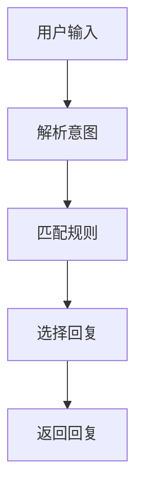
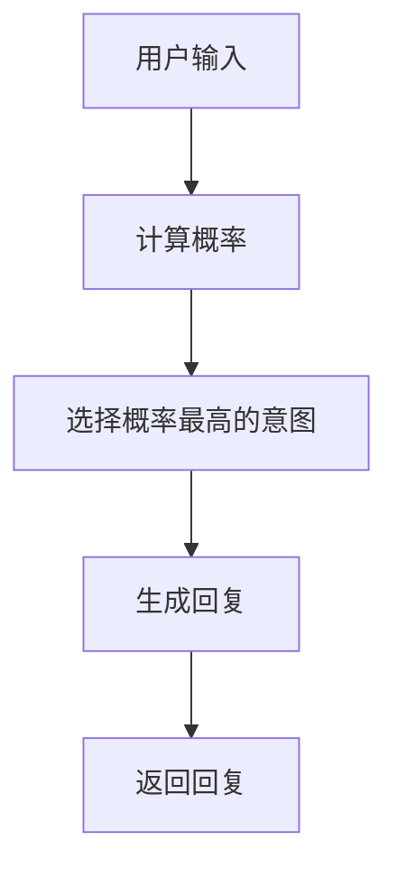
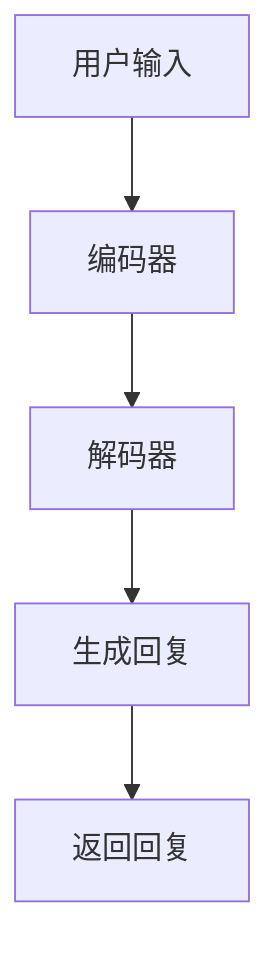
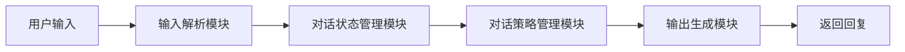
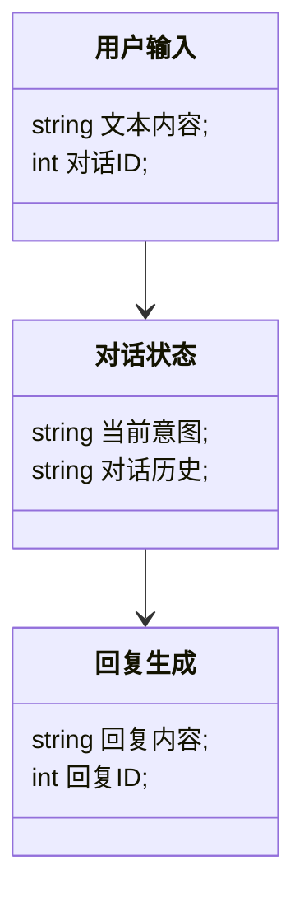
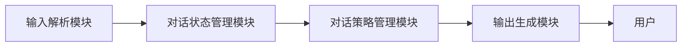
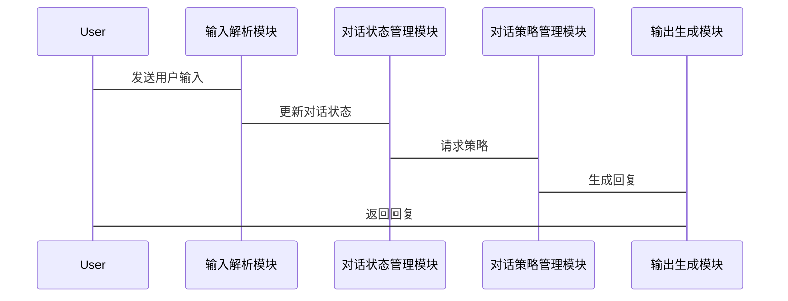

                 

# AI Agent的对话管理策略与实现

> 关键词：AI Agent、对话管理、自然语言处理、深度学习、系统架构

> 摘要：本文详细探讨了AI Agent的对话管理策略与实现，从基础概念到算法原理，再到系统架构与项目实战，全面解析对话管理的核心技术与实现方法。

---

## 第一章: AI Agent与对话管理概述

### 1.1 AI Agent的基本概念

AI Agent（人工智能代理）是一种能够感知环境、自主决策并执行任务的智能实体。它通过与用户或环境的交互，实现特定目标，例如信息检索、任务执行或情感交流。AI Agent的核心特点包括：

- **自主性**：能够自主决策，无需外部干预。
- **反应性**：能够实时感知环境并做出反应。
- **社会性**：能够与人类或其他Agent进行交互。
- **学习能力**：能够通过经验改进自身行为。

AI Agent的应用场景广泛，包括智能助手、智能客服、自动驾驶、智能家居等。

### 1.2 对话管理在AI Agent中的作用

对话管理是AI Agent实现人机交互的核心技术，负责理解用户意图、生成回复、维护对话状态，并引导对话走向预期目标。对话管理确保了AI Agent能够自然流畅地与用户交流，提升用户体验。

### 1.3 对话管理的核心挑战

对话管理面临以下核心挑战：

- **语义理解**：如何准确理解用户的意图。
- **上下文管理**：如何维护对话的上下文信息。
- **多轮对话**：如何处理复杂且多轮的对话流程。
- **个性化交互**：如何实现个性化和自然的对话风格。

### 1.4 对话管理的未来发展方向

随着技术的进步，对话管理将朝着以下方向发展：

- **多模态交互**：结合视觉、听觉等多种交互方式。
- **个性化服务**：基于用户画像提供定制化服务。
- **自适应学习**：通过持续学习优化对话策略。

---

## 第二章: 对话管理的背景与核心概念

### 2.1 对话管理的背景介绍

对话管理技术源于自然语言处理（NLP）和人工智能领域。随着NLP技术的进步，对话系统从基于规则的传统方法逐步发展到基于深度学习的智能对话系统。

### 2.2 对话管理的核心概念

#### 对话系统的分类

对话系统可以分为以下几类：

- **基于规则的对话系统**：通过预定义的规则实现对话管理。
- **基于统计的对话系统**：利用统计模型进行对话管理。
- **基于深度学习的对话系统**：使用深度学习模型（如Transformer）实现对话管理。

#### 对话管理的模块划分

对话管理系统通常包括以下几个模块：

- **自然语言理解（NLU）**：理解用户输入的意图和实体。
- **对话状态管理（DST）**：维护对话的当前状态。
- **对话策略管理（DP）**：决定下一步的对话动作。
- **自然语言生成（NLG）**：生成回复文本。

#### 对话状态表示与上下文管理

对话状态表示是对话管理的核心，通常包括以下内容：

- **用户意图**：用户希望通过对话实现的目标。
- **对话历史**：对话的上下文信息。
- **系统状态**：系统当前的状态和可用资源。

上下文管理负责维护对话的上下文信息，确保对话的连贯性和一致性。

### 2.3 对话策略的分类

对话策略决定了AI Agent如何根据当前对话状态选择下一步动作。常见的对话策略包括：

- **规则驱动策略**：基于预定义的规则选择回复。
- **概率驱动策略**：基于概率模型选择最优回复。
- **基于Q-learning的策略**：通过强化学习优化对话策略。

---

## 第三章: 对话管理的算法原理

### 3.1 基于规则的对话管理算法

基于规则的对话管理通过预定义的规则实现对话控制。规则通常包括以下内容：

- **对话流程**：定义对话的步骤和逻辑。
- **意图匹配**：匹配用户的意图并选择相应的回复。

**规则驱动对话管理的流程图**：

### 3.2 基于统计的对话管理算法

基于统计的对话管理利用概率模型（如马尔可夫链）预测用户的下一步意图。这种方法需要大量的训练数据来优化模型参数。

**基于统计的对话管理流程图**：

### 3.3 基于深度学习的对话管理算法

基于深度学习的对话管理利用神经网络（如Transformer）模型进行对话理解与生成。这种方法能够捕捉对话中的复杂模式。

**基于Transformer的对话管理流程图**：

---

## 第四章: 对话管理的系统架构与设计

### 4.1 系统架构概述

对话管理系统的架构通常包括以下几个模块：

- **输入解析模块**：解析用户的输入。
- **对话状态管理模块**：维护对话状态。
- **对话策略管理模块**：选择回复。
- **输出生成模块**：生成回复文本。

**系统架构图**：

### 4.2 系统功能设计

#### 领域模型设计

#### 系统架构设计

#### 系统接口设计

- **输入接口**：接收用户的输入文本。
- **输出接口**：返回生成的回复文本。

#### 系统交互设计

---

## 第五章: 对话管理的项目实战

### 5.1 项目背景与需求分析

#### 项目背景介绍

以智能客服对话系统为例，设计一个基于深度学习的对话管理系统，实现客户咨询、问题解答等功能。

#### 项目需求分析

- **核心功能**：用户咨询、问题分类、自动回复。
- **技术要求**：基于深度学习模型实现对话管理。
- **用户界面**：简洁易用的Web界面。

---

## 第六章: 对话管理的策略与实现总结

### 6.1 本章小结

对话管理是AI Agent实现人机交互的核心技术。本文从基础概念到算法原理，再到系统架构与项目实战，全面解析了对话管理的核心技术与实现方法。

### 6.2 最佳实践与注意事项

- **算法选择**：根据具体场景选择合适的对话管理算法。
- **数据质量**：保证训练数据的质量和多样性。
- **系统优化**：优化对话流程，提升用户体验。

### 6.3 拓展阅读

- **推荐书籍**：《对话系统实践指南》。
- **推荐论文**：《基于深度学习的对话管理研究》。

---

## 作者：AI天才研究院/AI Genius Institute & 禅与计算机程序设计艺术 /Zen And The Art of Computer Programming

