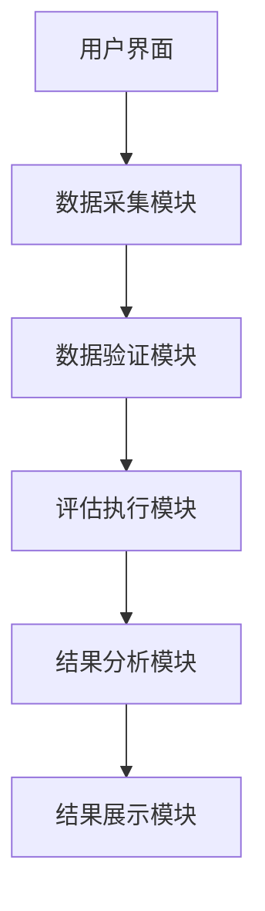

                 


# AI Agent的性能评估指标与方法

> 关键词：AI Agent, 性能评估, 评估指标, 评估方法, 性能优化

> 摘要：本文详细探讨了AI Agent性能评估的核心概念、指标与方法，从理论分析到实际应用，系统性地阐述了如何全面评估AI Agent的性能表现。文章结合具体案例，深入分析了准确性、响应时间、鲁棒性等关键评估维度，并通过数学公式、算法流程图和系统架构图等可视化工具，帮助读者更好地理解和应用AI Agent的性能评估方法。

---

## 第1章: AI Agent的基本概念与背景

### 1.1 AI Agent的定义与特点

AI Agent（人工智能代理）是一种能够感知环境、自主决策并执行任务的智能实体。它具备以下核心特点：

- **自主性**：能够在没有外部干预的情况下自主运作。
- **反应性**：能够实时感知环境变化并做出响应。
- **目标导向**：基于明确的目标或任务进行决策和行动。
- **学习能力**：能够通过数据和经验不断优化自身性能。

AI Agent的应用场景广泛，包括智能助手、自动驾驶、智能客服、机器人控制等领域。

### 1.2 AI Agent的性能评估背景

AI Agent的性能评估是确保其在实际应用中高效、可靠运行的关键。随着AI技术的快速发展，AI Agent的复杂性和应用场景的多样性也在不断增加，这使得性能评估变得尤为重要。

- **性能评估的目标**：通过量化指标，全面衡量AI Agent在不同场景下的表现，为优化和改进提供依据。
- **性能评估的意义**：提升用户体验，降低系统运行成本，提高系统的可靠性和安全性。
- **当前挑战**：评估维度多样化、数据获取复杂性、评估方法的科学性等问题亟待解决。

---

## 第2章: 性能评估的维度与指标

### 2.1 性能评估的主要维度

AI Agent的性能评估可以从以下几个维度进行：

- **准确性**：AI Agent输出结果的正确性，是评估其核心性能的关键指标。
- **响应时间**：AI Agent完成任务所需的时间，影响用户体验和效率。
- **鲁棒性**：AI Agent在面对异常输入或复杂环境时的稳定性和可靠性。
- **可解释性**：AI Agent决策过程的透明度，影响用户信任和系统调试的难度。
- **资源消耗**：AI Agent运行过程中对计算资源的占用，影响系统的扩展性和成本。

### 2.2 各评估维度的数学定义与公式

#### 2.2.1 准确率的计算公式
$$
准确率 = \frac{正确预测的数量}{总预测数量}
$$

#### 2.2.2 F1分数的计算公式
$$
F1 = 2 \times \frac{精确率 \times 召回率}{精确率 + 召回率}
$$

#### 2.2.3 响应时间的计算方法
响应时间通常通过多次运行任务并取平均值来计算：
$$
响应时间 = \frac{\sum_{i=1}^{n} t_i}{n}
$$
其中，$t_i$ 表示第$i$次任务的运行时间，$n$为总运行次数。

#### 2.2.4 鲁棒性的评估指标
鲁棒性可以通过系统在异常情况下的错误率来衡量：
$$
鲁棒性 = 1 - 错误率
$$

### 2.3 评估维度的对比分析

以下是对各评估维度的对比分析：

#### 对比表格展示
| 评估维度 | 定义 | 计算公式 | 重要性 |
|----------|------|----------|--------|
| 准确率    | 正确预测的比例 | $$准确率 = \frac{正确预测的数量}{总预测数量}$$ | 高       |
| 响应时间  | 任务完成的平均时间 | $$响应时间 = \frac{\sum_{i=1}^{n} t_i}{n}$$ | 中       |
| 鲁棒性    | 系统在异常情况下的稳定性 | $$鲁棒性 = 1 - 错误率$$ | 高       |
| 可解释性  | 决策过程的透明度 | 无具体公式，基于主观判断 | 中       |
| 资源消耗  | 系统运行的资源占用 | 基于具体资源监控数据 | 低       |

#### ER实体关系图
```mermaid
er
actor(AI Agent)
actor --> action: 执行任务
action --> result: 产生结果
result --> metric: 评估指标
```

---

## 第3章: 性能评估的算法原理

### 3.1 算法原理概述

AI Agent的性能评估通常涉及以下几种典型算法：

1. **准确率计算**：基于分类任务的正确预测数量与总预测数量的比值。
2. **F1分数计算**：结合精确率和召回率的综合指标，用于平衡查准率和查全率。
3. **AUC计算**：在二分类问题中，AUC（Area Under Curve）反映了模型的区分能力。

### 3.2 算法流程图

以下是对F1分数计算的流程图展示：

```mermaid
graph TD
    A[精确率] --> B[召回率]
    B --> C{计算F1分数}
    C --> D[F1分数 = 2 * (精确率 * 召回率) / (精确率 + 召回率)]
```

### 3.3 Python代码实现

以下是一个计算准确率和F1分数的Python示例：

```python
from sklearn.metrics import accuracy_score, f1_score
import numpy as np

# 示例数据
y_true = np.array([0, 1, 0, 1, 1])
y_pred = np.array([0, 1, 1, 1, 0])

# 计算准确率
accuracy = accuracy_score(y_true, y_pred)
print(f"准确率: {accuracy}")

# 计算F1分数
f1 = f1_score(y_true, y_pred, average='binary')
print(f"F1分数: {f1}")
```

---

## 第4章: 系统分析与架构设计

### 4.1 系统功能设计

AI Agent性能评估系统的功能模块包括：

1. **数据采集模块**：负责收集AI Agent的输入输出数据和运行日志。
2. **评估执行模块**：根据预设的评估指标，对AI Agent的性能进行计算和分析。
3. **结果展示模块**：以可视化的方式呈现评估结果，便于用户理解和分析。

### 4.2 系统架构图



---

## 第5章: 项目实战

### 5.1 环境配置

以下是AI Agent性能评估系统的环境配置示例：

- **Python版本**：3.8+
- **依赖库**：scikit-learn, numpy, mermaid, matplotlib

### 5.2 核心代码实现

以下是一个简单的AI Agent性能评估系统的核心代码示例：

```python
import logging
from typing import Dict, Any

class AI_AGENT:
    def __init__(self):
        self.results = []

    def evaluate_performance(self, inputs: Dict[str, Any]) -> Dict[str, Any]:
        try:
            # 执行任务并记录结果
            result = self.process_input(inputs)
            self.results.append(result)
            return result
        except Exception as e:
            logging.error(f"Error occurred: {str(e)}")
            return {"status": "error", "message": str(e)}

    def process_input(self, inputs: Dict[str, Any]) -> Dict[str, Any]:
        # 示例处理逻辑
        return {"status": "success", "result": "Processed input successfully"}
```

---

## 第6章: 最佳实践与小结

### 6.1 最佳实践

- **数据质量**：确保评估数据的多样性和代表性，避免过拟合。
- **评估指标选择**：根据具体场景选择合适的评估指标，避免片面追求单一指标。
- **系统扩展性**：在系统设计中预留足够的扩展空间，以应对未来可能出现的新评估维度。

### 6.2 小结

本文系统性地探讨了AI Agent的性能评估指标与方法，从理论分析到实际应用，全面阐述了如何有效评估AI Agent的性能表现。通过本文的学习，读者可以掌握AI Agent性能评估的核心方法，并能够在实际项目中灵活应用这些方法。

---

## 作者

作者：AI天才研究院/AI Genius Institute & 禅与计算机程序设计艺术 /Zen And The Art of Computer Programming

---

**感谢您的阅读！希望本文能为您提供有价值的技术见解和实践指导。**

