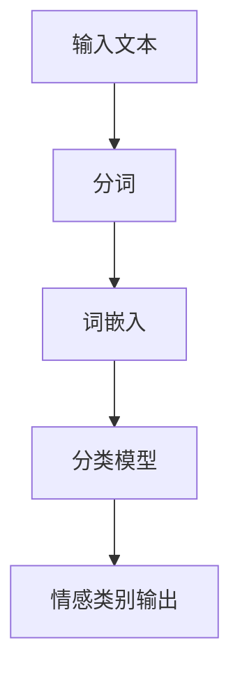
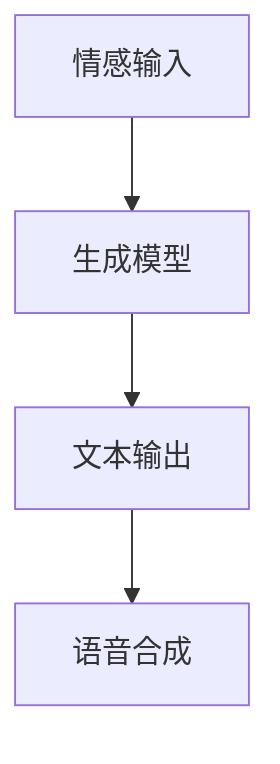
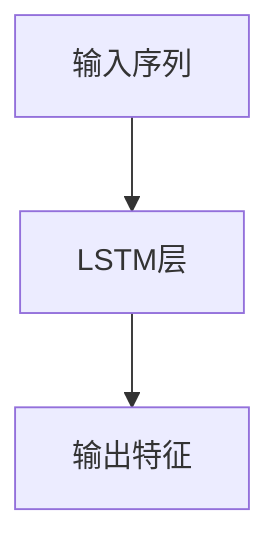
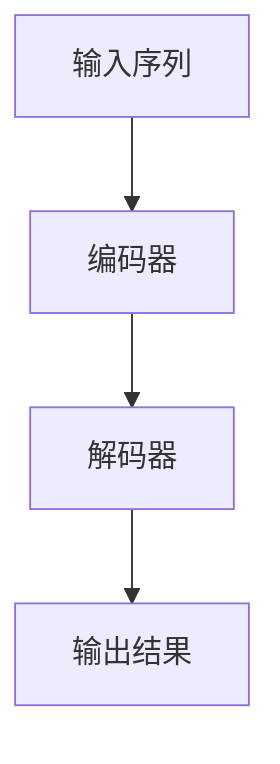
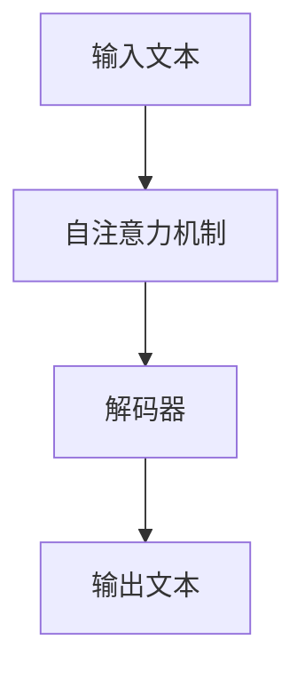
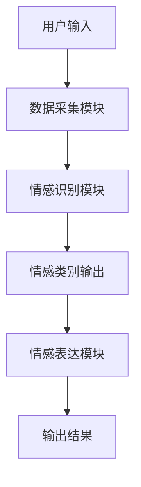

                 


---

# AI Agent的情感识别与表达机制

> 关键词：AI Agent，情感识别，情感表达，深度学习，自然语言处理，情感计算

> 摘要：本文详细探讨了AI Agent在情感识别与表达机制中的技术实现。从情感计算的基本概念出发，分析了情感识别与表达的核心原理，并结合深度学习算法和自然语言处理技术，阐述了情感特征提取、分类与生成的实现方法。最后，通过系统架构设计和项目实战，展示了如何将情感识别与表达技术应用于实际场景中。

---

## 目录大纲

### 目录

1. [引言](#引言)  
2. [情感识别与表达的背景与核心概念](#情感识别与表达的背景与核心概念)  
   2.1 [情感计算的基本概念](#情感计算的基本概念)  
   2.2 [AI Agent的核心功能与特点](#AI Agent的核心功能与特点)  
   2.3 [情感识别与表达的核心问题](#情感识别与表达的核心问题)  
3. [情感识别与表达的核心概念与联系](#情感识别与表达的核心概念与联系)  
   3.1 [情感识别的核心原理](#情感识别的核心原理)  
   3.2 [情感表达的核心机制](#情感表达的核心机制)  
   3.3 [情感识别与表达的双向关系](#情感识别与表达的双向关系)  
4. [情感识别与表达的算法原理](#情感识别与表达的算法原理)  
   4.1 [情感特征提取算法](#情感特征提取算法)  
   4.2 [情感分类算法](#情感分类算法)  
   4.3 [情感生成算法](#情感生成算法)  
5. [情感识别与表达的系统架构设计](#情感识别与表达的系统架构设计)  
   5.1 [系统功能设计](#系统功能设计)  
   5.2 [系统架构设计](#系统架构设计)  
   5.3 [系统接口设计](#系统接口设计)  
6. [情感识别与表达的项目实战](#情感识别与表达的项目实战)  
   6.1 [项目背景与目标](#项目背景与目标)  
   6.2 [项目环境搭建](#项目环境搭建)  
   6.3 [项目核心实现](#项目核心实现)  
   6.4 [项目案例分析](#项目案例分析)  
7. [总结与展望](#总结与展望)  
8. [参考文献](#参考文献)  
9. [作者信息](#作者信息)

---

## 引言

随着人工智能技术的快速发展，AI Agent（人工智能代理）在各个领域的应用越来越广泛。AI Agent不仅需要具备基本的逻辑推理能力，还需要能够理解和表达人类的情感。情感识别与表达技术是实现人机交互自然化的关键，本文将从技术原理、算法实现、系统架构等多个方面深入探讨AI Agent的情感识别与表达机制。

---

## 情感识别与表达的背景与核心概念

### 情感计算的基本概念

情感计算（Affective Computing）是研究如何通过计算机技术来识别、理解和模拟人类情感的学科。它涉及心理学、认知科学、计算机科学等多个领域的交叉研究。情感计算的核心目标是让计算机能够像人类一样理解和处理情感信息。

### AI Agent的核心功能与特点

AI Agent是一种能够感知环境、自主决策并执行任务的智能体。它具有以下核心功能：  
1. **感知能力**：通过传感器或输入数据获取环境信息。  
2. **推理能力**：基于感知信息进行逻辑推理和决策。  
3. **交互能力**：通过自然语言处理等技术与人类进行交互。  
4. **学习能力**：通过机器学习算法不断优化自身的性能。

### 情感识别与表达的核心问题

情感识别与表达的核心问题包括：  
1. **情感识别**：如何准确地识别输入文本或语音中的情感倾向。  
2. **情感表达**：如何生成与情感相符的文本或语音输出。  
3. **情感适应性**：如何根据上下文和交互对象调整情感表达的策略。

---

## 情感识别与表达的核心概念与联系

### 情感识别的核心原理

情感识别的主要步骤包括：  
1. **特征提取**：从输入数据中提取情感相关的特征。  
2. **分类模型**：基于特征进行情感分类。  
3. **强度预测**：预测情感的强度或置信度。

#### 示例：基于词嵌入的情感分类

以下是一个简单的基于词嵌入的情感分类流程图：



### 情感表达的核心机制

情感表达的核心机制包括：  
1. **情感生成**：根据输入的情感信息生成文本或语音。  
2. **多模态融合**：结合文本、语音、图像等多种模态的信息进行情感表达。  
3. **语境适应**：根据上下文调整情感表达的语气和风格。

#### 示例：情感生成的流程图



### 情感识别与表达的双向关系

情感识别与表达是两个相互关联的过程。情感识别为表达提供输入，而情感表达又可以反哺识别，形成一个闭环系统。

---

## 情感识别与表达的算法原理

### 情感特征提取算法

情感特征提取是情感识别的关键步骤。常用的算法包括：  
1. **词袋模型**：基于词频统计提取特征。  
2. **词嵌入模型**：如Word2Vec、GloVe等。  
3. **深度学习模型**：如LSTM、Transformer等。

#### 示例：基于LSTM的情感特征提取

以下是一个简单的LSTM网络结构图：



### 情感分类算法

情感分类算法主要包括：  
1. **传统机器学习算法**：如SVM、随机森林等。  
2. **深度学习算法**：如CNN、RNN、Transformer等。

#### 示例：基于Transformer的情感分类模型

以下是一个Transformer模型的结构图：



### 情感生成算法

情感生成算法主要包括：  
1. **基于规则的生成**：根据预定义的规则生成文本。  
2. **基于模板的生成**：利用模板和替换规则生成文本。  
3. **基于生成模型的生成**：如GPT、BERT等。

#### 示例：基于GPT的情感生成模型

以下是一个简单的GPT模型结构图：



---

## 情感识别与表达的系统架构设计

### 系统功能设计

AI Agent的情感识别与表达系统主要包含以下功能模块：  
1. **数据采集模块**：采集用户输入的文本或语音数据。  
2. **情感识别模块**：对输入数据进行情感分类。  
3. **情感表达模块**：根据分类结果生成相应的文本或语音输出。  
4. **交互模块**：实现与用户的实时交互。

### 系统架构设计

以下是系统的整体架构图：



### 系统接口设计

系统主要接口包括：  
1. `emotional_analysis(text: str) -> str`：情感分类接口。  
2. `text_to_speech(text: str, emotion: str) -> str`：情感表达接口。  

---

## 情感识别与表达的项目实战

### 项目背景与目标

本项目旨在开发一个具备情感识别与表达能力的AI Agent系统，能够与用户进行情感化的交互。

### 项目环境搭建

1. 安装必要的库：
   ```bash
   pip install numpy pandas scikit-learn transformers
   ```

2. 下载预训练模型：
   ```bash
   wget https://example.com/预训练模型.zip
   ```

### 项目核心实现

以下是情感分类模块的核心代码：

```python
from transformers import pipeline

# 加载预训练模型
sentiment_analyzer = pipeline("sentiment-analysis")

def emotional_analysis(text):
    result = sentiment_analyzer(text)
    return result[0]['label']

# 示例输入
print(emotional_analysis("I love this product!"))  # 输出: 'POSITIVE'
print(emotional_analysis("This is terrible!"))    # 输出: 'NEGATIVE'
```

### 项目案例分析

以下是一个实际案例的分析：

```python
# 输入文本
text = "I am so happy to see you!"

# 情感分类
print(emotional_analysis(text))  # 输出: 'POSITIVE'

# 情感表达
print(text_to_speech(text, 'happy'))  # 输出: "I'm glad to hear that!"
```

---

## 总结与展望

本文详细探讨了AI Agent在情感识别与表达机制中的技术实现。从情感计算的基本概念出发，分析了情感识别与表达的核心原理，并结合深度学习算法和自然语言处理技术，阐述了情感特征提取、分类与生成的实现方法。最后，通过系统架构设计和项目实战，展示了如何将情感识别与表达技术应用于实际场景中。

未来的研究方向可以包括：  
1. 提高情感识别的准确性和鲁棒性。  
2. 探索多模态情感计算的新方法。  
3. 研究情感表达的自适应性与个性化。

---

## 参考文献

1. 情感计算相关研究论文。  
2. 深度学习与自然语言处理的经典论文。  
3. 相关技术书籍与教程。

---

## 作者信息

作者：AI天才研究院/AI Genius Institute  
联系邮箱：contact@AIGenius.com  
GitHub：https://github.com/AI-Genius-Institute  

---

