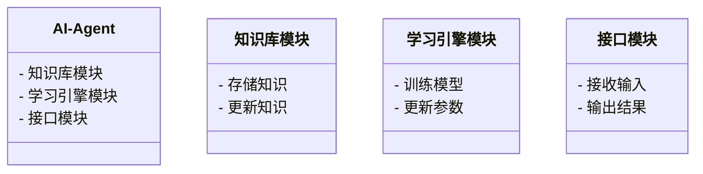

                 


# AI Agent的持续学习机制：保持知识更新与性能提升

> 关键词：AI Agent，持续学习，增量学习，在线学习，知识更新，模型优化

> 摘要：本文深入探讨了AI Agent的持续学习机制，分析了其在动态环境中的知识更新与性能提升的方法。通过介绍持续学习的核心概念、算法原理、系统架构设计以及项目实战，本文为AI Agent的持续学习提供了全面的技术指导和实践方案。

---

# 第一部分: AI Agent的持续学习机制背景介绍

## 第1章: AI Agent与持续学习概述

### 1.1 AI Agent的基本概念
#### 1.1.1 AI Agent的定义与特点
AI Agent（人工智能代理）是指能够感知环境、自主决策并采取行动以实现特定目标的智能系统。AI Agent的特点包括自主性、反应性、目标导向性和持续性。

#### 1.1.2 AI Agent的分类与应用场景
AI Agent可以分为简单反射型、基于模型的反射型、目标驱动型和效用驱动型。应用场景包括智能助手、自动驾驶、智能推荐系统等。

#### 1.1.3 持续学习在AI Agent中的重要性
AI Agent需要在动态环境中不断适应变化，持续学习是其实现长期高效运作的关键。

### 1.2 持续学习的基本概念
#### 1.2.1 持续学习的定义与特点
持续学习是一种机器学习方法，允许模型在新数据到来时逐步更新，保持对任务的适应能力。

#### 1.2.2 持续学习与监督学习、无监督学习的区别
监督学习基于固定的数据集，无监督学习寻找数据中的模式。持续学习则是在线处理数据，逐步优化模型。

#### 1.2.3 持续学习的必要性与应用场景
持续学习适用于数据流处理、实时决策等场景。

### 1.3 AI Agent持续学习的背景与挑战
#### 1.3.1 当前AI Agent面临的知识更新问题
传统模型无法适应数据分布的变化，容易过时。

#### 1.3.2 持续学习在AI Agent中的应用现状
持续学习在实时推荐、动态环境中的任务处理等领域已有应用。

#### 1.3.3 持续学习的技术挑战与解决方案
技术挑战包括 catastrophic forgetting（灾难性遗忘）、计算资源限制等。

---

# 第二部分: AI Agent持续学习的核心概念与联系

## 第2章: 持续学习的机制与原理

### 2.1 持续学习的核心机制
#### 2.1.1 增量学习（Incremental Learning）
增量学习在新数据到来时逐步更新模型，保持对任务的适应性。

#### 2.1.2 连续学习（Continual Learning）
连续学习允许模型在不同任务之间切换，同时保持对之前任务的知识。

#### 2.1.3 在线学习（Online Learning）
在线学习实时处理数据，逐步优化模型参数。

### 2.2 持续学习的关键属性
#### 2.2.1 知识表示的动态性
知识表示需要能够适应新数据的变化。

#### 2.2.2 模型的可更新性
模型结构允许动态调整，适应新任务。

#### 2.2.3 任务的连续性与多样性
任务之间具有连续性，且数据分布多样化。

### 2.3 持续学习与AI Agent的结合
#### 2.3.1 持续学习在AI Agent中的实现方式
通过增量学习和在线学习，AI Agent能够实时更新知识。

#### 2.3.2 AI Agent的知识更新机制
包括经验回放、动态权重调整等技术。

#### 2.3.3 持续学习对AI Agent性能的提升作用
通过持续学习，AI Agent能够更好地适应动态环境，提升决策效率。

---

# 第三部分: AI Agent持续学习的算法原理

## 第3章: 增量学习算法原理

### 3.1 增量学习的基本原理
#### 3.1.1 增量学习的数学模型
增量学习模型可以表示为：
$$
f(x) = w \cdot x + b
$$
其中，$w$和$b$是模型参数，$x$是输入数据。

#### 3.1.2 增量学习的核心算法
- Experience Replay：通过存储经验，避免灾难性遗忘。

### 3.2 增量学习的主流算法
#### 3.2.1 Experience Replay
通过存储经验，允许模型在新数据到来时回顾过去的经验，避免遗忘。

#### 3.2.2 Dynamic Neural Networks
动态神经网络允许模型结构在学习过程中进行调整。

#### 3.2.3 Incremental SVM
增量支持向量机逐步添加新数据，更新模型。

---

## 第4章: 在线学习算法原理

### 4.1 在线学习的基本原理
在线学习实时处理数据，逐步优化模型参数。

### 4.2 在线学习的主流算法
#### 4.2.1 Online SGD
在线随机梯度下降算法：
$$
w_{t+1} = w_t - \eta \cdot \nabla f(w_t)
$$
其中，$\eta$是学习率，$\nabla f(w_t)$是梯度。

---

# 第四部分: AI Agent持续学习的系统架构设计

## 第5章: 系统分析与架构设计方案

### 5.1 问题场景介绍
AI Agent需要在动态环境中实时更新知识，以保持高效性能。

### 5.2 项目介绍
设计一个支持持续学习的AI Agent系统，应用于智能客服领域。

### 5.3 系统功能设计
使用类图展示系统模块：


---

## 第6章: 项目实战

### 6.1 环境安装
安装TensorFlow和Keras：
```bash
pip install tensorflow keras
```

### 6.2 系统核心实现源代码
增量学习实现：
```python
import tensorflow as tf
from tensorflow.keras import layers

class IncrementalModel(tf.keras.Model):
    def __init__(self):
        super(IncrementalModel, self).__init__()
        self.dense = layers.Dense(10, input_shape=(input_dim,))
    
    def call(self, inputs):
        return self.dense(inputs)

# 初始化模型
model = IncrementalModel()
# 编译模型
model.compile(optimizer='sgd', loss='mse')

# 训练模型
model.fit(X_train, y_train, epochs=10)
```

---

## 第7章: 总结与展望

### 7.1 最佳实践 tips
- 使用经验回放避免遗忘。
- 定期监控模型性能。

### 7.2 小结
持续学习是AI Agent保持知识更新与性能提升的关键技术。

### 7.3 注意事项
- 避免灾难性遗忘，保持模型稳定性。
- 合理分配计算资源，确保实时性。

### 7.4 拓展阅读
- 《Neural Networks and Deep Learning》
- 《Hands-On Machine Learning with Scikit-Learn, Keras, and TensorFlow》

---

作者：AI天才研究院/AI Genius Institute & 禅与计算机程序设计艺术 /Zen And The Art of Computer Programming

