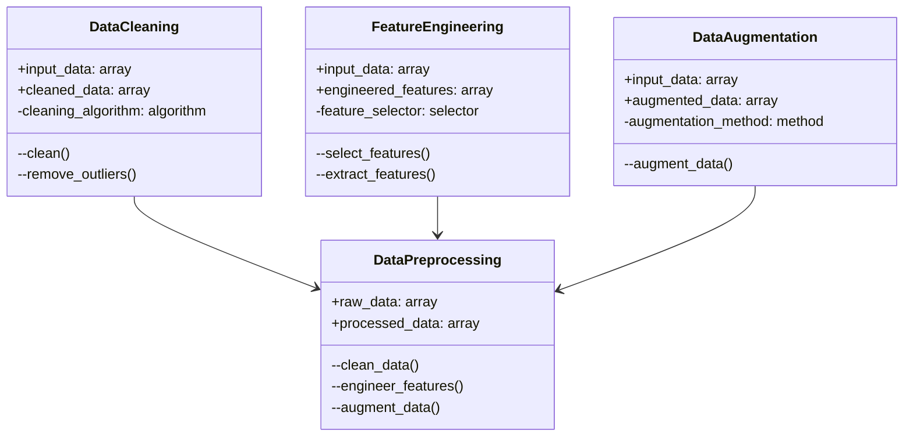
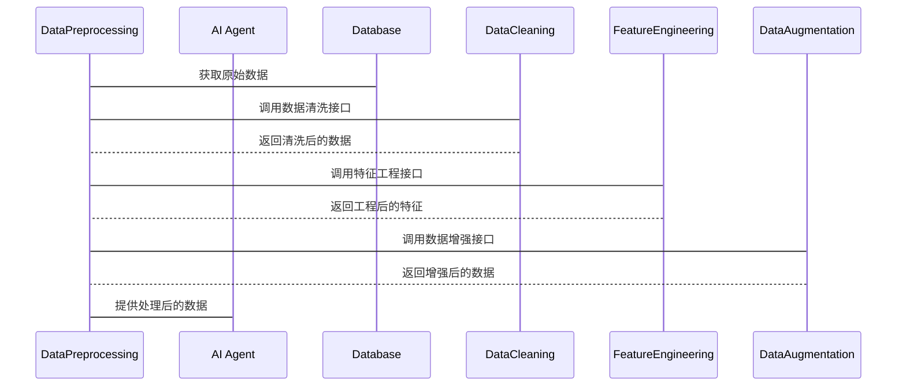

                 


# AI Agent的数据准备和预处理技巧

> 关键词：AI Agent, 数据准备, 数据预处理, 数据清洗, 特征工程, 数据增强

> 摘要：本文将详细探讨AI Agent在数据准备和预处理过程中的关键技巧。从数据清洗、特征工程到数据增强，我们将逐步分析每个步骤的核心原理、实现方法和实际案例。通过丰富的实战经验分享，帮助读者掌握如何高效地进行数据准备和预处理，以支持AI Agent的高效运行。

---

# 第一部分: AI Agent数据准备与预处理背景

## 第1章: AI Agent与数据准备概述

### 1.1 AI Agent的基本概念

AI Agent（人工智能代理）是指能够感知环境并采取行动以实现目标的智能实体。它广泛应用于推荐系统、自然语言处理、计算机视觉和自动驾驶等领域。数据是AI Agent的核心驱动力，数据的质量和格式直接影响AI Agent的性能和决策能力。

#### 1.1.1 AI Agent的定义与特点

AI Agent可以是软件程序、机器人或其他智能系统。其特点包括：

- **自主性**：能够在没有外部干预的情况下运行。
- **反应性**：能够根据环境变化调整行为。
- **目标导向性**：以特定目标为导向进行决策。
- **学习能力**：能够通过数据和经验改进性能。

#### 1.1.2 数据在AI Agent中的核心作用

数据是AI Agent的“燃料”。高质量的数据能够提升模型的准确性和效率，而低质量的数据可能导致错误的决策。数据准备和预处理是AI Agent开发过程中至关重要的一环。

#### 1.1.3 数据准备与预处理的背景与意义

数据准备和预处理是将原始数据转化为适合模型输入格式的过程。这个过程包括数据清洗、特征工程、数据转换和数据增强等步骤。其意义在于：

- **提升数据质量**：去除噪声和冗余数据。
- **统一数据格式**：确保模型能够一致地处理输入。
- **增强模型性能**：通过特征工程和数据增强提升模型的泛化能力。

### 1.2 数据准备与预处理的基本流程

数据准备和预处理的流程可以分为以下几个阶段：

#### 1.2.1 数据收集阶段

数据收集是数据准备的第一步。数据来源可以是数据库、API、日志文件或外部数据源。常见的数据收集方法包括：

- **结构化数据**：如关系型数据库中的表格数据。
- **非结构化数据**：如文本文件、图像和视频。

#### 1.2.2 数据清洗阶段

数据清洗是去除数据中的噪声和冗余信息的过程。常见的清洗方法包括：

- **删除无效数据**：去除重复数据或缺失值过多的记录。
- **填充缺失值**：使用均值、中位数或插值方法填充缺失值。
- **去除异常值**：通过统计方法或机器学习模型检测并去除异常值。

#### 1.2.3 数据转换与标准化阶段

数据转换与标准化是将数据转化为适合模型输入格式的过程。常见的转换方法包括：

- **归一化**：将数据缩放到固定范围（如0-1）。
- **标准化**：将数据转化为均值为0、方差为1的正态分布。
- **特征编码**：将分类变量转换为数值形式（如独热编码）。

#### 1.2.4 数据增强阶段

数据增强是通过增加数据的多样性和复杂性来提升模型的泛化能力。常见的数据增强方法包括：

- **图像增强**：旋转、翻转、裁剪和调整亮度等。
- **文本增强**：同义词替换、数据重排和数据扩增。

### 1.3 数据准备与预处理的挑战

数据准备和预处理过程中可能会遇到以下挑战：

#### 1.3.1 数据质量问题

数据可能包含噪声、缺失值和异常值，这些都会影响模型的性能。

#### 1.3.2 数据格式多样性问题

数据可能来自不同的来源，格式和结构可能存在差异，导致处理复杂。

#### 1.3.3 数据量与计算资源的平衡问题

大规模数据的处理需要高性能的计算资源，如何在有限的资源下高效处理数据是一个挑战。

### 1.4 数据准备工具与框架简介

#### 1.4.1 常见数据处理工具

- **Pandas**：广泛用于数据清洗和转换。
- **NumPy**：用于数组和矩阵操作。
- **Matplotlib/Seaborn**：用于数据可视化。

#### 1.4.2 数据预处理框架

- **Scikit-learn**：提供丰富的数据预处理工具。
- **TensorFlow/PyTorch**：提供数据预处理的API。

#### 1.4.3 AI Agent专用数据处理工具

- **OpenCV**：用于图像数据处理。
- **Natural Language Toolkit (NLTK)**：用于文本数据处理。

### 1.5 本章小结

本章介绍了AI Agent的基本概念和数据准备与预处理的背景与意义。数据准备和预处理是AI Agent开发过程中不可或缺的一步，其质量和效率直接影响模型的性能。

---

# 第二部分: 数据准备与预处理的核心概念

## 第2章: 数据清洗与异常处理

### 2.1 数据清洗的基本原理

数据清洗是去除数据中的噪声和冗余信息的过程。其基本原理包括：

- **缺失值处理**：通过填充、删除或插值方法处理缺失值。
- **异常值检测**：通过统计方法或机器学习模型检测异常值。
- **重复数据处理**：去除重复记录。

#### 2.1.1 数据清洗的目标与步骤

数据清洗的目标是提高数据质量，减少噪声对模型的影响。其步骤包括：

1. **识别问题**：识别数据中的缺失值、异常值和重复值。
2. **选择清洗方法**：根据具体情况选择合适的清洗方法。
3. **执行清洗**：实施清洗操作并验证结果。

#### 2.1.2 数据清洗的常见方法

- **删除法**：直接删除无效数据。
- **填充法**：使用均值、中位数或特定值填充缺失值。
- **插值法**：使用模型预测缺失值。
- **异常值检测**：通过Z-score或Isolation Forest算法检测异常值。

### 2.2 数据清洗的数学模型

#### 2.2.1 缺失值处理模型

常用的缺失值处理模型包括：

- **均值填充**：$x_{\text{new}} = \mu$, 其中$\mu$是特征的均值。
- **中位数填充**：$x_{\text{new}} = \text{median}$, 其中$\text{median}$是特征的中位数。
- **插值法填充**：使用回归模型预测缺失值。

#### 2.2.2 异常值检测模型

常用的异常值检测模型包括：

- **Z-score方法**：$Z = \frac{x - \mu}{\sigma}$, 其中$\mu$是均值，$\sigma$是标准差。
- **Isolation Forest**：基于树结构的无监督异常检测算法。

### 2.3 数据清洗的Python实现

#### 2.3.1 使用Pandas进行数据清洗

```python
import pandas as pd

# 示例数据
data = {'A': [1, 2, np.nan, 4, 5],
        'B': [np.nan, 6, 7, 8, 9]}
df = pd.DataFrame(data)

# 填充缺失值
df['A'].fillna(df['A'].mean(), inplace=True)
df['B'].fillna(df['B'].median(), inplace=True)

# 删除异常值
z_scores = np.abs(stats.zscore(df))
df_clean = df[(z_scores < 3).all(axis=1)]
```

#### 2.3.2 使用Scikit-learn进行异常检测

```python
from sklearn.ensemble import IsolationForest

# 示例数据
X = df.values

# 训练模型
model = IsolationForest(n_estimators=100, random_state=42)
model.fit(X)

# 预测异常值
outliers = model.predict(X)
normal_indices = np.where(outliers != -1)[0]
df_clean = df.iloc[normal_indices]
```

### 2.4 数据清洗的案例分析

#### 2.4.1 某电商网站的用户数据清洗案例

某电商网站收集了用户的行为数据，包括点击、浏览和购买记录。数据中存在大量缺失值和异常值。通过填充缺失值和删除异常值，提高了数据质量，提升了推荐系统的准确率。

#### 2.4.2 某金融领域的交易数据清洗案例

某金融公司收集了交易数据，包括交易金额、时间戳和用户ID。通过检测异常交易金额，识别并删除了欺诈交易，提高了模型的鲁棒性。

### 2.5 本章小结

本章详细讲解了数据清洗的基本原理和实现方法。通过Pandas和Scikit-learn的示例代码，展示了如何在实际中进行数据清洗。数据清洗是数据准备过程中最重要的一步，直接影响模型的性能。

---

## 第3章: 数据转换与标准化

### 3.1 数据转换的基本原理

数据转换是将数据从一种格式转换为另一种格式的过程。其基本原理包括：

- **归一化**：将数据缩放到固定范围。
- **标准化**：将数据转化为均值为0、方差为1的正态分布。
- **特征编码**：将分类变量转换为数值形式。

#### 3.1.1 数据标准化的定义与作用

数据标准化的目的是为了消除不同特征之间的量纲差异，使模型能够公平地比较不同特征的重要性。

#### 3.1.2 数据转换的常见方法

- **归一化**：$x_{\text{new}} = \frac{x - \min}{\max - \min}$
- **标准化**：$x_{\text{new}} = \frac{x - \mu}{\sigma}$
- **独热编码**：将分类变量转换为二进制向量。

### 3.2 数据标准化的数学模型

#### 3.2.1 均值方差标准化公式

$$
x_{\text{标准化}} = \frac{x - \mu}{\sigma}
$$

其中，$\mu$是均值，$\sigma$是标准差。

#### 3.2.2 最大最小归一化公式

$$
x_{\text{归一化}} = \frac{x - \min}{\max - \min}
$$

### 3.3 数据标准化的Python实现

#### 3.3.1 使用Scikit-learn进行标准化

```python
from sklearn.preprocessing import StandardScaler

# 示例数据
X = df.drop('target', axis=1).values

# 标准化数据
scaler = StandardScaler()
X_scaled = scaler.fit_transform(X)
```

#### 3.3.2 使用自定义函数进行数据转换

```python
def normalize_data(X):
    X_normalized = (X - X.min()) / (X.max() - X.min())
    return X_normalized

# 示例数据
X = df.drop('target', axis=1).values
X_normalized = normalize_data(X)
```

### 3.4 数据标准化的案例分析

#### 3.4.1 图像数据的标准化

在图像处理中，通常将像素值标准化到0-1范围。例如，将RGB值从0-255转换为0-1。

#### 3.4.2 文本数据的标准化

在文本处理中，通常将文本向量进行标准化，以消除不同文本长度的影响。

### 3.5 本章小结

本章详细讲解了数据转换与标准化的基本原理和实现方法。通过Scikit-learn和自定义函数的示例代码，展示了如何在实际中进行数据标准化。数据标准化是数据预处理中的关键步骤，能够显著提升模型的性能。

---

## 第4章: 数据增强与特征工程

### 4.1 数据增强的基本原理

数据增强是通过增加数据的多样性和复杂性来提升模型的泛化能力。其基本原理包括：

- **图像增强**：旋转、翻转、裁剪和调整亮度等。
- **文本增强**：同义词替换、数据重排和数据扩增。
- **音频增强**：噪声添加和速度调整。

#### 4.1.1 数据增强的目标与方法

数据增强的目标是通过生成更多样化的新数据，提升模型的鲁棒性和泛化能力。常用方法包括：

- **图像增强**：使用OpenCV或Keras的图像预处理库。
- **文本增强**：使用NLTK或Gensim库。
- **音频增强**：使用 librosa 库。

### 4.2 数据增强的Python实现

#### 4.2.1 使用OpenCV进行图像增强

```python
import cv2
import numpy as np

# 示例图像
image = cv2.imread('image.jpg')

# 随机裁剪
height, width = image.shape[:2]
scale = 0.8
new_height = int(height * scale)
new_width = int(width * scale)
y = int((height - new_height) * 0.5)
x = int((width - new_width) * 0.5)
cropped_image = image[y:y + new_height, x:x + new_width]

# 随机翻转
if np.random.random() < 0.5:
    cropped_image = cv2.flip(cropped_image, 1)

cv2.imwrite('augmented_image.jpg', cropped_image)
```

#### 4.2.2 使用Keras进行图像增强

```python
from tensorflow.keras.preprocessing.image import ImageDataGenerator

# 示例数据生成器
datagen = ImageDataGenerator(
    rotation_range=20,
    horizontal_flip=True,
    fill_mode='nearest'
)

# 生成增强数据
for X_batch, Y_batch in datagen.flow(x_train, y_train, batch_size=1):
    plt.imshow(X_batch[0])
    plt.show()
    break
```

### 4.3 特征工程的基本原理

特征工程是通过构造和选择特征来提升模型性能的过程。其基本原理包括：

- **特征选择**：选择对目标变量有最大影响力的特征。
- **特征提取**：从原始数据中提取有用的特征。
- **特征变换**：将特征转换为更适合模型的形式。

#### 4.3.1 特征工程的目标与方法

特征工程的目标是提升模型的性能和可解释性。常用方法包括：

- **特征选择**：使用回归系数或决策树进行特征重要性排序。
- **特征提取**：使用主成分分析（PCA）提取主成分。
- **特征变换**：使用独热编码或标签编码处理分类变量。

### 4.4 特征工程的Python实现

#### 4.4.1 使用Scikit-learn进行特征选择

```python
from sklearn.feature_selection import SelectKBest, chi2

# 示例数据
X = df.drop('target', axis=1).values
y = df['target'].values

# 特征选择
selector = SelectKBest(chi2, k=5)
X_new = selector.fit_transform(X, y)
```

#### 4.4.2 使用Scikit-learn进行特征提取

```python
from sklearn.decomposition import PCA

# 示例数据
X = df.drop('target', axis=1).values
y = df['target'].values

# 主成分分析
pca = PCA(n_components=3)
X_pca = pca.fit_transform(X)
```

### 4.5 数据增强与特征工程的案例分析

#### 4.5.1 图像分类任务中的数据增强

在图像分类任务中，通过数据增强生成更多样化的新图像，可以显著提升模型的泛化能力。例如，在训练过程中，使用随机旋转和翻转生成新的图像。

#### 4.5.2 文本分类任务中的特征工程

在文本分类任务中，通过TF-IDF（词频-逆文档频率）进行特征提取，可以更好地捕捉文本的语义信息。

### 4.6 本章小结

本章详细讲解了数据增强与特征工程的基本原理和实现方法。通过OpenCV、Keras和Scikit-learn的示例代码，展示了如何在实际中进行数据增强和特征工程。这些技巧能够显著提升模型的性能和泛化能力。

---

## 第5章: 数据准备与预处理的系统架构设计

### 5.1 问题场景介绍

在实际应用中，数据准备和预处理通常需要一个高效的系统架构来支持。我们以一个AI Agent开发平台为例，介绍系统的架构设计。

#### 5.1.1 项目背景

某公司开发了一个基于AI Agent的推荐系统，需要处理大规模的用户行为数据。数据来自多个渠道，格式和结构存在差异，需要进行清洗、转换和增强。

#### 5.1.2 项目目标

通过数据准备和预处理，提升推荐系统的准确率和响应速度。

### 5.2 系统功能设计

#### 5.2.1 领域模型（Mermaid 类图）



#### 5.2.2 系统架构设计（Mermaid 架构图）


### 5.3 系统接口设计

#### 5.3.1 数据清洗接口

```python
def clean_data(input_data):
    # 数据清洗逻辑
    pass
```

#### 5.3.2 特征工程接口

```python
def engineer_features(input_data):
    # 特征工程逻辑
    pass
```

#### 5.3.3 数据增强接口

```python
def augment_data(input_data):
    # 数据增强逻辑
    pass
```

### 5.4 系统交互设计（Mermaid 序列图）



### 5.5 本章小结

本章通过系统架构设计，展示了数据准备和预处理的实现过程。通过Mermaid图和接口设计，详细描述了系统的功能模块和交互流程。

---

## 第6章: 项目实战

### 6.1 项目背景与目标

我们以一个图像分类任务为例，介绍数据准备和预处理的实战过程。项目目标是通过数据清洗、特征工程和数据增强，提升图像分类模型的准确率。

#### 6.1.1 环境安装

```bash
pip install numpy matplotlib scikit-learn tensorflow keras
```

### 6.2 核心实现

#### 6.2.1 数据清洗

```python
import numpy as np
import cv2
import os

# 数据清洗逻辑
def clean_images(directory):
    for filename in os.listdir(directory):
        img = cv2.imread(os.path.join(directory, filename))
        if img is None:
            os.remove(os.path.join(directory, filename))
            continue
        # 去除低质量图像
        if img.shape == (28, 28, 1):
            os.remove(os.path.join(directory, filename))
```

#### 6.2.2 特征工程

```python
from sklearn.decomposition import PCA

# 特征工程逻辑
def extract_features(images):
    features = []
    for img in images:
        # 提取主成分
        pca = PCA(n_components=10)
        features.append(pca.fit_transform(img.reshape(-1, 1)))
    return np.array(features)
```

#### 6.2.3 数据增强

```python
from tensorflow.keras.preprocessing.image import ImageDataGenerator

# 数据增强逻辑
def augment_data(images, labels):
    datagen = ImageDataGenerator(
        rotation_range=20,
        horizontal_flip=True,
        fill_mode='nearest'
    )
    augmented_images = []
    for img, label in zip(images, labels):
        x = img.reshape((1, 28, 28, 1))
        for batch in datagen.flow(x, batch_size=1):
            augmented_images.append(batch[0])
            if len(augmented_images) >= 10 * len(images):
                break
    return np.array(augmented_images)
```

### 6.3 案例分析与实现解读

#### 6.3.1 数据清洗的实现解读

上述代码通过遍历图像文件夹，去除无效图像和低质量图像，确保输入数据的完整性。

#### 6.3.2 数据增强的实现解读

上述代码使用Keras的数据生成器，通过随机旋转和水平翻转生成新的图像，显著增加了训练数据的多样性。

#### 6.3.3 特征工程的实现解读

上述代码通过主成分分析提取图像的特征，降低了数据的维度，同时保留了最重要的特征信息。

### 6.4 项目小结

本章通过一个图像分类任务的实战，展示了数据准备和预处理的具体实现过程。通过数据清洗、特征工程和数据增强，显著提升了模型的性能。

---

## 第7章: 数据准备与预处理的总结与展望

### 7.1 本章总结

数据准备和预处理是AI Agent开发过程中不可或缺的一步。通过数据清洗、特征工程和数据增强，能够显著提升数据的质量和模型的性能。本章详细讲解了数据准备和预处理的核心概念和实现方法，并通过实际案例展示了其应用过程。

### 7.2 未来展望

随着AI技术的不断发展，数据准备和预处理技术也将不断创新。未来的研究方向包括：

- **自动化数据清洗**：通过自动化工具减少人工干预。
- **智能特征工程**：利用机器学习技术自动提取特征。
- **自适应数据增强**：根据模型需求动态生成数据。

### 7.3 最佳实践 Tips

- **数据清洗**：根据具体情况选择合适的清洗方法。
- **特征工程**：结合领域知识选择重要的特征。
- **数据增强**：根据任务需求选择合适的方法。

### 7.4 小结

数据准备和预处理是AI Agent开发过程中至关重要的一环。通过本文的讲解，读者能够掌握数据准备和预处理的核心技巧，并在实际应用中灵活运用。

---

# 作者：AI天才研究院/AI Genius Institute & 禅与计算机程序设计艺术 /Zen And The Art of Computer Programming

