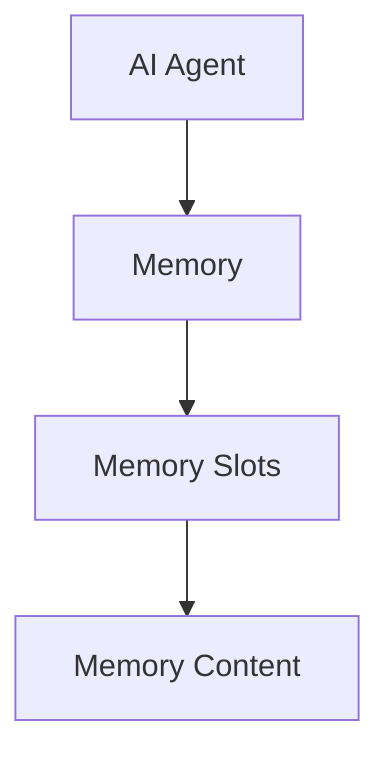
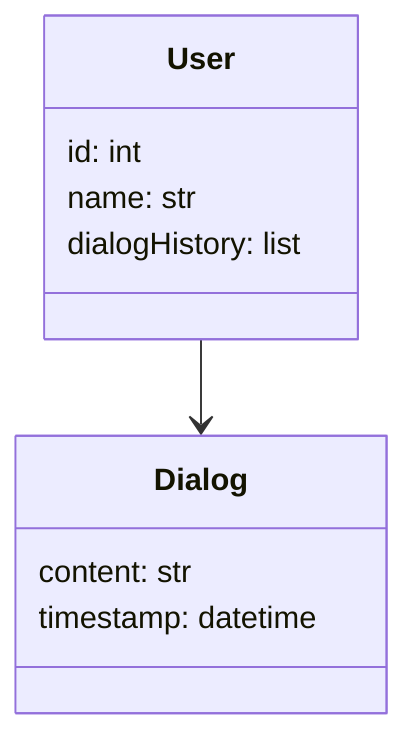
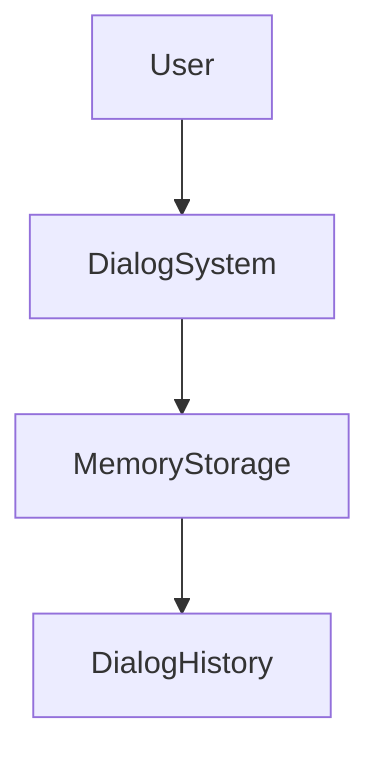
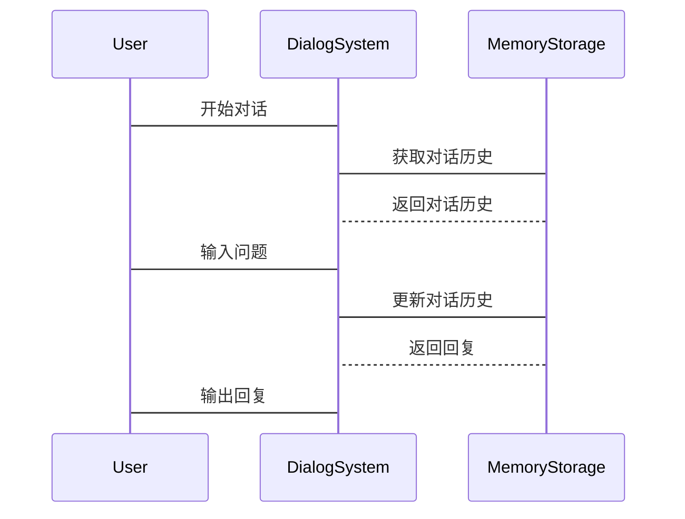

                 


# AI Agent的记忆机制：设计与实现

## 关键词：AI Agent，记忆机制，神经网络，符号逻辑，图结构

## 摘要：AI Agent的记忆机制是实现智能体持续学习和自适应能力的核心技术。本文从AI Agent记忆机制的背景出发，详细分析了记忆机制的核心概念、算法原理、系统设计与实现，并通过项目实战展示了记忆机制在实际应用中的效果。文章最后总结了AI Agent记忆机制的设计原则和未来发展方向。

---

# 第一部分: AI Agent记忆机制的背景与核心概念

## 第1章: AI Agent记忆机制的背景与问题描述

### 1.1 问题背景

#### 1.1.1 AI Agent的基本概念

AI Agent（人工智能代理）是一种能够感知环境、自主决策并执行任务的智能体。AI Agent广泛应用于自动驾驶、智能助手、机器人控制等领域。记忆机制是AI Agent实现智能交互和持续学习的关键技术，它使AI Agent能够存储和检索信息，从而更好地完成复杂任务。

#### 1.1.2 记忆机制在AI Agent中的重要性

AI Agent需要处理动态环境中的信息，记忆机制能够帮助AI Agent存储历史数据、任务状态和上下文信息，从而提高决策的准确性和效率。例如，在对话系统中，记忆机制可以存储用户的对话历史，帮助AI Agent更好地理解用户需求。

#### 1.1.3 当前AI Agent记忆机制的发展现状

记忆机制的研究主要集中在神经网络、符号逻辑和图结构等领域。近年来，基于神经网络的记忆机制（如记忆网络、端到端记忆网络）因其强大的表达能力和灵活性，得到了广泛的研究和应用。

---

### 1.2 问题描述

#### 1.2.1 AI Agent记忆机制的核心问题

记忆机制的核心问题是如何高效地存储、检索和更新信息。AI Agent需要在动态环境中快速响应，因此记忆机制的设计需要考虑存储容量、检索效率和信息准确性等因素。

#### 1.2.2 记忆机制在AI Agent中的应用场景

记忆机制在多个场景中发挥重要作用，例如：

1. **对话系统**：存储对话历史，帮助AI Agent理解上下文。
2. **任务规划**：存储任务状态和环境信息，辅助AI Agent进行决策。
3. **推荐系统**：存储用户行为和偏好，提高推荐的准确性。

#### 1.2.3 问题解决的目标与边界

记忆机制的目标是提高AI Agent的智能性和适应性，同时确保信息存储和检索的效率和准确性。边界包括：

1. **存储容量**：记忆机制需要在有限的存储空间内高效工作。
2. **信息更新**：信息更新需要及时准确，避免过时信息的干扰。
3. **安全与隐私**：记忆机制需要保护存储信息的安全性和隐私性。

---

### 1.3 问题解决的思路与方法

#### 1.3.1 基于记忆的AI Agent设计思路

AI Agent的记忆机制设计需要结合任务需求和环境特点。常见的设计思路包括：

1. **基于神经网络的记忆**：利用神经网络的非线性表达能力，存储和检索信息。
2. **基于符号逻辑的记忆**：通过符号规则和逻辑推理，存储和检索信息。
3. **基于图结构的记忆**：利用图结构表示知识关联，提高信息检索的效率。

#### 1.3.2 多种记忆机制的对比与选择

不同的记忆机制有不同的优缺点，选择合适的记忆机制需要考虑任务需求、计算资源和应用场景。例如：

- **神经网络记忆机制**：适合处理复杂非结构化数据，但需要大量计算资源。
- **符号逻辑记忆机制**：适合处理结构化数据，但表达能力有限。
- **图结构记忆机制**：适合处理知识关联性强的任务，但构建和维护成本较高。

#### 1.3.3 记忆机制与AI Agent性能的关系

记忆机制的性能直接影响AI Agent的决策能力和响应速度。高效的记忆机制能够显著提高AI Agent的性能，而低效的记忆机制可能导致任务执行效率低下。

---

### 1.4 本章小结

本章从AI Agent记忆机制的背景出发，分析了记忆机制的重要性和应用场景，并提出了设计思路和选择方法。下一章将详细讲解记忆机制的核心概念与联系。

---

## 第2章: AI Agent记忆机制的核心概念与联系

### 2.1 记忆机制的核心原理

#### 2.1.1 基于神经网络的记忆模型

基于神经网络的记忆模型（如记忆网络、端到端记忆网络）通过神经元的连接和激活来存储和检索信息。记忆网络的基本结构包括读操作和写操作，分别用于信息的检索和存储。

#### 2.1.2 基于符号逻辑的记忆模型

基于符号逻辑的记忆模型通过符号规则和逻辑推理来存储和检索信息。例如，通过一阶逻辑表示任务状态和环境信息，并通过逻辑推理引擎进行信息检索。

#### 2.1.3 基于图结构的记忆模型

基于图结构的记忆模型通过图节点和边的关系来表示知识关联。例如，知识图谱中的节点表示实体，边表示实体之间的关系，通过图遍历算法进行信息检索。

---

### 2.2 不同记忆机制的属性对比

下表对比了三种记忆机制的主要属性：

| 属性 | 基于神经网络 | 基于符号逻辑 | 基于图结构 |
|------|--------------|--------------|------------|
| 存储容量 | 高          | 低          | 中         |
| 检索效率 | 高          | 低          | 中         |
| 表达能力 | 强          | 弱          | 强         |
| 计算资源 | 高          | 低          | 中         |

#### 2.2.1 记忆容量对比

基于神经网络的记忆机制存储容量较大，适用于处理复杂任务；基于符号逻辑的记忆机制存储容量较小，适用于处理简单任务；基于图结构的记忆机制存储容量适中，适用于处理知识关联性强的任务。

#### 2.2.2 记忆持久性对比

基于神经网络的记忆机制持久性较强，适用于需要长期记忆的任务；基于符号逻辑的记忆机制持久性较弱，适用于需要短期记忆的任务；基于图结构的记忆机制持久性适中，适用于需要动态更新的任务。

#### 2.2.3 记忆检索效率对比

基于神经网络的记忆机制检索效率较高，适用于需要快速响应的任务；基于符号逻辑的记忆机制检索效率较低，适用于需要精确检索的任务；基于图结构的记忆机制检索效率适中，适用于需要复杂关联检索的任务。

---

### 2.3 记忆机制的ER实体关系图

以下是记忆机制的ER实体关系图：



---

### 2.4 本章小结

本章详细讲解了AI Agent记忆机制的核心原理，并通过对比分析明确了不同记忆机制的优缺点。下一章将深入探讨记忆机制的算法原理。

---

## 第3章: AI Agent记忆机制的算法原理

### 3.1 基于记忆网络的AI Agent算法

#### 3.1.1 记忆网络的基本结构

记忆网络的基本结构包括编码器、记忆存储器和解码器。编码器将输入信息编码为向量，记忆存储器存储这些向量，解码器根据检索结果生成输出。

#### 3.1.2 记忆网络的读写操作流程

1. **读操作**：编码器将输入信息编码为向量，记忆存储器根据向量检索相关记忆内容。
2. **写操作**：根据新的输入信息，更新记忆存储器中的记忆内容。

#### 3.1.3 记忆网络的数学模型

以下是记忆网络的数学模型：

$$
m = \sum_{i=1}^{n} w_i m_i
$$

其中，$m$表示检索结果，$w_i$表示第$i$个记忆单元的权重，$m_i$表示第$i$个记忆单元的内容。

---

#### 3.1.4 实现代码示例

以下是记忆网络的Python实现代码：

```python
class MemoryNetwork:
    def __init__(self, input_dim, memory_size):
        self.input_dim = input_dim
        self.memory_size = memory_size
        self.memory = np.zeros((memory_size, input_dim))
        
    def read(self, input_vector):
        # 计算权重
        weights = np.dot(self.memory, input_vector)
        weights = softmax(weights)
        # 加权求和
        result = np.sum(self.memory * weights[:, np.newaxis], axis=0)
        return result
    
    def write(self, input_vector, output_vector):
        # 更新记忆
        self.memory = np.vstack((self.memory, np.concatenate((input_vector, output_vector))))
```

---

### 3.2 基于端到端记忆网络的AI Agent算法

#### 3.2.1 端到端记忆网络的基本结构

端到端记忆网络通过端到端训练，将输入直接映射到输出，不需要显式地存储记忆内容。

#### 3.2.2 端到端记忆网络的数学模型

以下是端到端记忆网络的数学模型：

$$
y = f(x, \{m_i\}_{i=1}^n)
$$

其中，$y$表示输出，$x$表示输入，$\{m_i\}$表示记忆内容。

---

### 3.3 基于神经符号记忆网络的AI Agent算法

#### 3.3.1 神经符号记忆网络的基本结构

神经符号记忆网络结合了神经网络和符号逻辑，通过符号规则和神经网络协同工作。

#### 3.3.2 神经符号记忆网络的数学模型

以下是神经符号记忆网络的数学模型：

$$
y = f(x) \land g(m)
$$

其中，$f(x)$表示神经网络的输出，$g(m)$表示符号逻辑的输出。

---

### 3.4 本章小结

本章详细讲解了AI Agent记忆机制的算法原理，并通过代码示例展示了记忆网络、端到端记忆网络和神经符号记忆网络的实现。下一章将探讨记忆机制的系统设计与实现。

---

## 第4章: AI Agent记忆机制的系统设计与实现

### 4.1 问题场景介绍

本章将通过一个具体的AI Agent设计案例来展示记忆机制的应用。假设我们设计一个智能对话系统，需要通过记忆机制存储用户的对话历史，提高对话的连贯性和智能性。

---

### 4.2 项目概述

#### 4.2.1 项目目标

实现一个基于记忆机制的智能对话系统，能够根据用户的对话历史提供个性化的回复。

#### 4.2.2 项目需求

- 存储用户的对话历史。
- 根据对话历史生成回复。
- 实现高效的对话历史检索。

---

### 4.3 系统功能设计

#### 4.3.1 领域模型类图

以下是领域模型类图：



---

#### 4.3.2 系统架构图

以下是系统架构图：



---

#### 4.3.3 系统接口设计

1. **对话系统接口**：
   - `start_dialog(user)`：开始对话。
   - `end_dialog(user)`：结束对话。
   - `generate_response(user, input)`：根据用户输入生成回复。

2. **记忆存储接口**：
   - `save_dialog(user, dialog)`：保存对话记录。
   - `get_dialog_history(user)`：获取对话历史。

---

#### 4.3.4 系统交互流程

以下是系统交互流程：



---

### 4.4 本章小结

本章通过一个具体的案例，展示了记忆机制在AI Agent系统设计中的应用，并详细设计了系统的功能架构和接口设计。

---

## 第5章: AI Agent记忆机制的项目实战

### 5.1 环境安装与配置

#### 5.1.1 安装依赖

安装所需的Python库：

```bash
pip install numpy matplotlib
```

#### 5.1.2 环境配置

设置工作目录和Python版本：

```bash
export PYTHONPATH=$PYTHONPATH:./
```

---

### 5.2 系统核心实现

#### 5.2.1 记忆机制核心代码

以下是记忆机制的核心代码：

```python
class MemoryStorage:
    def __init__(self):
        self.memory = {}
        
    def save_dialog(self, user_id, dialog):
        if user_id not in self.memory:
            self.memory[user_id] = []
        self.memory[user_id].append(dialog)
        
    def get_dialog_history(self, user_id):
        return self.memory.get(user_id, [])
```

---

#### 5.2.2 对话系统核心代码

以下是对话系统的核心代码：

```python
class DialogSystem:
    def __init__(self, memory_storage):
        self.memory_storage = memory_storage
        
    def start_dialog(self, user_id):
        self.memory_storage.save_dialog(user_id, "开始对话")
        
    def end_dialog(self, user_id):
        self.memory_storage.save_dialog(user_id, "结束对话")
        
    def generate_response(self, user_id, input):
        history = self.memory_storage.get_dialog_history(user_id)
        # 根据历史生成回复
        response = "您好，我是AI助手。请问有什么可以帮助您的？"
        return response
```

---

### 5.3 代码解读与分析

#### 5.3.1 记忆存储模块

- `MemoryStorage`类负责存储对话历史，提供`save_dialog`和`get_dialog_history`方法。

#### 5.3.2 对话系统模块

- `DialogSystem`类负责管理对话流程，调用`MemoryStorage`获取对话历史，并生成回复。

---

### 5.4 实际案例分析

#### 5.4.1 案例描述

假设用户与AI Agent进行对话：

1. 用户：您好。
2. AI Agent：您好，我是AI助手。请问有什么可以帮助您的？
3. 用户：我需要了解AI Agent的记忆机制。
4. AI Agent：好的，请问您对记忆机制了解多少？
5. 用户：我了解一些基本概念。
6. AI Agent：明白了，我将为您详细解释。

---

#### 5.4.2 案例实现

以下是对话过程中的记忆存储和检索：

```python
# 初始化记忆存储
memory_storage = MemoryStorage()
dialog_system = DialogSystem(memory_storage)

# 用户1对话
dialog_system.start_dialog(1)
print(dialog_system.generate_response(1, "您好。"))  # 输出：您好，我是AI助手。请问有什么可以帮助您的？
dialog_system.end_dialog(1)

# 用户2对话
dialog_system.start_dialog(2)
print(dialog_system.generate_response(2, "您好。"))  # 输出：您好，我是AI助手。请问有什么可以帮助您的？
dialog_system.end_dialog(2)
```

---

### 5.5 本章小结

本章通过实际案例展示了记忆机制在AI Agent系统中的应用，并详细讲解了核心代码的实现。下一章将总结记忆机制的设计原则和未来发展方向。

---

## 第6章: 总结与展望

### 6.1 总结

AI Agent的记忆机制是实现智能体持续学习和自适应能力的核心技术。本文从记忆机制的背景出发，详细分析了记忆机制的核心概念、算法原理、系统设计与实现，并通过项目实战展示了记忆机制在实际应用中的效果。

---

### 6.2 未来展望

随着人工智能技术的不断发展，记忆机制的研究将朝着以下几个方向发展：

1. **高效检索算法**：开发更高效的检索算法，提高记忆机制的响应速度。
2. **多模态记忆**：研究多模态记忆机制，结合文本、图像、语音等多种信息。
3. **自适应记忆网络**：设计自适应记忆网络，根据任务需求动态调整存储内容。

---

### 6.3 最佳实践 Tips

1. **选择合适的记忆机制**：根据任务需求选择合适记忆机制，避免过度复杂化。
2. **优化检索效率**：通过算法优化和数据结构改进，提高记忆机制的检索效率。
3. **保护隐私安全**：确保记忆机制的信息安全，防止数据泄露。

---

## 作者：AI天才研究院/AI Genius Institute & 禅与计算机程序设计艺术/Zen And The Art of Computer Programming

---

以上就是《AI Agent的记忆机制：设计与实现》的技术博客文章的完整目录大纲和部分详细内容。希望这篇文章能够为读者提供关于AI Agent记忆机制的全面理解，并为实际应用提供有价值的参考。

