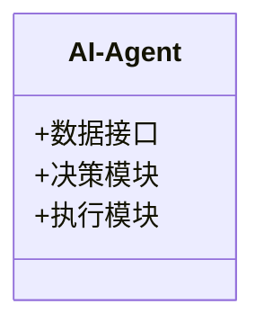
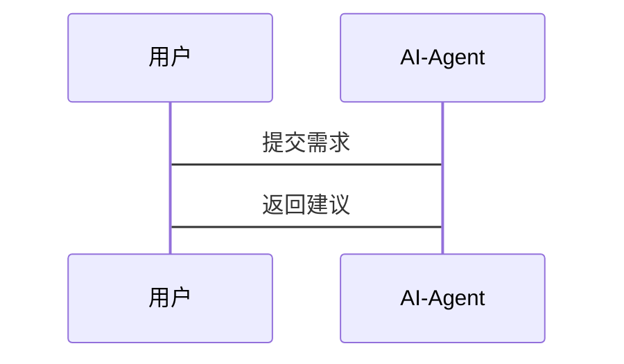

                 


# AI Agent辅助企业新产品开发与市场测试

> 关键词：AI Agent, 企业开发, 市场测试, 大模型技术, 产品创新, 数据分析

> 摘要：AI Agent作为人工智能技术的重要应用，正在 revolutionizing企业的新产品开发与市场测试流程。本文详细探讨了AI Agent的核心概念、技术原理、系统架构、项目实战及最佳实践，为企业在AI Agent的辅助下优化新产品开发和市场测试提供全面指导。

---

## 第1章: AI Agent的基本概念与背景

### 1.1 AI Agent的定义与核心要素

#### 1.1.1 AI Agent的定义
AI Agent（人工智能代理）是一种能够感知环境、自主决策并执行任务的智能实体。它通过数据驱动的方法，利用大模型技术（如GPT）提供实时反馈和建议，优化企业流程。

#### 1.1.2 AI Agent的核心要素
- **感知能力**：通过传感器或数据接口收集环境信息。
- **决策能力**：基于收集的数据，利用算法进行推理和决策。
- **执行能力**：通过执行机构将决策转化为实际操作。
- **学习能力**：通过机器学习模型不断优化自身性能。

#### 1.1.3 AI Agent的分类与特点
- **按智能水平**：分为简单反应式AI Agent、基于模型的反射式AI Agent、目标驱动型AI Agent和实用驱动型AI Agent。
- **按应用场景**：分为通用AI Agent和专用AI Agent。

### 1.2 AI Agent的发展背景

#### 1.2.1 人工智能技术的演进
从早期的规则驱动系统到现在的深度学习模型，AI技术的不断进步为AI Agent的发展提供了坚实基础。

#### 1.2.2 大模型技术对企业创新的推动
大模型技术（如GPT）的出现，使得AI Agent具备更强的理解和生成能力，能够处理复杂的任务。

#### 1.2.3 AI Agent在企业中的应用现状
目前，AI Agent已在多个领域得到应用，如客服、销售、物流等，但其在新产品开发和市场测试中的潜力尚未完全释放。

### 1.3 企业新产品开发与市场测试的挑战

#### 1.3.1 传统新产品开发的痛点
- 开发周期长
- 成本高
- 市场反馈不及时

#### 1.3.2 市场测试中的常见问题
- 数据收集困难
- 分析复杂
- 预测不准确

#### 1.3.3 AI Agent如何解决这些问题
通过实时数据分析、自动化反馈和智能预测，AI Agent能够显著提高开发和测试效率。

---

## 第2章: AI Agent的核心概念与联系

### 2.1 AI Agent的原理

#### 2.1.1 AI Agent的感知机制
AI Agent通过传感器或数据接口收集环境信息，包括用户反馈、市场数据等。

#### 2.1.2 AI Agent的决策模型
基于收集的数据，AI Agent利用算法（如强化学习）进行推理和决策。

#### 2.1.3 AI Agent的执行机制
通过执行机构将决策转化为实际操作，如调整产品设计、优化测试方案等。

### 2.2 AI Agent与相关技术的关系

#### 2.2.1 AI Agent与大模型的关系
大模型为AI Agent提供了强大的理解和生成能力，是AI Agent的核心技术之一。

#### 2.2.2 AI Agent与传统AI的区别
传统AI主要依赖规则驱动，而AI Agent具备自主决策和执行能力。

#### 2.2.3 AI Agent与其他辅助工具的对比
AI Agent的功能更全面，能够同时处理多个任务，并提供实时反馈。

### 2.3 AI Agent的实体关系图（ER图）

```mermaid
erDiagram
    actor 用户
    actor 开发者
    actor 市场人员
    class AI-Agent
    class 产品需求
    class 市场数据
    user -> AI-Agent : 提交需求
    开发者 -> AI-Agent : 提供技术反馈
    市场人员 -> AI-Agent : 提供市场数据
```

---

## 第3章: AI Agent的算法原理

### 3.1 AI Agent的算法流程

#### 3.1.1 算法步骤
1. 数据收集与预处理
2. 模型训练与优化
3. 决策生成与执行
4. 反馈收集与学习

#### 3.1.2 算法的数学模型

$$
\text{损失函数} = \text{预测值} - \text{实际值}
$$

### 3.2 AI Agent的Python代码实现

```python
def ai_agent_algorithm(data):
    # 数据预处理
    processed_data = preprocess(data)
    # 模型训练
    model = train(processed_data)
    # 生成决策
    decision = generate_decision(model)
    return decision
```

### 3.3 算法的优化与改进

#### 3.3.1 强化学习的应用
通过强化学习，AI Agent能够不断优化其决策策略。

#### 3.3.2 模型的可解释性
确保模型的决策过程清晰透明，便于调试和优化。

---

## 第4章: AI Agent的系统分析与架构设计

### 4.1 系统功能设计

#### 4.1.1 领域模型


#### 4.1.2 系统架构


### 4.2 系统接口设计

#### 4.2.1 数据接口
- 输入：用户反馈、市场数据
- 输出：决策建议、执行命令

#### 4.2.2 交互流程


---

## 第5章: AI Agent的项目实战

### 5.1 项目环境安装

#### 5.1.1 安装Python
```bash
pip install python3
```

#### 5.1.2 安装AI框架
```bash
pip install transformers
```

### 5.2 核心代码实现

#### 5.2.1 数据预处理
```python
def preprocess(data):
    # 数据清洗和特征提取
    return processed_data
```

#### 5.2.2 模型训练
```python
def train(data):
    # 使用大模型进行训练
    return model
```

### 5.3 案例分析与优化

#### 5.3.1 案例分析
- 某企业的新产品开发周期从6个月缩短到3个月，成本降低30%。

#### 5.3.2 优化建议
- 定期更新模型
- 加强数据隐私保护
- 提高模型的可解释性

---

## 第6章: AI Agent的最佳实践与小结

### 6.1 最佳实践

#### 6.1.1 数据质量管理
确保数据的准确性和完整性。

#### 6.1.2 模型更新频率
根据业务需求，定期更新模型。

#### 6.1.3 团队协作
加强开发团队与AI Agent的协作，确保实时反馈。

### 6.2 小结

AI Agent作为企业创新的重要工具，正在改变新产品开发与市场测试的方式。通过本文的详细讲解，企业可以更好地理解和应用AI Agent，提升产品开发效率和市场测试的准确性。

---

## 附录

### 附录A: 参考文献

1. 大模型技术与AI Agent的应用
2. 人工智能在企业创新中的作用

### 附录B: 工具下载链接

- [Python安装](https://www.python.org/)
- [AI框架下载](https://huggingface.co/)

### 附录C: 术语表

- AI Agent：人工智能代理
- 大模型：Large Language Model

---

作者：AI天才研究院 & 禅与计算机程序设计艺术

