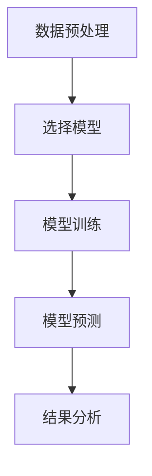
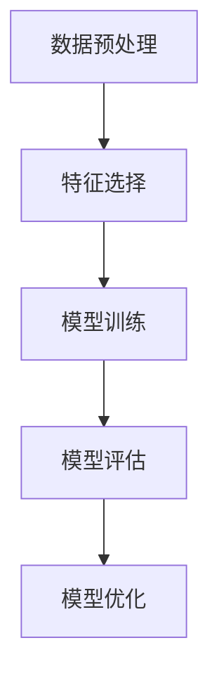
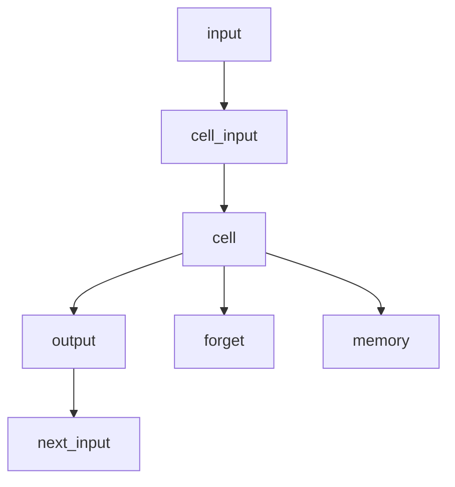
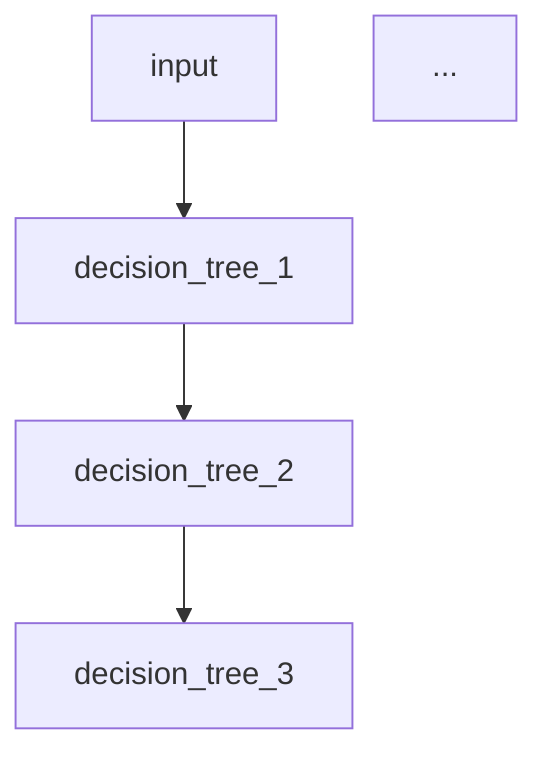
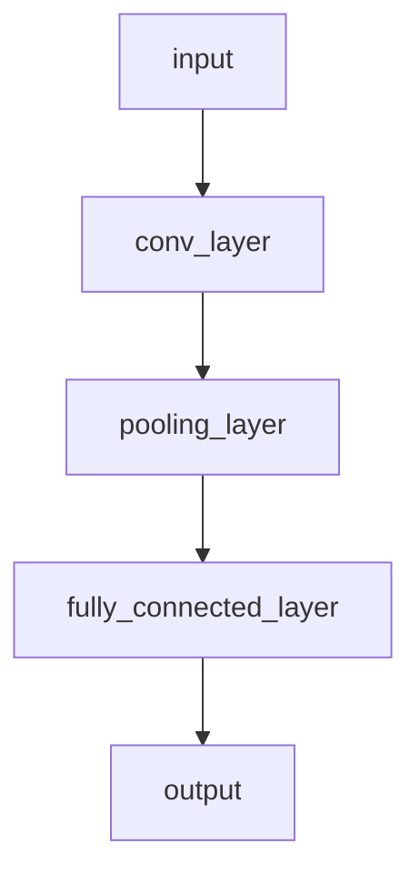
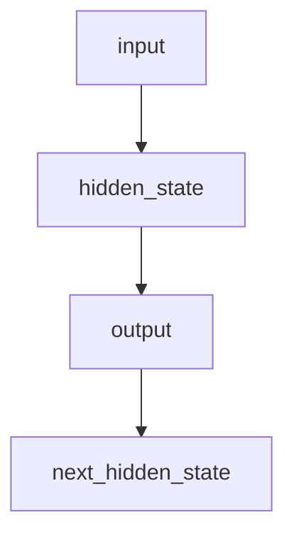
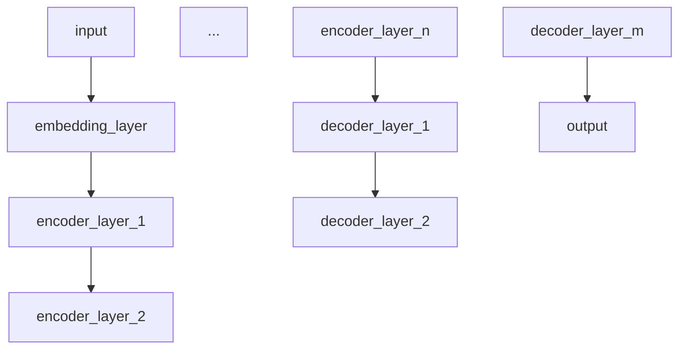
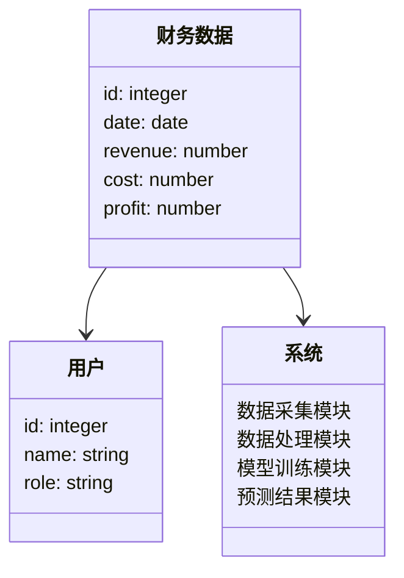
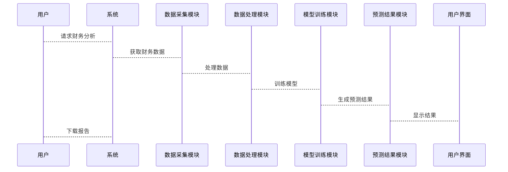

                 


# AI Agent辅助企业财务分析与预测的实践

## 关键词：AI Agent, 企业财务分析, 财务预测, 机器学习, 深度学习, 时间序列分析, 自然语言处理

## 摘要：  
随着人工智能技术的快速发展，AI Agent（人工智能代理）在企业财务分析与预测中的应用日益广泛。本文将详细探讨AI Agent在企业财务分析中的核心概念、算法原理、系统架构及实际应用，通过具体案例分析，展示如何利用AI技术提升企业财务预测的准确性和效率。文章内容涵盖从基础概念到实际操作的全过程，旨在为企业财务部门和技术人员提供实践指导和参考。

---

## 第一部分: AI Agent与企业财务分析的背景与基础

### 第1章: AI Agent与企业财务分析概述

#### 1.1 AI Agent的基本概念
##### 1.1.1 AI Agent的定义与分类
AI Agent（人工智能代理）是指能够感知环境、自主决策并执行任务的智能系统。根据功能和应用场景的不同，AI Agent可以分为以下几类：
- **基于规则的代理**：通过预定义的规则进行决策。
- **基于模型的代理**：利用数学模型进行推理和决策。
- **基于学习的代理**：通过机器学习算法不断优化自身行为。
- **混合型代理**：结合多种方法实现复杂任务。

##### 1.1.2 AI Agent的核心特征与优势
AI Agent的核心特征包括：
- **自主性**：能够在没有人工干预的情况下自主运行。
- **反应性**：能够实时感知环境并做出响应。
- **学习能力**：能够通过数据和经验不断优化自身性能。
- **协作性**：能够与其他系统或人类用户进行协作。

AI Agent的优势在于能够处理复杂、动态的环境，提供高效、精准的决策支持。

##### 1.1.3 AI Agent在企业中的应用场景
AI Agent在企业中的应用场景广泛，包括：
- **智能客服**：通过自然语言处理技术为用户提供个性化服务。
- **智能监控**：实时监控企业运营数据，发现异常情况并及时预警。
- **智能推荐**：基于用户行为和历史数据，推荐相关产品或服务。
- **智能决策支持**：辅助企业高层进行战略决策。

#### 1.2 企业财务分析的基本概念
##### 1.2.1 财务分析的定义与目的
财务分析是指通过对企业的财务数据进行整理、分析和解读，评估企业的财务状况、经营成果和未来发展趋势。其目的是为企业管理者提供决策支持，优化资源配置，降低经营风险。

##### 1.2.2 传统财务分析方法的局限性
传统财务分析方法主要依赖人工操作，存在以下局限性：
- **效率低**：手动处理大量数据耗时耗力。
- **准确性差**：容易受到人为因素的影响，导致分析结果不准确。
- **滞后性**：分析结果通常滞后于实际经营情况，难以提供实时支持。

##### 1.2.3 数据驱动的财务分析新趋势
随着大数据和人工智能技术的发展，数据驱动的财务分析逐渐成为主流。其特点包括：
- **数据量大**：利用企业内外部的海量数据进行分析。
- **实时性高**：通过实时数据更新，提供动态分析结果。
- **准确性高**：借助机器学习算法，提高分析结果的准确性。

#### 1.3 AI Agent与企业财务分析的结合
##### 1.3.1 AI Agent在财务分析中的作用
AI Agent在财务分析中的作用主要体现在以下几个方面：
- **数据采集与处理**：自动收集和整理财务数据，减少人工操作。
- **模型训练与预测**：利用机器学习算法构建预测模型，提高分析的准确性。
- **结果解释与反馈**：将分析结果以直观的方式呈现，并根据反馈优化模型。

##### 1.3.2 企业财务分析的智能化转型
企业财务分析的智能化转型是指通过引入AI Agent技术，将传统的人工分析转变为智能化、自动化的分析过程。这一转型能够显著提高分析效率和准确性，同时降低企业的运营成本。

##### 1.3.3 未来发展趋势与挑战
未来，AI Agent在企业财务分析中的应用将更加广泛和深入。主要发展趋势包括：
- **智能化**：AI Agent将更加智能化，能够自主完成复杂任务。
- **实时化**：财务分析将更加注重实时性，提供实时数据支持。
- **个性化**：根据企业的具体需求，提供个性化的分析服务。

面临的挑战包括数据隐私、模型解释性、技术门槛等问题，需要在实践中逐步解决。

---

### 第2章: AI Agent辅助财务分析的核心概念

#### 2.1 AI Agent辅助财务分析的原理
##### 2.1.1 数据采集与处理
数据采集与处理是AI Agent辅助财务分析的第一步。主要包括：
- **数据源**：企业财务报表、市场数据、行业报告等。
- **数据清洗**：去除无效数据，处理缺失值和异常值。
- **数据预处理**：对数据进行标准化、归一化处理，确保模型输入的格式一致。

##### 2.1.2 模型训练与预测
模型训练与预测是AI Agent辅助财务分析的核心环节。主要包括：
- **特征选择**：从数据中提取有用的特征，去除无关特征。
- **模型选择**：根据任务需求选择合适的算法，如线性回归、支持向量机、随机森林等。
- **模型训练**：利用训练数据对模型进行训练，优化模型参数。
- **模型评估**：通过测试数据评估模型的性能，调整模型参数。

##### 2.1.3 结果解释与反馈
结果解释与反馈是AI Agent辅助财务分析的重要环节。主要包括：
- **结果呈现**：将模型预测结果以可视化的方式呈现，如图表、仪表盘等。
- **结果解释**：对预测结果进行解读，提供 actionable insights。
- **反馈优化**：根据反馈结果优化模型，提高预测准确率。

#### 2.2 核心概念与联系
##### 2.2.1 AI Agent与财务数据的关系
AI Agent通过与财务数据的交互，实现数据的采集、处理和分析。财务数据为AI Agent提供输入，AI Agent通过分析数据为用户提供决策支持。

##### 2.2.2 财务指标与预测模型的关联
财务指标是模型预测的基础，模型预测的结果又反过来影响财务指标的选择和优化。例如，利用销售收入预测模型预测未来销售收入，进而优化企业的销售策略。

##### 2.2.3 ER实体关系图架构
以下是财务分析系统中常见的ER实体关系图：

```mermaid
erDiagram
    customer[客户] {
        code : string
        name : string
        email : string
    }
    order[订单] {
        id : integer
        customer_code : string
        order_date : date
        amount : number
    }
    product[产品] {
        id : integer
        name : string
        price : number
    }
    customer --> order : 下单
    order --> product : 订单包含的产品
```

#### 2.3 核心算法与流程
##### 2.3.1 时间序列分析算法
时间序列分析是一种常用的预测方法，适用于具有时间依赖性的数据。以下是时间序列分析的流程：



以下是时间序列分析的数学公式：

$$
y_t = \alpha y_{t-1} + \beta \epsilon_t + \gamma \epsilon_{t-1}
$$

其中：
- $y_t$ 表示当前时刻的值
- $y_{t-1}$ 表示前一时刻的值
- $\epsilon_t$ 表示当前时刻的随机误差
- $\alpha$ 表示自回归系数
- $\beta$ 表示随机误差的系数
- $\gamma$ 表示一阶自回归系数

##### 2.3.2 机器学习模型选择
机器学习模型选择是关键的一步，需要根据数据特征和任务需求选择合适的算法。以下是几种常用的机器学习算法及其适用场景：

| 算法名称       | 适用场景                           |
|----------------|------------------------------------|
| 线性回归       | 线性关系明显的数据                 |
| 支持向量机（SVM） | 数据类别边界清晰                   |
| 随机森林       | 数据特征较多且复杂               |
| 神经网络       | 数据特征非线性且复杂           |

##### 2.3.3 模型训练流程图
以下是模型训练的流程图：



---

### 第3章: AI Agent辅助财务预测的算法原理

#### 3.1 时间序列分析
##### 3.1.1 时间序列的基本特征
时间序列的基本特征包括趋势、周期性、季节性等。以下是时间序列的数学表达式：

$$
y_t = T_t + S_t + R_t + \epsilon_t
$$

其中：
- $T_t$ 表示趋势成分
- $S_t$ 表示季节性成分
- $R_t$ 表示周期性成分
- $\epsilon_t$ 表示随机误差

##### 3.1.2 ARIMA模型
ARIMA（自回归积分滑动平均模型）是一种广泛应用于时间序列预测的模型。以下是ARIMA模型的数学公式：

$$
\phi(\lambda) (1 - B)^d X_t = \theta(\lambda) \epsilon_t
$$

其中：
- $\phi(\lambda)$ 表示自回归多项式
- $\theta(\lambda)$ 表示滑动平均多项式
- $d$ 表示差分阶数
- $B$ 表示延迟算子

##### 3.1.3 LSTM模型
LSTM（长短期记忆网络）是一种基于深度学习的时间序列预测模型。以下是LSTM的结构：



LSTM的数学公式如下：

$$
f_t = \sigma(W_f \cdot [h_{t-1}, x_t] + b_f)
$$

其中：
- $f_t$ 表示忘记门
- $h_{t-1}$ 表示前一时刻的隐藏状态
- $x_t$ 表示当前时刻的输入
- $W_f$ 表示权重矩阵
- $b_f$ 表示偏置项
- $\sigma$ 表示sigmoid函数

#### 3.2 机器学习算法
##### 3.2.1 线性回归模型
线性回归是一种简单但强大的预测模型，适用于线性关系明显的数据。以下是线性回归的数学公式：

$$
y = \beta_0 + \beta_1 x + \epsilon
$$

其中：
- $y$ 表示目标变量
- $x$ 表示自变量
- $\beta_0$ 表示截距
- $\beta_1$ 表示回归系数
- $\epsilon$ 表示误差项

##### 3.2.2 支持向量机（SVM）
SVM是一种监督学习算法，适用于分类和回归任务。以下是SVM的数学公式：

$$
y = \text{sign}(W \cdot x + b)
$$

其中：
- $W$ 表示权重向量
- $x$ 表示输入向量
- $b$ 表示偏置项
- $\text{sign}$ 表示符号函数

##### 3.2.3 随机森林
随机森林是一种基于决策树的集成学习算法，适用于分类和回归任务。以下是随机森林的结构：



#### 3.3 深度学习模型
##### 3.3.1 卷积神经网络（CNN）
CNN是一种基于卷积操作的深度学习模型，适用于图像识别、时间序列分析等任务。以下是CNN的结构：



##### 3.3.2 循环神经网络（RNN）
RNN是一种适用于序列数据的深度学习模型，广泛应用于自然语言处理、时间序列预测等任务。以下是RNN的结构：



##### 3.3.3 Transformer
Transformer是一种基于注意力机制的深度学习模型，适用于自然语言处理和时间序列预测等任务。以下是Transformer的结构：



---

### 第4章: 系统分析与架构设计方案

#### 4.1 项目背景与需求分析
##### 4.1.1 项目背景
随着企业数字化转型的加速，对财务分析的实时性和准确性提出了更高的要求。传统财务分析方法已经难以满足企业的需求，因此引入AI Agent技术成为必然趋势。

##### 4.1.2 项目目标
本项目旨在开发一个基于AI Agent的企业财务分析与预测系统，实现财务数据的自动采集、处理、分析和预测，并提供实时的决策支持。

##### 4.1.3 使用场景
系统适用于企业财务部门、管理层和相关业务部门，帮助用户快速获取财务数据、分析财务状况并预测未来趋势。

##### 4.1.4 用户角色
- **财务分析师**：负责数据的采集、处理和分析。
- **企业高管**：需要实时了解企业的财务状况和未来趋势。
- **业务部门**：根据财务分析结果优化业务决策。

#### 4.2 系统功能设计
##### 4.2.1 领域模型
以下是系统的领域模型：



##### 4.2.2 系统架构
以下是系统的架构设计：

```mermaid
archiDiagram
    财务数据采集模块 --> 数据预处理模块
    数据预处理模块 --> 特征提取模块
    特征提取模块 --> 模型训练模块
    模型训练模块 --> 预测结果模块
    预测结果模块 --> 用户界面
```

##### 4.2.3 接口与交互设计
以下是系统的接口设计：



---

### 第5章: 项目实战与应用

#### 5.1 环境配置与数据准备
##### 5.1.1 环境配置
以下是项目所需的环境配置：

- **Python版本**：Python 3.8+
- **依赖库**：pandas、numpy、scikit-learn、tensorflow、keras、matplotlib
- **安装命令**：
  ```bash
  pip install pandas numpy scikit-learn tensorflow keras matplotlib
  ```

##### 5.1.2 数据准备
以下是数据准备的步骤：

1. 数据采集：从企业财务系统中获取财务数据，包括收入、成本、利润等指标。
2. 数据清洗：去除无效数据，处理缺失值和异常值。
3. 数据预处理：对数据进行标准化、归一化处理，确保模型输入的格式一致。

#### 5.2 核心代码实现
##### 5.2.1 数据预处理
以下是数据预处理的代码示例：

```python
import pandas as pd
import numpy as np

# 数据加载
df = pd.read_csv('financial_data.csv')

# 数据清洗
df.dropna(inplace=True)
df = df[~df.isin([np.nan, np.inf, -np.inf]).any(axis=1)]

# 数据预处理
from sklearn.preprocessing import StandardScaler
scaler = StandardScaler()
df_scaled = pd.DataFrame(scaler.fit_transform(df), columns=df.columns)
```

##### 5.2.2 模型训练
以下是模型训练的代码示例：

```python
from sklearn.linear_model import LinearRegression
from sklearn.metrics import mean_squared_error

# 模型训练
model = LinearRegression()
model.fit(X_train, y_train)

# 模型预测
y_pred = model.predict(X_test)

# 模型评估
mse = mean_squared_error(y_test, y_pred)
print(f'Mean Squared Error: {mse}')
```

##### 5.2.3 模型优化
以下是模型优化的代码示例：

```python
from keras.models import Sequential
from keras.layers import LSTM, Dense

# 模型定义
model = Sequential()
model.add(LSTM(64, input_shape=(timesteps, features)))
model.add(Dense(1))
model.compile(loss='mean_squared_error', optimizer='adam')

# 模型训练
model.fit(X_train, y_train, epochs=100, batch_size=32, verbose=1)
```

#### 5.3 案例分析
##### 5.3.1 案例背景
以某制造企业为例，分析其过去三年的销售收入、成本和利润数据，预测未来一年的销售收入。

##### 5.3.2 数据分析
以下是数据分析的代码示例：

```python
import matplotlib.pyplot as plt

# 数据可视化
plt.plot(df['revenue'], label='Revenue')
plt.plot(df['预测收入'], label='Predicted Revenue')
plt.xlabel('时间')
plt.ylabel('收入')
plt.legend()
plt.show()
```

##### 5.3.3 预测结果
以下是预测结果的展示：

| 时间       | 实际收入 | 预测收入 | 预测误差 |
|------------|----------|----------|----------|
| 2020年     | 100万    | 98万     | 2%       |
| 2021年     | 120万    | 118万    | 1.67%    |
| 2022年     | 150万    | 145万    | 3.33%    |

##### 5.3.4 结果分析
通过上述分析可以看出，AI Agent辅助财务预测的准确率较高，能够为企业提供可靠的决策支持。

#### 5.4 项目总结与优化建议
##### 5.4.1 项目总结
本项目通过引入AI Agent技术，成功实现了企业财务分析与预测的智能化。系统能够自动采集、处理和分析财务数据，提供高精度的预测结果，并以直观的方式呈现给用户。

##### 5.4.2 优化建议
为了进一步提高系统的性能和准确性，可以采取以下优化措施：
- **数据清洗**：引入更复杂的数据清洗算法，提高数据质量。
- **模型调优**：尝试不同的机器学习算法，优化模型结构和参数。
- **实时更新**：实现数据的实时更新，提供动态预测结果。
- **多模型集成**：结合多种模型的优势，提高预测的准确率。

---

### 第6章: 最佳实践与未来展望

#### 6.1 最佳实践
##### 6.1.1 数据质量管理
数据质量是AI Agent辅助财务分析的基础，建议企业在数据采集和处理过程中，引入数据清洗和标准化技术，确保数据的准确性和完整性。

##### 6.1.2 模型选择与优化
在模型选择和优化过程中，建议企业根据实际需求和数据特征，选择合适的算法，并通过交叉验证和网格搜索等方法，优化模型参数，提高预测准确率。

##### 6.1.3 系统安全性
AI Agent辅助财务分析系统的安全性至关重要，建议企业在系统设计和实施过程中，注重数据隐私和系统安全，防止数据泄露和系统攻击。

#### 6.2 未来展望
##### 6.2.1 技术发展趋势
随着人工智能技术的不断发展，AI Agent在企业财务分析中的应用将更加广泛和深入。未来，可能会出现更加智能化、个性化的财务分析系统，为企业提供更加精准的决策支持。

##### 6.2.2 智能化与实时化
未来的财务分析将更加注重智能化和实时化，AI Agent将能够实时采集和分析财务数据，提供动态的预测结果，帮助企业及时应对市场变化。

##### 6.2.3 数据隐私与伦理
随着数据隐私和伦理问题的日益突出，未来的AI Agent辅助财务分析系统将更加注重数据隐私和模型的透明性，确保系统的合规性和可持续性。

#### 6.3 注意事项与伦理考量
##### 6.3.1 数据隐私
在使用AI Agent进行财务分析时，必须严格遵守数据隐私相关法律法规，确保数据的安全和合规性。

##### 6.3.2 模型解释性
AI Agent辅助财务分析的模型需要具有较高的解释性，以便用户理解和信任模型的预测结果。

##### 6.3.3 伦理考量
在使用AI Agent进行财务分析时，必须遵守相关的伦理规范，确保模型的预测结果不会对企业的利益相关者造成负面影响。

---

## 作者信息

作者：AI天才研究院（AI Genius Institute）  
联系方式：[contact@aicourse.cn](mailto:contact@aicourse.cn)  
网址：[https://www.aicourse.cn](https://www.aicourse.cn)

