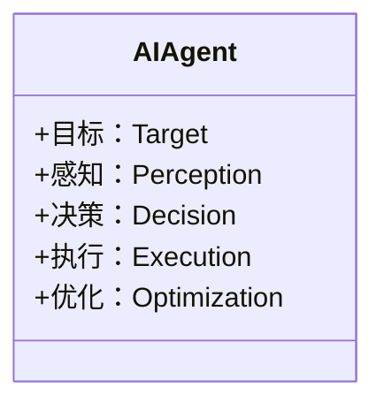
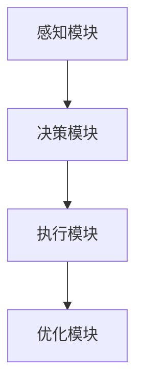
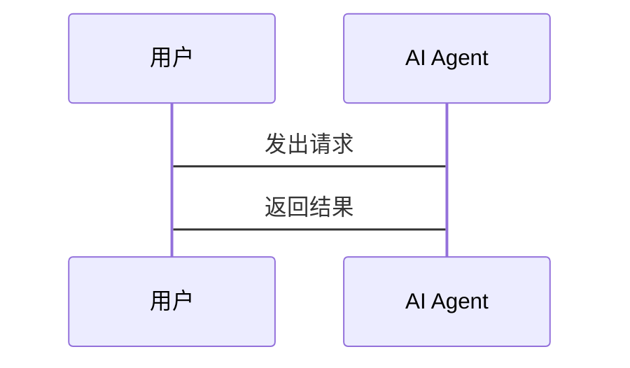

                 


# AI Agent项目的ROI分析：量化收益与成本

> 关键词：AI Agent, ROI分析, 投资回报率, 量化收益, 项目成本, 系统架构

> 摘要：本文将详细分析AI Agent项目的投资回报率（ROI），从背景介绍、核心概念、算法原理、系统架构、项目实战到总结，系统地探讨如何量化AI Agent项目的收益与成本。通过实际案例和数学模型，帮助读者理解AI Agent项目的 ROI 分析方法。

---

## 第一部分: AI Agent项目的背景与核心概念

### 第1章: AI Agent的基本概念与问题背景

#### 1.1 AI Agent的定义与特点
##### 1.1.1 AI Agent的定义
人工智能代理（AI Agent）是一种能够感知环境、自主决策并执行任务的智能实体。它可以是一个软件程序、机器人或其他智能系统，通过传感器和执行器与环境交互。

##### 1.1.2 AI Agent的核心特点
1. **自主性**：AI Agent能够自主决策，无需外部干预。
2. **反应性**：能够实时感知环境并做出反应。
3. **目标导向**：通过设定目标来优化行为。
4. **学习能力**：通过数据和经验不断优化性能。

##### 1.1.3 AI Agent与传统软件的区别
AI Agent与传统软件的区别主要在于其智能性和自主性。传统软件依赖于预定义的规则，而AI Agent能够通过学习和适应环境来优化行为。

#### 1.2 问题背景与问题描述
##### 1.2.1 当前AI Agent应用的现状
AI Agent技术在多个领域得到广泛应用，如自动驾驶、智能助手、推荐系统等。然而，AI Agent项目的实施通常伴随着高成本和复杂性，因此对项目 ROI 的分析显得尤为重要。

##### 1.2.2 项目ROI分析的必要性
AI Agent项目的 ROI 分析有助于企业在投资前评估项目的可行性和潜在收益。通过量化收益与成本，企业可以做出更明智的决策。

##### 1.2.3 问题解决的边界与外延
AI Agent项目的 ROI 分析需要明确项目的目标、范围和边界条件。外延部分则包括项目可能带来的间接收益和长期影响。

#### 1.3 问题解决与核心要素
##### 1.3.1 AI Agent项目的实施流程
1. 需求分析
2. 系统设计
3. 算法实现
4. 测试与优化
5. 项目部署

##### 1.3.2 核心要素的构成与关系
核心要素包括：目标、感知、决策、执行、优化。这些要素相互关联，共同构成AI Agent的完整体系。

##### 1.3.3 问题解决的逻辑框架
通过系统化的逻辑框架，AI Agent能够将复杂问题分解为可管理的部分，逐一解决，最终实现目标。

### 第2章: AI Agent项目的ROI分析框架

#### 2.1 ROI分析的核心概念
##### 2.1.1 投资回报率的基本定义
ROI（Return On Investment）是指投资项目的收益与成本的比率。计算公式为：
$$ ROI = \frac{\text{净收益}}{\text{总投入}} $$

##### 2.1.2 AI Agent项目的收益来源
收益来源包括直接收益（如效率提升、成本降低）和间接收益（如市场竞争力提升）。

##### 2.1.3 项目成本的构成
项目成本包括开发成本、运行成本、维护成本等。

#### 2.2 核心概念的联系与模型
##### 2.2.1 核心概念的属性对比表
| 概念 | 特性 |
|------|------|
| 收益 | 可量化的收益来源 |
| 成本 | 开发、运行和维护成本 |
| ROI  | 收益与成本的比率 |

##### 2.2.2 ER实体关系图架构
```mermaid
erd
  entity 投资回报率 ROI
  entity 项目成本
  entity 项目收益
  ROI --> 项目收益: 由 ... 关联
  ROI --> 项目成本: 由 ... 关联
```

#### 2.3 本章小结
本章介绍了AI Agent项目的ROI分析框架，强调了收益与成本的量化分析的重要性。

---

## 第二部分: AI Agent项目的算法原理

### 第3章: AI Agent项目的算法流程

#### 3.1 算法概述
##### 3.1.1 算法的基本流程
AI Agent的算法流程包括感知、决策、执行和优化四个阶段。

##### 3.1.2 算法的主要步骤
1. 感知环境：通过传感器收集环境数据。
2. 决策：基于感知数据进行分析和决策。
3. 执行：根据决策结果执行动作。
4. 优化：通过反馈不断优化算法性能。

#### 3.2 算法原理的详细讲解
##### 3.2.1 感知模块
感知模块负责收集环境数据，如图像、声音等。

##### 3.2.2 决策模块
决策模块基于感知数据进行分析，选择最优行动方案。

##### 3.2.3 执行模块
执行模块将决策结果转化为实际动作，如控制机器人运动。

##### 3.2.4 优化模块
优化模块通过反馈不断调整算法参数，提高整体性能。

#### 3.3 算法的数学模型与公式
##### 3.3.1 收益预测模型
$$ R = \sum_{i=1}^{n} w_i x_i $$
其中，\( R \) 表示收益，\( w_i \) 是权重，\( x_i \) 是特征变量。

##### 3.3.2 成本预测模型
$$ C = a + b \cdot t $$
其中，\( C \) 表示成本，\( a \) 是固定成本，\( b \) 是单位时间成本，\( t \) 是时间。

#### 3.4 本章小结
本章详细讲解了AI Agent项目的算法流程和数学模型，为后续的系统设计和项目实施奠定了基础。

---

## 第三部分: AI Agent项目的系统分析与架构设计

### 第4章: AI Agent项目的系统架构

#### 4.1 问题场景介绍
AI Agent项目通常涉及复杂的系统架构，包括多个模块和组件。

#### 4.2 系统功能设计
##### 4.2.1 领域模型类图


#### 4.3 系统架构设计
##### 4.3.1 系统架构图


#### 4.4 系统接口设计
系统接口设计包括数据输入接口、控制接口和反馈接口。

#### 4.5 系统交互流程
##### 4.5.1 系统交互序列图


#### 4.6 本章小结
本章通过系统架构设计和交互流程分析，展示了AI Agent项目的整体结构和工作流程。

---

## 第四部分: AI Agent项目的项目实战

### 第5章: AI Agent项目的实战分析

#### 5.1 环境安装
安装必要的开发工具和依赖库，如Python、TensorFlow等。

#### 5.2 系统核心实现
##### 5.2.1 核心代码实现
```python
def calculate_ro

