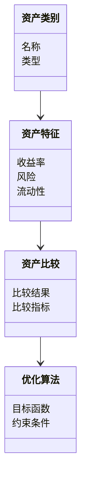
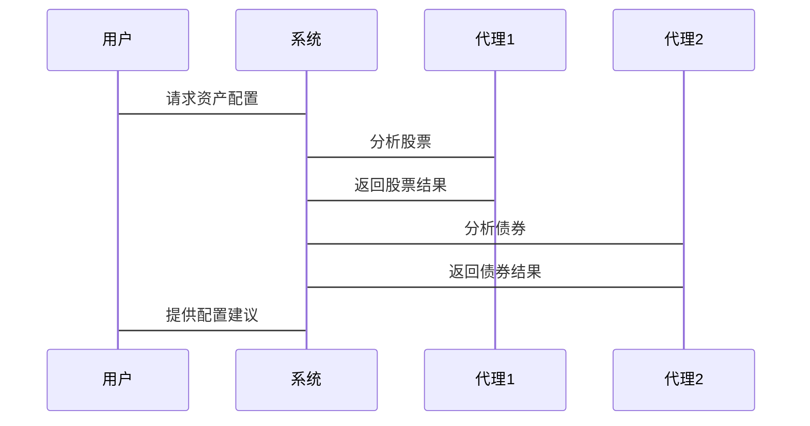

                 


# AI agents协作进行跨资产类别价值比较：优化资产配置

## 关键词：AI代理，跨资产比较，资产配置，优化算法，多智能体系统

## 摘要

本文详细探讨了AI代理协作在跨资产类别价值比较中的应用，旨在通过优化算法提升资产配置效率。文章从背景介绍、核心概念、算法原理到系统架构和项目实战，全面分析了AI代理协作的优势与挑战，并结合实际案例展示了其在金融领域的潜在价值。

## 第一部分: AI agents协作进行跨资产类别价值比较的背景与基础

## 第1章: 资产配置与AI代理协作概述

### 1.1 问题背景与意义

#### 1.1.1 资产配置的传统方法与局限性
传统的资产配置方法依赖于历史数据分析和经验判断，但这种方法在面对复杂多变的市场环境时，往往显得效率低下且难以捕捉新兴机会。随着金融市场的日益复杂化，投资者需要更加智能化和个性化的解决方案。

#### 1.1.2 AI代理在资产配置中的潜在价值
AI代理通过实时数据处理和复杂模型运算，能够快速分析多类资产的潜在收益与风险，为投资者提供精准的配置建议。此外，AI代理可以协同工作，形成分布式计算和决策能力，显著提高资产配置的效率和准确性。

#### 1.1.3 跨资产类别比较的挑战与机遇
跨资产类别比较涉及不同金融工具的复杂性，包括股票、债券、基金等多种类型。这种比较需要考虑多种因素，如流动性、风险承受能力、市场趋势等。AI代理可以通过深度学习和自然语言处理技术，自动提取和分析这些因素，为投资者提供更全面的比较结果。

### 1.2 AI代理协作的核心概念

#### 1.2.1 AI代理的定义与特点
AI代理是一种智能体，能够感知环境、执行任务并做出决策。其特点包括自主性、反应性、目标导向和协作性。在资产配置中，AI代理可以独立分析数据，同时与其他代理协作，共同完成复杂的任务。

#### 1.2.2 跨资产类别比较的定义与目标
跨资产类别比较是指在多种资产类别之间进行价值评估和比较，以确定最优的投资组合。其目标是通过分析不同资产的风险和收益，为投资者提供科学的配置建议。

#### 1.2.3 AI代理协作在资产配置中的作用
AI代理通过协作，可以充分利用各自的优势，进行分布式数据处理和分析。例如，一个代理可以负责分析股票数据，另一个负责分析债券数据，通过协同工作，提供全面的资产比较结果。

### 1.3 跨资产类别比较的关键要素

#### 1.3.1 资产类别与特征分析
资产类别包括股票、债券、房地产等，每个类别都有其独特的特征。例如，股票的风险较高但收益潜力大，债券的风险较低但收益相对稳定。AI代理需要能够识别这些特征，并进行比较。

#### 1.3.2 价值比较的核心指标
价值比较的核心指标包括收益、风险、流动性等。AI代理需要能够计算这些指标，并进行综合评估，以确定最优资产组合。

#### 1.3.3 优化资产配置的目标函数
优化资产配置的目标函数通常包括最大化收益、最小化风险等。AI代理可以通过优化算法，找到最优的资产配置方案。

## 第2章: AI代理协作的理论基础

### 2.1 多智能体系统概述

#### 2.1.1 多智能体系统的定义与特点
多智能体系统是指多个智能体协同工作的系统，具有分布性、协作性、反应性和适应性等特点。在资产配置中，多个AI代理可以协同工作，共同完成复杂的任务。

#### 2.1.2 多智能体系统的分类与应用
多智能体系统可以分为集中式和分布式两类。在资产配置中，分布式系统更为常见，因为不同代理可以独立分析不同资产类别，然后协同得出结论。

#### 2.1.3 多智能体系统在资产配置中的应用
多智能体系统可以用于实时监控市场变化、分析多种资产类别、制定投资策略等。通过协同工作，AI代理可以提供更全面和准确的资产配置建议。

### 2.2 跨资产类别比较的数学模型

#### 2.2.1 资产回报率的数学表达
资产回报率可以通过历史数据和预测模型进行计算。例如，股票的回报率可以表示为 $r_i = \frac{p_i(t+1) - p_i(t)}{p_i(t)}$，其中 $p_i(t)$ 是第 $i$ 资产在时间 $t$ 的价格。

#### 2.2.2 风险评估的数学模型
风险可以通过方差或标准差来衡量。例如，资产组合的风险可以表示为 $\sigma_p = \sqrt{\sum_{i=1}^n w_i^2 \sigma_i^2 + 2 \sum_{i<j} w_i w_j \sigma_i \sigma_j \rho_{ij}}$，其中 $w_i$ 是第 $i$ 资产的权重，$\sigma_i$ 是第 $i$ 资产的风险，$\rho_{ij}$ 是第 $i$ 和 $j$ 资产之间的相关系数。

#### 2.2.3 资产配置的优化算法
资产配置的优化算法可以采用均值-方差优化，目标是最小化风险或最大化收益。例如，使用拉格朗日乘数法求解优化问题：$$\min_w \sigma_p^2$$ subject to $$\sum_{i=1}^n w_i = 1$$和$$\mathbb{E}[r] = \sum_{i=1}^n w_i \mathbb{E}[r_i]$$

### 2.3 AI代理协作的算法基础

#### 2.3.1 分布式计算与协作机制
AI代理可以通过分布式计算技术协同工作，每个代理负责一部分数据的处理和分析，然后将结果汇总，得出最终的资产配置建议。

#### 2.3.2 跨代理通信协议
为了实现协作，AI代理之间需要有高效的通信协议。例如，使用HTTP协议进行数据交换，或者使用消息队列进行异步通信。

#### 2.3.3 联合决策算法
联合决策算法可以采用投票机制、加权平均等方法，综合多个代理的决策结果，得出最终的资产配置方案。

## 第三部分: 算法原理

## 第3章: 优化算法原理与实现

### 3.1 遗传算法

#### 3.1.1 遗传算法的基本原理
遗传算法是一种模拟自然选择的优化算法，包括编码、选择、交叉和变异等步骤。例如，将资产配置问题编码为二进制字符串，然后通过选择、交叉和变异生成新的个体，最终找到最优解。

#### 3.1.2 遗传算法的实现步骤
1. 初始化种群：随机生成一组资产配置方案。
2. 计算适应度：评估每个方案的收益和风险。
3. 选择：根据适应度值选择优秀方案。
4. 交叉：生成新的方案。
5. 变异：随机改变部分方案。
6. 重复步骤2-5，直到满足终止条件。

#### 3.1.3 遗传算法的Python实现
```python
import random

def fitness(w, returns):
    variance = sum(w[i] ** 2 * returns[i] for i in range(len(w)))
    return -variance  # 最小化方差

def genetic_algorithm(asset_returns, population_size=100, generations=50):
    n = len(asset_returns)
    # 初始化种群
    population = [[random.random() for _ in range(n)] for _ in range(population_size)]
    for i in range(population_size):
        sum_weights = sum(population[i])
        population[i] = [x / sum_weights for x in population[i]]

    for _ in range(generations):
        # 计算适应度
        fitness_values = [fitness(w, asset_returns) for w in population]
        # 选择
        selected = [population[i] for i in range(population_size) if fitness_values[i] > max(fitness_values) * 0.5]
        # 交叉
        new_population = []
        while len(new_population) < population_size:
            parent1 = random.choice(selected)
            parent2 = random.choice(selected)
            child = [max(parent1[i], parent2[i]) for i in range(n)]
            new_population.append(child)
        # 变异
        for i in range(population_size):
            if random.random() < 0.1:
                j = random.randint(0, n-1)
                new_population[i][j] = random.random()
        population = new_population

    best = max(fitness(w, asset_returns) for w in population)
    best_solution = [w for w in population if fitness(w, asset_returns) == best][0]
    return best_solution
```

#### 3.1.4 遗传算法的优缺点分析
遗传算法具有全局搜索能力，能够找到全局最优解，但计算复杂度较高，收敛速度较慢。

### 3.2 模拟退火算法

#### 3.2.1 模拟退火的基本原理
模拟退火是一种全局优化算法，通过模拟金属退火过程，逐步降低系统的能量。例如，从一个随机的资产配置方案开始，逐步调整方案，以降低风险。

#### 3.2.2 模拟退火的实现步骤
1. 初始化：随机生成一个资产配置方案。
2. 计算目标函数：评估方案的风险或收益。
3. 降温：逐步降低温度，减少扰动幅度。
4. 扰动：随机改变方案，计算新的目标函数。
5. 接受或拒绝：根据梅尔策准则决定是否接受新的方案。
6. 重复步骤3-5，直到满足终止条件。

#### 3.2.3 模拟退火的Python实现
```python
import random

def simulated_annealing(asset_returns, max_iterations=1000, initial_temp=1000):
    n = len(asset_returns)
    # 初始化
    current = [random.random() for _ in range(n)]
    sum_weights = sum(current)
    current = [x / sum_weights for x in current]

    best = current.copy()
    best_fitness = fitness(current, asset_returns)

    for temp in range(initial_temp, 0, -1):
        # 扰动
        neighbor = [x + random.gauss(0, temp/100) for x in current]
        sum_neighbor = sum(neighbor)
        if sum_neighbor == 0:
            neighbor = [random.random() for _ in range(n)]
            sum_neighbor = sum(neighbor)
        neighbor = [x / sum_neighbor for x in neighbor]

        # 计算适应度
        current_fitness = fitness(neighbor, asset_returns)

        # 接受准则
        if current_fitness > best_fitness:
            best_fitness = current_fitness
            best = neighbor.copy()
        elif random.random() < 0.1:
            best = neighbor.copy()

        # 降温
        current = best.copy()

    return best

def fitness(weights, returns):
    variance = sum(weights[i] ** 2 * returns[i] for i in range(len(weights)))
    return -variance  # 最小化方差
```

#### 3.2.4 模拟退火的优缺点分析
模拟退火能够跳出局部最优，找到全局最优解，但收敛速度较慢，参数设置较为复杂。

### 3.3 粒子群优化

#### 3.3.1 粒子群优化的基本原理
粒子群优化是一种基于群体智能的优化算法，通过模拟鸟群觅食行为，寻找最优解。例如，将每个粒子看作一个可能的资产配置方案，通过更新速度和位置，找到最优解。

#### 3.3.2 粒子群优化的实现步骤
1. 初始化：随机生成一群粒子，每个粒子代表一个资产配置方案。
2. 计算适应度：评估每个方案的风险或收益。
3. 更新速度：根据粒子自身的经验和群体经验，调整速度。
4. 更新位置：根据新的速度，移动到新的位置。
5. 记录最优解：跟踪全局最优解和个体最优解。
6. 重复步骤2-5，直到满足终止条件。

#### 3.3.3 粒子群优化的Python实现
```python
import random

def particle_swarm_optimization(asset_returns, n_particles=50, max_iterations=100):
    n = len(asset_returns)
    # 初始化
    particles = [[random.random() for _ in range(n)] for _ in range(n_particles)]
    for i in range(n_particles):
        sum_weights = sum(particles[i])
        particles[i] = [x / sum_weights for x in particles[i]]

    best = min(particles, key=lambda x: fitness(x, asset_returns))
    best_fitness = fitness(best, asset_returns)

    for _ in range(max_iterations):
        # 更新速度和位置
        for i in range(n_particles):
            # 计算适应度
            fitness_i = fitness(particles[i], asset_returns)
            # 更新全局最优
            if fitness_i < best_fitness:
                best_fitness = fitness_i
                best = particles[i].copy()

        # 重新初始化位置
        new_positions = []
        for i in range(n_particles):
            # 速度更新
            v_i = [random.uniform(0, 1) for _ in range(n)]
            # 位置更新
            new_pos = [best[i] + v_i[i] for i in range(n)]
            sum_new = sum(new_pos)
            new_pos = [x / sum_new for x in new_pos]
            new_positions.append(new_pos)
        particles = new_positions

    return best

def fitness(weights, returns):
    variance = sum(weights[i] ** 2 * returns[i] for i in range(len(weights)))
    return variance  # 最小化方差
```

#### 3.3.4 粒子群优化的优缺点分析
粒子群优化具有较好的全局搜索能力，收敛速度快，但容易陷入局部最优，参数设置较为敏感。

## 第四部分: 系统架构

## 第4章: 系统分析与架构设计方案

### 4.1 问题场景介绍

#### 4.1.1 问题场景的描述
投资者需要在股票、债券、房地产等多种资产类别中进行选择，以实现收益与风险的最佳平衡。传统的资产配置方法效率低下，难以应对复杂的市场环境。

#### 4.1.2 项目介绍
本项目旨在开发一个基于AI代理协作的资产配置系统，通过分布式计算和多智能体协同，提供高效的资产配置建议。

### 4.2 系统功能设计

#### 4.2.1 领域模型设计
领域模型包括资产类别、资产特征、资产比较和优化算法等核心概念。通过Mermaid类图可以清晰地展示各个概念之间的关系。



### 4.3 系统架构设计

#### 4.3.1 系统架构设计
系统架构采用分布式架构，包括多个AI代理、数据源、用户界面和存储系统。每个AI代理负责分析一种资产类别，通过通信协议汇总结果，最终生成资产配置建议。


### 4.4 系统接口设计

#### 4.4.1 系统接口设计
系统接口包括数据输入接口、代理通信接口和用户交互接口。数据输入接口接收市场数据，代理通信接口实现代理之间的协作，用户交互接口提供可视化界面。



## 第五部分: 项目实战

## 第5章: 项目实战与实现

### 5.1 环境安装与配置

#### 5.1.1 环境要求
需要安装Python 3.8及以上版本，安装numpy、pandas、matplotlib等库，以及安装分布式计算框架如Dask。

#### 5.1.2 安装步骤
```bash
pip install numpy pandas matplotlib scikit-learn dask distributed
```

### 5.2 系统核心实现

#### 5.2.1 核心代码实现
```python
import dask.distributed as dd

def analyze_asset(asset_data):
    # 数据处理和分析
    return result

client = dd.Client()
assets = [asset1, asset2, asset3]
 futures = [client.submit(analyze_asset, a) for a in assets]
results = client.gather(futures)
```

#### 5.2.2 代码实现与解读
核心代码实现了分布式分析，每个代理负责分析一个资产类别，通过Dask框架进行任务提交和结果汇总。

### 5.3 案例分析与解读

#### 5.3.1 案例分析
假设我们有三个资产类别：股票、债券和房地产。通过AI代理协作，分别分析这三个类别的风险和收益，然后进行比较，得出最优的资产配置方案。

#### 5.3.2 实际应用
投资者可以根据系统提供的配置建议，动态调整投资组合，以应对市场变化。

### 5.4 项目小结

#### 5.4.1 项目总结
通过AI代理协作，系统能够高效地进行跨资产类别比较，为投资者提供科学的资产配置建议。

#### 5.4.2 项目意义
本项目展示了AI技术在金融领域的广泛应用，为未来的智能化投资提供了新的思路。

## 第六部分: 最佳实践

## 第6章: 最佳实践与经验分享

### 6.1 最佳实践

#### 6.1.1 系统设计建议
建议采用分布式架构，合理分配任务，确保系统的高效性和可扩展性。

#### 6.1.2 代理协作策略
在实际应用中，可以根据具体需求调整代理的协作策略，如采用加权投票机制，提高决策的准确性。

### 6.2 小结

#### 6.2.1 本章总结
通过本文的介绍，读者可以了解到AI代理协作在跨资产类别价值比较中的重要作用，以及如何通过优化算法和系统架构设计，提升资产配置的效率和准确性。

#### 6.2.2 后续工作展望
未来的工作可以进一步研究更高效的优化算法，探索AI代理在更多金融领域的应用。

### 6.3 注意事项

#### 6.3.1 实际应用中的注意事项
在实际应用中，需要注意数据的实时性、算法的收敛速度以及系统的可扩展性，确保系统的稳定性和高效性。

#### 6.3.2 模型的局限性
任何模型都存在其局限性，AI代理协作在跨资产类别比较中，也难以完全消除市场的不确定性和黑天鹅事件的影响。

### 6.4 拓展阅读

#### 6.4.1 推荐书籍
- 《机器学习实战》
- 《分布式系统：概念与设计原则》
- 《金融风险管理》

#### 6.4.2 推荐文章
- "Multi-Agent Systems in Financial Portfolio Management"
- "Distributed Computing and Its Applications in Finance"

## 作者

作者：AI天才研究院/AI Genius Institute & 禅与计算机程序设计艺术/Zen And The Art of Computer Programming

---

这篇文章详细探讨了AI代理协作在跨资产类别价值比较中的应用，从背景介绍、核心概念、算法原理到系统架构和项目实战，全面分析了其在优化资产配置中的潜力和挑战。通过实际案例和代码实现，展示了如何利用AI技术提升投资决策的效率和准确性。希望本文能为读者提供有价值的见解，并激发进一步的研究和实践。

